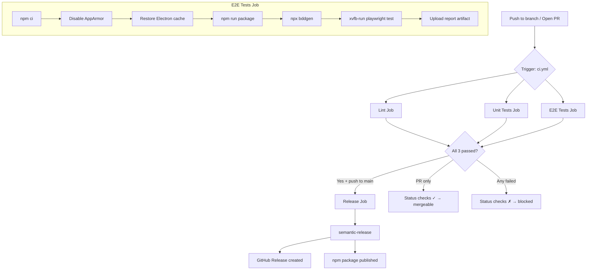
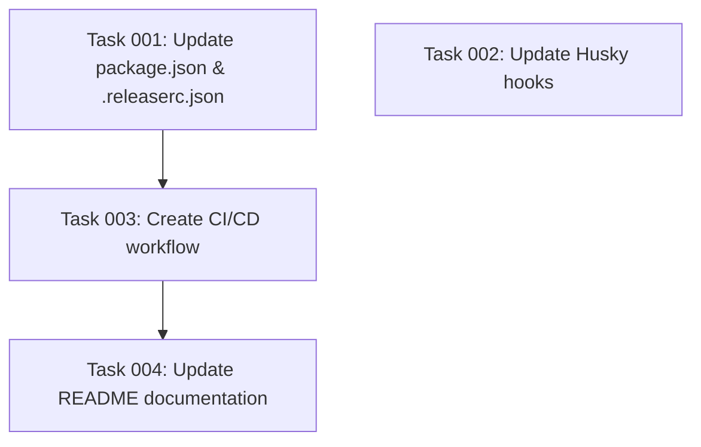

# Plan: GitHub Actions CI/CD Pipeline

## Original Work Order

> I want to create a GitHub Actions setup. This CI CD setup should take into account the different purposes that we want to do. One is to execute tests on new pull requests and on pushes to main whenever we merge onto main. This is one. This test workflow should block merging NAPRs and also it should prevent releasing code from main using the release workflow. Additionally, we want to have the aforementioned release workflow. This workflow should use semantic release to create a package in NPM that can be installed via NPM. What information do you need? What questions do you have? I need you to do a thorough research online on the best practices and the best way to get playwright scripts end-to-end executed in GitHub Actions dealing with the container limitations and the problems that may arise from not having a window environment.

## Plan Clarifications

| Question | Answer |
|----------|--------|
| NPM package name? (`package.json` has `"name": "workspace"`, `"private": true`) | `@e0ipso/self-review` — remove `private: true` |
| `@semantic-release/git` pushes to protected `main` — how to handle? | Remove `@semantic-release/git` from `.releaserc.json`. Rely on GitHub Releases for changelog. |
| Include linting as a separate CI job? | Yes — three parallel jobs: Lint, Unit Tests, E2E Tests |
| Fix husky hooks? (pre-commit runs full e2e suite) | Yes — pre-commit runs lint + unit only. Full suite runs in CI. |
| NPM authentication method? | npm Trusted Publishing (OIDC) — no stored `NPM_TOKEN` secret |
| Electron binary caching? | Yes — cache `~/.cache/electron` |

## Executive Summary

This plan adds a single GitHub Actions workflow (`ci.yml`) with four jobs: **Lint**, **Unit Tests**, **E2E Tests** (running in parallel), and **Release** (running after all three pass, only on `main` pushes). The test jobs serve as required status checks that block PR merging. The release job uses semantic-release to publish `@e0ipso/self-review` to npm via OIDC Trusted Publishing.

The key technical challenge — running Playwright E2E tests against a packaged Electron app in CI — is solved using `xvfb-run` (pre-installed on `ubuntu-latest`) combined with a critical AppArmor kernel parameter fix required by Ubuntu 24.04. The project's existing test infrastructure (`tests/steps/app.ts`) already handles `--no-sandbox` and display detection, so no changes to test code are needed.

Supporting changes include updating `package.json` (name, private flag), removing `@semantic-release/git` from `.releaserc.json`, and fixing husky hooks to not run E2E tests on every local commit.

## Context

### Current State vs Target State

| Current State | Target State | Why? |
|---|---|---|
| No `.github/workflows/` directory — no CI/CD | Single `ci.yml` workflow with 4 jobs | Automated test gating and releases |
| PRs can be merged without tests passing | Lint, Unit Test, and E2E Test jobs are required status checks | Prevent broken code from reaching `main` |
| No automated releases | semantic-release creates GitHub Releases + npm packages on `main` push | Automated versioning and distribution |
| `package.json` name is `"workspace"`, marked `"private": true` | Name is `@e0ipso/self-review`, `private` removed | Required for npm publishing |
| `.releaserc.json` includes `@semantic-release/git` plugin | `@semantic-release/git` removed | Cannot push to protected `main`; GitHub Releases suffice for changelog |
| Husky pre-commit runs `npm test` (unit + e2e) | Pre-commit runs `npm run lint && npm run test:unit` | Local commits take seconds instead of minutes |
| Husky pre-push runs `npm run test` (unit + e2e) | Pre-push runs `npm run test:unit` | Full E2E suite runs in CI, not blocking local pushes |
| NPM auth via stored tokens | npm Trusted Publishing via OIDC | No secrets to manage; more secure |

### Background

**Electron + Playwright in GitHub Actions**: Electron requires a display server to render windows. GitHub's `ubuntu-latest` (Ubuntu 24.04) includes `xvfb` pre-installed, so `xvfb-run --auto-servernum` provides the virtual framebuffer. However, Ubuntu 24.04 enables AppArmor's `kernel.apparmor_restrict_unprivileged_userns=1` by default, which **blocks all Electron versions from launching**. This is the single most critical CI configuration detail — without `sudo sysctl -w kernel.apparmor_restrict_unprivileged_userns=0`, Electron crashes with `SIGILL` regardless of sandbox flags.

The project's test helper (`tests/steps/app.ts`) already applies `--no-sandbox`, `--disable-gpu`, and `--disable-dev-shm-usage` Chromium flags, and auto-starts Xvfb if `$DISPLAY` is missing. These existing measures complement the CI environment well.

**npm Trusted Publishing (OIDC)**: This is npm's modern authentication mechanism where GitHub Actions authenticates directly with npm via OpenID Connect — no `NPM_TOKEN` secret stored in the repository. It requires npm >=11.5.1, which ships with Node.js >=24. Since the project uses Node 22, the release job will need to either use Node 24 or upgrade npm globally. As of February 2026, Node 24 is LTS and this is a safe choice for the release job specifically.

**Fallback note**: If OIDC Trusted Publishing proves incompatible with `@semantic-release/npm`, the fallback is a classic `NPM_TOKEN` repository secret. This should be evaluated during implementation.

## Architectural Approach

### CI Workflow Structure (`.github/workflows/ci.yml`)

**Objective**: Single workflow file that handles both test gating and conditional releases.

The workflow triggers on `push` to `main` and `pull_request` targeting `main`. It contains four jobs:

1. **Lint** — runs `npm run lint`. Fast (~15s), catches formatting/static issues early.
2. **Unit Tests** — runs `npm run test:unit` (Vitest for both main and renderer configs).
3. **E2E Tests** — packages the Electron app, generates BDD tests, runs Playwright under xvfb-run.
4. **Release** — conditional on `github.ref == 'refs/heads/main'` and `github.event_name == 'push'`. Depends on all three test jobs via `needs: [lint, unit-test, e2e-test]`.

Jobs 1-3 run in parallel. Job 4 runs only after all three succeed and only on main pushes.

All test jobs use `ubuntu-latest` with Node LTS and npm caching via `actions/setup-node`. No custom Docker containers.

### E2E Test Configuration

**Objective**: Run Playwright + Cucumber BDD tests against the packaged Electron app in a headless CI environment.

The E2E job requires these specific CI steps:

1. **AppArmor fix**: `sudo sysctl -w kernel.apparmor_restrict_unprivileged_userns=0` — disables Ubuntu 24.04's restriction that prevents Electron's Chromium sandbox from functioning. Without this, Electron crashes before any window opens.
2. **Electron cache**: Cache `~/.cache/electron` keyed on `package-lock.json` hash to avoid re-downloading the ~180MB Electron binary on every run.
3. **Package step**: `npm run package` runs Electron Forge to produce the webpack bundle. This is the slowest step (~60-90s).
4. **BDD generation**: `npx bddgen` converts `.feature` files into Playwright test files. This is a pure code-gen step that does not need a display.
5. **Test execution**: `xvfb-run --auto-servernum npx playwright test` — xvfb-run creates a virtual X11 display and runs the tests within it.
6. **Artifact upload**: Upload `playwright-report/` on any non-cancelled run for debugging failures.

No `npx playwright install` is needed because the tests use the project's own Electron binary (via `_electron.launch()`), not Playwright's bundled browsers.

The Playwright config timeout should be increased for CI. The project currently uses 30s; CI should use 60s to account for slower runner performance.

### Release Configuration

**Objective**: Automated semantic versioning and npm publishing triggered by conventional commits merged to `main`.

The release job:
- Checks out with `fetch-depth: 0` (semantic-release needs full git history for commit analysis).
- Uses Node 24 (for npm >=11.5.1 OIDC support). All other jobs use Node LTS (22).
- Requests `permissions: contents: write, issues: write, pull-requests: write, id-token: write`.
- Runs `npx semantic-release` which uses the plugins configured in `.releaserc.json`.

The `.releaserc.json` will be updated to remove `@semantic-release/git` (cannot push to protected branches, and GitHub Releases provide the changelog). The remaining plugins are: `commit-analyzer`, `release-notes-generator`, `changelog`, `npm`, `github`.

**npm Trusted Publishing setup** (manual, one-time, done on npmjs.com):
1. Create the `@e0ipso/self-review` package on npm (initial `npm publish` or via npm website).
2. In package settings → Trusted Publishers → GitHub Actions, configure the repo and workflow file.
3. The workflow's `id-token: write` permission enables OIDC authentication automatically.

### Package Configuration Updates

**Objective**: Prepare `package.json` and `.releaserc.json` for npm publishing and CI compatibility.

Changes to `package.json`:
- `"name"` → `"@e0ipso/self-review"`
- Remove `"private": true`
- `"productName"` → `"self-review"`

Changes to `.releaserc.json`:
- Remove the `@semantic-release/git` plugin entry (the array element with assets/message config).

### Husky Hook Updates

**Objective**: Speed up local development by limiting pre-commit to fast checks.

Changes:
- `.husky/pre-commit`: Change from `npm test` to `npm run lint && npm run test:unit`
- `.husky/pre-push`: Change from `npm run test` to `npm run test:unit`

E2E tests are slow (package + launch + test) and are better suited for CI. Unit tests + lint provide sufficient local gating.

## Risk Considerations and Mitigation Strategies

Technical Risks

- **AppArmor restriction breaks Electron**: Ubuntu 24.04's `kernel.apparmor_restrict_unprivileged_userns=1` blocks Electron from launching. This is the #1 failure mode.
    - **Mitigation**: The `sysctl` fix is well-documented (Electron #41066, Playwright PR #34238) and used by Playwright's own CI. It is a single-line step.

- **npm Trusted Publishing incompatibility with @semantic-release/npm**: The OIDC mechanism may not be recognized by semantic-release's npm plugin if it calls `npm publish` in a non-standard way.
    - **Mitigation**: Fall back to a classic `NPM_TOKEN` repository secret. The workflow structure supports either mechanism — only the env var and permission lines change.

- **E2E test flakiness in CI**: Slower runners, software GPU rendering, and missing fonts can cause timeouts or rendering differences.
    - **Mitigation**: Increase Playwright timeout to 60s in CI. Upload test report artifacts for debugging. The project does not use screenshot comparison, reducing font-related risk.

Implementation Risks

- **First run bootstrapping**: Required status checks only appear in GitHub's branch protection dropdown after the workflow has run at least once.
    - **Mitigation**: Document this: push the workflow to `main`, then configure branch protection rules manually in Settings → Branches.

- **Scoped package first publish**: `@e0ipso/self-review` must exist on npm before Trusted Publishing can be configured.
    - **Mitigation**: Perform an initial manual `npm publish --access public` or let the first semantic-release run create it (with `NPM_TOKEN` for that first run, then switch to OIDC).

## Success Criteria

### Primary Success Criteria

1. PRs targeting `main` cannot be merged until Lint, Unit Tests, and E2E Tests jobs all pass (verified via GitHub branch protection required checks).
2. Pushing to `main` (via merged PR) triggers semantic-release, which creates a GitHub Release with auto-generated release notes when conventional commits warrant a version bump.
3. The npm package `@e0ipso/self-review` is published automatically on version bumps with OIDC authentication (no stored secrets).
4. E2E tests run successfully in GitHub Actions, with Electron rendering under xvfb on Ubuntu 24.04 with the AppArmor fix applied.
5. Local pre-commit hooks complete in under 30 seconds (lint + unit tests only).

## Documentation

- Update the project `README.md` with a CI badge and brief CI/CD section explaining the workflow.
- Add a comment block at the top of `.github/workflows/ci.yml` explaining the workflow structure and the AppArmor requirement.
- Document the one-time npm Trusted Publishing setup steps in a comment in the release job.

## Resource Requirements

### Development Skills

- GitHub Actions workflow authoring (YAML syntax, job dependencies, conditional execution)
- npm publishing and registry configuration
- Electron CI debugging (AppArmor, xvfb, sandbox flags)

### Technical Infrastructure

- GitHub repository with Actions enabled
- npm account with `@e0ipso` scope ownership
- npm Trusted Publishing configuration (one-time setup on npmjs.com)
- GitHub branch protection rules (one-time setup in repository settings)

## Integration Strategy

The workflow integrates with the existing project without modifying any source code or test files. Changes are limited to:
- New file: `.github/workflows/ci.yml`
- Modified files: `package.json`, `.releaserc.json`, `.husky/pre-commit`, `.husky/pre-push`
- Optional: `playwright.config.ts` (CI timeout increase)

The existing `npm run lint`, `npm run test:unit`, `npm run package`, `npx bddgen`, and `npx playwright test` scripts are used as-is. No new npm scripts are needed.

## Notes

- **Branch protection is a manual step**: After the first successful workflow run, go to Settings → Branches → Add rule for `main` → Enable "Require status checks to pass" → Select `Lint`, `Unit Tests`, `E2E Tests`.
- **The `CHANGELOG.md` will no longer be committed to `main`** since we removed `@semantic-release/git`. The changelog content will be available in GitHub Releases instead. If this is undesirable, the plugin can be restored with a PAT later.
- **`@semantic-release/changelog`** still generates the changelog file during the release process, but without `@semantic-release/git` it won't be committed. Consider removing `@semantic-release/changelog` as well if the file is not needed.

## Execution Blueprint

**Validation Gates:**

- Reference: `/config/hooks/POST_PHASE.md`

### Dependency Diagram

### ✅ Phase 1: Package Configuration

**Parallel Tasks:**

- ✔️ Task 001: Update package.json and .releaserc.json for npm publishing
- ✔️ Task 002: Update Husky hooks for fast local development

### ✅ Phase 2: CI/CD Workflow

**Parallel Tasks:**

- ✔️ Task 003: Create GitHub Actions CI/CD workflow (depends on: 001)

### ✅ Phase 3: Documentation

**Parallel Tasks:**

- ✔️ Task 004: Update README with CI/CD documentation (depends on: 003)

### Post-phase Actions

- Verify `ci.yml` is valid YAML syntax
- Verify no circular dependencies exist in the task graph

### Execution Summary

- Total Phases: 3
- Total Tasks: 4
- Maximum Parallelism: 2 tasks (in Phase 1)
- Critical Path Length: 3 phases (001 → 003 → 004)

## Execution Summary

**Status**: ✅ Completed Successfully **Completed Date**: 2026-02-12

### Results

All 4 tasks across 3 phases executed successfully:

- **Phase 1** (2 tasks in parallel): Updated `package.json` (name → `@e0ipso/self-review`, removed `private: true`, set `productName`), cleaned `.releaserc.json` (removed `@semantic-release/git` and `@semantic-release/changelog`), updated Husky hooks to run lint + unit tests only.
- **Phase 2** (1 task): Created `.github/workflows/ci.yml` with 4 jobs (Lint, Unit Tests, E2E Tests, Release). Updated `playwright.config.ts` with CI-conditional 60s timeout.
- **Phase 3** (1 task): Added CI badge and CI/CD documentation section to `README.md`.

All 160 unit tests pass (127 main + 33 renderer). Lint passes clean.

### Noteworthy Events

- The `.husky/pre-commit` file had `npm test:unit` (malformed — missing `run` keyword). This was corrected to `npm run lint && npm run test:unit`.
- The remote origin points to `code.randemar.app` rather than GitHub. The CI badge URL uses `github.com/e0ipso/self-review` per the plan spec. This will need adjustment if the primary remote is not GitHub.
- The E2E job places the Electron cache restore step **before** `npm ci` so the cached binary is available during postinstall scripts, per the corrected ordering in the task notes.

### Recommendations

- After pushing this branch and merging to `main`, configure GitHub branch protection rules (Settings → Branches → Add rule for `main` → Require status checks → Select `Lint`, `Unit Tests`, `E2E Tests`).
- Set up npm Trusted Publishing on npmjs.com for `@e0ipso/self-review` (configure GitHub Actions as trusted publisher).
- If OIDC publishing is incompatible with `@semantic-release/npm`, fall back to an `NPM_TOKEN` repository secret.
- Consider removing `@semantic-release/changelog` and `@semantic-release/git` from `dependencies` in `package.json` since they are no longer used.
