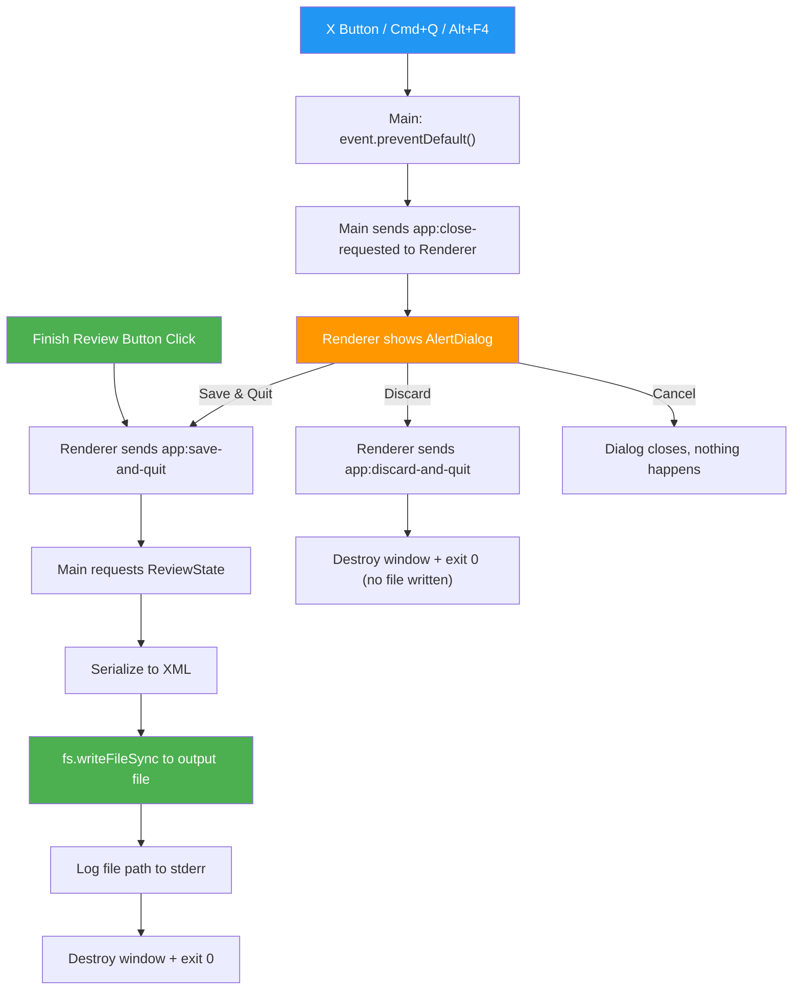
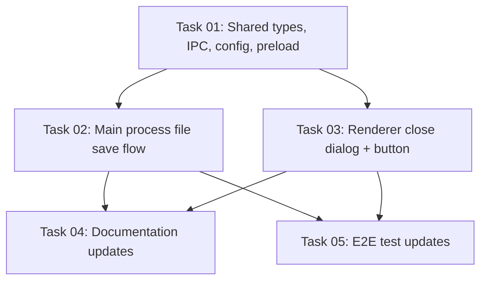

# Plan: File-Based XML Output with Explicit Save Flow

## Original Work Order

> The stdout solution is not working the XML is not being output. I want to switch gears. Let's
> output to the file configured in the config file. Default to `./review.xml` in the cwd. We'll need
> to document this in README.md, AGENTS.md, PRD.md, tests/features, ... We'll also need to update
> the existing unit tests. This is to sidestep the problems with stdout.

> Let's turn the Finish Review button into a button that saves the file and quits. If the user closes
> the window without writing, then add a confirmation alert to let them know that their review will
> be lost.

## Plan Clarifications

| Question | Answer |
|----------|--------|
| Should there be a `--output-file` CLI flag? | No. All non-reserved args pass through to `git diff`. Adding more reserved flags increases ambiguity. Config-only. |
| Resume collision (resume-from and output-file are the same path)? | Overwrite is fine. The app reads the resume file at startup into memory, then overwrites on close. |
| Should anything be written to stdout? | No. Stdout is completely unused. All logging on stderr. Output file path logged to stderr on write. |
| Confirmation dialog style when closing via X? | Three-way dialog: Save & Quit / Discard / Cancel (VS Code pattern). User can save from the dialog without going back to click Finish Review. |

## Executive Summary

The current architecture writes XML review output to stdout, which has proven unreliable under
Electron's process model. The fix is to write directly to a configurable file (default
`./review.xml`).

Alongside this change, the close/save flow is redesigned. Currently, all close paths (Finish Review
button and X button) trigger the same save-and-exit sequence. The new design splits these into two
distinct paths: the **Finish Review button** explicitly saves and quits, while the **window X
button** shows a three-way confirmation dialog (Save & Quit / Discard / Cancel). This prevents
accidental loss of review work while giving users a clear, intentional save action.

The changes are: one new config key (`output-file`), a restructured close/save flow with new IPC
channels, a shadcn/ui AlertDialog confirmation component, and documentation updates to match.

## Context

### Current State vs Target State

| Current State | Target State | Why? |
|---|---|---|
| XML written to stdout via `process.stdout.write()` | XML written to file via `fs.writeFileSync()` | Electron stdout is unreliable; XML output is lost |
| Users pipe output: `self-review --staged > review.xml` | App writes directly: `self-review --staged` → creates `./review.xml` | Removes the broken stdout dependency |
| No `output-file` config key exists | `output-file` key in YAML config, default `./review.xml` | Configurable output path |
| `AppConfig` has `outputFormat` field (unused) | `AppConfig` gains `outputFile` field | New config field for the file path |
| Finish Review button calls `window.close()` | Finish Review button sends `app:save-and-quit` IPC | Explicit save action, not a side effect of closing |
| All close paths (button + X) trigger identical save flow | X close shows confirmation dialog; button saves directly | Prevent accidental review loss |
| No confirmation dialogs exist | Three-way AlertDialog on X close: Save / Discard / Cancel | User can save, discard, or cancel from the dialog |
| Convention: "Close = done", "No confirmation dialogs" | New convention: Finish Review = save, X = confirm | Conventions must match actual behavior |
| AGENTS.md says "stdout is sacred" and "No file writes" | AGENTS.md says stdout is unused, app writes one file (the review XML) | Conventions must match actual behavior |
| E2E tests assert `stdout should contain valid XML` | E2E tests assert output file contains valid XML | Tests must match new behavior |

### Background

Electron runs as a GUI application with its own process management. Writing to stdout from the main
process during window close has proven unreliable — the XML output is silently lost. Rather than
debugging Electron's stdout plumbing further, writing to a file is the pragmatic fix.

The app already has a config system (user-level `~/.config/self-review/config.yaml` and
project-level `.self-review.yaml`) with precedence rules. Adding a new config key fits naturally
into this system.

The current "Close = done" convention means any close action (intentional or accidental) triggers
the save flow. The user wants an explicit save action via the Finish Review button, with a safety
net dialog when closing via other means (X button, Cmd+Q, Alt+F4).

## Architectural Approach

### Config Layer Changes

**Objective**: Add `output-file` config key with default `./review.xml`.

The `AppConfig` interface in `src/shared/types.ts` gains an `outputFile: string` field. The default
in `src/main/config.ts` is set to `./review.xml`. The YAML parser in `loadYamlConfig` reads the
`output-file` key (kebab-case, matching the existing convention for all other config keys). The
value is a string representing a file path, interpreted relative to cwd.

Validation: any non-empty string is accepted. If the path is empty or missing, the default
(`./review.xml`) is used. No validation of whether the directory exists is done at config load time
— that error surfaces at write time.

### New IPC Channels

**Objective**: Add three IPC channels to support the split close/save flow.

New channels added to `src/shared/ipc-channels.ts`:

| Channel | Direction | Purpose |
|---------|-----------|---------|
| `app:close-requested` | Main → Renderer | Main tells renderer the user tried to close the window; renderer should show confirmation dialog |
| `app:save-and-quit` | Renderer → Main | Renderer tells main to save the review to file and exit |
| `app:discard-and-quit` | Renderer → Main | Renderer tells main to exit immediately without saving |

### Main Process Close/Save Flow Changes

**Objective**: Restructure the close handler to support two distinct exit paths.

The `mainWindow.on('close')` handler changes from the current save-and-exit logic to:
1. `event.preventDefault()` (same as before).
2. Send `app:close-requested` to renderer via `mainWindow.webContents.send()`.
3. Wait for either `app:save-and-quit` or `app:discard-and-quit` from renderer.

New IPC handler for `app:save-and-quit`:
1. Request `ReviewState` from renderer (reuse existing `review:request`/`review:submit` flow).
2. Serialize to XML.
3. Resolve output file path from `appConfig.outputFile` (relative to `process.cwd()`).
4. Write XML to file via `fs.writeFileSync()`.
5. Log the written path to stderr: `[main] Review written to <path>`.
6. `mainWindow.destroy()` + `process.exit(0)`.

New IPC handler for `app:discard-and-quit`:
1. `mainWindow.destroy()` + `process.exit(0)`. No file written.

Error handling: wrap the save flow in try/catch. On `fs.writeFileSync` failure, log the error to
stderr and exit with code 1.

### Renderer: Confirmation Dialog

**Objective**: Add a shadcn/ui AlertDialog that appears when the user closes the window via X.

Add the shadcn/ui `alert-dialog` component (`npx shadcn@latest add alert-dialog`). Create a
`CloseConfirmDialog` React component in `src/renderer/components/` that:

1. Listens for `app:close-requested` via `window.electronAPI.onCloseRequested(callback)`.
2. When triggered, opens an AlertDialog with:
   - **Title**: "Save your review?"
   - **Description**: "You have unsaved review work. What would you like to do?"
   - **Save & Quit** button (primary): calls `window.electronAPI.saveAndQuit()`
   - **Discard** button (destructive variant): calls `window.electronAPI.discardAndQuit()`
   - **Cancel** button: closes the dialog, returns to the review
3. Render this component in `App.tsx` (always mounted, dialog visibility controlled by state).

### Renderer: Finish Review Button Changes

**Objective**: Change the button from `window.close()` to an explicit save-and-quit IPC call.

In `src/renderer/components/Toolbar.tsx`, the Finish Review button's `onClick` changes from
`window.close()` to `window.electronAPI.saveAndQuit()`. The button label stays "Finish Review".

### Preload Bridge Updates

**Objective**: Expose the new IPC methods to the renderer.

Add to `src/preload/preload.ts`:
- `onCloseRequested(callback)`: listens for `app:close-requested` from main.
- `saveAndQuit()`: sends `app:save-and-quit` to main.
- `discardAndQuit()`: sends `app:discard-and-quit` to main.

Update the `ElectronAPI` type in the preload types to include these new methods.

### Documentation Updates

**Objective**: Update all documentation to reflect file-based output and the new close behavior.

Files to update:
- **`AGENTS.md`**: Remove "stdout is sacred", "No file writes", and "Close = done / No confirmation
  dialogs" conventions. Replace with: output file is configurable via `output-file` config key,
  default `./review.xml`. Finish Review button saves and quits. X close shows confirmation dialog.
  Update the IPC Channels table with the three new channels.
- **`docs/PRD.md`**: Update Design Philosophy, Data Flow diagram, Usage Examples, stdout/stderr
  section, Exit Behavior, Security section, Config sections. Add close confirmation behavior.
- **`README.md`**: Update usage examples (remove `> review.xml` pipe syntax), update design
  principles, add `output-file` to available options list.
- **`src/main/cli.ts`**: Update `printHelp()` to remove `> review.xml` from examples and mention
  the output file config.

### Unit Test Updates

**Objective**: Update existing unit tests to match new behavior.

- **`src/main/config.test.ts`**: Add test for `output-file` config loading (string parsing, default
  value, merge precedence). The default config test should assert `outputFile` is `'./review.xml'`.
- **`src/main/xml-serializer.test.ts`**: No changes needed — the serializer returns a string. It
  doesn't know about stdout or files. Its tests remain valid.

### E2E Test Updates

**Objective**: Update feature files and step definitions to check file output and dialog behavior.

- **`tests/features/07-xml-output.feature`**: Replace all "stdout should contain" assertions with
  file-based assertions (e.g., "the output file should contain valid XML"). The "Nothing is written
  to stdout except XML" scenario becomes "Nothing is written to stdout".
- **`tests/features/08-resume.feature`**: Update scenarios that reference "the XML output" to
  reference the output file.
- Step definitions need to read the output file instead of capturing stdout.
- Step definitions for "Finish Review" button click need to trigger `saveAndQuit` instead of
  `window.close()` (the button behavior change propagates here).

## Risk Considerations and Mitigation Strategies

Technical Risks

- **Write permission errors**: The user may run self-review in a directory where they don't have
  write permission.
    - **Mitigation**: Catch the `fs.writeFileSync` error, log a clear message to stderr with the
      path that failed, and exit with code 1. This is the same pattern used for git errors.

- **Path resolution edge cases**: Relative paths with `..` or symlinks.
    - **Mitigation**: Use `path.resolve(process.cwd(), outputFile)` which handles all standard path
      resolution. No special-casing needed.

- **Cmd+Q / Alt+F4 behavior**: System-level quit commands trigger Electron's `before-quit` event
  then `close` on all windows. The `event.preventDefault()` in the close handler must correctly
  intercept these.
    - **Mitigation**: This is standard Electron behavior. The `close` event handler with
      `event.preventDefault()` already works for these cases (it's used in the current codebase).

Implementation Risks

- **E2E test rework**: Tests that capture stdout need to be rewritten to read the output file.
    - **Mitigation**: The change is mechanical — replace stdout capture with file reads. The
      assertions on XML content stay the same.

- **Breaking change for existing users**: Anyone who has `> review.xml` in their scripts or muscle
  memory will get an empty file (stdout is now unused) plus a `review.xml` file from the app.
    - **Mitigation**: This is intentional and accepted. The stdout approach doesn't work. The README
      and help text will be updated.

- **Dialog IPC race condition**: If the user rapidly clicks X then Save, the IPC messages could
  overlap.
    - **Mitigation**: The main process close handler uses `event.preventDefault()` which blocks the
      close. The save flow is sequential (request state → serialize → write → destroy). Once
      `mainWindow.destroy()` is called, no further close events can fire.

## Success Criteria

### Primary Success Criteria

1. Clicking "Finish Review" saves the review to `./review.xml` (or configured path) and exits
2. Clicking the X button (or Cmd+Q/Alt+F4) shows a three-way AlertDialog
3. Choosing "Save & Quit" from the dialog saves the review and exits (same as Finish Review)
4. Choosing "Discard" from the dialog exits immediately without writing any file
5. Choosing "Cancel" from the dialog returns to the review (no action taken)
6. Stdout is empty — no output goes to stdout under any circumstances
7. The output file path is logged to stderr on successful write
8. The `output-file` config key is respected from both user-level and project-level YAML configs
9. All unit tests pass with the new default config value
10. All documentation (README, AGENTS.md, PRD.md, CLI help) accurately reflects the new behavior

## Documentation

| Document | Updates Needed |
|----------|---------------|
| `AGENTS.md` | Remove "stdout is sacred", "No file writes", "Close = done", "No confirmation dialogs" conventions. Add `output-file` config key, new IPC channels, new close behavior conventions. |
| `docs/PRD.md` | Update Design Philosophy, Data Flow, CLI examples, stdout/stderr section, Exit Behavior, Security section, Config sections. Add close confirmation dialog behavior. |
| `README.md` | Update usage examples, design principles, available options list. |
| `src/main/cli.ts` | Update `printHelp()` output. |
| `tests/features/07-xml-output.feature` | Rewrite stdout assertions to file assertions. |
| `tests/features/08-resume.feature` | Update "XML output" references to file output. |

## Resource Requirements

### Development Skills

- TypeScript / Node.js (main process changes)
- Electron config/lifecycle understanding
- React (dialog component)
- Vitest (unit test updates)
- Playwright + Cucumber (e2e test updates, if run on host)

### Technical Infrastructure

- Existing `fs` module (Node.js built-in, no new dependencies)
- Existing `path` module for path resolution
- Existing config loading infrastructure in `src/main/config.ts`
- shadcn/ui `alert-dialog` component (add via `npx shadcn@latest add alert-dialog`)

## Notes

- The `outputFormat` field in `AppConfig` remains unchanged. It was already a reserved/future field
  (`'xml'` is the only value). It is orthogonal to the output destination change.
- The `--resume-from` flag continues to accept an explicit file path. When the resume file happens
  to be the same as the output file, the app reads it at startup (into memory) and overwrites it on
  close. This is safe because the file content is fully loaded before the write occurs.

### Change Log

- 2026-02-12: Refined plan to split close/save flow. Added three-way confirmation dialog on X
  close, explicit save-and-quit from Finish Review button, three new IPC channels, and
  CloseConfirmDialog component. Updated executive summary, architecture diagram, current/target
  table, success criteria, and documentation requirements.
- 2026-02-12: Generated 5 tasks and execution blueprint.

---

## Execution Blueprint

**Validation Gates:**

- Reference: `/config/hooks/POST_PHASE.md`

### Dependency Diagram

### ✅ Phase 1: Foundation

**Parallel Tasks:**

- ✔️ Task 01: Shared types, IPC channels, config layer, preload bridge + unit tests

### ✅ Phase 2: Core Implementation

**Parallel Tasks:**

- ✔️ Task 02: Main process file-based save and close flow (depends on: 01)
- ✔️ Task 03: Renderer close confirmation dialog and Finish Review button (depends on: 01)

### ✅ Phase 3: Documentation and E2E Tests

**Parallel Tasks:**

- ✔️ Task 04: Documentation updates (depends on: 02, 03)
- ✔️ Task 05: E2E test updates (depends on: 02, 03)

### Post-phase Actions

- Run full unit test suite: `npm run test:unit`
- Run E2E tests on host machine: `npm run test:e2e`
- Manual smoke test: launch app, verify Finish Review saves file, verify X shows dialog

### Execution Summary

- Total Phases: 3
- Total Tasks: 5
- Maximum Parallelism: 2 tasks (in Phases 2 and 3)
- Critical Path Length: 3 phases

---

## Execution Summary

**Status**: Completed Successfully **Completed Date**: 2026-02-12

### Results

All 5 tasks across 3 phases completed successfully. The application now writes XML review output to a configurable file (default `./review.xml`) instead of stdout. The close/save flow is split into two distinct paths: explicit save via "Finish Review" button, and a three-way confirmation dialog on window close (Save & Quit / Discard / Cancel).

Key deliverables:
- `AppConfig.outputFile` field with YAML config parsing and `./review.xml` default
- 3 new IPC channels (`app:close-requested`, `app:save-and-quit`, `app:discard-and-quit`)
- Main process file-write handler replacing stdout write
- CloseConfirmDialog component (shadcn/ui AlertDialog)
- Updated Finish Review button to call `saveAndQuit()`
- Full documentation updates (AGENTS.md, README.md, PRD.md, CLI help)
- E2E tests rewritten for file-based output assertions

### Noteworthy Events

- Stashed unrelated CI/release changes before creating feature branch (`.github/workflows/ci.yml` and `package.json` URL format change)
- E2E test agent also fixed `ConfigContext.tsx` default config to include the new `outputFile` field — a necessary change missed in the original task breakdown
- E2E test agent updated more feature files than planned (01, 06, 09, 10 in addition to 07, 08) because they all had "I close the Electron window" steps that needed to use the save-and-quit flow
- E2E tests cannot be run in the dev container; changes should be validated on the host machine

### Recommendations

- Run E2E tests on the host machine (`npm run test:e2e`) to validate the full flow
- Manual smoke test: launch app, click "Finish Review", verify `./review.xml` is created
- Manual smoke test: launch app, click X, verify three-way dialog appears
- Consider restoring the stashed CI/release changes (`git stash pop`) after merging this branch
