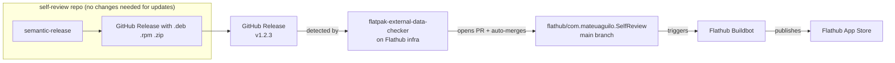
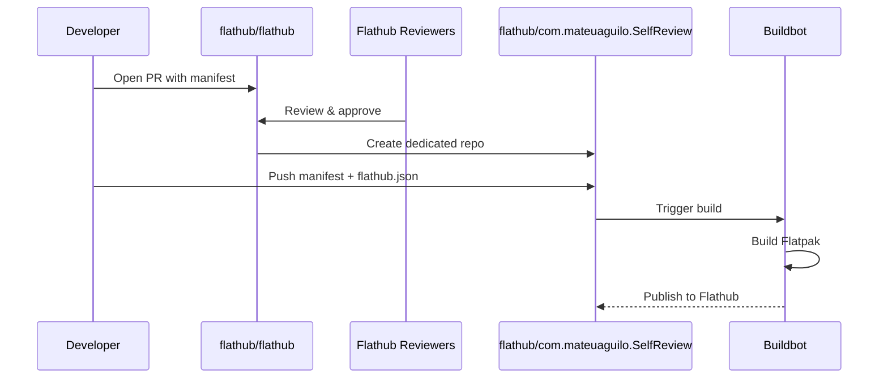
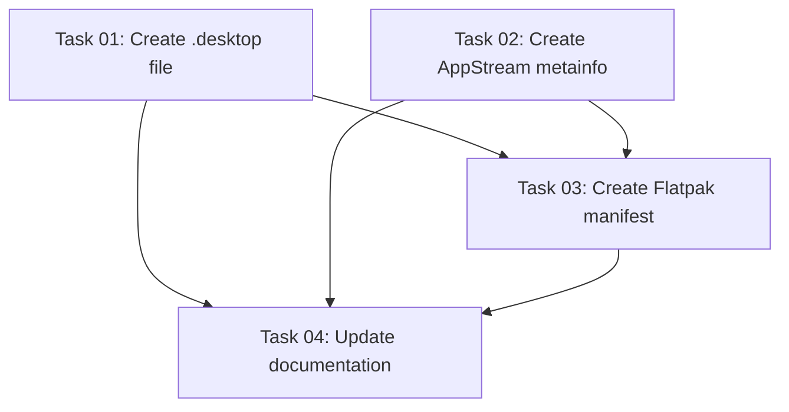

# Plan: Automate Flathub Publishing for self-review

## Original Work Order

> To automate publishing the app in flathub

## Plan Clarifications

| Question                 | Answer                                                   |
| ------------------------ | -------------------------------------------------------- |
| Existing Flathub repo?   | No — initial submission from scratch                     |
| Flatpak app ID?          | `com.mateuaguilo.SelfReview` (user owns mateuaguilo.com) |
| Desktop/AppStream files? | Don't exist — need to create both                        |
| Automation level?        | Full auto-merge — no manual review of Flathub updates    |

## Executive Summary

This plan prepares self-review for Flathub distribution by creating the required Linux desktop
integration files (`.desktop`, AppStream metainfo), authoring a Flatpak manifest, and configuring
Flathub's built-in auto-update infrastructure (`flatpak-external-data-checker`) for fully automated
publishing on new releases.

The approach leverages Flathub's native tooling rather than custom CI workflows. The Flatpak
manifest uses `x-checker-data` annotations so Flathub's bot automatically detects new GitHub
releases, updates the manifest, and merges the changes — requiring zero CI changes in the
self-review repo itself.

## Context

### Current State vs Target State

| Current State                                 | Target State                                                                          | Why?                                                             |
| --------------------------------------------- | ------------------------------------------------------------------------------------- | ---------------------------------------------------------------- |
| No `.desktop` file                            | `com.mateuaguilo.SelfReview.desktop` installed with the app                           | Required by Flathub and FreeDesktop spec for Linux app launchers |
| No AppStream metainfo                         | `com.mateuaguilo.SelfReview.metainfo.xml` with app description, screenshots, releases | Required by Flathub for app store listing                        |
| Only `.deb`, `.rpm`, `.zip` packages          | Flatpak available on Flathub                                                          | Broader Linux distribution reach                                 |
| Manual release process for new distro formats | Flathub auto-detects new GitHub releases and publishes                                | Zero maintenance for Flathub updates                             |
| No domain verification                        | `/.well-known/org.flathub.VerifiedApps.txt` on mateuaguilo.com                        | Required to use `com.mateuaguilo.*` app ID                       |

### Background

Flathub does not accept binary uploads. It builds apps from a manifest (YAML/JSON) hosted in a
dedicated repo under the `flathub` GitHub org. The repo is created via a PR to `flathub/flathub`.
Once accepted, Flathub's buildbot rebuilds on every push to the default branch.

For Electron apps, Flathub uses a "binary bundle" approach: the manifest downloads the pre-built app
archive from a GitHub Release and installs it into the Flatpak sandbox. This avoids building
Electron from source (which Flathub cannot realistically do).

Key constraint: the self-review app declares **no network access** (`--unset-env=...` and no
`--share=network` in sandbox permissions), which aligns well with Flathub's sandboxing expectations.

## Architectural Approach

### Desktop Integration Files

**Objective**: Create the `.desktop` and AppStream metainfo files required by Flathub and the
FreeDesktop specification.

**`.desktop` file** (`com.mateuaguilo.SelfReview.desktop`): Standard FreeDesktop entry declaring the
app name, executable path, icon, categories (`Development`), and MIME types. The `Exec` line will
point to the Electron binary wrapper inside the Flatpak.

**AppStream metainfo** (`com.mateuaguilo.SelfReview.metainfo.xml`): Contains app name, summary,
description, screenshots (URLs to hosted images), release history, license (MIT), and content
rating. Flathub uses this for the app store listing page. The `<releases>` section should include at
least the current version. Future releases will be auto-appended by the external data checker.

Both files will live in the project source tree under a `flatpak/` directory so they're versioned
alongside the app.

The app icon is available as `logo-square.svg` (SVG) and `assets/icon.png` (PNG). Flathub prefers
SVG icons — the SVG will be installed as the primary icon, with the PNG as a fallback for sizes
where rasterization is needed.

### Flatpak Manifest

**Objective**: Author the build manifest that Flathub's buildbot uses to create the Flatpak package.

The manifest (`com.mateuaguilo.SelfReview.yml`) will:

- Use `org.freedesktop.Platform` / `org.freedesktop.Sdk` as the runtime (version 24.08 or latest
  stable)
- Use the `org.electronjs.Electron2.BaseApp` base app, which provides Electron-specific dependencies
  (libnotify, etc.)
- Download the Linux x64 `.zip` or packaged directory from the GitHub Release as the source
- Install the app, `.desktop` file, metainfo, and icon into the Flatpak file hierarchy
- Declare sandbox permissions: `--share=ipc`, `--socket=x11`, `--socket=wayland`, `--device=dri`
  (GPU), `--filesystem=host:ro` (read-only access to repos for `git diff`),
  `--talk-name=org.freedesktop.Notifications`
- **No** `--share=network` (app has no network access by design)
- Include `x-checker-data` annotations on the source for auto-update detection

The manifest will live in the Flathub repo (`flathub/com.mateuaguilo.SelfReview`), not in the
self-review source repo. A reference copy will be kept in `flatpak/` for documentation.

### Auto-Update via flatpak-external-data-checker

**Objective**: Configure fully automated Flathub updates when new GitHub releases are created.

The Flatpak manifest source block will include `x-checker-data` with `type: json` pointing to the
GitHub Releases API. This tells Flathub's `flatpak-external-data-checker` bot to:

1. Poll the GitHub Releases API for new versions
2. When a new release is detected, update the source URL and sha256 in the manifest
3. Open a PR to the Flathub repo
4. Auto-merge the PR (enabled via `automerge-flathubbot-prs` in the repo config or via
   `is-important-app: false` + `merge-on-ci-pass: true` in the `flathub.json` config file)

This requires **no CI changes** in the self-review repo. The existing `release.yml` workflow already
creates GitHub Releases with downloadable assets — the Flathub bot consumes those directly.

### Domain Verification

**Objective**: Prove ownership of `mateuaguilo.com` to Flathub so the `com.mateuaguilo.SelfReview`
app ID is accepted.

A text file must be served at `https://mateuaguilo.com/.well-known/org.flathub.VerifiedApps.txt`
containing `com.mateuaguilo.SelfReview` on a line by itself. This is a one-time manual step outside
the scope of this codebase.

### Initial Flathub Submission

**Objective**: Get the app accepted on Flathub.

The submission process:

1. Create the manifest and supporting files locally
2. Test the build locally with `flatpak-builder`
3. Fork `flathub/flathub` and open a PR adding `com.mateuaguilo.SelfReview.yml`
4. Flathub reviewers verify the manifest, permissions, and metadata
5. Once approved, a new repo `flathub/com.mateuaguilo.SelfReview` is created
6. Push the manifest + `flathub.json` (auto-merge config) to the new repo
7. Flathub buildbot builds and publishes the first version

## Risk Considerations and Mitigation Strategies

Technical Risks

- **Electron + Flatpak sandbox conflicts**: Electron apps sometimes need specific sandbox
  workarounds (e.g., `--no-sandbox` flag or `zypak` wrapper for Chromium sandboxing within Flatpak's
  own sandbox).
  - **Mitigation**: Use `org.electronjs.Electron2.BaseApp` which includes `zypak`, the standard
    solution for running Electron inside Flatpak. The app's `Exec` line will use `zypak-wrapper.sh`
    to launch the Electron binary.

- **Filesystem access for git operations**: The app runs `git diff` on local repos, but Flatpak
  restricts filesystem access.
  - **Mitigation**: Request `--filesystem=host:ro` (read-only access to the host filesystem). This
    is a broad permission but necessary for a CLI-invoked code review tool. Flathub reviewers may
    flag this — a justification comment in the PR will be needed.

- **CLI invocation from host terminal**: Flatpak apps are launched via
`flatpak run com.mateuaguilo.SelfReview`, not a bare `self-review` command. - **Mitigation**:
Document that users can create a shell alias
(`alias self-review='flatpak run com.mateuaguilo.SelfReview'`). Flatpak also creates a wrapper
script in `~/.local/share/flatpak/exports/bin/` automatically.

Implementation Risks

- **Flathub review rejection**: Initial submissions can take days/weeks and may be rejected for
  permission scope or metadata issues.
  - **Mitigation**: Follow Flathub's quality guidelines strictly. Test with `flatpak-builder` and
    `appstreamcli validate` locally before submitting.

- **GitHub Release asset format changes**: If the release workflow changes the asset naming or
format, the Flathub manifest's source URL will break. - **Mitigation**: The `x-checker-data` uses
the GitHub API to find assets by pattern, not hardcoded URLs. As long as a Linux x64 archive is
present in the release, the checker will find it.

Process Risks

- **Domain verification delay**: Flathub verifies the domain asynchronously. If the `.well-known`
file is missing at review time, the submission will be rejected. - **Mitigation**: Set up domain
verification before submitting the PR.

## Success Criteria

### Primary Success Criteria

1. self-review is listed on Flathub and installable via
   `flatpak install flathub com.mateuaguilo.SelfReview`
2. New GitHub releases automatically trigger a Flathub update within 24 hours with no manual
   intervention
3. The app launches correctly from the Flatpak sandbox and can run `git diff` on host repos
4. The Flathub listing shows proper metadata (description, icon, screenshots, license)

## Documentation

- Update project `README.md` to add Flatpak installation instructions alongside the existing
  `.deb`/`.rpm` instructions
- Update `AGENTS.md` to mention the `flatpak/` directory and its purpose
- The Flathub repo itself will contain a `README.md` with build instructions (Flathub convention)

## Resource Requirements

### Development Skills

- Flatpak manifest authoring (YAML format, `flatpak-builder` toolchain)
- AppStream metainfo XML format
- FreeDesktop `.desktop` file specification

### Technical Infrastructure

- `flatpak` and `flatpak-builder` installed on the development machine for local testing
- Write access to `mateuaguilo.com` for domain verification file
- GitHub account with permission to fork and submit PRs to `flathub/flathub`

### External Dependencies

- Flathub team review and approval of initial submission
- `org.electronjs.Electron2.BaseApp` availability on Flathub (currently maintained and active)
- `org.freedesktop.Platform` runtime version compatibility with the Electron version used (Electron
  40.x)

## Notes

- The existing release pipeline (`release.yml`, `release-darwin.yml`) requires **no modifications**.
  Flathub consumes the GitHub Release assets that are already being produced.
- The `flathub.json` config file in the Flathub repo controls auto-merge behavior. Setting
  `"automerge-flathubbot-prs": true` enables the fully automated flow.
- The `--filesystem=host:ro` permission may be flagged during review. An alternative is
  `--filesystem=home:ro` (only home directory) but this would prevent reviewing repos outside
  `$HOME`.

## Dependency Diagram

## Execution Blueprint

**Validation Gates:**

- Reference: `/config/hooks/POST_PHASE.md`

### ✅ Phase 1: Desktop Integration Files

**Parallel Tasks:**

- ✔️ Task 01: Create .desktop file
- ✔️ Task 02: Create AppStream metainfo XML

### ✅ Phase 2: Flatpak Packaging

**Parallel Tasks:**

- ✔️ Task 03: Create Flatpak manifest (depends on: 01, 02)

### ✅ Phase 3: Documentation

**Parallel Tasks:**

- ✔️ Task 04: Update documentation (depends on: 01, 02, 03)

### Execution Summary

- Total Phases: 3
- Total Tasks: 4
- Maximum Parallelism: 2 tasks (in Phase 1)
- Critical Path Length: 3 phases

## Execution Summary

**Status**: ✅ Completed Successfully **Completed Date**: 2026-02-17

### Results

All 4 tasks completed across 3 phases. Created the `flatpak/` directory with all files required for Flathub submission:
- `.desktop` entry file for Linux app launchers
- AppStream metainfo XML for the Flathub app store listing
- Flatpak build manifest (YAML) with `x-checker-data` for automated version updates
- `flathub.json` enabling auto-merge of bot PRs
- Updated README.md with Flatpak installation instructions
- Updated AGENTS.md project structure to include `flatpak/` directory

### Noteworthy Events

- The release pipeline only produces `.deb` and `.rpm` packages (no Linux zip). The Flatpak manifest was adapted to extract the app from the `.deb` using `ar` and `tar` — a standard approach for Electron Flatpak packaging.
- Two `sha256` checksums in the manifest are placeholder values (`FIXME_REPLACE_WITH_ACTUAL_SHA256`) that must be computed before the actual Flathub submission.
- Domain verification (`mateuaguilo.com/.well-known/org.flathub.VerifiedApps.txt`) is a manual step outside the scope of this execution.

### Recommendations

- Compute and replace the `sha256` placeholders in the manifest before submitting to Flathub
- Set up domain verification on `mateuaguilo.com` before the Flathub PR
- Test the Flatpak build locally with `flatpak-builder` before submission
- Consider adding a Linux zip maker to `forge.config.ts` for a cleaner Flatpak source (optional)
