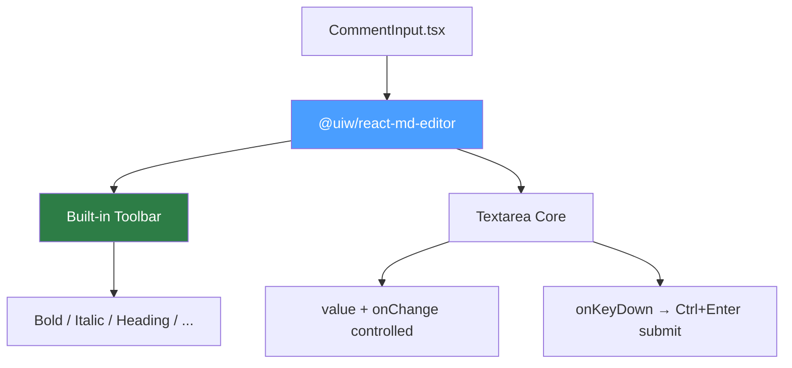
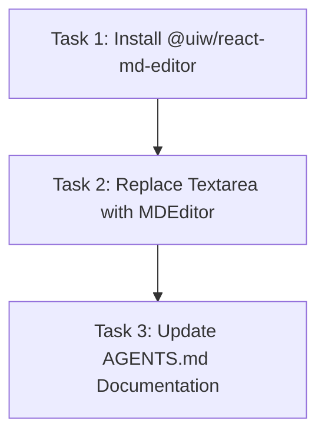

# Plan: Markdown Formatting Toolbar for Comment Input

## Original Work Order

> I'm going to add a mini-wizweek to the commenting text area. This wizweek will allow to add
> markdown formatting more easily at the click of a button. We don't need to have a rendered preview
> of the text area inside of the editor. It should be something simple, like the GitHub interface. I
> want you to use a well-maintained and popular library for this that is compatible with React. I
> don't want to create a massive feature inside of our code base. I want this to be maintained
> elsewhere.

## Plan Clarifications

| Question | Answer |
|---|---|
| Library approach | Use `@uiw/react-md-editor` — replaces the shadcn Textarea with a maintained editor component (~280K weekly downloads, 2.7K GitHub stars) |
| Toolbar buttons | Match GitHub's full set: headings, bold, italic, quote, code, link, bulleted list, numbered list, task list |
| Ctrl+Enter submit | Yes — preserve the existing Ctrl+Enter keyboard shortcut to submit comments via the editor's `onKeyDown` handler |

## Executive Summary

Replace the plain shadcn `<Textarea>` in `CommentInput.tsx` with `@uiw/react-md-editor`, configured
in **write-only mode** (no preview pane). The editor provides a built-in toolbar with GitHub-style
formatting buttons (bold, italic, headings, lists, code, links, quotes, task lists) out of the box.

This approach was chosen because the library is actively maintained (~280K weekly downloads),
lightweight (~4.6 KB gzipped), built on native textarea (no CodeMirror/Monaco dependency), and
provides the exact toolbar UX requested with minimal custom code. The formatting logic, toolbar
rendering, and keyboard shortcuts are all maintained upstream.

## Context

### Current State vs Target State

| Current State | Target State | Why? |
|---|---|---|
| Plain `<Textarea>` for comment body | `@uiw/react-md-editor` in write-only mode | Users need markdown formatting assistance without memorizing syntax |
| No formatting toolbar | GitHub-style toolbar (bold, italic, heading, quote, code, link, lists, task list) | Click-to-format reduces friction for writing structured comments |
| Ctrl+Enter submits via `onKeyDown` on Textarea | Ctrl+Enter submits via `onKeyDown` on the editor | Preserve existing keyboard shortcut behavior |
| shadcn Textarea styling | Editor styled to match existing card/border theme | Visual consistency with the rest of the UI |

### Background

The comment textarea in `CommentInput.tsx` currently uses a plain shadcn `<Textarea>` component.
Users can write markdown manually but have no formatting assistance. The `@uiw/react-md-editor`
library can be configured with `preview="edit"` to show only the editor (no preview pane), which
matches the requirement of "no rendered preview."

The library provides configurable `commands` and `extraCommands` props to control exactly which
toolbar buttons appear.

## Architectural Approach

### Library Integration

**Objective**: Replace the plain textarea with `@uiw/react-md-editor` configured for write-only
mode with a curated toolbar.

The integration involves:
- Installing `@uiw/react-md-editor` as a dependency
- Replacing the `<Textarea>` in `CommentInput.tsx` with `<MDEditor>` using `preview="edit"` to
  disable the preview pane
- Configuring the `commands` prop to include: headings, bold, italic, quote, code, link, unordered
  list, ordered list, and checked list (task list)
- Wiring `value` and `onChange` to the existing `body`/`setBody` state
- Adding an `onKeyDown` handler that intercepts `Ctrl+Enter` / `Cmd+Enter` to call `handleSubmit()`

### Styling Alignment

**Objective**: Make the editor visually consistent with the existing card-based comment input design.

The editor will need CSS overrides to:
- Match the existing border, background, and shadow styling from the comment input card
- Remove any default editor chrome that conflicts with the surrounding `CommentInput` container
  (the editor sits inside a rounded card with its own border)
- Respect the app's light/dark theme (the editor supports a `data-color-mode` attribute)
- Set appropriate min-height to match the current textarea dimensions

### Suggestion Textarea Unchanged

**Objective**: Keep the suggestion code textareas (Original / Suggested) as plain textareas.

The suggestion section uses `<Textarea>` for code input (monospaced, code-oriented). These should
remain as plain shadcn textareas since they handle code, not markdown prose. No changes needed to
the suggestion section.

## Risk Considerations and Mitigation Strategies

Technical Risks

- **Editor styling conflicts with shadcn/Tailwind**: The editor brings its own CSS that may conflict
  with the existing Tailwind-based styling.
    - **Mitigation**: Use CSS scoping and overrides. The editor supports `className` prop and can be
      styled via CSS custom properties. Test in both light and dark themes.

- **Webpack bundling compatibility**: The editor needs to work with the existing Electron Forge
  webpack setup.
    - **Mitigation**: `@uiw/react-md-editor` is a standard npm package with no special bundler
      requirements. It works with webpack out of the box.

Implementation Risks

- **Ctrl+Enter interception**: The editor may consume keyboard events before our handler runs.
    - **Mitigation**: The editor exposes `onKeyDown` handler. Test that `Ctrl+Enter` is properly
      intercepted and `e.preventDefault()` stops the editor from acting on it.

- **Value format mismatch**: The editor may add extra formatting or whitespace that affects XML
  serialization of comment bodies.
    - **Mitigation**: The editor uses plain markdown text as its value — no hidden formatting. The
      `value` prop is a plain string, same as what the textarea provided.

## Success Criteria

### Primary Success Criteria

1. Comment input displays a toolbar with all GitHub-style formatting buttons (headings, bold, italic,
   quote, code, link, bulleted list, numbered list, task list)
2. Clicking toolbar buttons inserts the correct markdown syntax at the cursor position
3. Ctrl+Enter (Cmd+Enter on Mac) still submits the comment
4. No preview pane is shown — editor is write-only
5. Editor styling is visually consistent with the existing comment input card design in both light
   and dark themes
6. Existing unit tests pass without modification (or with minimal adaptation to the new component)

## Documentation

- Update `AGENTS.md` to note that `CommentInput` uses `@uiw/react-md-editor` for the comment body
  (under the Components section or Critical Conventions)

## Resource Requirements

### Development Skills

- React component integration
- CSS/Tailwind styling for third-party component theming

### Technical Infrastructure

- `@uiw/react-md-editor` npm package (v4.x)
- Existing Electron Forge + webpack build pipeline (no changes needed)

## Execution Blueprint

**Validation Gates:**

- Reference: `/config/hooks/POST_PHASE.md`

### Dependency Diagram

### ✅ Phase 1: Dependency Setup

**Parallel Tasks:**

- ✔️ Task 1: Install @uiw/react-md-editor dependency

### ✅ Phase 2: Core Implementation

**Parallel Tasks:**

- ✔️ Task 2: Replace Textarea with MDEditor in CommentInput (depends on: 1)

### ✅ Phase 3: Documentation

**Parallel Tasks:**

- ✔️ Task 3: Update AGENTS.md documentation (depends on: 2)

### Execution Summary

- Total Phases: 3
- Total Tasks: 3
- Maximum Parallelism: 1 task (sequential dependency chain)
- Critical Path Length: 3 phases

## Execution Summary

**Status**: Completed Successfully **Completed Date**: 2026-02-16

### Results

All 3 tasks executed successfully across 3 phases. The plain shadcn `<Textarea>` in `CommentInput.tsx` has been replaced with `@uiw/react-md-editor` configured in write-only mode. The editor provides a GitHub-style formatting toolbar with headings, bold, italic, quote, code, link, bulleted list, numbered list, and task list buttons. Ctrl+Enter submit behavior preserved. Editor styled to blend with the existing card-based comment input design, supporting both light and dark themes. AGENTS.md updated with the new convention.

### Noteworthy Events

No significant issues encountered. The library installed cleanly, bundled with webpack without configuration changes, and all 163 existing unit tests continued to pass without modification.

### Recommendations

- Manually test the editor in the running app to verify toolbar interactions and theme switching work as expected.
- Consider adding a focused unit or e2e test for the MDEditor Ctrl+Enter submit behavior if regression risk is a concern.
