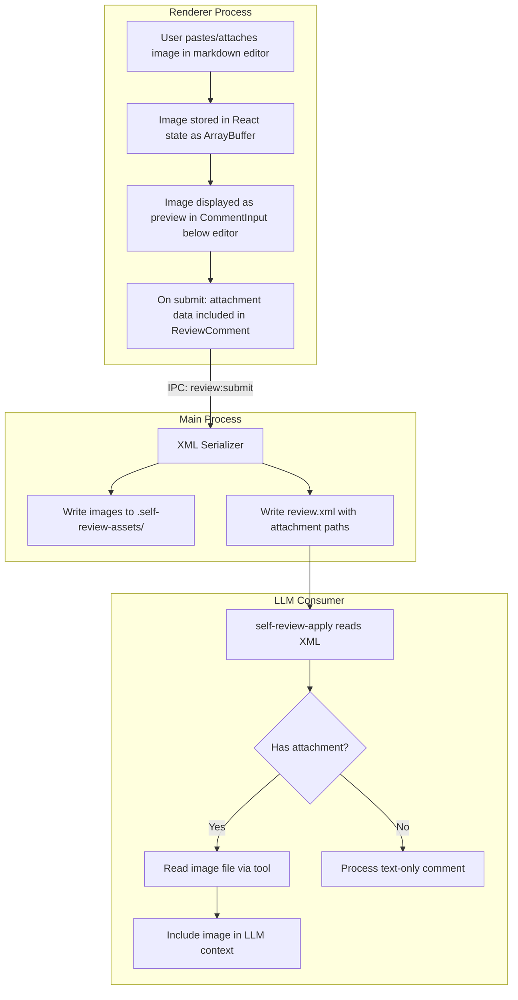
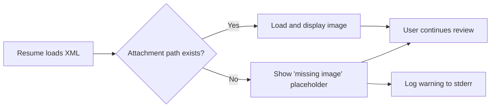
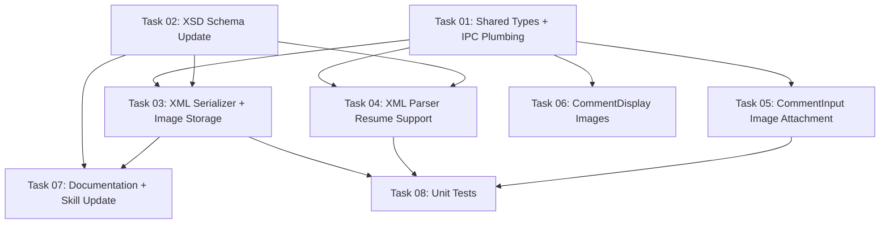

# Plan: Image Attachments in Review Comments

## Original Work Order

> ok let's go with option 1, create a plan

Context from prior conversation: implement image attachment support in self-review comments using
file references (Option 1). Users should be able to paste or attach screenshots and design
references to their review comments. Images are saved to a directory alongside the XML output. The
XML stores relative file paths. The consuming LLM reads the image files via its file-reading
capabilities.

## Plan Clarifications

| Question | Answer |
|----------|--------|
| Who consumes the XML? | Multiple LLMs (Claude, GPT-4, Gemini, etc.) via skills/tools |
| Primary concern with base64? | Context window bloat — base64 strings consume tokens but LLMs can't "see" them without decoding |
| Image types expected? | Screenshots + design exports (Figma, mockups) |
| File storage convention? | No existing convention — open to suggestions |
| Integrity checks needed? | No — graceful degradation is sufficient (missing image placeholder in UI, warnings in stderr) |
| Comment editor baseline? | The comment body editor is `@uiw/react-md-editor` (already on `main`), not a plain shadcn `<Textarea>`. Attachment UX must integrate with the editor’s underlying textarea via `textareaProps`. |

## Executive Summary

This plan adds image attachment support to review comments. Users can paste images from clipboard or
attach files via a file picker (and optionally drag/drop into the editor). Images are saved to a
`.self-review-assets/` directory alongside the XML output file. The XML schema gains an optional
`<attachment>` element per comment containing a relative file path and media type.

This approach was chosen because it keeps the XML lean (no base64 bloat), is compatible with all
vision-capable LLMs (they read the image file directly), and degrades gracefully for text-only LLMs
(the comment body text still conveys the feedback). The `self-review-apply` skill needs a minor
update to read attachment files when processing comments.

Important integration note: the comment editor is `@uiw/react-md-editor` (already on `main`). That
library does not provide image uploads out of the box; attachment handling must be implemented by
intercepting paste/drop events via the editor’s `textareaProps` and by adding an explicit attach
action (button/toolbar command) that stores attachments in review state (not as markdown inline
images).

## Context

### Current State vs Target State

| Current State | Target State | Why? |
|---|---|---|
| Comments are text-only (body + optional suggestion) | Comments can include image attachments | Screenshots and design references make feedback clearer and more actionable for LLMs |
| App writes exactly one file (`review.xml`) | App writes XML + image files to `.self-review-assets/` | Images must be stored as files to avoid bloating XML and LLM context windows |
| XSD has no attachment concept | XSD includes optional `<attachment>` element on comments | LLM consumers need structured metadata to find and load images |
| `self-review-apply` skill only processes text | Skill reads image files when `<attachment>` is present | LLMs need to "see" the image to understand visual feedback |
| PRD Section 10.4 states "writes exactly one file" | PRD updated to reflect image asset directory | Documentation must match actual behavior |

### Background

The self-review app produces XML consumed by LLMs. When reviewing AI-generated code, users often
want to reference visual context — screenshots of bugs, design mockups, or UI comparisons. Text
alone can't convey "this button is misaligned" as clearly as a screenshot. The XML output must
remain compact because it's fed into LLM context windows where every token counts.

Key constraint: the app currently has a strict "one file write" convention (Section 10.4 of the
PRD). This plan necessarily breaks that convention by writing image files alongside the XML. This is
a deliberate, justified trade-off.

## Architectural Approach

### Shared Types Update

**Objective**: Extend the type contract to include attachment data in `ReviewComment`.

Add an `Attachment` interface to `src/shared/types.ts` with fields for the image data (used during
the session) and the persisted file reference (used in XML). The `ReviewComment` interface gains an
optional `attachments` array. Use plural to support multiple images per comment from the start — the
UI can initially limit to one, but the data model shouldn't artificially constrain it.

The attachment type needs:
- `id`: unique identifier (same pattern as comment IDs)
- `fileName`: the generated filename (e.g., `img-001.png`)
- `mediaType`: MIME type (`image/png`, `image/jpeg`, `image/webp`)
- `data`: `ArrayBuffer` (in-memory during session, stripped before XML serialization)

For IPC transfer, `ArrayBuffer` must be serialized. Electron's structured clone algorithm handles
this natively — `ArrayBuffer` can cross the IPC bridge without manual encoding.

### XSD Schema Update

**Objective**: Add an optional `<attachment>` element to the comment schema.

Add `AttachmentType` to the XSD with two required attributes:
- `path` (xs:string): relative path from the XML file to the image file
- `media-type` (xs:string): MIME type of the image

The element is optional (`minOccurs="0"`) and repeatable (`maxOccurs="unbounded"`) on `CommentType`.
Place it after `<suggestion>` in the sequence.

The embedded XSD in `xml-serializer.ts` must be updated to match. Both copies (standalone file and
embedded string) must stay in sync.

### Image Storage (Main Process)

**Objective**: Save images to disk during XML serialization.

When `serializeReview` is called, image attachments are written to a `.self-review-assets/`
directory located in the same directory as the output XML file. The directory is created on-demand
(only if there are attachments).

File naming: `{comment-id}-{index}.{ext}` where index handles multiple attachments per comment, and
ext is derived from the media type. This naming avoids collisions and makes files traceable to their
source comment.

The serializer strips the `data` field from attachments and replaces it with the relative `path`
before building the XML.

If the output file is `./review.xml`, images go to `./.self-review-assets/`. If the output file is
`/tmp/my-review.xml`, images go to `/tmp/.self-review-assets/`.

### XML Serializer Update

**Objective**: Serialize attachment references into the XML output.

Extend `buildCommentXml` in `xml-serializer.ts` to emit `<attachment>` elements for comments with
attachments. The element contains only the `path` and `media-type` attributes — no inline data.

The serializer function signature changes to accept or return the asset directory path, since it
needs to write image files before referencing them in the XML.

### XML Parser Update (--resume-from)

**Objective**: Parse `<attachment>` elements back into `ReviewComment` objects on resume.

When loading a prior review via `--resume-from`, the parser extracts attachment metadata (path,
media-type) from `<attachment>` elements. It does NOT load the image data into memory — it only
stores the path reference.

The renderer, on receiving resumed comments with attachments, attempts to display the images by
reading them from disk via a new IPC channel (e.g., `attachment:read`). If the file doesn't exist
(deleted between sessions), the renderer shows a "missing image" placeholder. A warning is logged
to stderr.

### Renderer: CommentInput Component

**Objective**: Allow users to paste or attach images when writing a comment.

Extend `CommentInput.tsx` with:
1. **Editor integration**: The comment body is `@uiw/react-md-editor` (write-only). Wire attachment
   handling through its underlying textarea via `textareaProps` (rather than assuming a shadcn
   `<Textarea>`).
2. **Clipboard paste handler**: Provide `textareaProps.onPaste`. If the clipboard contains image
   data (`clipboardData.items` with `type.startsWith('image/')` or `clipboardData.files`), capture
   the image as an `ArrayBuffer`, call `preventDefault()` to avoid inserting stray text, and add it
   to the attachment list. If no image data exists, allow normal paste behavior.
3. **(Optional) Drag/drop handler**: Provide `textareaProps.onDrop` so dropped image files are added
   as attachments (not uploaded). If not implemented initially, keep it explicitly out of scope and
   document that paste + file picker are the supported paths.
4. **Attach action**: Provide an explicit attach UI that opens a native file picker dialog
   (`<input type="file" accept="image/*">`). This can be a shadcn/ui `Button` near the editor, or a
   custom `@uiw/react-md-editor` toolbar command—either way the result is identical: files become
   attachments stored in state (not markdown `` links).
5. **Image preview**: Display attached images as thumbnails below the editor. Each thumbnail has a
   remove button (X icon).
6. **State management**: Track attached images in local component state. On submit, include them in
   the `addComment` / `editComment` call.

Image size consideration: resize images that exceed 1920px in either dimension to keep file sizes
reasonable. Use the Canvas API for resizing in the renderer process.

### Renderer: CommentDisplay Component

**Objective**: Show attached images in rendered comments.

Extend `CommentDisplay.tsx` to render image attachments below the comment body. For images with
in-memory data (current session), render directly from the ArrayBuffer via `URL.createObjectURL`.
For resumed comments with file paths, load via IPC. Show a placeholder for missing images.

### IPC: Attachment File Reading

**Objective**: Allow the renderer to request image files from the main process.

Add a new IPC channel `attachment:read` (request-response pattern via `ipcMain.handle` /
`ipcRenderer.invoke`). The renderer sends the file path, the main process reads the file and
returns the buffer. This is needed for `--resume-from` and for displaying images from prior
sessions.

Add the channel constant to `src/shared/ipc-channels.ts` and the method to `ElectronAPI` in
`src/shared/types.ts`.

### Self-Review-Apply Skill Update

**Objective**: Instruct the LLM to read image attachments when processing comments.

Add a step to `SKILL.md` between the current steps 2 and 3:

> For each comment with `<attachment>` elements, read the referenced image file using the Read tool
> to include it as visual context before processing the comment. If the file does not exist, note
> this and proceed with the text-based feedback only.

### Graceful Degradation

**Objective**: Handle missing images without crashing or losing data.

Three degradation scenarios:
1. **Missing image on resume**: Renderer shows a placeholder, stderr warning logged. Comment text is
   fully preserved.
2. **Missing image during apply**: Skill instruction says to proceed with text-only feedback.
3. **Corrupt image file**: Same handling as missing — show placeholder, log warning.

No integrity checks (checksums, hashes) are implemented. The images are local files on the user's
machine — integrity verification adds complexity without solving a real problem.

## Risk Considerations and Mitigation Strategies

Technical Risks

- **IPC payload size with large images**: A 5MB screenshot as ArrayBuffer crossing IPC could cause
  latency.
    - **Mitigation**: Resize images to max 1920px wide before storing. Most screenshots will be
      under 500KB after resize. If needed in the future, write directly to temp files and pass paths
      instead of buffers.
- **Embedded XSD divergence**: The XSD is duplicated in `xml-serializer.ts` and
  `.claude/skills/self-review-apply/assets/self-review-v1.xsd`.
    - **Mitigation**: Update both in the same change. Note this in AGENTS.md under conventions.
- **Markdown editor event handling**: `@uiw/react-md-editor` may intercept or alter paste/drop
  behavior compared to a plain `<textarea>`.
    - **Mitigation**: Use the editor’s documented `textareaProps` to attach `onPaste` / `onDrop`
      handlers. Validate behavior in both light/dark themes and ensure Ctrl/Cmd+Enter submit remains
      functional alongside paste/drop handling.

Implementation Risks

- **Breaking the "one file write" convention**: PRD Section 10.4 explicitly states the app writes
  exactly one file. This change violates that.
    - **Mitigation**: Update PRD Section 10.4 to document the asset directory. The convention change
      is deliberate and justified.
- **Clipboard paste varies by OS**: Linux and macOS handle clipboard image data differently.
    - **Mitigation**: Electron's web APIs (`clipboardData`) abstract most differences. Test on both
      platforms.

## Success Criteria

### Primary Success Criteria

1. User can paste an image from clipboard into a comment and see it as a preview before submitting
2. User can attach an image file via file picker
3. Attachment UX works with the markdown editor (`@uiw/react-md-editor`, already on `main`) and does
   not require switching back to a plain textarea
4. Submitted comments with images display the images inline in `CommentDisplay`
5. On "Finish Review", images are written to `.self-review-assets/` and referenced in the XML via
   `<attachment path="..." media-type="..." />`
6. The generated XML validates against the updated XSD
7. `--resume-from` correctly loads and displays images from a prior review (or shows placeholder if
   missing)
8. The `self-review-apply` skill successfully reads and passes images to the LLM when processing
   comments with attachments

## Documentation

- **PRD.md Section 10.4**: Update to document that the app writes the XML output file AND an
  optional `.self-review-assets/` directory for image attachments.
- **AGENTS.md**: Update the "Critical Conventions" section to reflect the new file write behavior
  and document the dual-XSD-copy sync requirement.
- **SKILL.md**: Add the attachment reading instruction to the self-review-apply skill.
- **XSD annotations**: The new `AttachmentType` in the XSD must include `xs:documentation`
  annotations (consistent with existing schema style) so LLMs understand the element's purpose.

## Resource Requirements

### Development Skills

- Electron IPC and main/renderer process model
- React component development with shadcn/ui
- Clipboard API and File API in browser context
- Canvas API for image resizing
- XSD schema design
- XML serialization

### Technical Infrastructure

- No new dependencies required. Electron, React, Canvas API, and the existing XML toolchain are
  sufficient.
- `lucide-react` already in the project provides icons (Paperclip, Image, X) for the attachment UI.

## Integration Strategy

This feature integrates at multiple layers:

1. **Types** (`src/shared/types.ts`): New `Attachment` interface, updated `ReviewComment` — affects
   both processes.
2. **IPC** (`src/shared/ipc-channels.ts`): New `attachment:read` channel — requires preload bridge
   update.
3. **Main process**: XML serializer, XML parser, IPC handlers, file I/O for asset directory.
4. **Renderer**: `CommentInput`, `CommentDisplay`, `ReviewContext` (addComment signature), and
   `useReviewState` hook.
5. **Skill**: `SKILL.md` text update only.

Changes propagate from types → IPC → main → renderer. The skill update is independent and can be
done at any point.

## Notes

- The `.self-review-assets/` directory is ephemeral. It can be `.gitignore`'d or deleted after the
  apply skill runs. The app does not clean it up automatically — the user manages it like they
  manage the `review.xml` file.
- If no comments have attachments, the asset directory is never created. The app's behavior is
  unchanged for text-only reviews.
- Testing expectation: add unit coverage for attachment XML serialization/parsing and renderer state
  transitions (add/remove attachments, preview rendering). E2E coverage is optional and can be added
  later on a host machine (not in the dev container).
- Future consideration: if image attachments become common, a `--cleanup` flag could delete the
  asset directory after a successful apply. This is explicitly out of scope for this plan.
- 2026-02-16: Refined to explicitly integrate with the `@uiw/react-md-editor` comment body editor
  (now on `main`) via `textareaProps` (paste/drop handlers + attach action), and clarified that
  attachments are not represented as inline markdown image links.

## Execution Blueprint

**Validation Gates:**

- Reference: `/config/hooks/POST_PHASE.md`

### Dependency Diagram

### ✅ Phase 1: Foundation

**Parallel Tasks:**

- ✔️ Task 01: Shared types, IPC channel, preload bridge, attachment:read handler
- ✔️ Task 02: XSD schema update (standalone + embedded)

### ✅ Phase 2: Core Implementation

**Parallel Tasks:**

- ✔️ Task 03: XML serializer + image storage (depends on: 01, 02)
- ✔️ Task 04: XML parser resume support (depends on: 01, 02)
- ✔️ Task 05: CommentInput image attachment UX (depends on: 01)
- ✔️ Task 06: CommentDisplay image rendering (depends on: 01)

### ✅ Phase 3: Documentation & Testing

**Parallel Tasks:**

- ✔️ Task 07: Documentation + self-review-apply skill update (depends on: 02, 03)
- ✔️ Task 08: Unit tests for attachments (depends on: 03, 04, 05)

### Post-phase Actions

- Run `npm run test:unit` to verify all tests pass
- Verify TypeScript compilation with no errors

### Execution Summary

- Total Phases: 3
- Total Tasks: 8
- Maximum Parallelism: 4 tasks (in Phase 2)
- Critical Path Length: 3 phases (01 → 03 → 08)

## Execution Summary

**Status**: Completed Successfully **Completed Date**: 2026-02-16

### Results

All 8 tasks across 3 phases completed successfully. The image attachment feature is fully implemented:

- **Phase 1** (Foundation): Added `Attachment` type, IPC channel, preload bridge, and XSD schema update. 2 tasks, parallel.
- **Phase 2** (Core): XML serializer writes images to `.self-review-assets/`, parser handles attachment elements on resume, CommentInput supports paste/file-picker with resize, CommentDisplay renders attachments with graceful degradation. 4 tasks, parallel.
- **Phase 3** (Docs & Tests): Updated PRD, AGENTS.md, SKILL.md. Added 8 unit tests (serializer, parser, state management). 2 tasks, parallel.

Final test count: 171 (136 main + 35 renderer), all passing. TypeScript and lint clean.

### Noteworthy Events

- XML parser imported `Attachment` type but didn't use it explicitly (lint caught unused import, fixed during Phase 2 post-hook).
- Git commit hook rejected messages containing the word "feat" followed by certain patterns — required rewording Phase 3 commit message.

### Recommendations

- Add E2E tests for the attachment workflow on a host machine (not possible in dev container).
- Consider adding a `--cleanup` flag to delete `.self-review-assets/` after a successful apply (explicitly out of scope for this plan).
- Monitor IPC payload sizes if users attach very large images despite the 1920px resize cap.
