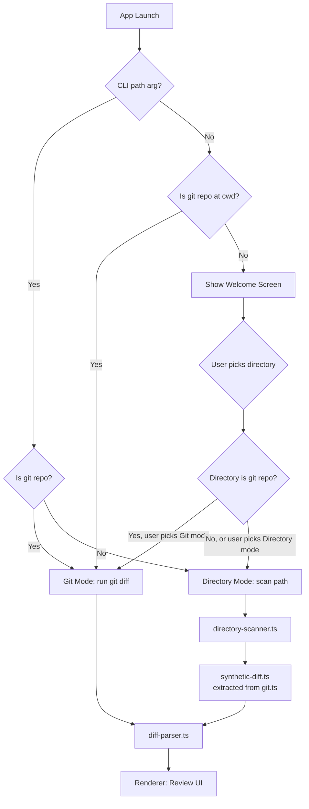
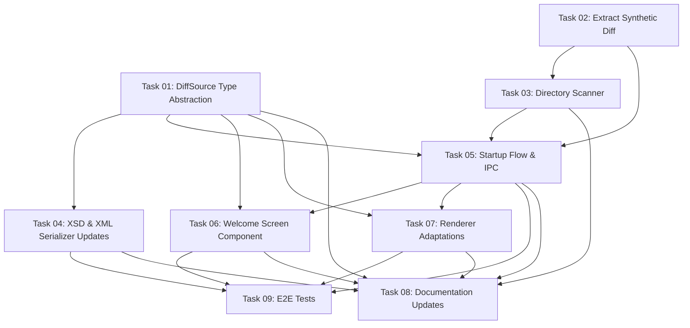

# Plan: Welcome Screen & Directory Review Mode

## Original Work Order

> I want to be able to start self-review from the App Launcher in macOS and Linux and have it pop up
> a current working directory so we can select a repository. Also, if a specific path is provided via
> the CLI, there is no Git repository in the current working directory. I would like the UI to open
> and treat all of the files in that particular path as new files. Make sure to document well the new
> behavior in the PRD.md. Also make sure to add some e2e testing for the welcome screen.

## Plan Clarifications

| Question | Answer |
|----------|--------|
| Should the directory picker allow any directory or only git repos? | Any directory. UI text should explain the difference between git and non-git mode. |
| What files are included in non-git mode? | All files, recursive. |
| How should the XML output handle missing git metadata? | Omit `git-diff-args` and `repository`; add `source-path` attribute instead. |
| Default path for directory picker? | Home directory (~). |
| Binary files in non-git mode? | Same as current behavior: listed with "Binary file" indicator, no diff content, file-level comments allowed. |

## Executive Summary

Currently, self-review hard-exits with code 1 if launched outside a git repository. This blocks two
use cases: (1) launching from macOS Finder / Linux app launchers where `process.cwd()` is
unreliable, and (2) reviewing arbitrary directories of files without git context.

This plan introduces a **welcome screen** that appears when the app has no actionable diff context
on launch, and a **directory review mode** that treats all files in a selected directory as new
additions. The welcome screen uses Electron's native directory picker and shadcn/ui Card + RadioGroup
components for mode selection. The core diff pipeline (`diff-parser.ts`, renderer components) remains
unchanged because it already handles synthetic unified diffs.

The approach prioritizes code reuse: the existing `generateUntrackedDiffs()` function (which has zero
git dependency) is extracted into a shared utility and reused for both untracked file handling and
full directory scanning.

## Context

### Current State vs Target State

| Current State | Target State | Why? |
|---|---|---|
| App hard-exits with code 1 if no git repo | App shows welcome screen with directory picker | Enable app launcher usage on macOS/Linux |
| Only git diffs can be reviewed | Any directory's files can be reviewed as "all new" | Support non-git review workflows |
| `git-diff-args` and `repository` are required in XSD | Both are optional; new optional `source-path` attribute added | Non-git mode has no git metadata to emit |
| `generateUntrackedDiffs()` lives in `git.ts` | Extracted to `synthetic-diff.ts`, reused by both git and directory modes | Code reuse: same operation, no git dependency |
| Toolbar always shows `git diff ...` | Toolbar shows source context based on mode (git args or directory path) | Accurate UI for both modes |
| DiffViewer help text is git-specific | Help text adapts based on mode | Relevant guidance for each mode |
| E2E tests only cover git-based scenarios | New feature file covers welcome screen and directory mode | Test coverage for new functionality |

### Background

When Electron is launched from macOS Finder, `process.cwd()` returns `/` and `process.argv` may
contain a `-psn_XXXX` argument. On Linux app launchers, `process.cwd()` varies by desktop
environment. The current `validateGitAvailable()` call at startup causes the app to immediately
exit in these contexts.

The existing `generateUntrackedDiffs()` function in `git.ts` already generates synthetic unified
diffs from file paths — reading files, detecting binaries, and producing the exact format that
`diff-parser.ts` consumes. This function has zero git dependency and is the foundation for directory
mode.

## Architectural Approach



### 1. DiffSource Type Abstraction

**Objective**: Replace hard-coded `gitDiffArgs` + `repository` fields with a discriminated union
that supports git, directory, and welcome-screen states across the entire data flow.

In `src/shared/types.ts`, introduce:

```
DiffSource = { type: 'git'; gitDiffArgs: string; repository: string }
           | { type: 'directory'; sourcePath: string }
           | { type: 'welcome' }
```

Replace `gitDiffArgs: string` and `repository: string` in `ReviewState`, `DiffLoadPayload`, and
all downstream consumers with `source: DiffSource`. This is a mechanical refactor — every file
that reads these two fields switches to reading `source.gitDiffArgs` (git mode) or
`source.sourcePath` (directory mode) via a type guard or switch on `source.type`. The renderer uses
`source.type === 'welcome'` to render the Welcome Screen instead of trying to infer mode from “empty
diff” (which would incorrectly trigger on valid repos with zero changes).

### 2. Synthetic Diff Extraction

**Objective**: Extract the git-independent synthetic diff generation into a reusable module.

Move `generateUntrackedDiffs()` and its binary detection logic from `src/main/git.ts` into
`src/main/synthetic-diff.ts`. The function signature and behavior remain identical. `git.ts` imports
and re-exports or directly calls the extracted function for the untracked files path. The new
directory scanner also calls it.

### 3. Directory Scanner

**Objective**: Recursively enumerate all files in a directory and produce `DiffFile[]` via the
existing synthetic diff + parser pipeline.

New module `src/main/directory-scanner.ts` with a single async function:
- Recursively walks the target directory
- Collects all file paths (relative to the directory root)
- Passes them to `generateSyntheticDiffs()` (the extracted function)
- Returns the result through `parseDiff()` — the same parser used for git diffs
- All files get `changeType: 'added'` (everything is "new")

### 4. Startup Flow Changes

**Objective**: Replace the hard git gate with a conditional branch that routes to the appropriate
mode.

In `main.ts`, the current flow is effectively: `validateGitAvailable()` (hard exit if not in repo)
-> `getRepoRootAsync()` -> `runGitDiffAsync()` -> render. This must change so the app can create a
window and render a welcome screen even when not in a repo.

The new flow:
1. Parse CLI args (unchanged).
2. Determine mode:
   - **If current working directory is a git repo**: enter **git mode** (current behavior).
   - **If not in a git repo**:
     - If there is exactly one positional CLI argument and it resolves to an existing directory on
       disk: enter **directory mode** with that directory (treat all files as new).
     - Otherwise: enter **welcome mode**.

   *Rationale*: outside a git repo we can safely interpret a lone positional argument as a
   filesystem path without conflicting with git rev/range arguments like `HEAD~3` or
   `main..feature` (those remain valid inputs when inside a git repo, where passthrough behavior is
   preserved).
3. Git mode and directory mode both produce `DiffFile[]` + `DiffSource` and proceed to render as
   today.
4. Welcome mode creates the window without running any git commands and seeds the diff cache with a
   `DiffLoadPayload` whose `source.type` is `'welcome'` and `files` is empty.

Implementation note: the existing unconditional `validateGitAvailable()` call must be removed or
made conditional so it only runs in git mode.

### 5. Welcome Screen Component

**Objective**: Provide a directory picker UI when the app launches without actionable context.

New renderer component `src/renderer/components/WelcomeScreen.tsx` displayed conditionally in
`App.tsx` when no diff data is available. Uses:
- **Card** (new shadcn/ui install) for the two mode panels
- **RadioGroup** + **Label** (new shadcn/ui installs) for mode selection
- **Button** (existing) to trigger Electron's native `dialog.showOpenDialog({ properties: ['openDirectory'] })`
- Informational text explaining the difference between git mode (runs `git diff`, shows actual
  changes) and directory mode (shows all files as new additions)

The directory picker is triggered via a new IPC channel `dialog:pick-directory` handled in main
process using `electron.dialog.showOpenDialog({ properties: ['openDirectory'], defaultPath: app.getPath('home') })`.

After the user selects a directory, main process determines if it's a git repo and routes
accordingly, then sends `diff:load` with the computed `DiffFile[]` + `source` to transition from
welcome screen to review UI.

### 6. XSD Schema & XML Serializer Updates

**Objective**: Make the XML output valid for both git and directory modes.

In the XSD (`self-review-v1.xsd`):
- Change `git-diff-args` from `use="required"` to `use="optional"`
- Change `repository` from `use="required"` to `use="optional"`
- Add `source-path` attribute with `use="optional"` — the absolute path to the reviewed directory
  (present only in directory mode)

In `xml-serializer.ts`:
- Emit `git-diff-args` and `repository` only when `source.type === 'git'`
- Emit `source-path` only when `source.type === 'directory'`

In `xml-parser.ts` (for `--resume-from`):
- Read whichever attributes are present; construct the appropriate `DiffSource` variant

The embedded XSD string in the serializer must match the file at
`.claude/skills/self-review-apply/assets/self-review-v1.xsd` — both must be updated together.

### 7. Renderer Adaptations

**Objective**: Make the toolbar and help text mode-aware.

- `Toolbar.tsx`: Show `git diff {args}` for git mode, show the directory path for directory mode.
- `DiffViewer.tsx` empty state: Show git-specific help text for git mode, directory-specific guidance
  for directory mode.
- `ReviewContext.tsx`: Replace `gitDiffArgs` + `repository` state with `source: DiffSource`.

### 8. IPC Additions

**Objective**: Support the directory picker and welcome screen flow.

New IPC channels in `src/shared/ipc-channels.ts`:
- `dialog:pick-directory` (Renderer -> Main, invoke/handle): Opens native directory picker, returns
  selected path or null.

New entries in `ElectronAPI` interface and preload bridge.

### 9. PRD.md Documentation

**Objective**: Document the new behavior as a first-class part of the product spec.

Updates to `docs/PRD.md`:
- Section 4 (CLI Interface): Document that a positional path argument can be a non-git directory
- Section 4.5 (Exit Behavior): No changes (same behavior in both modes)
- New Section 4.6 (App Launcher Behavior): Document behavior when launched without CLI context
- Section 5.3.0 (Empty Diff Help): Add directory mode variant
- New Section 5.7 (Welcome Screen): Document the welcome screen layout, mode selection, and
  directory picker flow
- Section 9 (Git Integration): Add subsection on directory mode as alternative to git
- Section 10.3 (Error Handling): Update "not a git repository" to describe the new fallback behavior

### 10. E2E Tests

**Objective**: Verify the welcome screen and directory mode work end-to-end.

Add one new feature file `tests/features/11-welcome-screen.feature` with scenarios covering:
- Welcome screen appears when launched outside a git repo with no path argument
- Directory picker can be triggered (mock native dialog in Playwright)
- After selecting a directory, files appear in the review UI as "added"
- Toolbar shows directory path instead of git diff args
- Finish Review produces valid XML with `source-path` attribute and no `git-diff-args`
- Launching with a non-git directory path argument skips the welcome screen
- All files in the directory appear as additions
- Binary files show "Binary file" indicator
- XML output uses `source-path`, omits `git-diff-args` and `repository`
- Existing git-based scenarios continue to work unchanged (regression guard)

New step definitions in `tests/steps/11-welcome-screen.steps.ts`, following existing patterns:
- Use `createBdd()` from `playwright-bdd`
- Use `data-testid` selectors for welcome screen elements
- Use `launchApp()` / `launchAppExpectExit()` from existing `app.ts`
- Create temporary non-git directories as test fixtures

Testing environment note: per project guidance, e2e tests cannot run inside the dev container. The
plan should ensure tests are written to run on the host machine (headed or headless) using the
existing Playwright Electron harness.

## Risk Considerations and Mitigation Strategies

<details>
<summary>Technical Risks</summary>

- **Electron native dialog mocking in e2e tests**: Playwright's Electron API can intercept
  `dialog.showOpenDialog` via `electronApp.evaluate()`. This is a known pattern but requires
  careful setup.
    - **Mitigation**: Use Electron's `app.on('dialog')` or mock the dialog module in the test
      harness before the welcome screen triggers it.

- **Large directory scanning performance**: Recursively walking a directory with thousands of files
  could be slow.
    - **Mitigation**: The scanner only needs to list files and read them for synthetic diff
      generation. The existing `generateUntrackedDiffs()` already handles this at the file level.
      No new performance concern beyond what untracked files already face.

- **Welcome screen vs “empty git diff” ambiguity**: A git repo can legitimately have 0 changed
  files; treating “no diff data” as “show welcome” would be incorrect.
    - **Mitigation**: Introduce explicit `source.type === 'welcome'` signaling via the shared type
      contract, rather than inferring from empty arrays/strings.
</details>

<details>
<summary>Implementation Risks</summary>

- **DiffSource type refactor touches many files**: The `gitDiffArgs` + `repository` fields exist in
  types, contexts, IPC handlers, serializer, parser, toolbar, and diff viewer.
    - **Mitigation**: This is a mechanical refactor guided by TypeScript compiler errors. Change the
      type, fix every compile error. The discriminated union makes it impossible to forget a case.

- **XSD backward compatibility**: Existing XML files have `git-diff-args` and `repository` as
  required. Making them optional means old XMLs still validate, but the self-review-apply skill
  reads the XSD dynamically, so it will adapt.
    - **Mitigation**: The skill reads the XSD annotations to understand structure. Optional
      attributes are handled naturally. No changes needed to the skill itself.
</details>

## Success Criteria

### Primary Success Criteria

1. Launching self-review from macOS Finder or Linux app launcher shows the welcome screen instead
   of exiting with code 1
2. Selecting a non-git directory via the welcome screen opens the review UI with all files shown
   as additions
3. `self-review /some/non-git/path` opens the review UI directly in directory mode
4. XML output for directory mode validates against the updated XSD and contains `source-path`
   without `git-diff-args` or `repository`
5. All existing e2e tests continue to pass (no regression in git mode)
6. New e2e tests cover welcome screen display and directory mode XML output

## Documentation

- **PRD.md**: Add sections for app launcher behavior, welcome screen, and directory mode as
  described in section 9 of the architectural approach
- **AGENTS.md**: Add one concise sentence in the overview noting support for directory-based review
  mode and welcome-screen fallback; avoid expanding architecture or adding verbose feature detail.
- **XSD**: Update schema documentation annotations to describe optional git attributes and new
  `source-path` attribute

## Resource Requirements

### Development Skills

- Electron main process development (IPC, native dialogs, process detection)
- React component development with shadcn/ui
- TypeScript discriminated unions and type-safe refactoring
- Playwright + Cucumber BDD e2e testing for Electron apps

### Technical Infrastructure

- New shadcn/ui components to install: **Card**, **RadioGroup**, **Label**
- No new npm dependencies beyond shadcn/ui additions
- Existing test infrastructure (Playwright BDD, test fixtures) extended with new scenarios

## Integration Strategy

The `DiffSource` type change is the integration backbone. It flows through every layer:

```
main.ts -> types.ts (DiffSource) -> ipc-handlers.ts -> preload.ts -> ReviewContext.tsx -> Toolbar/DiffViewer
                                                                                       -> xml-serializer.ts -> XSD
```

The TypeScript compiler enforces completeness: every `switch (source.type)` must handle both `'git'`
and `'directory'` variants, making it impossible to ship a partial integration.

## Notes

- The `-psn_XXXX` argument injected by macOS Finder should be filtered from `process.argv` in
  `cli.ts` before parsing, to avoid it being treated as a git diff argument.
- `process.cwd()` returning `/` when launched from Finder is the primary trigger for showing the
  welcome screen (no git repo at `/`, no CLI path arg).
- The welcome screen is **not** shown when a valid git repo or directory path is available — it only
  appears as a fallback when the app has no actionable context.

### Change Log

- 2026-02-16: Refined mode signaling to use explicit `DiffSource` (`'git' | 'directory' | 'welcome'`)
  rather than inferring from empty diff data; tightened CLI path disambiguation rules to avoid
  conflicts with git revision/range args; reduced e2e scope to a single feature file with multiple
  scenarios; reintroduced a minimal `AGENTS.md` update requirement (single concise mention only).

## Dependency Diagram



## Execution Blueprint

**Validation Gates:**

- Reference: `/config/hooks/POST_PHASE.md`

### ✅ Phase 1: Foundation (Type System & Module Extraction)

**Parallel Tasks:**

- ✔️ Task 01: DiffSource type abstraction in `types.ts`
- ✔️ Task 02: Extract synthetic diff generation into `synthetic-diff.ts`

### ✅ Phase 2: Core Infrastructure & Data Layer

**Parallel Tasks:**

- ✔️ Task 03: Directory scanner module (depends on: 02)
- ✔️ Task 04: XSD schema & XML serializer/parser updates (depends on: 01)

### ✅ Phase 3: Main Process & Renderer Wiring

**Parallel Tasks:**

- ✔️ Task 05: Startup flow changes & IPC additions (depends on: 01, 02, 03)

### ✅ Phase 4: UI Components

**Parallel Tasks:**

- ✔️ Task 06: Welcome screen component (depends on: 01, 05)
- ✔️ Task 07: Renderer adaptations — Toolbar, ReviewContext, DiffViewer (depends on: 01, 05)

### ✅ Phase 5: Validation & Documentation

**Parallel Tasks:**

- ✔️ Task 08: PRD.md & AGENTS.md documentation (depends on: 01, 03, 04, 05, 06, 07)
- ✔️ Task 09: E2E tests for welcome screen & directory mode (depends on: 04, 05, 06, 07)

### Post-phase Actions

- Run full unit test suite: `npm run test:unit`
- Run full e2e test suite on host machine: `npm run test:e2e`
- Verify TypeScript compiles cleanly: `npx tsc --noEmit`

### Execution Summary

- Total Phases: 5
- Total Tasks: 9
- Maximum Parallelism: 2 tasks (in Phases 1, 2, 4, 5)
- Critical Path Length: 5 phases (01 → 05 → 06/07 → 09)

## Execution Summary

**Status**: ✅ Completed Successfully **Completed Date**: 2026-02-16

### Results

All 9 tasks executed across 5 phases. Key deliverables:
- `DiffSource` discriminated union type replaces hard-coded git fields across the codebase
- `synthetic-diff.ts` extracted as reusable module from `git.ts`
- `directory-scanner.ts` recursively scans directories via synthetic diff pipeline
- XSD schema updated: `git-diff-args`/`repository` optional, new `source-path` attribute
- Startup flow supports git mode, directory mode, and welcome mode
- Welcome screen component with directory picker and mode explanation
- Toolbar and DiffViewer are mode-aware
- PRD.md and AGENTS.md updated with new feature documentation
- E2E test feature file and step definitions for welcome screen and directory mode
- All 198 unit tests pass (152 main + 46 renderer)
- TypeScript compiles with zero errors
- Lint passes cleanly

### Noteworthy Events

- The `welcome-and-keyboard` branch had pre-existing keyboard navigation commits that overlapped with some Phase 1 file changes. The agents' work aligned with the existing state, and commits were created correctly.
- A pre-existing failing test in `useKeyboardNavigation.test.ts` was fixed (incorrect expectation for two-char label generation order).
- The pre-commit hook (husky: lint + test) blocked commits with a pre-existing unused `DiffSource` import in `main.ts`, which was fixed inline.
- E2E tests were written but cannot be run in the dev container (per project guidance).

### Recommendations

- Run the full e2e suite on a host machine to validate the new welcome screen scenarios
- Consider adding integration tests for the `review:start-directory` IPC flow
- The keyboard navigation changes on this branch should be reviewed separately as they were pre-existing work
