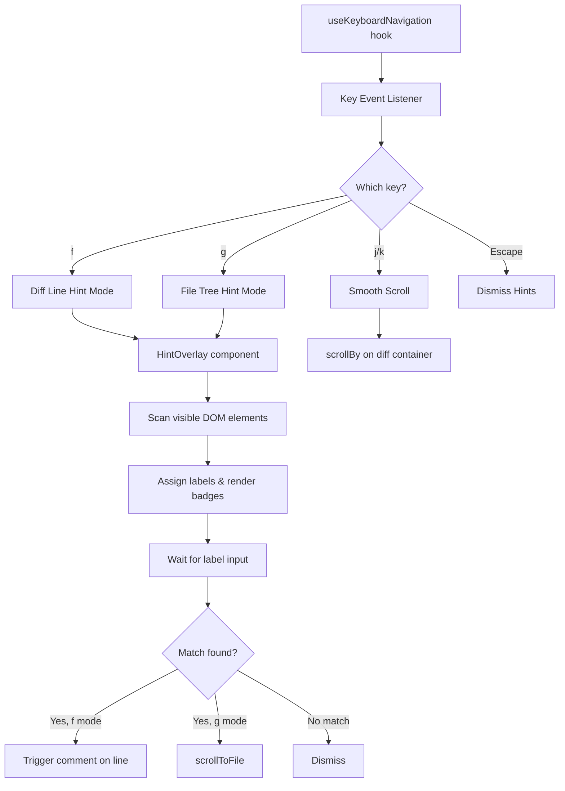
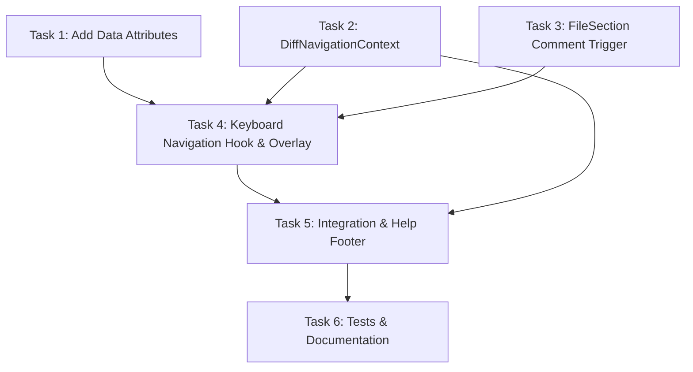

# Plan: Keyboard Hint Navigation

## Original Work Order

> Implement keyboard navigation for the self-review app with three capabilities:
> 1. `f` key activates hint labels on changed diff lines (additions/deletions only) for quickly opening a comment input on a specific line
> 2. `g` key activates hint labels on file tree entries for jumping to a file in the diff pane
> 3. `j/k` keys for smooth scrolling the diff pane (not semantic jumping, since tall hunks would be skipped entirely)
>
> All keyboard shortcuts are suppressed when a text input has focus (comment textarea, search box, markdown editor).

## Plan Clarifications

| Question | Answer |
|----------|--------|
| Should hints appear on all lines or only changed lines? | Changed lines only (additions/deletions), not context lines |
| Should file tree also get hints? | Yes, triggered by `g` with single-character labels |
| Scroll model: semantic jumping or smooth scroll? | Smooth scroll (j/k scroll by a few lines), because semantic jumping skips tall hunks entirely |
| Should j/k work during hint mode? | Yes, j/k always works unless a text input has focus |
| When `g` jumps to a collapsed file section, should it auto-expand? | No. Keep current collapsed state and scroll to the file header only |
| How should changed-line filtering be determined for `f` hints? | Add and use a new `data-line-type` attribute (`addition`, `deletion`, `context`) |
| How should keyboard navigation access `scrollToFile`? | Refactor to a shared provider/context so file tree and keyboard navigation use the same navigation source |
| How should shortcuts be discovered in-app? | Add a "Help" section in the footer area below the file tree listing the available shortcuts |

## Executive Summary

The app currently has no global keyboard shortcuts — all interaction is mouse-driven (hover to reveal `+` buttons, click to navigate files, scroll wheel to browse diffs). This plan adds a Vimium-inspired hint overlay system and smooth keyboard scrolling to enable fully keyboard-driven code review.

The approach introduces a single `useKeyboardNavigation` hook that manages two hint modes (`f` for diff lines, `g` for file tree) and continuous smooth scrolling (`j/k`). Hint labels are rendered as lightweight overlays positioned over existing UI elements using DOM queries and explicit `data-*` attributes. Diff/file navigation is unified through a shared navigation provider so mouse and keyboard entry points call the same `scrollToFile` path. Shortcut discovery is provided via a dedicated "Help" section in the file tree footer. No changes to the existing component data model, IPC contract, or review state are required.

## Context

### Current State vs Target State

| Current State | Target State | Why? |
|---------------|-------------|------|
| Comments are added by hovering over a line gutter to reveal a `+` icon, then clicking | Press `f`, type 1-2 character label to open comment input on that line | Eliminates mouse dependency; faster for keyboard-oriented reviewers |
| File navigation requires clicking file entries in the tree panel | Press `g`, type a single character to jump to that file | Faster random access to files without mouse |
| Diff pane scrolling requires mouse scroll wheel or trackpad | `j`/`k` keys scroll the diff pane smoothly | Enables fully keyboard-driven review sessions |
| No keyboard shortcut awareness — all key events go to the browser | Global key listener with text-input suppression | Foundation for future keyboard shortcuts |

### Background

The app already has useful `data-*` attributes on DOM elements that the hint system can target:
- `data-file-path` on file sections and file tree entries
- `data-line-number` and `data-line-side` on diff lines
- `data-testid="comment-icon-{side}-{lineNumber}"` on `+` buttons

The comment workflow currently uses a drag-to-select model (`FileSection.tsx` manages `dragState` and `commentRange`). The hint system needs to integrate with this by simulating a single-line comment range (start === end) on the targeted line.

The diff pane scroll container is the `div.overflow-y-auto` parent of `DiffViewer` in `Layout.tsx`.

## Architectural Approach

### Keyboard Event Management

**Objective**: Intercept global keystrokes and route them to the correct handler, while ensuring text inputs are never disrupted.

The `useKeyboardNavigation` hook attaches a single `keydown` listener to `document`. Before processing any key, it checks if the active element is a text input (`input`, `textarea`, `[contenteditable]`, or within an MDEditor). If so, the event is ignored entirely. This is the same guard pattern used by Vimium.

The hook manages a `mode` state: `'normal' | 'hint-diff' | 'hint-file'`. In normal mode, `f` enters `hint-diff`, `g` enters `hint-file`, and `j/k` trigger scrolling. In either hint mode, alphanumeric keys are captured for label matching, and `Escape` or any non-matching key returns to normal mode.

*Clarification reference: `scrollToFile` comes from shared navigation context rather than a second independent hook instance.*

### Hint Label Generation & Rendering

**Objective**: Show short, ergonomic labels on targetable elements and match user input to a label.

When entering a hint mode, the system:
1. Queries the DOM for visible target elements (changed lines for `f`, file entries for `g`)
2. Filters to elements currently within the viewport using `getBoundingClientRect`
3. Assigns labels from a home-row-first character set: `a, s, d, f, j, k, l, h, g, q, w, e, r, t, u, i, o, p` for single-char, then two-char combos (`aa, as, ad, ...`) if needed
4. Renders a `HintOverlay` component — a fixed-position container with absolutely-positioned badge elements

The `HintOverlay` is a React portal rendered at the document body level. Each badge is positioned using the target element's `getBoundingClientRect()`. Badges use a high `z-index` and a visually distinct style (small, colored background, monospace font) similar to Vimium's yellow labels.

For `f` (diff lines): targets are elements matching `[data-line-number][data-line-side][data-line-type]` where `data-line-type` is `addition` or `deletion`. Labels replace the line number text in the gutter temporarily rather than overlaying, to avoid visual clutter.

For `g` (file tree): targets are file entry buttons in the file tree. Labels are rendered as inline badges prepended to the file name.

*Clarification reference: line hints replace gutter text while file hints use inline file badges because the file tree has no equivalent numeric gutter and must preserve file-name scanability.*

### Diff Line Hint → Comment Trigger

**Objective**: When a user selects a hint label on a diff line, open a comment input on that line.

The current comment flow is: mousedown on `+` icon → sets `commentRange` in `FileSection` → renders `CommentInput`. The hint system needs to trigger this same flow programmatically.

Approach: expose a `triggerComment(filePath, lineNumber, side)` callback from `FileSection` (or via a custom DOM event / React context method). When a hint is selected, the hook dispatches this with the target line's data attributes. `FileSection` receives it, sets `commentRange` to `{ start: lineNumber, end: lineNumber, side }`, and the existing `CommentInput` rendering logic handles the rest.

A custom DOM event (`trigger-line-comment`) is the cleanest integration path, since the app already uses custom DOM events for cross-component coordination (e.g., `toggle-all-sections`, `toggle-all-comments`). The event carries `{ filePath, lineNumber, side }` in its `detail`.

### File Tree Hint → Navigation

**Objective**: When a user selects a hint label on a file tree entry, scroll the diff pane to that file.

This is straightforward: the existing `scrollToFile(filePath)` from `useDiffNavigation` already does exactly this. The hint system just needs to call it with the `filePath` from the selected file entry's `data-testid` or a new `data-file-path` attribute on the file tree buttons.

When the selected file section is collapsed, navigation preserves that state and scrolls to the file header only (no auto-expand).

*Clarification reference: `g` jumps do not change collapse state.*

### Shortcut Discovery (Help Section)

**Objective**: Provide an in-app legend to make keyboard shortcuts discoverable.

A new "Help" section is added to the bottom of the `FileTree` component. This section is visually separated from the file list (e.g., using a border or background tint) and contains a concise list of shortcuts:
- `f`: Hint-based line commenting
- `g`: Hint-based file jump
- `j/k`: Smooth scroll diffs
- `Esc`: Cancel hint mode

This section remains visible regardless of the scroll position of the file tree.

### Smooth Scrolling (j/k)

**Objective**: Allow the user to scroll the diff pane up/down using `j` and `k` keys.

The scroll container is the `div.overflow-y-auto` wrapping `DiffViewer` in `Layout.tsx`. The hook needs a ref to this element. Options:
1. Add a `data-scroll-container` attribute to the div and query it
2. Pass a ref down via context

Option 1 is simpler and consistent with the existing `data-*` attribute pattern. The hook calls `container.scrollBy({ top: ±SCROLL_AMOUNT, behavior: 'smooth' })` on each `j`/`k` press. A reasonable `SCROLL_AMOUNT` is ~80px (roughly 3-4 lines of code).

For held keys (key repeat), the browser's native key repeat handles continuous scrolling. `behavior: 'instant'` should be used instead of `'smooth'` to avoid animation queue buildup during rapid key repeat.

### Component Structure

**New files:**
- `src/renderer/hooks/useKeyboardNavigation.ts` — the core hook (mode state, key listener, label generation, scroll logic)
- `src/renderer/components/HintOverlay.tsx` — React portal rendering hint badges
- `src/renderer/context/DiffNavigationContext.tsx` — shared navigation provider exposing `scrollToFile` and related navigation actions

**Modified files:**
- `src/renderer/components/Layout.tsx` — add `data-scroll-container` attribute to the diff pane wrapper div
- `src/renderer/components/DiffViewer/FileSection.tsx` — listen for `trigger-line-comment` custom event to programmatically open comment input
- `src/renderer/components/DiffViewer/UnifiedView.tsx` — add `data-line-type` attribute to line elements (addition/deletion/context)
- `src/renderer/components/DiffViewer/SplitView.tsx` — add `data-line-type` attribute to line elements
- `src/renderer/components/FileTree.tsx` — add `data-file-path` attribute to file entry buttons and implement "Help" footer section
- `src/renderer/hooks/useDiffNavigation.ts` — refactor core navigation logic into shared provider utility
- `src/renderer/App.tsx` — mount navigation provider, `useKeyboardNavigation` hook, and `HintOverlay`

## Risk Considerations and Mitigation Strategies

Technical Risks

- **Hint positioning after scroll**: If the user scrolls while hints are visible, badge positions become stale.
    - **Mitigation**: Dismiss hints on scroll. This matches Vimium's behavior and avoids the complexity of repositioning.
- **Performance with many changed lines**: A diff with 200+ visible changed lines would generate many DOM badges.
    - **Mitigation**: Changed-lines-only filtering already reduces targets significantly. Two-character labels handle large sets without performance issues. Portal rendering avoids re-rendering parent components.
- **Key repeat and scroll jank**: Holding `j` with `behavior: 'smooth'` queues up many smooth scrolls.
    - **Mitigation**: Use `behavior: 'instant'` for `scrollBy` to ensure immediate response on key repeat.

Implementation Risks

- **Integration with comment drag system**: The existing comment system uses drag state in `FileSection`. Programmatic triggering must not conflict with in-progress drag operations.
    - **Mitigation**: The custom event handler checks that no drag is in progress before setting `commentRange`. Hints are dismissed if a drag starts.
- **MDEditor key capture**: The `@uiw/react-md-editor` component may capture keystrokes in ways that the `activeElement` check doesn't catch.
    - **Mitigation**: Check for ancestors with `[class*="md-editor"]` or `[data-color-mode]` in the suppression logic.
- **Regression in mouse-based flow**: Keyboard additions could accidentally break existing click/hover/drag comment and file navigation behavior.
    - **Mitigation**: Add focused unit tests for keyboard handlers and regression checks for mouse comment creation and file-tree click navigation.

## Success Criteria

### Primary Success Criteria

1. Pressing `f` shows character labels on all visible changed lines (additions/deletions) in the diff pane; typing a label opens a comment input on that line
2. Pressing `g` shows character labels on file tree entries; typing a label scrolls the diff pane to that file
3. Pressing `j`/`k` scrolls the diff pane down/up smoothly
4. All keyboard shortcuts are suppressed when any text input element has focus
5. `Escape` dismisses any active hint overlay
6. File jumps triggered by `g` preserve existing file section collapsed/expanded state
7. The file tree footer displays the keyboard shortcut help legend

## Documentation

- Update `AGENTS.md` to document the keyboard shortcuts (`f`, `g`, `j/k`, `Escape`) and the `useKeyboardNavigation` hook
- Update `docs/PRD.md` section 10.2 (Accessibility) to reference the new keyboard navigation capabilities and list the available shortcuts
- Update `test/features` coverage to include keyboard hint activation, label selection behavior, and `j/k` suppression when inputs are focused (only if these scenarios are not already covered)

## Resource Requirements

### Development Skills

- React hooks (custom hooks, refs, portals, DOM event coordination)
- DOM API (getBoundingClientRect, scrollBy, IntersectionObserver awareness)
- Electron renderer process constraints (no Node.js APIs in renderer)

### Technical Infrastructure

- No new dependencies required. All functionality uses native DOM APIs and React primitives.

## Integration Strategy

Introduce a shared diff-navigation provider in renderer context and route both file-tree click navigation and keyboard hint navigation through the same `scrollToFile` interface. This reduces duplicated navigation logic and keeps behavior parity across mouse and keyboard entry points.

## Notes

### Decision Log

- Use explicit `data-line-type` for changed-line targeting instead of styling/class heuristics.
- Preserve collapsed state on `g`-based file jumps; only scroll to file header.
- Centralize diff navigation through shared provider/context to improve reuse and consistency.

### Change Log

- 2026-02-16: Added user-confirmed clarifications for collapsed file jump behavior, line-type targeting strategy, and shared navigation source for `scrollToFile`.
- 2026-02-16: Added a "Help" footer section to the file tree for shortcut discovery as per user request.
- 2026-02-16: Strengthened architecture with shared navigation context, clarified hint-rendering rationale, and added regression risk + mitigation notes.
- 2026-02-16: Added integration strategy and documentation/test coverage expectations for keyboard workflows.
- 2026-02-16: Generated 6 tasks with execution blueprint.

## Execution Blueprint

**Validation Gates:**

- Reference: `/config/hooks/POST_PHASE.md`

### Dependency Diagram

### ✅ Phase 1: Foundation

**Parallel Tasks:**

- ✔️ Task 1: Add data attributes for keyboard hint targeting
- ✔️ Task 2: Create shared DiffNavigationContext provider
- ✔️ Task 3: Add custom event listener for programmatic comment triggering

### ✅ Phase 2: Core Implementation

**Parallel Tasks:**

- ✔️ Task 4: Implement useKeyboardNavigation hook and HintOverlay component (depends on: 1, 2, 3)

### ✅ Phase 3: Integration

**Parallel Tasks:**

- ✔️ Task 5: Integrate navigation provider, keyboard hook, and help footer (depends on: 2, 4)

### ✅ Phase 4: Quality

**Parallel Tasks:**

- ✔️ Task 6: Write tests and update documentation (depends on: 5)

### Post-phase Actions

- Verify all keyboard shortcuts work end-to-end
- Confirm no regressions in mouse-based workflows

### Execution Summary

- Total Phases: 4
- Total Tasks: 6
- Maximum Parallelism: 3 tasks (in Phase 1)
- Critical Path Length: 4 phases

## Execution Summary

**Status**: Completed Successfully **Completed Date**: 2026-02-16

### Results

All 6 tasks across 4 phases executed successfully. The keyboard hint navigation system is fully implemented:
- Data attributes added to DOM elements for hint targeting (Phase 1)
- Shared DiffNavigationContext provider created and integrated (Phase 1)
- Custom event listener for programmatic comment triggering (Phase 1)
- Core useKeyboardNavigation hook and HintOverlay component (Phase 2)
- Full integration in App.tsx with keyboard shortcuts help footer in FileTree (Phase 3)
- 11 unit tests for pure functions, AGENTS.md and PRD.md updated (Phase 4)

### Noteworthy Events

- Phase 1 tasks (1, 2, 3) executed in parallel successfully with no conflicts
- Pre-existing TypeScript error in xml-parser.ts (from uncommitted changes unrelated to this plan) did not affect execution
- The generateLabels function switches entirely to two-char combos when count exceeds 18 (not a mix of single and double), which the tests correctly reflect
- Commit hooks enforced 50/72 line wrapping on commit messages throughout

### Recommendations

- End-to-end testing of the keyboard workflows should be done manually since E2E tests cannot run in the dev container
- Consider adding visual feedback (e.g., a mode indicator) when hint mode is active in a future iteration
