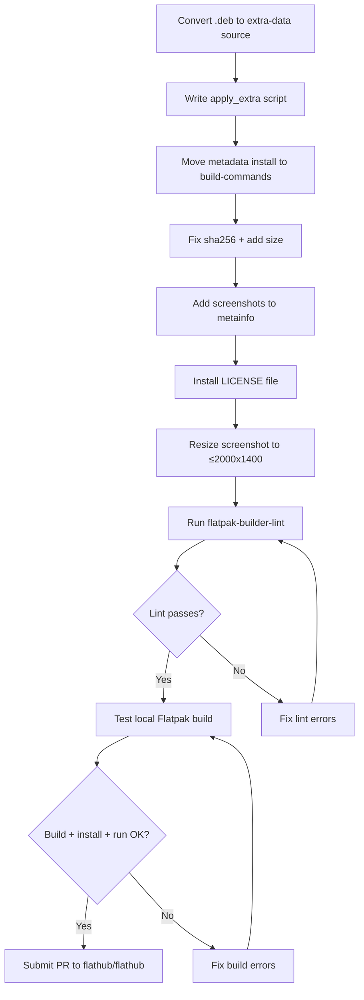
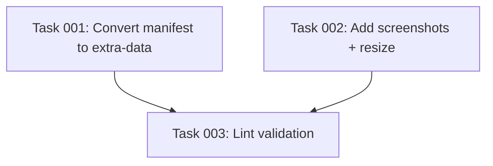

# Plan: Flathub Submission Readiness

## Original Work Order

> To ensure all these steps are passing (referring to Flathub submission prerequisites: fix sha256
> checksums, test local build, run linter, submit PR to flathub/flathub)

## Executive Summary

The Flatpak packaging files exist but have several blockers that will cause Flathub submission
rejection. This plan addresses all known issues so the app can pass `flatpak-builder-lint`
validation and Flathub reviewer scrutiny.

The most significant change is converting the `.deb` source from a regular `file` type to
`extra-data`. Because the app uses a proprietary license (`LicenseRef-proprietary`), Flathub
cannot redistribute the binary on their servers. The `extra-data` source type defers the download
to install time — the `.deb` is fetched directly from GitHub when the user installs the Flatpak,
not during the Flathub build.

Additional issues: placeholder sha256 checksums, missing screenshots in the metainfo (required
for graphical apps), missing license file installation, and an oversized screenshot.

## Context

### Current State vs Target State

| Current State | Target State | Why? |
| --- | --- | --- |
| `.deb` uses regular `file` source type | `.deb` uses `extra-data` source type with `apply_extra` script | Proprietary license requires non-redistributable source handling |
| Two `FIXME_REPLACE_WITH_ACTUAL_SHA256` in manifest | Real sha256 checksums | Flatpak build will fail without valid checksums |
| No `<screenshots>` in metainfo.xml | At least 1 screenshot with caption | Required for all graphical apps on Flathub; rejection without it |
| No license file installed in build | License installed to `/app/share/licenses/com.mateuaguilo.SelfReview/` | Flathub requirement for all modules |
| `docs/screenshot.png` is 2647x1525 | Screenshot ≤2000x1400 (HiDPI) or ≤1000x700 (1x) | Flathub quality guidelines cap dimensions |
| Files not validated with `flatpak-builder-lint` | All lint checks pass | Required before submission |

### Background

The app uses a proprietary license. Flathub requires that non-redistributable sources use the
`extra-data` source type. With `extra-data`, the `.deb` is not downloaded during the Flatpak build
(and therefore not stored in the Flathub ostree repo). Instead, Flatpak downloads it at install
time and runs an `apply_extra` script to extract and install it.

This changes the manifest architecture:
- Build commands can only install metadata (desktop file, metainfo, icon, license) — they cannot
  touch the `.deb` contents since it doesn't exist at build time.
- An `apply_extra` script runs at install time in a sandbox with access only to `/app/extra`. It
  must extract the `.deb` and place the app files in the right location.
- The `extra-data` source requires a `size` field (in bytes) in addition to `sha256`.

The `.deb` for v1.8.0 is 88,713,642 bytes with sha256
`8667fac98822d7c2f287b207406dd986191f811de17de3142b8ca95862068dad`.

The `x-checker-data` pattern remains valid for `extra-data` sources — Flathub's bot can still
auto-update the URL, checksum, and size on new releases.

## Architectural Approach

### Convert Manifest to extra-data Architecture

**Objective**: Restructure the manifest so the `.deb` is downloaded at install time, not build time,
to comply with Flathub's non-redistributable source requirements.

The manifest must be split into two phases:

**Build time** (runs on Flathub infrastructure):
- Install metadata files: `.desktop`, `.metainfo.xml`, icon SVG, LICENSE
- Install the `apply_extra` script to `/app/bin/apply_extra`
- Install the wrapper script (`self-review.sh`) to `/app/bin/self-review`

**Install time** (runs on user's machine via `apply_extra`):
- Extract the `.deb` (`ar x`, `tar xf data.tar.*`)
- Move the Electron app files from the extracted tree to `/app/extra/`

The `extra-data` source declaration replaces the current `file` source for the `.deb`, adding
the `size` field (88713642 bytes) and keeping the `x-checker-data` for auto-updates.

### Add Screenshots to Metainfo

**Objective**: Satisfy the mandatory screenshot requirement for graphical applications on Flathub.

An existing screenshot lives at `docs/screenshot.png` (2647x1525). It needs to be:

1. Resized to ≤2000x1400 for HiDPI compliance.
2. Hosted at a stable URL (tagged commit or commit SHA on GitHub, not a branch ref).
3. Referenced in the metainfo with a `<screenshots>` block including a caption.

### Install License File

**Objective**: Comply with Flathub's requirement that license files are installed for each module.

Since the `.deb` won't be available at build time with `extra-data`, the LICENSE file must be
sourced separately. Add it as a `file` source fetched from the repository's raw URL and install
it to `/app/share/licenses/com.mateuaguilo.SelfReview/LICENSE` in the build commands.

### Validate and Test

**Objective**: Ensure all files pass Flathub's automated validation and the app works.

Run `flatpak-builder-lint` against both the manifest and the built appstream data. Then build
locally and verify the app launches and functions correctly. This must happen on a Linux host
with display access (not in the dev container).

## Risk Considerations and Mitigation Strategies

Technical Risks

- **`apply_extra` sandbox limitations**: The script runs in a restricted sandbox with access only to
  `/app/extra`. If the `.deb` extraction produces unexpected paths, the app won't find its files.
    - **Mitigation**: Test the extraction manually first. The `.deb` structure from Electron Forge
      is well-known (`usr/share/<app-name>/` contains the Electron app).
- **Screenshot hosting stability**: If the screenshot URL points to a branch (`main`), it can break.
    - **Mitigation**: Use a commit SHA URL for the screenshot reference.

Implementation Risks

- **Linter rejections for unforeseen issues**: `flatpak-builder-lint` may flag issues not covered in
  documentation (e.g., permission concerns with `--filesystem=host:ro`).
    - **Mitigation**: Run the linter early and iterate. The `host:ro` permission is common for
      dev tools that need to read the filesystem.
- **Flathub reviewer requirements**: Reviewers may have additional expectations for proprietary apps
  beyond what's documented.
    - **Mitigation**: Be responsive to reviewer feedback on the PR.

Policy Risks

- **Flathub Generative AI policy**: Flathub's requirements state that "submissions or changes having
  low-quality AI-generated or AI-assisted code are not allowed" and that submissions where the
  majority of code is AI-written "without meaningful human input, review, or justification" are
  rejected. This project is built primarily with AI assistance, and the repository contains visible
  AI tooling artifacts (CLAUDE.md, AGENTS.md, `.claude/` directory). If a Flathub reviewer
  inspects the source repository and interprets the policy strictly, they could reject the
  submission on AI policy grounds. The policy is vague — it targets low-quality automated
  submissions but could be applied more broadly at reviewer discretion.
    - **Mitigation**: The submission PR to `flathub/flathub` must be created manually (not by AI).
      Do not use AI to respond to reviewer comments. The app has real users, a real use case, is
      tested, and the author reviews all AI-generated code. If challenged, emphasize that AI is a
      development tool under human oversight, not the unchecked author. However, there is no
      guarantee this argument will satisfy every reviewer — this is an **acceptance risk** that
      cannot be fully mitigated.

## Success Criteria

### Primary Success Criteria

1. Manifest uses `extra-data` for the `.deb` source with valid sha256 and size
2. `apply_extra` script correctly extracts and installs the app at install time
3. `flatpak-builder-lint manifest` passes with zero errors and zero warnings
4. `flatpak-builder-lint appstream` passes with zero errors and zero warnings
5. Local Flatpak build completes and the app launches correctly
6. PR submitted to `flathub/flathub` targeting the `new-pr` branch

## Resource Requirements

### Development Skills

- Familiarity with Flatpak `extra-data` source type and `apply_extra` scripts
- Linux desktop environment with display (for testing — cannot use dev container)

### Technical Infrastructure

- `flatpak-builder` and `org.flatpak.Builder` runtime installed on the host
- `org.freedesktop.Platform` and `org.freedesktop.Sdk` version 24.08
- `org.electronjs.Electron2.BaseApp` version 24.08
- `imagemagick` or similar for resizing the screenshot

## Notes

- The local Flatpak build and lint validation **cannot run inside the dev container** — they require
  a host Linux system with Flatpak installed.
- The `x-checker-data` in the manifest enables Flathub's bot to auto-update checksums on future
  releases, so the sha256 and size values only need to be set manually for the initial submission.
- The `apply_extra` approach means the Flatpak download from Flathub will be small (just metadata),
  but installation will require downloading the ~85MB `.deb` from GitHub.

## Task Dependency Diagram

## Execution Blueprint

**Validation Gates:**

- Reference: `/config/hooks/POST_PHASE.md`

### ✅ Phase 1: Manifest and Metainfo Updates

**Parallel Tasks:**

- ✔️ Task 001: Convert manifest to extra-data architecture (fix checksums, add apply_extra, install LICENSE)
- ✔️ Task 002: Add screenshots to metainfo and resize screenshot image

### ✅ Phase 2: Validation

**Parallel Tasks:**

- ✔️ Task 003: Validate with flatpak-builder-lint (depends on: 001, 002)

### Execution Summary

- Total Phases: 2
- Total Tasks: 3
- Maximum Parallelism: 2 tasks (in Phase 1)
- Critical Path Length: 2 phases

## Execution Summary

**Status**: ✅ Completed Successfully **Completed Date**: 2026-02-17

### Results

All 3 tasks completed successfully. The Flatpak manifest has been converted to use `extra-data` source type with a proper `apply_extra` script, sha256 checksums are real values, the LICENSE file is installed, and the metainfo includes a resized screenshot. YAML and XML validation passed.

### Noteworthy Events

- `flatpak-builder-lint` could not run inside the dev container (no Flatpak runtime available). YAML and XML structural validation was performed as a substitute. The user must run `flatpak-builder-lint manifest` and `flatpak-builder-lint appstream` on a host Linux system before submitting the Flathub PR.
- The screenshot URL in metainfo uses the `main` branch reference. This will resolve correctly once changes are pushed but is not a stable commit-pinned URL.

### Recommendations

- Run on host: `flatpak-builder-lint manifest flatpak/com.mateuaguilo.SelfReview.yml`
- Run on host: `flatpak-builder-lint appstream flatpak/com.mateuaguilo.SelfReview.metainfo.xml`
- Test a local Flatpak build on the host to verify `apply_extra` works correctly
- Consider pinning the screenshot URL to a commit SHA after pushing to main
- Submit the Flathub PR manually (not via AI) per the policy risk mitigation in the plan
