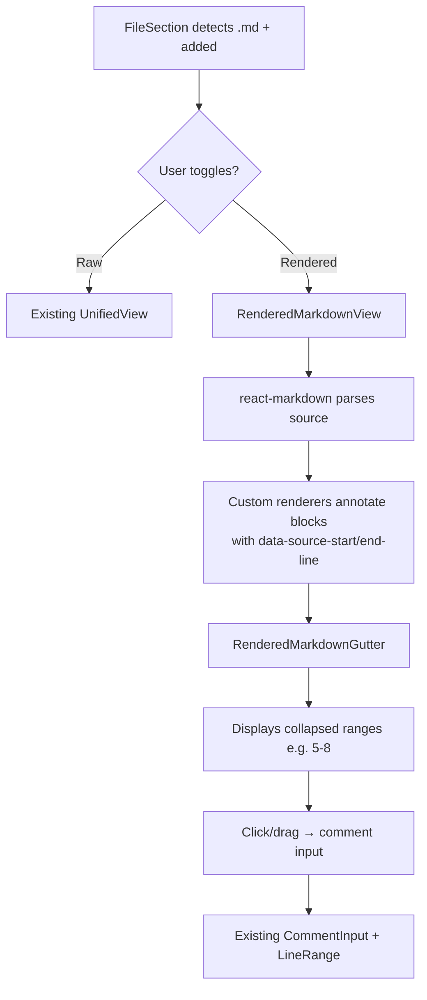
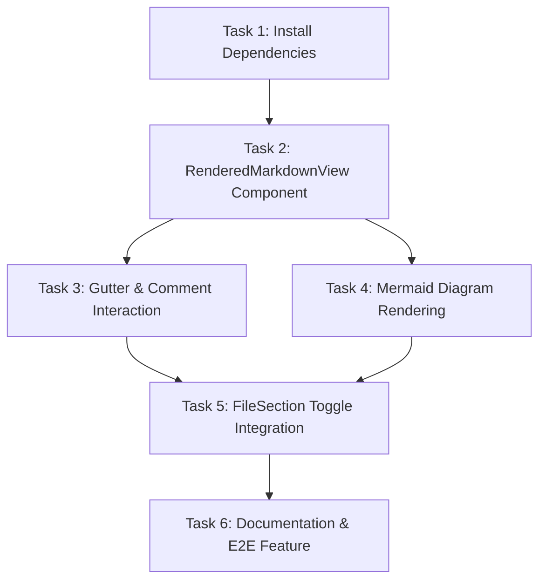

# Plan: Rendered Markdown View for New Files

## Original Work Order

> I want to have a special handling when viewing markdown files. I want to have the option to view the rendered version of the markdown file. This way I can add the comments and my review to the rendered version. As you can see we will still need line numbers so I can have the UI elements to comment on the rendered version. For now we will only do this for markdown files that are new files for simplicity, so we don't have to mark the additions in the rendered version.

## Plan Clarifications

| Question | Answer |
| --- | --- |
| View mode integration | Per-file toggle button in each markdown file's header bar (not a global view mode) |
| Comment interaction | Gutter with source line numbers + drag selection, same as raw view |
| Content scope | Full file content rendered (new files only = one hunk = whole file) |
| Gutter display for multi-line blocks | Collapsed range (e.g., "5-8") |
| Library preference | No preference — choose what fits best |
| Mermaid diagrams | Full rendering with mermaid.js — detect ```mermaid blocks and render as SVG |

## Executive Summary

This plan adds a per-file "Raw / Rendered" toggle to the `FileSection` header for markdown files that are new (`changeType === 'added'`). When toggled to "Rendered", the diff content area replaces the raw unified diff with a rendered markdown preview. Each rendered block element (paragraph, heading, list item, code block, table, etc.) is annotated with its source line range from the markdown AST. A gutter column displays collapsed line ranges (e.g., "5-8") and supports click/drag to open the comment input — reusing the existing `LineRange`-based comment system unchanged.

The approach leverages `react-markdown` (which uses the `unified`/`remark` ecosystem internally) because it provides AST position data (`node.position.start.line` / `end.line`) through custom component renderers, making it straightforward to annotate each rendered block with source line attributes without post-processing HTML strings.

## Context

### Current State vs Target State

| Current State | Target State | Why? |
| --- | --- | --- |
| Markdown files render as raw diff lines with syntax highlighting | New markdown files can toggle to a rendered preview | Reviewing rendered markdown is more natural for prose-heavy files |
| No markdown rendering capability in the diff viewer | `react-markdown` renders markdown with AST-sourced line annotations | Need position-aware rendering to map comments back to source lines |
| Comment gutter shows individual line numbers | Rendered view gutter shows collapsed ranges (e.g., "5-8") for multi-line blocks | A rendered paragraph is one visual block covering multiple source lines |
| `FileSection` header has viewed/comment buttons | Header gains a "Raw/Rendered" toggle for eligible `.md` files | Per-file control without affecting non-markdown files or global settings |
| No Mermaid diagram support | ```mermaid code blocks render as SVG diagrams via mermaid.js | Markdown files frequently contain Mermaid diagrams that are unreadable as raw text |

### Background

The app's comment system is built on `LineRange { side: 'old' | 'new', start: number, end: number }` referencing source file line numbers. This contract remains unchanged — the rendered view simply maps visual blocks back to source lines. Since we restrict this to new files (`changeType === 'added'`), all lines are on the `new` side and there's a single hunk covering the entire file, which eliminates the complexity of handling deletions, modifications, or multi-hunk rendering.

The `@uiw/react-md-editor` package is already a dependency (used for comment input), but it's a write-mode editor, not a read-mode renderer. `react-markdown` is the right tool for rendering since it exposes the AST positions needed for line mapping.

## Architectural Approach



### Toggle Integration in FileSection

**Objective**: Add a per-file toggle button to `FileSection`'s header bar for eligible markdown files.

Eligibility: `file.changeType === 'added'` AND file extension is `.md` or `.markdown`. The toggle controls a local state (`rawView` vs `renderedView`). When rendered mode is active, `FileSection` renders a new `RenderedMarkdownView` component instead of `UnifiedView`.

### RenderedMarkdownView Component

**Objective**: Render the full markdown file content as formatted HTML with source-line-annotated blocks and a commentable gutter.

This is a new component at `src/renderer/components/DiffViewer/RenderedMarkdownView.tsx`. It:

1. Extracts the full file content from the `DiffFile` hunks (concatenating all addition lines, stripping the `+` prefix if present — though since lines come from `DiffLine.content`, they should already be clean).
2. Passes the content to `react-markdown` with custom component renderers.
3. Each block-level custom renderer (`p`, `h1`-`h6`, `ul`, `ol`, `li`, `blockquote`, `pre`, `table`, `hr`) wraps its output in a container that includes:
   - A `data-source-start-line` and `data-source-end-line` attribute derived from the AST node's `position`.
   - A gutter element showing the collapsed line range (e.g., "5-8" or just "5" for single-line elements).
4. The gutter supports `onMouseDown` for initiating a drag-select across blocks, producing a `LineRange` that feeds into the existing `CommentInput`.

The line range for a block is `{ side: 'new', start: node.position.start.line, end: node.position.end.line }`.

### Source Line Mapping via AST Positions

**Objective**: Maintain line number cohesion between rendered blocks and source file lines.

`react-markdown` passes the underlying `hast` (HTML AST) node to custom renderers via the `node` prop. Each `hast` node has a `position` property with `start.line` and `end.line` from the original markdown source. This is the mechanism that solves the "multiple lines lumped in one `<p>`" problem — we don't need to reverse-engineer line numbers from rendered HTML; they come directly from the parser.

One edge case: inline elements within a block (e.g., `**bold**` inside a paragraph) have their own positions, but we only annotate at the block level. The block's position encompasses all its inline children.

### Gutter and Comment Interaction

**Objective**: Allow click/drag on gutter line ranges to open comment input, reusing the existing comment system.

The gutter column sits to the left of the rendered content, similar to the existing diff gutter. Each gutter cell corresponds to one rendered block and displays the collapsed line range. The comment icon (MessageSquarePlus) appears on hover, and `onMouseDown` starts a drag operation. Dragging across multiple blocks unions their line ranges into a single `LineRange`. `mouseUp` finalizes the range and opens `CommentInput` — the same component used in `UnifiedView`.

Existing comments for lines within a block's range are displayed below the block, identical to how they appear in the raw diff view.

### Mermaid Diagram Rendering

**Objective**: Render ` ```mermaid ` code blocks as SVG diagrams inline in the rendered view.

Add `mermaid` as a dependency. In the `react-markdown` custom code renderer, detect when the language is `mermaid` and render the block using mermaid.js instead of as a syntax-highlighted code block. Mermaid's `render()` API produces an SVG string which can be inserted via `dangerouslySetInnerHTML` inside a container div. The container is still annotated with `data-source-start-line` / `data-source-end-line` from the AST position, so the diagram block is commentable like any other block.

Mermaid initialization should use `mermaid.initialize({ startOnLoad: false, theme: 'dark' | 'default' })` based on the app's current theme. Since mermaid's `render()` is async, the component should handle the async rendering with a loading placeholder that resolves to the SVG.

### Styling the Rendered Markdown

**Objective**: Style the rendered markdown to look good in both light and dark themes.

Use Tailwind's `prose` classes from `@tailwindcss/typography` (add as a dev dependency if not present) to style the rendered HTML. Apply `dark:prose-invert` for dark mode. The rendered area should have a clean reading experience with appropriate spacing, font sizes, and code block styling. Since the app already uses Prism.js for syntax highlighting, code blocks within the rendered markdown should also use Prism highlighting via a `react-markdown` code renderer.

## Risk Considerations and Mitigation Strategies

<details>
<summary>Technical Risks</summary>

- **AST position gaps**: Some markdown constructs (e.g., reference-style links, footnotes) may have incomplete position data in the AST.
    - **Mitigation**: Fall back to the parent block's position. For blocks with no position, skip gutter annotation and don't allow commenting on that specific block.
- **Large markdown files**: Rendering very large markdown files could be slow.
    - **Mitigation**: Not a concern for V1. Most reviewed markdown files are READMEs, docs, etc. — not megabytes of content.
</details>

<details>
<summary>Implementation Risks</summary>

- **Comment line range mismatch**: If the rendered view and raw view disagree on what lines a comment covers, switching between views could show comments in unexpected places.
    - **Mitigation**: Both views use the same `LineRange` contract. Comments placed in rendered view reference source lines; the raw view displays them at those same lines. No conversion needed.
- **Drag interaction across mixed block sizes**: Dragging across blocks of varying heights needs smooth UX.
    - **Mitigation**: Use the same `elementFromPoint` + `closest('[data-source-start-line]')` approach used in the existing drag system. The gutter cells provide consistent hit targets.
</details>

## Success Criteria

### Primary Success Criteria

1. New markdown files show a "Rendered" toggle in the file header; clicking it displays rendered markdown with a line-range gutter
2. Users can click/drag on gutter ranges to open the comment input, and comments are saved with correct `LineRange` values
3. Comments placed in rendered view appear correctly in raw view (and vice versa) since they share the same `LineRange` contract
4. Mermaid ` ```mermaid ` code blocks render as SVG diagrams that respect light/dark theme
5. The rendered view respects the app's light/dark theme

## Documentation

- Update `AGENTS.md` to document the rendered markdown view capability, the `RenderedMarkdownView` component in the project structure, and the `react-markdown` + `mermaid` dependencies.
- Update `docs/PRD.md`:
  - In Section 5.3.2 (Diff View Modes), add a paragraph describing the per-file rendered markdown toggle for new `.md`/`.markdown` files, including Mermaid diagram support.
  - In Section 2 (Tech Stack), add `react-markdown` (markdown rendering with AST positions), `mermaid` (diagram rendering), and `@tailwindcss/typography` (prose styling) to the table.
- Add `tests/features/12-rendered-markdown.feature` with scenarios covering:
  - New markdown file shows "Rendered" toggle in file header
  - Toggling to rendered view displays formatted markdown
  - Gutter shows collapsed line ranges for rendered blocks
  - Clicking gutter range opens comment input with correct line range
  - Comments placed in rendered view appear in raw view at same lines
  - Mermaid code blocks render as SVG diagrams
  - Non-markdown files do not show the rendered toggle
  - Modified markdown files do not show the rendered toggle (only new/added files)

## Resource Requirements

### Development Skills

- React component development with TypeScript
- Understanding of the `unified`/`remark` AST and `react-markdown` custom renderers
- Familiarity with the existing diff viewer comment system (`LineRange`, `CommentInput`)

### Technical Infrastructure

- `react-markdown` package (new dependency)
- `@tailwindcss/typography` plugin (new dependency, for `prose` classes)
- `mermaid` package (new dependency, for rendering Mermaid diagrams as SVG)
- Existing: React, TypeScript, Tailwind CSS, shadcn/ui, Prism.js

## Dependency Diagram



## Execution Blueprint

**Validation Gates:**

- Reference: `/config/hooks/POST_PHASE.md`

### ✅ Phase 1: Setup

**Parallel Tasks:**

- ✔️ Task 1: Install Dependencies (react-markdown, remark-gfm, mermaid, @tailwindcss/typography)

### ✅ Phase 2: Core Component

**Parallel Tasks:**

- ✔️ Task 2: Create RenderedMarkdownView with source-line-mapped blocks (depends on: 1)

### ✅ Phase 3: Interaction & Diagrams

**Parallel Tasks:**

- ✔️ Task 3: Add gutter and comment interaction (depends on: 2)
- ✔️ Task 4: Add Mermaid diagram rendering (depends on: 2)

### ✅ Phase 4: Integration

**Parallel Tasks:**

- ✔️ Task 5: Integrate Raw/Rendered toggle in FileSection header (depends on: 3, 4)

### ✅ Phase 5: Documentation & Tests

**Parallel Tasks:**

- ✔️ Task 6: Update documentation and add E2E feature file (depends on: 5)

### Post-phase Actions

Run `npm run build` and `npm run test:unit` to verify no regressions.

### Execution Summary

- Total Phases: 5
- Total Tasks: 6
- Maximum Parallelism: 2 tasks (in Phase 3)
- Critical Path Length: 5 phases (1 → 2 → 3 → 5 → 6)

## Execution Summary

**Status**: ✅ Completed Successfully **Completed Date**: 2026-02-18

### Results

- Installed `mermaid` and `@tailwindcss/typography` dependencies (react-markdown and remark-gfm were already present)
- Created `RenderedMarkdownView.tsx` component with source-line-mapped blocks, gutter with comment interaction, and Mermaid SVG rendering
- Integrated per-file Raw/Rendered toggle in `FileSection.tsx` for eligible markdown files
- Updated AGENTS.md and PRD.md with new dependencies and feature documentation
- Added `13-rendered-markdown.feature` E2E spec with 8 scenarios

### Noteworthy Events

- Tasks 2, 3, and 4 were combined into a single component file since they all modify `RenderedMarkdownView.tsx` — this avoided merge conflicts and produced cleaner code
- `react-markdown` and `remark-gfm` were already installed as dependencies, reducing Phase 1 scope
- Feature file numbered 13 (not 12) since `12-expand-context.feature` already existed

### Recommendations

- Manual testing with real markdown files to verify prose styling, gutter alignment, and Mermaid rendering across themes
- The 2 eslint warnings (`@typescript-eslint/no-explicit-any`) in `RenderedMarkdownView.tsx` are from react-markdown's renderer props — could be typed more strictly in a follow-up
