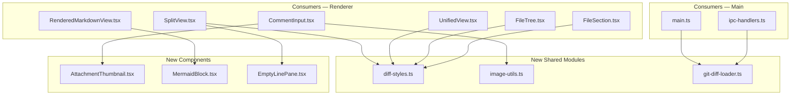
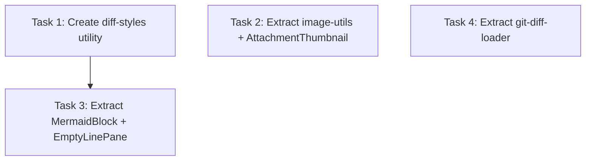

# Plan: Extract Shared Utilities & Sub-components

## Original Work Order

> Several files have grown large with duplicated logic scattered across components. The worst offender is `FileSection.tsx` at 813 lines, but the more actionable problem is that identical utility functions are copy-pasted across files (line stats, change type styles, gutter colors, comment filtering). Additionally, some inline sub-components are large enough to warrant their own files. The main process also has ~25 lines of duplicated git+untracked-file logic between `main.ts` and `ipc-handlers.ts`.

## Executive Summary

Duplicated styling utilities, file stat calculations, and git-diff-loading logic exist across multiple files in both the renderer and main process. Several inline sub-components (`MermaidBlock`, `AttachmentThumbnail`, `EmptyLinePane`) are large enough to extract into their own files.

This plan consolidates all duplicated logic into shared modules and extracts self-contained components, reducing maintenance burden and improving readability without changing any user-facing behavior.

## Context

### Current State vs Target State

| Current State | Target State | Why? |
|---|---|---|
| `getLineBg` duplicated in SplitView + UnifiedView | Single function in `diff-styles.ts` | DRY — identical logic in two files |
| `getGutterBg` duplicated in SplitView + UnifiedView | Single function in `diff-styles.ts` | DRY — identical logic in two files |
| `getFileStats`/`getLineStats` duplicated in FileTree + FileSection | Single function in `diff-styles.ts` | DRY — identical counting logic |
| `getChangeType`/`getChangeTypeStyle` partially duplicated | Single function returning `{ label, className }` | DRY — className strings are identical |
| Image utils inline in CommentInput.tsx (lines 17-48) | Extracted to `image-utils.ts` | Single responsibility, testable |
| AttachmentThumbnail inline in CommentInput.tsx (lines 50-83) | Own file `AttachmentThumbnail.tsx` | Self-contained component with own state |
| MermaidBlock inline in RenderedMarkdownView.tsx (lines 22-67) | Own file `MermaidBlock.tsx` | 45-line component with module-level state |
| Empty pane markup repeated 3× in SplitView.tsx | `EmptyLinePane.tsx` component | Identical JSX in 3 locations |
| Git+untracked logic duplicated in main.ts + ipc-handlers.ts | Single function in `git-diff-loader.ts` | ~25 lines of identical async logic |

### Background

All duplications were verified against the current codebase:
- Styling functions (`getLineBg`, `getGutterBg`) differ only in null-guard due to SplitView accepting `DiffLine | null` vs UnifiedView accepting `DiffLine` — the shared version should accept `DiffLine | null`
- `getChangeTypeInfo` in FileTree returns `{ label, className }` while FileSection only uses `className` — the unified function returns `{ label, className }` and FileSection destructures what it needs
- Git+untracked logic in `main.ts:205-238` passes `gitDiffArgs` while `ipc-handlers.ts:236-254` passes `[]` — the extracted function takes `gitDiffArgs` as a parameter

## Architectural Approach

### Renderer Styling Utilities (`src/renderer/utils/diff-styles.ts`)

**Objective**: Single source of truth for diff-line styling and file statistics.

Four exported functions:
- `getLineBg(line: DiffLine | null): string` — background class for diff lines
- `getGutterBg(line: DiffLine | null): string` — background class for gutter
- `getFileStats(file: DiffFile): { additions: number; deletions: number }` — count added/deleted lines
- `getChangeTypeInfo(changeType: DiffFile['changeType']): { label: string; className: string }` — badge label + style class, with a default fallback returning `{ label: '?', className: '' }`

### Image Utilities (`src/renderer/utils/image-utils.ts`)

**Objective**: Move image processing out of `CommentInput.tsx`.

Two exported functions moved verbatim:
- `resizeImageIfNeeded(blob: Blob, maxDimension: number): Promise<Blob>`
- `processImageFile(file: File): Promise<Attachment>`

### Extracted Components

**`AttachmentThumbnail.tsx`** — Self-contained component (34 lines) with its own state/lifecycle, moved from `CommentInput.tsx:50-83`.

**`MermaidBlock.tsx`** — Component (lines 22-67 of `RenderedMarkdownView.tsx`) plus its two module-level variables (`mermaidInitialized`, `mermaidIdCounter`). Moved as-is.

**`EmptyLinePane.tsx`** — Tiny component replacing 3 identical JSX blocks in `SplitView.tsx`. A simple `
` structure with no props.

### Main Process Git Diff Loader (`src/main/git-diff-loader.ts`)

**Objective**: Consolidate the duplicated git-diff + untracked-files pattern.

One exported async function:
- `loadGitDiffWithUntracked(gitDiffArgs: string[]): Promise<{ files: DiffFile[]; repository: string }>`

Encapsulates: `getRepoRootAsync()` → `runGitDiffAsync(args)` → `parseDiff()` → `getUntrackedFilesAsync()` → `generateUntrackedDiffs()` → merge. Both `main.ts` and `ipc-handlers.ts` call this instead of inlining the logic.

## Risk Considerations and Mitigation Strategies

Technical Risks

- **Import cycle**: New shared modules could create circular imports if they import from components.
    - **Mitigation**: Shared utils only import from `src/shared/types.ts` — no component imports.
- **Null-guard change in UnifiedView**: UnifiedView currently passes non-nullable `DiffLine`. After switching to the shared function accepting `DiffLine | null`, TypeScript is fine (subtype compatibility), no runtime change.
    - **Mitigation**: Type-check confirms compatibility.

Implementation Risks

- **Subtle behavior difference in getChangeTypeStyle**: FileSection has a `default: return ''` case while FileTree does not.
    - **Mitigation**: The unified function includes the default fallback, which is strictly safer.

## Success Criteria

### Primary Success Criteria

1. `npm run test:unit` passes with no regressions
2. `npx tsc --noEmit` reports zero type errors
3. No duplicated styling/stats/git-loading logic remains in the codebase
4. All extracted components render identically (manual verification)

## Documentation

No documentation updates needed. This is a pure internal refactoring with no behavior, API, or configuration changes. PRD.md and test features are unaffected.

## Resource Requirements

### Development Skills

TypeScript, React component extraction patterns, Electron main-process module organization.

### Technical Infrastructure

Existing toolchain only — no new dependencies.

## Notes

- File sizes will decrease across the board; `FileSection.tsx` and `CommentInput.tsx` see the largest reductions.
- The extracted `diff-styles.ts` module becomes a natural place for future styling utilities, but no speculative additions should be made now.

## Execution Blueprint

**Validation Gates:**

- Reference: `/config/hooks/POST_PHASE.md`

### Dependency Diagram

### ✅ Phase 1: Extract shared modules and independent components

**Parallel Tasks:**

- ✔️ Task 1: Create diff-styles.ts utility and update consumers
- ✔️ Task 2: Extract image-utils.ts and AttachmentThumbnail.tsx from CommentInput
- ✔️ Task 4: Extract git-diff-loader.ts from main.ts and ipc-handlers.ts

### ✅ Phase 2: Extract components dependent on Phase 1

**Parallel Tasks:**

- ✔️ Task 3: Extract MermaidBlock.tsx and EmptyLinePane.tsx (depends on: 1)

### Post-phase Actions

Run full verification suite:
- `npx tsc --noEmit` — zero type errors
- `npm run test:unit` — no regressions

### Execution Summary

- Total Phases: 2
- Total Tasks: 4
- Maximum Parallelism: 3 tasks (in Phase 1)
- Critical Path Length: 2 phases

## Execution Summary

**Status**: ✅ Completed Successfully **Completed Date**: 2026-02-18

### Results

All 4 tasks executed successfully across 2 phases. Six new files created, 9 consumer files updated. ~295 lines of duplicated code removed. All 204 unit tests pass, zero type errors, zero lint errors.

New shared modules:
- `src/renderer/utils/diff-styles.ts` — line/gutter bg, file stats, change type info
- `src/renderer/utils/image-utils.ts` — image resize and processing
- `src/main/git-diff-loader.ts` — git diff + untracked files loading
- `src/renderer/components/DiffViewer/MermaidBlock.tsx` — extracted from RenderedMarkdownView
- `src/renderer/components/DiffViewer/EmptyLinePane.tsx` — extracted from SplitView
- `src/renderer/components/Comments/AttachmentThumbnail.tsx` — extracted from CommentInput

### Noteworthy Events

- Phase 1 lint check caught two unused imports (`DiffLine` in UnifiedView, `DiffFile` in FileTree) left by agents after removing inline functions. Fixed before commit.
- The plan noted 3 EmptyLinePane occurrences in SplitView but the agent found 3 in the actual code (plan initially said 2 in the task notes). All replaced.

### Recommendations

No follow-up actions needed. This was a pure internal refactoring with no behavior changes.
