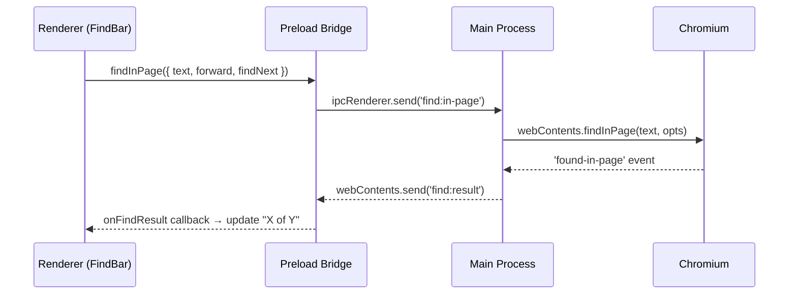

# Plan: Ctrl+F Find-in-Page

## Original Work Order

> I want to implement a search solution with Ctrl/Cmnd + F
>
> The approach has two parts:
>
> 1. Main process: Intercept Ctrl+F (via an app Menu with an accelerator), then tell the renderer to show a search bar.
> 2. Renderer: Show an input field. As the user types, call back to main via IPC, where mainWindow.webContents.findInPage(text) is called. Chromium handles all the highlighting automatically — you just need the input UI.
>
> The key APIs:
> - webContents.findInPage(text, { forward: true, findNext: false }) — starts/continues search
> - webContents.stopFindInPage('clearSelection') — clears highlights on Escape/close
> - webContents.on('found-in-page', (e, result) => ...) — returns match count

## Executive Summary

The Electron app lacks any text search capability. Pressing Ctrl+F does nothing because Electron strips Chrome's built-in find bar. This plan bridges Chromium's native `webContents.findInPage()` API to a React overlay component via IPC, giving users a VS Code-style floating search bar with match highlighting, navigation, and match counting — all powered by Chromium's built-in text search engine.

## Context

### Current State vs Target State

| Current State | Target State | Why? |
|---|---|---|
| No text search capability | Ctrl/Cmd+F opens a floating search bar | Users reviewing large diffs need to find specific text quickly |
| Ctrl+F does nothing (Electron strips Chrome find bar) | Native Chromium highlighting of all matches | Standard user expectation for any text-heavy application |
| No match navigation | Enter/Shift+Enter cycle through matches with "X of Y" counter | Users need to see total matches and navigate between them |

### Background

Electron intentionally removes Chrome's built-in find bar, but exposes the underlying search engine via `webContents.findInPage()` and `webContents.stopFindInPage()`. This API handles all DOM text matching and yellow highlight rendering — the only UI needed is an input field and controls.

The existing codebase already has patterns for: IPC channel definition (`src/shared/ipc-channels.ts`), preload bridge with cleanup subscriptions (`onCloseRequested` pattern), portal-based overlays (`HintOverlay`), and ref-based keyboard hook extensions (`useKeyboardNavigation`).

## Architectural Approach

### IPC Layer (Shared + Main + Preload)

**Objective**: Expose Chromium's find-in-page to the renderer process via the established IPC patterns.

Three new IPC channels in `src/shared/ipc-channels.ts`: `FIND_IN_PAGE` (renderer→main: execute search), `FIND_STOP` (renderer→main: clear highlights), `FIND_RESULT` (main→renderer: match results).

Two new `ipcMain.on()` handlers in `src/main/ipc-handlers.ts` for the fire-and-forget search/stop messages. A new exported `registerFindInPageForWindow(window)` function attaches the `webContents.on('found-in-page')` listener once per window to forward results — following the same export pattern as `sendDiffLoad`/`sendConfigLoad`.

Three new methods on the preload bridge and `ElectronAPI` interface: `findInPage()`, `stopFindInPage()`, and `onFindResult()` (with unsubscribe return, matching `onCloseRequested`).

### FindBar Component (Renderer)

**Objective**: Provide a minimal, VS Code-style floating search bar.

New `src/renderer/components/FindBar.tsx` rendered via `createPortal` to `document.body` (same as `HintOverlay`). Fixed position at top-right below the toolbar (`top: 44px` matching `h-11`). Uses shadcn `Input` and `Button` components with lucide-react icons.

State is fully local: `query`, `currentMatch`, `totalMatches`. The component subscribes to `onFindResult` via `useEffect` with cleanup. Only `finalUpdate: true` events are read to prevent counter flicker.

Key interactions: typing triggers search (`findNext: false`), Enter/Shift+Enter navigates (`findNext: true`), Escape closes and calls `stopFindInPage('clearSelection')`.

### Keyboard Shortcut Integration

**Objective**: Wire Ctrl/Cmd+F to toggle the FindBar without conflicting with existing Vimium shortcuts.

Add `onToggleFindBar` callback option to `useKeyboardNavigation` hook. The Ctrl+F check is placed **before** the `isTextInputFocused()` guard so it works even when the FindBar input is focused (matching browser behavior). Uses a ref to avoid stale closures (same pattern as existing `clearHintsRef`).

The open/closed state lives in `AppContent` (`App.tsx`) and flows down through `KeyboardNavigationManager` → `useKeyboardNavigation`.

## Risk Considerations and Mitigation Strategies

Technical Risks

- **`found-in-page` listener accumulation**: If attached inside a per-request handler, listeners would stack on every search.
    - **Mitigation**: `registerFindInPageForWindow` is called once from `createWindow()`, not per search.
- **Stale closure in keyboard hook**: The `onToggleFindBar` callback captured in `useEffect` could go stale.
    - **Mitigation**: Store in a ref (established `clearHintsRef` pattern in the same hook).

Implementation Risks

- **FindBar position may not align perfectly with toolbar**: The hardcoded `top: 44px` assumes toolbar height doesn't change.
    - **Mitigation**: Validate visually during implementation. The toolbar uses `h-11` (44px) so this is accurate.

## Success Criteria

### Primary Success Criteria

1. Ctrl+F (Cmd+F on macOS) opens a floating search bar; Escape closes it and clears highlights
2. Typing in the search bar highlights all matches in the rendered page via Chromium's native highlighting
3. Match counter shows "X of Y" and Enter/Shift+Enter navigates between matches
4. Existing Vimium shortcuts (`f`, `g`, `j`, `k`) continue to work when the FindBar is closed

## Documentation

Update keyboard shortcuts section in `AGENTS.md` to document Ctrl/Cmd+F.

## Resource Requirements

### Development Skills

Electron main/renderer IPC, React hooks with refs, Chromium `findInPage` API.

### Technical Infrastructure

No new dependencies. Uses existing shadcn/ui components (`Input`, `Button`), lucide-react icons, and `createPortal`.

## Notes

- No PRD.md or e2e test updates needed — this is a self-contained UI enhancement that doesn't change the app's output format or core review workflow
- The `findInPage` API only works on rendered DOM text, not on collapsed/hidden content. This is acceptable since users would only search visible content.

---

**Note**: Manually archived on 2026-02-25
