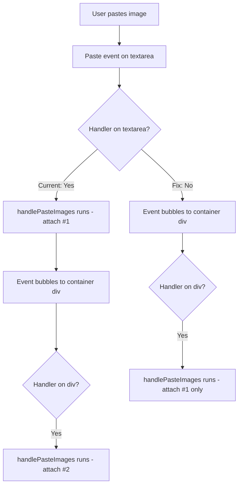

# Plan: Fix Image Paste Duplication in CommentInput

## Original Work Order

> I have identified an issue where when I paste from the clipboard an image it gets attached twice. However, if I drag the image or I upload it using the file picker, it gets attached only once. Can you look into it?

## Executive Summary

When a user pastes an image from the clipboard into the comment editor, the image is attached twice. The root cause is two overlapping `onPaste` handlers registered at different levels of the component tree in `CommentInput.tsx`. The paste event fires on the MDEditor textarea, then bubbles up to the container div — both invoking `handlePasteImages`, which calls `handleImageAttach` twice.

The fix is to remove the redundant paste handler, keeping only the one on the container div. This is the simplest, lowest-risk change that resolves the issue.

## Context

### Current State vs Target State

| Current State | Target State | Why? |
| --- | --- | --- |
| Pasting an image attaches it twice | Pasting an image attaches it once | Bug fix — duplicate attachments are wrong |
| Two `onPaste` handlers on nested elements | Single `onPaste` handler on container div | Eliminate event bubbling duplication |

### Background

The `CommentInput` component (`src/renderer/components/Comments/CommentInput.tsx`) has a container `
` with `onPaste={handlePasteImages}` (line 165) **and** passes `onPaste: handlePasteImages` to the MDEditor's `textareaProps` (line 220).

When the user pastes while focused on the textarea:
1. The textarea's `onPaste` fires first (line 220) → `handlePasteImages` runs → images attached
2. The event bubbles to the container div → its `onPaste` fires (line 165) → `handlePasteImages` runs again → images attached a second time

`e.preventDefault()` on line 64 prevents default browser behavior but does **not** stop event propagation. The drag-and-drop handler only exists on the container div (single handler), so it works correctly. The file picker uses a separate `onChange` event, so it also works correctly.

## Architectural Approach

### Remove Redundant Paste Handler from textareaProps

**Objective**: Eliminate the duplicate `onPaste` registration so paste events are only handled once.

The container div's `onPaste` handler already catches all paste events via bubbling, including those originating from the MDEditor textarea. Removing the `onPaste` from `textareaProps` (line 220) is sufficient. The container div handler will continue to handle paste events from any child element, including the textarea, the suggestion textarea, or any other future input within the component.

This is preferred over the alternative of keeping the textarea handler and removing the div handler, because the div handler also covers paste events from other child elements (e.g., the suggestion code textarea).

## Risk Considerations and Mitigation Strategies

Technical Risks

- **MDEditor intercepting paste events**: If MDEditor internally prevents paste event propagation, the container div handler would never fire. This is unlikely since the current bug proves events already bubble.
    - **Mitigation**: Manual testing of paste after the fix confirms the event reaches the container div.

Implementation Risks

- **Regression on text paste**: Removing the textarea `onPaste` should not affect text paste since `handlePasteImages` only acts on clipboard items with `image/*` MIME types and returns early otherwise.
    - **Mitigation**: Verify that pasting text into the editor still works after the change.

## Success Criteria

### Primary Success Criteria

1. Pasting an image from the clipboard attaches exactly one copy
2. Drag-and-drop image attachment continues to work (single copy)
3. File picker image attachment continues to work (single copy)
4. Pasting text into the comment editor still works normally

## Documentation

No documentation updates required. This is a single-line bug fix in an internal component.

## Resource Requirements

### Development Skills

Standard React/TypeScript knowledge.

### Technical Infrastructure

No new dependencies or infrastructure needed.

---

**Note**: Manually archived on 2026-02-25
