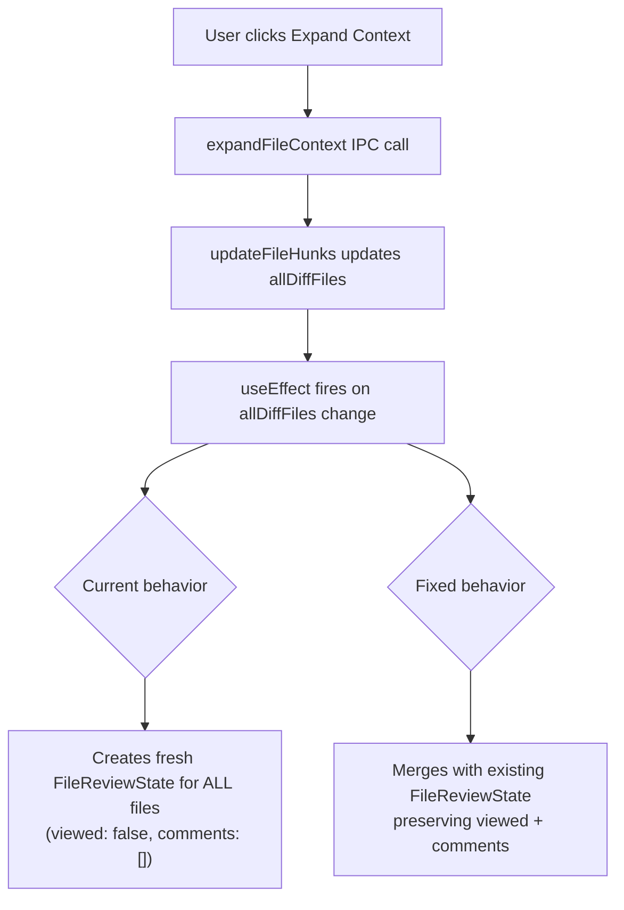
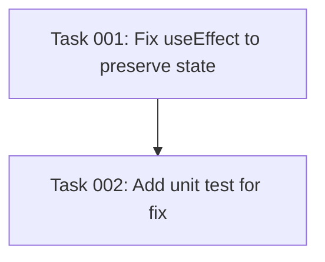

# Plan: Fix Viewed State Reset on Context Expansion

## Original Work Order

> I have noticed that when I'm reviewing files, I mark them as viewed, but if I at some point click a button to expand the context, I get all of the files that I marked as viewed reverted to not viewed. Can you find the culprit and fix it?

## Executive Summary

When a user expands context in the diff viewer, the `allDiffFiles` state array is updated (to store the new hunks for one file). This triggers a `useEffect` in `ReviewContext.tsx` that was designed to initialize `FileReviewState` on first load — but it fires on every `allDiffFiles` change, unconditionally resetting `viewed: false` and `comments: []` for all files.

The fix is surgical: make the initialization effect preserve existing file review state instead of overwriting it. This is a one-file change in `ReviewContext.tsx`.

## Context

### Current State vs Target State

| Current State | Target State | Why? |
| --- | --- | --- |
| Expanding context resets all `viewed` flags to `false` | Expanding context preserves all `viewed` flags | Users lose review progress when expanding context |
| The `useEffect` on `allDiffFiles` always creates fresh `FileReviewState` with `viewed: false` | The effect preserves existing `FileReviewState` entries for files that already have state | The effect should only initialize new files, not reinitialize everything |

### Background

The bug is in `src/renderer/context/ReviewContext.tsx` lines 92–103:

```
useEffect(() => {
  if (allDiffFiles.length > 0) {
    const fileStates = allDiffFiles.map(file => ({
      path: file.newPath || file.oldPath,
      changeType: file.changeType,
      viewed: false,          // ← always resets
      comments: [] as ReviewComment[],  // ← always resets
    }));
    reviewState.setFiles(fileStates);
  }
}, [allDiffFiles]);
```

The `allDiffFiles` dependency triggers whenever `updateFileHunks()` is called (line 171–181), which happens after every context expansion. The effect then rebuilds all `FileReviewState` from scratch, losing `viewed` and `comments`.

## Architectural Approach



### Fix in ReviewContext.tsx

**Objective**: Make the `allDiffFiles` effect preserve existing review state for files that already have entries.

Use the callback form of `reviewState.setFiles` to access previous state and merge it:

- For files that already exist in the review state: keep their `viewed` and `comments` values
- For genuinely new files (e.g., initial load): initialize with `viewed: false` and empty `comments`
- This also correctly handles the `resume:load` flow since resumed comments are applied via a separate effect that runs after initialization

The change is confined to a single `useEffect` block (lines 92–103 of `ReviewContext.tsx`). No other files need modification.

## Risk Considerations and Mitigation Strategies

<details>
<summary>Technical Risks</summary>

- **Resume flow interaction**: The `resume:load` handler applies comments after the `allDiffFiles` effect. Since we're now preserving existing state, the resume flow continues to work correctly — it uses `setFiles` with a callback that merges comments into existing entries.
    - **Mitigation**: Verify that `--resume-from` still correctly loads prior comments after the fix.
</details>

<details>
<summary>Implementation Risks</summary>

- **Low risk**: This is a one-line-scope change in a single effect. The fix uses the existing `setFiles` callback pattern already used elsewhere in `useReviewState.ts`.
    - **Mitigation**: Existing unit tests for `useReviewState` cover the state management. Manual testing confirms the fix.
</details>

## Success Criteria

### Primary Success Criteria

1. Expanding context in any file does NOT reset `viewed` flags on other files
2. Expanding context does NOT lose comments on any file
3. Initial diff load still correctly initializes all files with `viewed: false`
4. `--resume-from` still correctly restores prior comments and viewed state

## Documentation

No documentation updates required — this is a bug fix with no behavioral or API changes.

## Resource Requirements

### Development Skills

React state management, understanding of React `useEffect` dependencies and `useState` callback pattern.

### Technical Infrastructure

No new dependencies. Existing Vitest test infrastructure for validation.

## Dependency Diagram



## Execution Blueprint

**Validation Gates:**

- Reference: `/config/hooks/POST_PHASE.md`

### ✅ Phase 1: Core Bug Fix

**Parallel Tasks:**

- ✔️ Task 001: Fix useEffect to preserve existing review state on context expansion

### ✅ Phase 2: Testing

**Parallel Tasks:**

- ✔️ Task 002: Add unit test verifying viewed state preservation (depends on: 001)

### Execution Summary

- Total Phases: 2
- Total Tasks: 2
- Maximum Parallelism: 1 task (in Phase 1)
- Critical Path Length: 2 phases

## Execution Summary

**Status**: ✅ Completed Successfully **Completed Date**: 2026-02-24

### Results

- Fixed the `useEffect` in `ReviewContext.tsx` that unconditionally reset `FileReviewState` on every `allDiffFiles` change. The fix uses the `setFiles` callback form to merge with previous state, preserving `viewed` flags and `comments` for existing files.
- Added 2 unit tests verifying the state preservation behavior during merge operations.
- All 212 tests pass (164 main + 48 renderer). Lint clean.

### Noteworthy Events

- Task file naming used 3-digit zero-padding (`001--`) but the dependency checker script expected 2-digit padding (`01--`). Renamed task files to match the expected convention.

### Recommendations

No follow-up actions required. The fix is minimal and confined to a single `useEffect` block.
