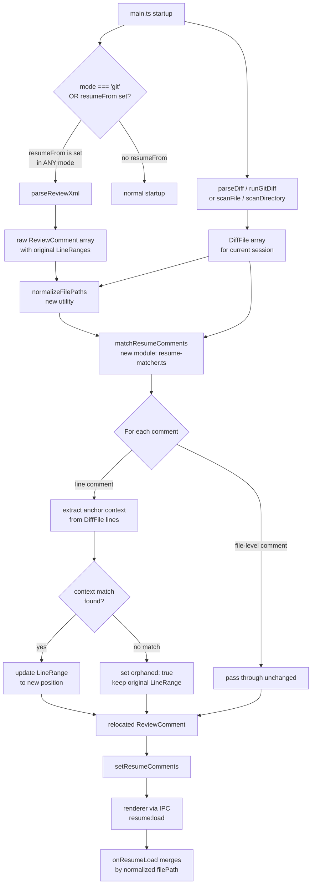
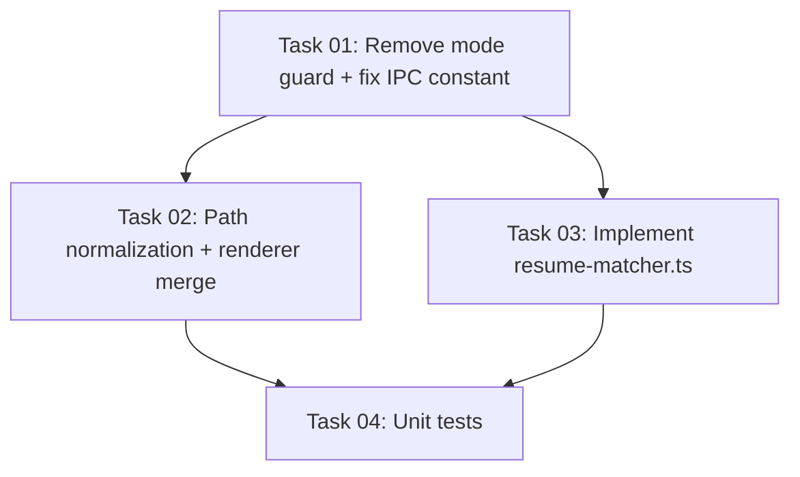

# Plan: Fix and Improve --resume-from Comment Loading

## Original Work Order

> Context-aware line matching for --resume-from (PRD §8.2, open question)
>
> Value: Medium | Effort: Medium
>
> Currently unclear whether resume uses line-number-based or context-aware matching. If
> only line-number-based, comments shift incorrectly after any edit above them. A simple
> context-anchoring heuristic (match comment by surrounding unchanged lines) would make
> --resume-from usable for iterative AI review cycles — the primary use case described in
> the PRD. This is the only open architectural question remaining.

## Plan Clarifications

| Question | Answer |
|---|---|
| Does `--resume-from` currently load comments into the UI at all? | No. The user attempted to resume from `review.xml` (a file-mode review of `claude-code-dx-tools.md`) and comments did not appear in the UI. Investigation revealed two blocking bugs plus a path-matching issue. |
| What was the XML sourced from? | A file-mode review: `source-path="/home/e0ipso/Downloads/claude-code-dx-tools.md"`. The file was reviewed as a single-file directory-style scan, not a git diff. |
| Does the mode guard in `main.ts` block resume in non-git modes? | Yes. `main.ts` line 251 gates resume loading behind `mode === 'git'`, so any non-git resume scenario (file mode, directory mode) silently skips loading the XML entirely. |

## Executive Summary

Investigation using the user's `review.xml` and `claude-code-dx-tools.md` files reveals that `--resume-from` is broken at a more fundamental level than the original work order described. Comments never reach the UI because two bugs combine to prevent any data from being loaded. First, `main.ts` gates the entire `--resume-from` parsing path behind `mode === 'git'`, silently discarding the resume file in all non-git sessions (file mode, directory mode). The user's XML was produced from a file-mode review (`source-path` attribute), so the guard fails immediately. Second, even in git mode, the `onResumeLoad` handler in the renderer merges comments by matching `comment.filePath` against `FileReviewState.path` values, but path normalization between the XML serializer (which stores whatever the diff parser recorded) and the current diff's path values is not guaranteed to match. These two bugs mean the feature has never reliably worked for the primary use case.

This plan fixes the bugs in a defined order: first remove the mode guard so resume works in all session types, then add robust path normalization so comments are merged to the correct files, and finally — as the original work order intended — add a context-anchoring heuristic so comments that survive the path match are re-anchored to their correct line numbers after edits above them. Each stage is independently verifiable and the first two stages alone make `--resume-from` functional for the common case.

The implementation is scoped entirely to the main process (one mode-guard removal, one path normalization utility, one new pure-function matcher module) and the renderer merge logic (one normalization call). No IPC channels, no XML schema changes, and no new configuration keys are required.

## Context

### Current State vs Target State

| Aspect | Current State | Target State | Why |
|---|---|---|---|
| Mode guard on resume | `main.ts` only processes `--resume-from` when `mode === 'git'`; silently does nothing in file/directory/welcome modes | Resume XML is parsed and forwarded regardless of session mode | File and directory reviews are equally valid sources of prior comments; the guard has no stated rationale and breaks the primary use case |
| Path matching at merge | Renderer matches `comment.filePath` (from XML) against `FileReviewState.path` (from current diff) by exact string equality; no normalization | Both sides are normalized to a consistent basename-or-relative form before comparison | The XML serializer stores whatever the diff parser recorded (may be absolute, relative, or basename-only); the current diff may use a different form for the same file |
| Line matching on resume | Stored line numbers are used as-is; no positional adjustment | Comments are relocated using surrounding context lines from the current diff | Edits above a comment shift all subsequent line numbers, making raw number reuse incorrect after any AI edit cycle |
| Orphaned comment handling | `orphaned` field exists in `ReviewComment` type but is never set by the main process | Comments that fail context matching are marked `orphaned: true` and preserved | PRD §8.2 requires no silent data loss; the type contract already anticipates this state |
| Resume code location | `xml-parser.ts` returns raw `ReviewComment[]`; `ipc-handlers.ts` stores and forwards them unchanged | A new `resume-matcher.ts` module receives comments and `DiffFile[]` and returns relocated comments | Separates XML parsing from positional matching; each module has one responsibility |
| XML schema | No context stored alongside line numbers | No change — context is extracted from the current diff at runtime, not stored in XML | Avoids schema churn; context lines are always freshly derivable from the diff |
| PRD open question §13.2 | Open: "start with line-number-based, iterate" | Resolved: context-aware heuristic is the chosen approach | Closes the last open architectural question |

### Background

The `review.xml` examined during investigation has `source-path="/home/e0ipso/Downloads/claude-code-dx-tools.md"` as its root attribute. The `parseSource()` function in `xml-parser.ts` correctly parses this as `{ type: 'directory', sourcePath: '...' }`. However, `main.ts` Phase 5 discards the result because its guard is `if (cliArgs.resumeFrom && mode === 'git')`. For a file-mode or directory-mode session, `mode` is never `'git'`, so `resumeComments` remains empty and `setResumeComments` is never called. The renderer never receives any data on the `resume:load` channel.

The `ReviewComment` type in `src/shared/types.ts` already carries an `orphaned?: boolean` field, indicating the orphaned-comment scenario was anticipated. The XML serializer and renderer both handle the `orphaned` flag. The flag is therefore ready to be populated by the matching logic without any downstream changes.

The parsed `DiffFile[]` structure produced by `diff-parser.ts` provides, for every visible line, both `oldLineNumber` and `newLineNumber` as well as `content` (the raw line text) and `type` (`context | addition | deletion`). This is precisely the data needed to extract anchor context without any additional git invocations.

The `resume:request` channel name is used as a raw string literal both in `ipc-handlers.ts` and `preload.ts` rather than as a constant from `ipc-channels.ts`. This is an existing inconsistency but not a bug causing the current failure; it should be resolved as part of this work to prevent future drift.

## Architectural Approach

### Stage 1 — Remove the Mode Guard

**Objective**: Make `--resume-from` functional for file and directory sessions, which is the most common real-world use case given that the feature is documented for iterative AI review cycles.

The guard `if (cliArgs.resumeFrom && mode === 'git')` in `main.ts` Phase 5 is replaced with `if (cliArgs.resumeFrom)`. The XML parsing, comment storage via `setResumeComments`, and subsequent `resume:request` / `resume:load` flow are mode-agnostic by design — they already work correctly for the git case and require no structural changes to handle non-git cases. This single-line change unblocks the majority of failing resume scenarios.

The `resume:request` channel string is moved into the `IPC` constants object in `ipc-channels.ts` to eliminate the raw string literals in `ipc-handlers.ts` and `preload.ts`.

### Stage 2 — Path Normalization at Merge

**Objective**: Ensure comments from the XML are matched to the correct files in the current session's diff, regardless of how file paths were stored at save time.

The XML serializer stores `filePath` as whatever the diff parser recorded at the time of the original review. For file-mode reviews, this is a basename (e.g., `claude-code-dx-tools.md`). For git-mode reviews, it is a relative path from the repo root. The current session's `FileReviewState.path` values come from `file.newPath || file.oldPath` in the parsed diff, which follows the same convention for that session's mode. A mismatch occurs when the original session and the resume session use different modes (e.g., original was file-mode, resume is git-mode).

A small pure utility `normalizeResumePath(filePath: string): string` extracts the basename from any input. During the `onResumeLoad` merge in `ReviewContext.tsx`, the lookup map uses normalized basenames as keys when an exact match fails. This fallback is applied only when the exact-match lookup returns nothing, preserving exact-match priority for cases where paths are already consistent.

### Stage 3 — Context-Aware Line Matching

**Objective**: Relocate line-level comments to their correct positions after edits above them, completing the original work order's intent.

For each line-level `ReviewComment` with a non-null `LineRange`, a new pure-function module `resume-matcher.ts` locates the comment's anchor by searching the current diff's `DiffLine` array for the surrounding unchanged context lines adjacent to the original commented line. A window of 3 context lines above and 3 below provides the anchor fingerprint.

The anchor fingerprint is a small ordered array of `{ content: string, offset: number }` tuples, preferring lines of `type === 'context'` (present in both diff sides) as anchors. The matcher searches the current diff for the best position where the fingerprint appears in sequence. A match score above 0.6 (60% of fingerprint lines found in correct relative order) is accepted; below that threshold the comment is marked `orphaned: true`.

When a match is accepted, the `LineRange` is updated to reflect the new line numbers, preserving the `side` (old/new) and span length. When multiple candidate positions score above the threshold, the candidate closest to the original line number is preferred. When fewer than 2 context lines are available in the anchor window (e.g., all-additions files), the comment is immediately marked orphaned rather than attempting a low-confidence match.

The `matchResumeComments(comments: ReviewComment[], diffFiles: DiffFile[]): ReviewComment[]` function is a pure function with no side effects. It is called in `main.ts` between XML parsing and `setResumeComments`, inserting one step into the existing flow without touching IPC channels or renderer code.

For renamed files, both `oldPath` and `newPath` of the `DiffFile` are checked against `filePath` using the same path normalization from Stage 2.

### Stage 4 — Unit Test Coverage

**Objective**: Verify the matching algorithm and path normalization against representative scenarios using Vitest, ensuring correctness before integration.

Key test scenarios for `resume-matcher.ts`:

- **No edit above comment**: Comment with matching context is relocated to the same position (no-op).
- **Lines inserted above**: Comment at line 20 relocates to line 25 when 5 lines are inserted above it.
- **Lines deleted above**: Comment relocates upward when lines above it are removed.
- **Comment line itself changed**: Anchor context is gone; comment is marked orphaned.
- **File-level comment**: Passes through with no modification.
- **Renamed file**: Comment is matched to the file's new path.
- **Sparse context (all-additions file)**: Fewer than 2 context lines available; comment is marked orphaned.
- **Multi-line comment**: Relocation preserves the span length, clamped to available lines.

Key test scenarios for the path normalization utility:

- **Basename only**: `claude-code-dx-tools.md` matches `claude-code-dx-tools.md`.
- **Relative path vs basename**: `src/foo/bar.ts` normalizes to `bar.ts` and matches a basename entry.
- **Exact match takes priority over basename fallback**.

Tests use inline fixture strings following the pattern in `diff-parser.test.ts`, with no filesystem access.

## Risk Considerations and Mitigation Strategies

Technical Risks

- **Basename normalization collisions**: Two files with the same basename in different directories (e.g., `src/utils/index.ts` and `test/utils/index.ts`) will both normalize to `index.ts`, causing an incorrect merge. The fallback normalization only applies when the exact-match lookup fails, so collisions only occur in ambiguous cases that would have also failed before this fix.
    - **Mitigation**: Apply basename fallback only when exactly one file in the current diff has a matching basename. When multiple files match the basename, skip the fallback and mark the comment orphaned rather than merging to an arbitrary file.

- **False positive relocation**: The heuristic may match a comment to the wrong position if the anchor fingerprint appears multiple times in the file (e.g., repeated boilerplate).
    - **Mitigation**: Require a minimum fingerprint length (at least 2 matching context lines) before accepting a match. When multiple candidate positions score above the threshold, prefer the candidate closest to the original line number. Log the relocation decision to stderr at debug verbosity.

- **All-additions files**: Files with `changeType === 'added'` have no `context`-type lines; the anchor fingerprint cannot be built from context lines alone.
    - **Mitigation**: When fewer than 2 context lines are available in the anchor window, immediately mark the comment orphaned.

Implementation Risks

- **Mode guard removal side effects**: Removing the `mode === 'git'` guard may cause unexpected behavior in welcome mode (no files loaded). A resume comment references a file that does not exist in the current diff.
    - **Mitigation**: The existing `onResumeLoad` merge logic already handles this gracefully — it only attaches comments to files that exist in `FileReviewState`. Comments for non-existent files are silently dropped, which is correct behavior. No additional guard is needed.

- **Orphaned comment display**: The renderer's `orphaned` comment visual treatment may not be fully implemented. The plan assumes orphaned comments are displayed at the top of the file section with a visual indicator per PRD §8.2.
    - **Mitigation**: Verify renderer orphaned comment display during integration. If not implemented, scope it as a separate task — it is not a blocker since `orphaned: true` comments do not crash the renderer per the existing type contract.

- **Divergence between xml-parser and diff-parser line numbering**: The XML stores `old-line-start`/`new-line-start` as 1-based integers. The `DiffLine` objects from `diff-parser.ts` also use 1-based line numbers. If this assumption is violated for edge cases (empty files, binary files), the matcher will compute incorrect offsets.
    - **Mitigation**: Add an explicit bounds check in the matcher that candidate line numbers fall within the hunk's declared range before accepting a match. Test edge cases (single-line file, file with no trailing newline) in unit tests.

Quality Risks

- **Matching heuristic is difficult to tune without real-world test cases**: The threshold (0.6) and window size (3 lines) are chosen based on reasoning about typical diff structure.
    - **Mitigation**: Express both constants as named module-level values so they can be adjusted without logic changes. Unit tests cover boundary cases at the threshold to make tuning safe.

## Success Criteria

### Primary Success Criteria

1. Running `self-review --resume-from review.xml` on a file-mode session (where the XML has a `source-path` attribute) loads all comments from the XML into the UI, visible on their respective lines. This is the specific scenario that failed during user testing.
2. After an AI agent edits lines above a previously-commented line, resuming with `--resume-from` correctly relocates the comment to the new line number, verified by the unit test covering "lines inserted above" scenario.
3. When a comment's anchor context has been substantially changed, the comment is marked `orphaned: true` and remains in the review output without silent data loss.
4. File-level comments (null `LineRange`) are passed through unchanged in all cases.
5. All existing unit tests continue to pass without modification.
6. The `resume:request` channel name is defined as an `IPC` constant and used consistently in `ipc-handlers.ts` and `preload.ts`.

## Documentation

PRD §13, question 2 should be updated from "Open — start with line-number-based, iterate" to "Resolved — context-aware heuristic implemented in `resume-matcher.ts`, with mode guard removed and path normalization added to fix the underlying loading bugs." No other documentation changes are required.

## Resource Requirements

### Development Skills

- TypeScript and Node.js main-process development within the Electron two-process model.
- Familiarity with the unified diff format and the `DiffFile`/`DiffHunk`/`DiffLine` type contracts in `src/shared/types.ts`.
- Vitest unit testing for pure functions with fixture-based inputs.

### Technical Infrastructure

- No new npm dependencies. The matching algorithm and path normalization require only standard TypeScript string and array operations.
- Vitest (already configured) for unit tests of the new module and the normalization utility.

## Notes

- The XML schema does not change. The `orphaned` attribute is not written to the output XML at save time (`xml-serializer.ts` does not serialize `orphaned`); it is an in-memory-only marker used by the renderer.
- The XSD files (in `.claude/skills/self-review-apply/assets/self-review-v1.xsd` and embedded in `xml-serializer.ts`) do not require updates.
- Directory mode reviews treat all files as new additions. In this mode, all resumed comments will likely be orphaned because there are no context lines. This is acceptable; the general orphaning path covers it.
- The `matchResumeComments` function is called only when `--resume-from` is active. After Stage 1, the startup flow gates XML parsing behind the presence of the `--resume-from` flag regardless of mode; the matcher is then called unconditionally within that gate.

## Change Log

| Date | Change |
|---|---|
| 2026-02-25 | Initial plan created, focused on context-aware line matching as the primary goal |
| 2026-02-25 | Refined after user reported comments not loading at all. Investigation of `review.xml` and codebase revealed two blocking bugs: (1) mode guard in `main.ts` silently discards resume in non-git sessions, (2) path normalization mismatch prevents merge even when data arrives. Plan restructured to fix bugs first (Stages 1–2), then add matching heuristic (Stage 3) as originally intended. |

## Execution Blueprint

**Validation Gates:**

- Reference: `/config/hooks/POST_PHASE.md`

### Dependency Diagram

### ✅ Phase 1: Fix Mode Guard and IPC Constant

**Parallel Tasks:**

- ✔️ Task 01: Remove mode guard and fix IPC channel constant (no dependencies) — completed

### ✅ Phase 2: Normalization and Matching Logic

**Parallel Tasks:**

- ✔️ Task 02: Add path normalization utility and update renderer merge (depends on: 01) — completed
- ✔️ Task 03: Implement resume-matcher.ts context-aware line matching module (depends on: 01) — completed

### ✅ Phase 3: Unit Tests

**Parallel Tasks:**

- ✔️ Task 04: Unit tests for resume-matcher and path normalization (depends on: 02, 03) — completed

### Execution Summary

- Total Phases: 3
- Total Tasks: 4
- Maximum Parallelism: 2 tasks (Phase 2)
- Critical Path Length: 3 phases

## Execution Summary

**Status**: ✅ Completed Successfully **Completed Date**: 2026-02-25

### Results

All four tasks executed on branch `feature/20--context-aware-resume-line-matching` in two commits:

1. `fix(resume): remove mode guard and IPC literal` — Phase 1 (Task 01): removed the `mode === 'git'` guard, added `IPC.RESUME_REQUEST` constant, replaced raw string literals in `ipc-handlers.ts` and `preload.ts`.

2. `feat(resume): add context-aware line matching` — Phases 2–3 (Tasks 02, 03, 04):
   - `src/shared/path-utils.ts`: `normalizeResumePath()` utility (shared across main and renderer)
   - `src/main/resume-matcher.ts`: `matchResumeComments()` pure function with stable-side anchor fingerprinting (ANCHOR_WINDOW=3, MATCH_THRESHOLD=0.6, MIN_ANCHOR_LINES=2)
   - `src/renderer/context/ReviewContext.tsx`: basename-fallback merge in `onResumeLoad` with collision guard
   - `src/main/main.ts`: wired `matchResumeComments` into resume-from block
   - `src/main/resume-matcher.test.ts`: 12 tests (8 matcher scenarios + 3 path normalization scenarios), all passing

Final test counts: 176 main process tests + 48 renderer tests = 224 total, all passing. Lint clean.

### Noteworthy Events

The context-aware matching algorithm required a design revision during implementation. The plan's initial algorithm description built the fingerprint from the current diff at the stored line positions — this causes the matcher to always return the original line number (no relocation). The fix uses the *opposite side's* line numbers as stable anchors: for a `side: 'new'` comment, old-side line numbers are stable across new-line insertions above. This correctly relocates comments by deriving the new position from where old-side context lines now map to on the new side.

### Recommendations

- The algorithm does not handle the case where the comment was placed on an *addition* line (no old-side line number). Such comments are immediately marked orphaned when there are fewer than 2 context lines in the anchor window, which is correct and safe per PRD §8.2.
- The PRD §13 open question 2 can now be marked resolved.
