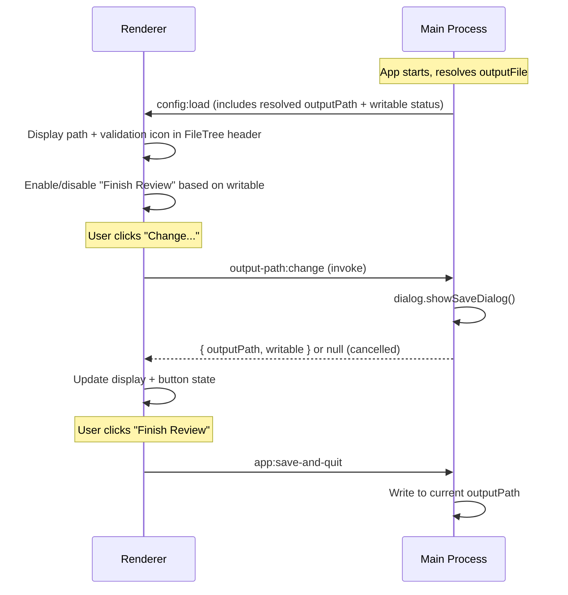
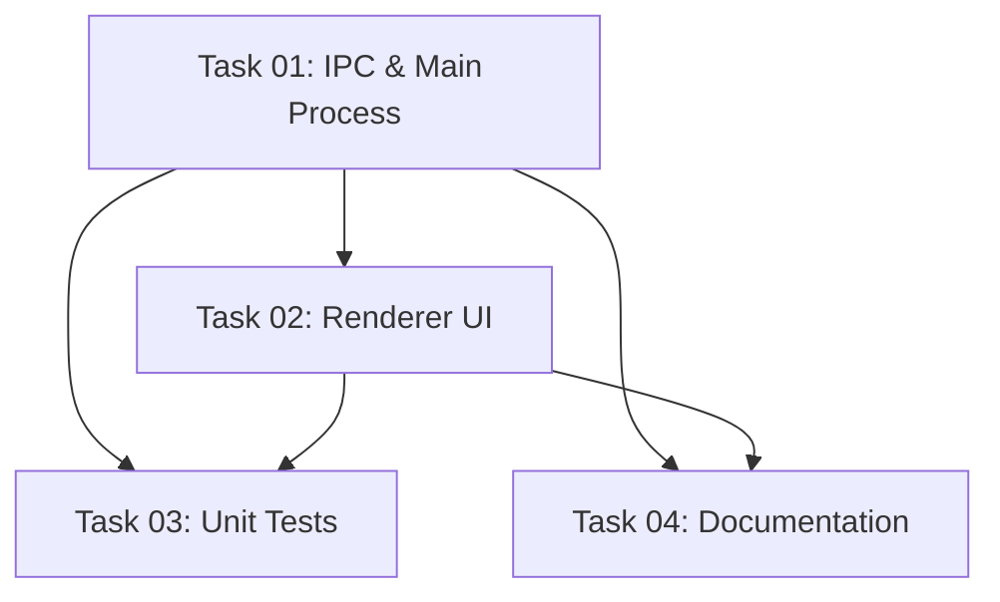

# Plan: Output Path Indicator with Writability Validation

## Original Work Order

> Can't save reviews of directories on macOS (GitHub Issue #21). When launched from macOS Finder,
> `process.cwd()` is `/` which isn't writable, so saving to `./review.xml` fails and the app
> crashes. Add a visible output path indicator in the file tree panel header with writability
> validation and a native save dialog to change the path.

## Plan Clarifications

| Question | Answer |
|----------|--------|
| Where should the output path indicator live? | File tree panel header (left panel, above the file list) |
| How should writability be validated? | On app load and when the user changes the path (no polling) |
| What happens when the path is not writable? | "Finish Review" button is disabled |
| How does the user change the path? | A button that opens the native OS save dialog |

## Executive Summary

When self-review is launched from a macOS app launcher (Finder, Spotlight), `process.cwd()` is `/`,
making the default output path (`/review.xml`) unwritable. The app crashes on save with no recovery.

This plan adds three things: (1) a visible output path display in the file tree panel header so the
user always knows where the review will be saved, (2) a writability check that shows a green/red
status icon and disables "Finish Review" when the path is unwritable, and (3) a "Change" button that
opens the native OS save dialog to pick a different location.

This approach was chosen because it solves the root cause (unwritable default path) while giving the
user full visibility and control, using native OS dialogs to avoid path validation complexity.

## Context

### Current State vs Target State

| Current State | Target State | Why? |
|---|---|---|
| Output path is invisible to the user | Output path shown in file tree panel header | User needs to know where the file will be saved |
| No writability check before save | Writability validated on load and path change | Prevents silent save failures |
| Save failure crashes the app (`process.exit(1)`) | "Finish Review" disabled when path is unwritable | Prevents data loss |
| Output path is fixed from config, cannot be changed at runtime | User can change path via native save dialog | Allows recovery when default path is unwritable |
| macOS GUI launch writes to `/review.xml` and fails | User is prompted to choose a valid location | Core bug fix |

### Background

The `outputFile` config value (default `./review.xml`) is resolved against `process.cwd()` at save
time in `src/main/main.ts:344`. When CWD is `/` (macOS GUI launch), this resolves to `/review.xml`
which requires root permissions. The save handler catches the error but calls `process.exit(1)`,
destroying the review with no recovery.

The output path is currently immutable at runtime — set once from config and used directly in the
save handler. This plan makes it mutable by introducing a new IPC round-trip for path changes and
writability checks.

## Architectural Approach

### IPC Layer

**Objective**: Enable the renderer to know the resolved output path, its writability, and to change
it via a native dialog.

Two new items are needed in the IPC contract:

1. **Extend `config:load` payload** — Add `resolvedOutputPath: string` and
   `outputPathWritable: boolean` to the data sent from main to renderer on startup. The main process
   resolves `outputFile` against `process.cwd()` and checks writability before sending.

2. **New `output-path:change` invoke channel** — The renderer calls this to open a native save
   dialog. Main process opens `dialog.showSaveDialog()` with the current path as default. Returns
   `{ outputPath: string, writable: boolean }` on selection, or `null` on cancel. Main process
   updates its internal output path state so the save handler uses the new path.

Files touched: `src/shared/ipc-channels.ts`, `src/shared/types.ts`, `src/preload/preload.ts`,
`src/main/ipc-handlers.ts` or `src/main/main.ts`.

### Main Process State

**Objective**: Make the output path mutable at runtime and check writability.

The main process currently computes the output path inline at save time:
`resolve(process.cwd(), appConfig!.outputFile)`. This needs to become a mutable variable that:

- Is initialized from config on startup (resolved to absolute path)
- Is checked for writability (test write access to the parent directory via `fs.accessSync`)
- Can be updated when the user picks a new path via the save dialog
- Is used by the existing save handler instead of re-computing from config

The writability check tests the parent directory of the output path using
`fs.accessSync(dir, fs.constants.W_OK)`. This is called once on startup and once after each path
change.

Files touched: `src/main/main.ts`.

### Renderer UI — Output Path Footer in FileTree

**Objective**: Show the output path, its writability status, and a change button at the bottom of
the file tree panel.

Add a footer section to the `FileTree` component (below the file list, pinned to the bottom) with:

- A small label "Output:" followed by the resolved filename (just the basename, with the full path
  in a tooltip)
- A status icon: green checkmark when writable, red warning/alert icon when not writable
- A small "Change..." button that invokes the `output-path:change` IPC channel
- When not writable, show a subtle warning message (e.g., "Path not writable")

The output path state will live in `ConfigContext` since it's config-adjacent and needs to be
accessible from both `FileTree` (to display) and `Toolbar` (to disable the button).

Files touched: `src/renderer/components/FileTree.tsx`,
`src/renderer/context/ConfigContext.tsx`.

### Finish Review Button Gating

**Objective**: Disable the "Finish Review" button when the output path is not writable.

The `Toolbar` component reads the writability state from `ConfigContext` and conditionally disables
the "Finish Review" button. When disabled, a tooltip explains: "Output path is not writable. Click
'Change...' in the file tree to pick a save location."

Files touched: `src/renderer/components/Toolbar.tsx`.

## Risk Considerations and Mitigation Strategies

Technical Risks

- **`fs.accessSync` false positives/negatives**: The writability check tests the parent directory,
  not the exact file. A directory could be writable but the file could be locked, or vice versa.
  - **Mitigation**: This is sufficient for the primary use case (CWD is `/`). Edge cases (file
    locked by another process) are rare and the existing save error handling remains as a backstop.

Implementation Risks

- **Config state shape change**: Adding `resolvedOutputPath` and `outputPathWritable` to the
  renderer state. This is additive and doesn't break existing config loading.
  - **Mitigation**: Use separate state fields rather than modifying `AppConfig` to keep the config
    contract clean. The new fields are renderer-only state managed in `ConfigContext`.

## Success Criteria

### Primary Success Criteria

1. Launching the app from macOS Finder with CWD `/` shows a red warning icon next to the output path
   and disables "Finish Review"
2. Clicking "Change..." opens a native save dialog; selecting a writable location turns the icon
   green and enables "Finish Review"
3. Saving successfully writes the review to the user-chosen path
4. The output path display is visible in the file tree panel footer at all times

## Documentation

- Update `AGENTS.md` to document the new IPC channels (`output-path:change`) and the output path
  indicator UI component in the project structure section.

## Resource Requirements

### Development Skills

- Electron IPC (main ↔ renderer communication, `dialog.showSaveDialog`)
- React state management (ConfigContext extension)
- Node.js filesystem APIs (`fs.accessSync`, `fs.constants.W_OK`)

### Technical Infrastructure

- Existing Electron + React + shadcn/ui stack (no new dependencies)
- Lucide icons for status indicators (already available)

## Dependency Diagram

## Execution Blueprint

**Validation Gates:**

- Reference: `/config/hooks/POST_PHASE.md`

### ✅ Phase 1: Foundation — IPC and Main Process

**Parallel Tasks:**

- ✔️ Task 01: Add IPC channels, types, writability check, and save dialog handler

### ✅ Phase 2: Renderer and Supporting Work

**Parallel Tasks:**

- ✔️ Task 02: Add output path footer in FileTree and disable Finish Review when unwritable (depends on: 01)

### ✅ Phase 3: Testing and Documentation

**Parallel Tasks:**

- ✔️ Task 03: Add unit tests for output path writability check and IPC handler (depends on: 01, 02)
- ✔️ Task 04: Update AGENTS.md with new IPC channel and UI component (depends on: 01, 02)

### Post-phase Actions

### Execution Summary

- Total Phases: 3
- Total Tasks: 4
- Maximum Parallelism: 2 tasks (in Phase 3)
- Critical Path Length: 3 phases

## Execution Summary

**Status**: ✅ Completed Successfully **Completed Date**: 2026-02-27

### Results

All 4 tasks executed successfully across 3 phases. The feature adds:
- Mutable output path state with writability validation in the main process
- Two new IPC channels (`output-path:change`, `output-path:changed`) with native save dialog support
- Output path footer in the FileTree panel showing path, writability icon, and change button
- Finish Review button disabled when path is not writable
- Unit tests for the `checkWritability` utility (extracted to `src/main/fs-utils.ts`)
- Updated AGENTS.md documentation

### Noteworthy Events

- The `checkWritability` function was extracted from `main.ts` to a dedicated `fs-utils.ts` module during Phase 3 to make it testable. This was a minor refactor not originally planned but necessary for proper unit testing.
- Dialog handler and save handler state management tests were intentionally skipped as they would only test Electron framework plumbing, consistent with the project's testing philosophy.

### Recommendations

- Consider adding an E2E test for the full workflow (launch with unwritable CWD → change path → save) once the feature is validated manually on macOS.
- The stashed `test.toml` file was left in git stash and should be restored or cleaned up.
