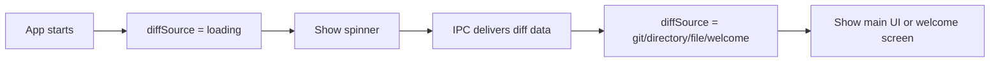

# Plan: Add Loading Spinner During Initial Diff Load

## Original Work Order
> The loading page is blank before rendering. we should have a spinner shown instead of a blank page.

## Executive Summary

When the app starts, the renderer initializes with `diffSource.type === 'loading'` while the main process parses CLI args, runs git diff, and sends data via IPC. During this period, `App.tsx` renders nothing — the user sees a blank white/dark page until data arrives.

This plan adds a simple centered spinner to the loading state so users get immediate visual feedback that the app is initializing.

## Context

### Current State vs Target State

| Current State | Target State | Why? |
|---|---|---|
| Blank page during loading | Centered spinner animation | Users see a blank window and may think the app is broken |
| No loading UI component exists | Reusable spinner in shadcn/ui style | Consistent with project's component architecture |

### Background

The loading state is already modeled in the type system (`DiffSource` has a `{ type: 'loading' }` variant). The `ReviewContext` initializes with this state. In `App.tsx` line 41, the main content is conditionally hidden when loading, but no replacement UI is shown.

## Architectural Approach

### Loading Spinner Component
**Objective**: Show a centered spinner with the app's theme colors during the loading state.

Add a CSS-animated spinner directly in `App.tsx`'s loading branch. Use a simple `animate-spin` Tailwind utility on an SVG circle — no new dependencies needed. The spinner renders centered in the viewport with the app's `bg-background` and `text-muted-foreground` colors for theme consistency.

The implementation modifies the conditional in `App.tsx` (line 41) to render a spinner when `diffSource.type === 'loading'` instead of rendering nothing.

## Risk Considerations and Mitigation Strategies

Technical Risks

- **Flash of spinner on fast loads**: On fast machines with small diffs, the spinner may flash briefly.
    - **Mitigation**: Acceptable trade-off — a brief spinner is better than a blank page. No artificial delay needed.

## Success Criteria

### Primary Success Criteria
1. A spinner is visible immediately when the app window opens, before diff data loads
2. The spinner disappears once the diff viewer or welcome screen renders
3. The spinner respects light/dark theme

## Documentation

No documentation updates needed — this is a minimal UX polish with no user-facing configuration.

## Resource Requirements

### Development Skills
- React, Tailwind CSS

### Technical Infrastructure
- No new dependencies — uses Tailwind's built-in `animate-spin` utility

## Execution Blueprint

**Validation Gates:**
- Reference: `/config/hooks/POST_PHASE.md`

### ✅ Phase 1: Add Loading Spinner
**Parallel Tasks:**
- ✔️ Task 001: Add loading spinner to App loading state

### Post-phase Actions
None.

### Execution Summary
- Total Phases: 1
- Total Tasks: 1
- Maximum Parallelism: 1 task (in Phase 1)
- Critical Path Length: 1 phase

## Execution Summary

**Status**: ✅ Completed Successfully
**Completed Date**: 2026-02-27

### Results
Added a centered loading spinner to `src/renderer/App.tsx` that displays during the `loading` diff source state. The spinner uses Tailwind's `animate-spin` utility with theme-aware colors (`bg-background`, `text-muted-foreground`). All 216 tests pass, linting clean.

### Noteworthy Events
No significant issues encountered.

### Recommendations
None — feature is complete as specified.
