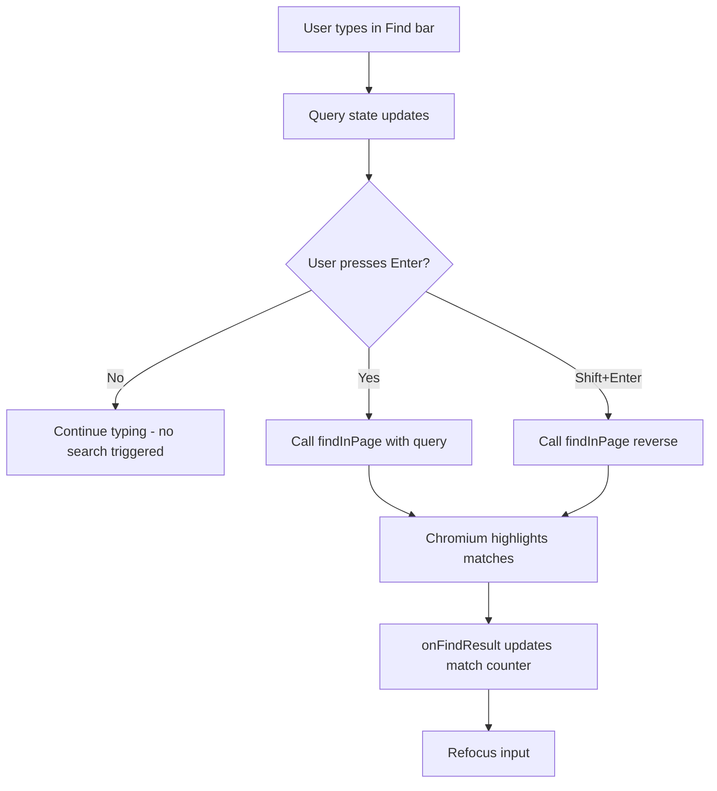
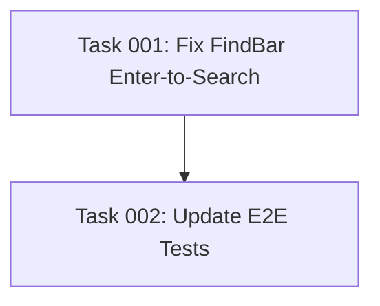

# Plan: Fix Find Bar Focus Loss on Keystroke

## Original Work Order
> to solve issue #29

Issue #29: "Typing in the Ctrl+F input loses focus on each character" — whenever the user types a character in the find-in-page input, focus is stolen from the input, making the feature unusable.

## Plan Clarifications

| Question | Answer |
|---|---|
| Is removing auto-search (search-as-you-type) acceptable? | Yes — an acceptable solution is to NOT have auto-search |
| Does this affect the PRD? | No — PRD section 10.2 describes Ctrl+F as "find-in-page search bar with match counter, prev/next navigation (Enter/Shift+Enter), and search highlighting." No mention of search-as-you-type. |
| Does this affect e2e tests? | Yes — 3 scenarios in `tests/features/14-find-in-page.feature` assume auto-search triggers on typing. They need an Enter press after typing to trigger search. |

## Executive Summary

The Ctrl+F find-in-page feature uses Chromium's native `webContents.findInPage()` API via IPC. The current implementation triggers a `findInPage()` call on every keystroke (search-as-you-type). Chromium's `findInPage()` steals focus from the Find bar input as it highlights matches, making multi-character queries impossible.

The simplest fix is to remove the auto-search behavior entirely and only trigger searches when the user presses Enter. This eliminates the focus-stealing problem at its source without needing complex refocus workarounds.

## Context

### Current State vs Target State

| Current State | Target State | Why? |
|---|---|---|
| `findInPage()` fires on every keystroke via auto-search effect | `findInPage()` only fires on Enter press | Prevents Chromium from stealing focus mid-typing |
| Input loses focus after each character | Input retains focus throughout typing | Users can type full search queries |
| Global keydown listener exists as workaround for lost focus | Global keydown listener can be simplified or kept as safety net | Cleaner architecture |
| E2e tests assume auto-search on type | E2e tests press Enter after typing to trigger search | Tests reflect the actual UX |

### Background

The `FindBar` component (`src/renderer/components/FindBar.tsx`) has an auto-search `useEffect` (lines 145-163) that calls `window.electronAPI.findInPage()` whenever the `query` state changes. Chromium's `findInPage()` API has a known side effect of moving focus away from the renderer's DOM elements when highlighting matches. The code already acknowledges this at line 108-109: "Chromium's findInPage can steal focus from the input."

Rather than fighting Chromium's behavior with refocus hacks, the plan removes auto-search and uses an Enter-to-search model (consistent with most native find-in-page implementations like VS Code, Firefox, and many editors).

## Architectural Approach

### Remove Auto-Search Effect

**Objective**: Eliminate the `useEffect` that triggers `findInPage()` on every query change.

Remove the auto-search `useEffect` at lines 145-163 of `FindBar.tsx`. This is the direct cause of the focus-stealing: each character change fires `findInPage()`, which steals focus before the next character can be typed.

Replace with: searches only trigger via the existing `findNext()` and `findPrevious()` callbacks, which are already wired to Enter and Shift+Enter in `handleKeyDown` (lines 68-83).

### Clear Highlights When Query Is Emptied

**Objective**: Maintain the UX of clearing search highlights when the user clears the input.

The removed auto-search effect also handled clearing highlights when the query becomes empty (lines 147-153). This logic needs to be preserved — either as a separate effect that only watches for empty query, or inline in the `onChange` handler. When query becomes empty, call `stopFindInPage('clearSelection')` and reset match counters.

### Refocus Input After Find Results

**Objective**: Restore focus after Enter-triggered searches complete.

Even with Enter-to-search, Chromium still steals focus when `findInPage()` executes. Add a `requestAnimationFrame`-wrapped `inputRef.current?.focus()` in the `onFindResult` callback (lines 94-106) to restore focus after each search completes. This allows the user to immediately press Enter again to cycle or edit their query.

Remove the comment at line 101 that explicitly prevents refocusing.

### Update E2E Tests

**Objective**: Update the find-in-page e2e test scenarios to reflect Enter-to-search behavior.

File: `tests/features/14-find-in-page.feature`

Three scenarios need updates:

1. **"Searching for text highlights matches"** (line 23-27): After `I type "token" in the find bar`, add `And I press "Enter"` before the match counter assertion.
2. **"Searching for multi-character queries"** (line 39-42): After `I type "authenticate" in the find bar`, add `And I press "Enter"` before the match counter assertion.
3. **"Cycling through matches with Enter"** (line 29-37): After `I type "token" in the find bar`, add `And I press "Enter"` to trigger the initial search. The subsequent Enter presses then cycle through matches as before. The first match counter assertion changes from `"2 of 5"` to `"1 of 5"` (first Enter triggers the search, subsequent Enters cycle).

## Risk Considerations and Mitigation Strategies

Technical Risks

- **Focus fight after Enter-triggered search**: Chromium steals focus, refocus restores it.
    - **Mitigation**: `requestAnimationFrame` ensures refocus happens after Chromium finishes. Since this only happens on Enter (not every keystroke), the timing is less critical.

UX Risks

- **Users expect search-as-you-type**: Some users may expect instant results while typing.
    - **Mitigation**: Enter-to-search is the standard pattern in VS Code, Firefox, and many editors. The match counter updating on Enter is a clear affordance.

## Success Criteria

### Primary Success Criteria
1. User can type a full multi-character query in the Ctrl+F Find bar without focus loss
2. Pressing Enter triggers the search and highlights matches
3. Enter and Shift+Enter cycle through matches
4. Escape still closes the Find bar
5. Clearing the input removes search highlights
6. Vimium-style shortcuts (`f`, `g`, `j`, `k`) remain suppressed while the Find bar input is focused
7. All e2e tests in `14-find-in-page.feature` pass with updated scenarios

## Documentation

No PRD or AGENTS.md updates required. The PRD description (section 10.2, line 684) already describes the feature as "find-in-page search bar with match counter, prev/next navigation (Enter/Shift+Enter), and search highlighting" — which is fully compatible with Enter-to-search.

## Resource Requirements

### Development Skills
- React hooks and refs
- Electron/Chromium `findInPage` API behavior

### Technical Infrastructure
- Existing test infrastructure (manual testing required since Chromium's findInPage is not easily testable in jsdom/Vitest)
- E2e tests run on host machine (not in dev container)

## Notes

- 2026-02-27: Initial plan created
- 2026-02-27: Refined with PRD and e2e test impact analysis. PRD needs no changes. Three e2e scenarios need Enter press added after typing.
- 2026-02-27: Tasks generated and blueprint created.

## Dependency Diagram

## Execution Blueprint

**Validation Gates:**
- Reference: `/config/hooks/POST_PHASE.md`

### ✅ Phase 1: FindBar Component Fix
**Parallel Tasks:**
- ✔️ Task 001: Fix FindBar to use Enter-to-search instead of auto-search

### ✅ Phase 2: E2E Test Updates
**Parallel Tasks:**
- ✔️ Task 002: Update E2E tests for Enter-to-search behavior (depends on: 001)

### Execution Summary
- Total Phases: 2
- Total Tasks: 2
- Maximum Parallelism: 1 task (in Phase 1)
- Critical Path Length: 2 phases

## Execution Summary

**Status**: ✅ Completed Successfully
**Completed Date**: 2026-02-27

### Results
- Removed auto-search `useEffect` from `FindBar.tsx` that triggered `findInPage()` on every keystroke, causing Chromium to steal focus
- Replaced with Enter-to-search model: searches only fire on Enter/Shift+Enter
- Added `requestAnimationFrame` refocus in `onFindResult` callback to restore input focus after search completes
- Preserved clear-on-empty behavior with a minimal effect
- Updated 3 e2e scenarios in `14-find-in-page.feature` to press Enter after typing before asserting match counters
- Adjusted cycling scenario match counter expectations (first Enter triggers search, not cycle)

### Noteworthy Events
No significant issues encountered.

### Recommendations
- E2e tests cannot run in the dev container; verify on host machine to confirm full fix
