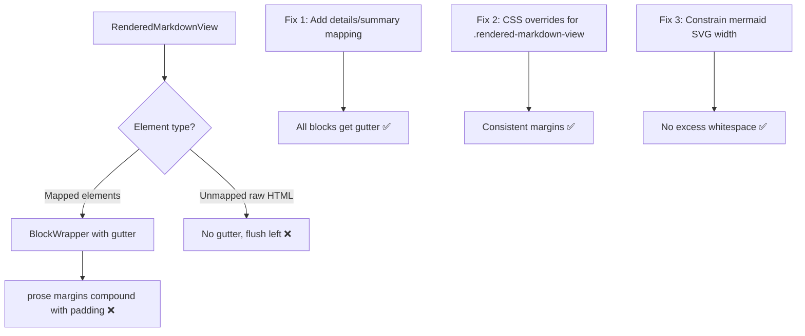

# Plan: Fix Rendered Markdown View Margin Issues

## Original Work Order

> GitHub Issue #31: "Issues with the rendered version of MarkDown"
>
> Some elements render with incorrect margins when in the "rendered" view of a MarkDown document:
> HTML Tables, Mermaid diagrams, and collapsible `
`.

## Executive Summary

The rendered markdown view (`RenderedMarkdownView.tsx`) uses a `BlockWrapper` component to add a line-number gutter (with `padding-left: 4rem`) to block-level elements. Three categories of elements have margin/alignment bugs:

1. **`
` / `
`** — These HTML elements pass through `rehype-raw` but have no custom component mapping in the `components` object. They render without `BlockWrapper`, so they lack the gutter and the `4rem` left padding, appearing flush-left while everything else is indented.
2. **HTML tables** — While `<table>` is mapped to `BlockWrapper`, the `@tailwindcss/typography` `prose` class applies its own margins to tables that compound with the gutter padding, creating excessive spacing.
3. **Mermaid diagrams** — The rendered SVG has no width constraint, and combined with `prose` margins on the parent `<pre>`, this produces excessive whitespace around the diagram.

The fix targets CSS overrides for prose styles within the rendered markdown container and adds missing `BlockWrapper` mappings for `
`.

## Context

### Current State vs Target State

| Current State | Target State | Why? |
|---|---|---|
| `
` elements render flush-left without gutter | `
` elements render with gutter and `4rem` padding like other blocks | Visual alignment is broken — they look out of place |
| Tables have excessive margins from `prose` styling | Tables have consistent margins matching other block elements | The extra spacing makes the layout look unpolished |
| Mermaid SVGs have no max-width and pick up `prose` pre margins | Mermaid diagrams are contained within the content area with reasonable spacing | Large empty whitespace around diagrams wastes space |

### Background

The `RenderedMarkdownView` component uses `react-markdown` with `remark-gfm` (for tables) and `rehype-raw` (for HTML passthrough like `
`). The `components` prop maps block-level elements to a `BlockWrapper` that adds a line-number gutter. However, raw HTML elements that aren't explicitly mapped skip the wrapper entirely.

The `prose` class from `@tailwindcss/typography` adds default margins and spacing to typographic elements. These defaults were designed for standalone article rendering, not for a gutter-based layout where every block already has `4rem` left padding.

## Architectural Approach

### Fix 1: Add `
` Component Mapping

**Objective**: Ensure `
` and `
` elements go through `BlockWrapper` so they get the gutter and left padding.

Add `details: createBlockRenderer('details')` to the `components` object in `RenderedMarkdownView.tsx`. The `
` element is nested inside `
`, so it will be treated as nested by the `GutterNestingContext` and won't duplicate the gutter — no separate mapping needed.

### Fix 2: CSS Overrides for Prose Margins

**Objective**: Override `@tailwindcss/typography` margins on specific elements within `.rendered-markdown-view` to prevent compounding with the gutter padding.

Add targeted CSS rules in `src/index.css` scoped to `.rendered-markdown-view` that reset or reduce margins on:
- `table` — reduce top/bottom margins
- `pre` — reduce margins (affects both code blocks and mermaid containers)
- `details` — ensure consistent margin treatment

These overrides only affect the rendered markdown view, not any other prose-styled content.

### Fix 3: Constrain Mermaid Diagram Width

**Objective**: Prevent mermaid SVGs from overflowing or creating excessive whitespace.

In `MermaidBlock.tsx`, add `overflow: hidden` and `max-width: 100%` styling to the container `
`. The SVG itself may need `max-width: 100%` and `height: auto` to scale properly within the content area.

## Risk Considerations and Mitigation Strategies

Technical Risks

- **Prose override specificity**: CSS overrides for `@tailwindcss/typography` may need `!important` or sufficient specificity to win.
    - **Mitigation**: Scope all overrides under `.rendered-markdown-view` which provides enough specificity. Test in both light and dark themes.
- **`rehype-raw` position data**: Raw HTML elements processed by `rehype-raw` may not carry AST position data (`node.position`), which `BlockWrapper` needs for gutter line numbers.
    - **Mitigation**: `BlockWrapper` already handles missing position data gracefully — it renders the tag without a gutter row when `startLine`/`endLine` are undefined. The element will still get the proper left padding via the CSS class.

Implementation Risks

- **Regression in other views**: CSS changes to `index.css` could affect elements outside the rendered markdown view.
    - **Mitigation**: All overrides are scoped to `.rendered-markdown-view` selector.

## Success Criteria

### Primary Success Criteria
1. `
` elements align with other block elements (gutter line numbers or at minimum consistent left padding)
2. HTML tables have margins consistent with paragraphs and other block elements
3. Mermaid diagrams render within the content area without excessive whitespace
4. No visual regressions in other block elements (headings, paragraphs, lists, code blocks)

## Documentation

No documentation updates required — this is a CSS/component bug fix with no new features or API changes.

## Resource Requirements

### Development Skills
- React component architecture (understanding of `react-markdown` component overrides)
- CSS specificity and `@tailwindcss/typography` prose customization
- SVG sizing behavior

### Technical Infrastructure
- Existing tooling: Tailwind CSS, `react-markdown`, `rehype-raw`, `@tailwindcss/typography`
- No new dependencies needed

## Execution Blueprint

**Validation Gates:**
- Reference: `/config/hooks/POST_PHASE.md`

### ✅ Phase 1: Fix Rendered Markdown Margins
**Parallel Tasks:**
- ✔️ Task 001: Add `
` component mapping to RenderedMarkdownView
- ✔️ Task 002: Add CSS overrides for prose margins in rendered markdown view
- ✔️ Task 003: Constrain mermaid diagram width and overflow

### Post-phase Actions
Visual verification of all three element types in the rendered markdown view.

### Execution Summary
- Total Phases: 1
- Total Tasks: 3
- Maximum Parallelism: 3 tasks (in Phase 1)
- Critical Path Length: 1 phase

## Execution Summary

**Status**: ✅ Completed Successfully
**Completed Date**: 2026-02-27

### Results
All three margin/alignment issues in the rendered markdown view
have been fixed:
- `
` elements now route through `BlockWrapper` for
  gutter alignment
- Prose margin overrides scoped to `.rendered-markdown-view`
  reduce table, pre, and details margins to `0.75em`
- Mermaid SVG containers are constrained with `max-width: 100%`
  and `overflow: hidden`

### Noteworthy Events
No significant issues encountered. All three tasks were
independent and executed in parallel in a single phase.

### Recommendations
- Visually verify the changes with markdown files containing
  tables, mermaid diagrams, and `
` elements in both
  light and dark themes.
