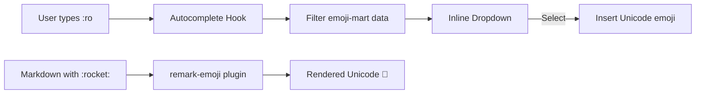
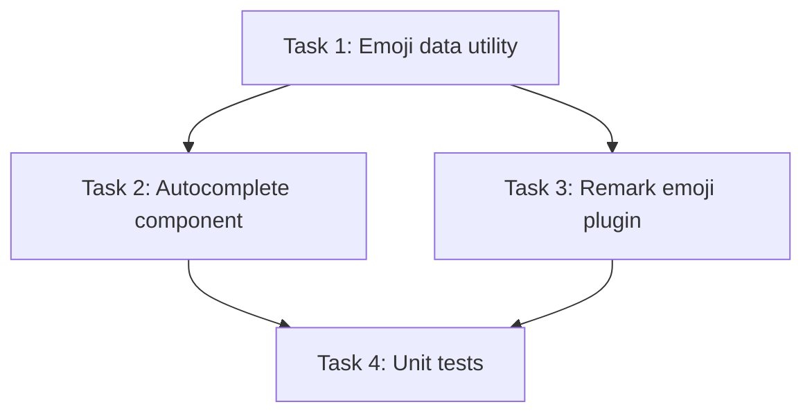

# Plan: Emoji Shortcode Support

## Original Work Order
> I would like to add support for emojis with the colon format in which one types a colon and an emoji dropdown appears and then you can select the emoji that you want based on the emoji ID or label. This is very common. This is supported in GitHub. Also, I want rendered comments to render emojis whenever they encounter an emoji ID in between colons.

## Plan Clarifications

| Question | Answer |
|----------|--------|
| Picker UI position | Inline near cursor in MDEditor textarea |
| Emoji data source | emoji-mart library (data package + custom autocomplete UI) |
| Render scope | All markdown rendering (CommentDisplay + RenderedMarkdownView) |
| Autocomplete trigger | After colon + 2 characters (e.g., `:ro` for :rocket:) |

## Executive Summary

This plan adds GitHub-style emoji shortcode support to the self-review app. Users will be able to type `:` followed by 2+ characters in the comment MDEditor to trigger an inline autocomplete dropdown showing matching emoji suggestions. Selecting an emoji replaces the shortcode text with the Unicode emoji character. Additionally, all markdown rendering across the app (CommentDisplay and RenderedMarkdownView) will convert emoji shortcodes (e.g., `:rocket:`) to their Unicode equivalents.

The approach uses the `@emoji-mart/data` package for emoji metadata/shortcodes and builds a lightweight custom autocomplete dropdown (no full emoji-mart picker component needed). For rendering, a remark plugin will transform shortcodes in the markdown AST before rendering.

## Context

### Current State vs Target State

| Current State | Target State | Why? |
|---|---|---|
| No emoji shortcode support in comment editor | Inline autocomplete dropdown triggered by `:` + 2 chars | Users expect GitHub-style emoji input when writing review comments |
| Emoji shortcodes in rendered text appear as raw text (e.g., `:rocket:`) | Shortcodes render as Unicode emojis (🚀) | Comments should display emojis properly like GitHub |
| No emoji data in the app | `@emoji-mart/data` provides shortcode-to-emoji mapping | Need a reliable, maintained emoji dataset |

### Background

The comment editor uses `@uiw/react-md-editor` which supports `extraCommands` for toolbar customization and exposes the textarea via `.w-md-editor-text-input`. The editor already has keyboard event handling for Ctrl+Enter and Escape. Comments are rendered via `react-markdown` with `remark-gfm` in both `CommentDisplay` and `RenderedMarkdownView`. The remark plugin system allows custom AST transformations.

## Architectural Approach

### Emoji Data Layer
**Objective**: Provide a shared emoji shortcode-to-Unicode mapping used by both the autocomplete and the rendering plugin.

Install `@emoji-mart/data` as a dependency. Create a small utility module (`src/renderer/utils/emoji-data.ts`) that imports the emoji-mart dataset and exposes two functions:
1. `searchEmojis(query: string): EmojiMatch[]` — fuzzy-searches emoji shortcodes/names by prefix, returns top ~8 results with id, name, and native Unicode character.
2. `resolveShortcode(shortcode: string): string | null` — given a shortcode (without colons), returns the native Unicode character or null.

### Emoji Autocomplete in CommentInput
**Objective**: Provide an inline dropdown when typing `:` + 2 chars in the MDEditor textarea.

Create a `useEmojiAutocomplete` hook that:
1. Listens for input changes on the MDEditor body text.
2. Detects when the cursor is preceded by `:` + 2+ alphanumeric/underscore characters (regex: `/:(\w{2,})$/`).
3. Calls `searchEmojis()` with the query portion.
4. Manages dropdown state: open/closed, selected index, position.
5. Computes dropdown position based on a caret-position measurement approach (mirror div or `textarea-caret` utility).

Create an `EmojiAutocomplete` component that:
1. Renders a small dropdown (max ~8 items) with emoji character + shortcode name.
2. Supports keyboard navigation: arrow up/down, Enter/Tab to select, Escape to dismiss.
3. On selection, replaces the `:query` text in the body with the Unicode emoji character.
4. Positioned absolutely near the cursor using coordinates from the hook.

Integrate into `CommentInput.tsx` by adding the hook and rendering the `EmojiAutocomplete` component within the editor container.

### Emoji Rendering in Markdown
**Objective**: Convert `:shortcode:` text to Unicode emojis in all rendered markdown views.

Create a custom remark plugin (`src/renderer/utils/remark-emoji.ts`) that:
1. Walks the markdown AST text nodes.
2. Finds patterns matching `:shortcode:` (regex: `/:([a-z0-9_+-]+):/g`).
3. Resolves each shortcode via `resolveShortcode()`.
4. Replaces matched text nodes with the Unicode emoji character.

Apply this plugin to the `remarkPlugins` array in:
- `CommentDisplay.tsx` (alongside existing `remarkGfm`)
- `RenderedMarkdownView.tsx` (alongside existing remark plugins)

## Risk Considerations and Mitigation Strategies

Technical Risks

- **Caret position measurement in MDEditor**: The MDEditor textarea is styled by the library, making pixel-perfect caret positioning tricky.
    - **Mitigation**: Use a well-known caret-position approach (mirror div technique or `textarea-caret` package). Fall back to positioning near the editor bottom-left if measurement fails.
- **Keyboard event conflicts**: The autocomplete needs arrow keys and Enter, which may conflict with MDEditor's own handlers.
    - **Mitigation**: When the autocomplete dropdown is open, capture these keys in the `onKeyDown` handler before they reach MDEditor. The existing `textareaProps.onKeyDown` in CommentInput already demonstrates this pattern.

Implementation Risks

- **Bundle size increase**: `@emoji-mart/data` adds ~400KB of emoji data.
    - **Mitigation**: This is a desktop Electron app with bundled assets, so bundle size is not a significant concern. The data is loaded once.

## Success Criteria

### Primary Success Criteria
1. Typing `:` + 2 characters in CommentInput shows a dropdown with matching emoji suggestions near the cursor
2. Selecting an emoji from the dropdown inserts the Unicode character and closes the dropdown
3. Keyboard navigation (arrows, Enter/Tab, Escape) works in the dropdown
4. `:shortcode:` text in rendered comments and markdown views displays as Unicode emojis
5. The autocomplete does not interfere with normal typing or existing keyboard shortcuts

## Documentation

- Update `AGENTS.md` to mention emoji shortcode support in the comment editor section if relevant.

## Resource Requirements

### Development Skills
- React component development, hooks, and event handling
- remark plugin authoring (unified/remark AST manipulation)
- CSS positioning for inline dropdowns

### Technical Infrastructure
- `@emoji-mart/data` — emoji dataset with shortcodes and Unicode mappings
- Existing: `react-markdown`, `remark-gfm`, `@uiw/react-md-editor`

## Dependency Diagram

## Execution Blueprint

**Validation Gates:**
- Reference: `/config/hooks/POST_PHASE.md`

### ✅ Phase 1: Foundation
**Parallel Tasks:**
- ✔️ Task 1: Install emoji-mart data and create emoji data utility

### ✅ Phase 2: Features
**Parallel Tasks:**
- ✔️ Task 2: Create emoji autocomplete dropdown for CommentInput (depends on: 1)
- ✔️ Task 3: Create remark-emoji plugin and integrate into markdown renderers (depends on: 1)

### ✅ Phase 3: Testing
**Parallel Tasks:**
- ✔️ Task 4: Write unit tests for emoji data utility and remark plugin (depends on: 2, 3)

### Execution Summary
- Total Phases: 3
- Total Tasks: 4
- Maximum Parallelism: 2 tasks (in Phase 2)
- Critical Path Length: 3 phases

## Execution Summary

**Status**: ✅ Completed Successfully
**Completed Date**: 2026-02-27

### Results
All 4 tasks completed across 3 phases. The emoji shortcode feature is fully implemented:
- Shared emoji data utility using `@emoji-mart/data`
- Inline autocomplete dropdown in comment editor (colon + 2 chars trigger)
- Remark plugin rendering `:shortcode:` as Unicode emojis in all markdown views
- 12 unit tests covering search, resolution, and AST transformation
- All 228 tests pass, linting clean, TypeScript compiles

### Noteworthy Events
No significant issues encountered. Phase 2 tasks (autocomplete + remark plugin) executed in parallel via worktree isolation.

### Recommendations
None — feature is self-contained with no follow-up actions needed.
