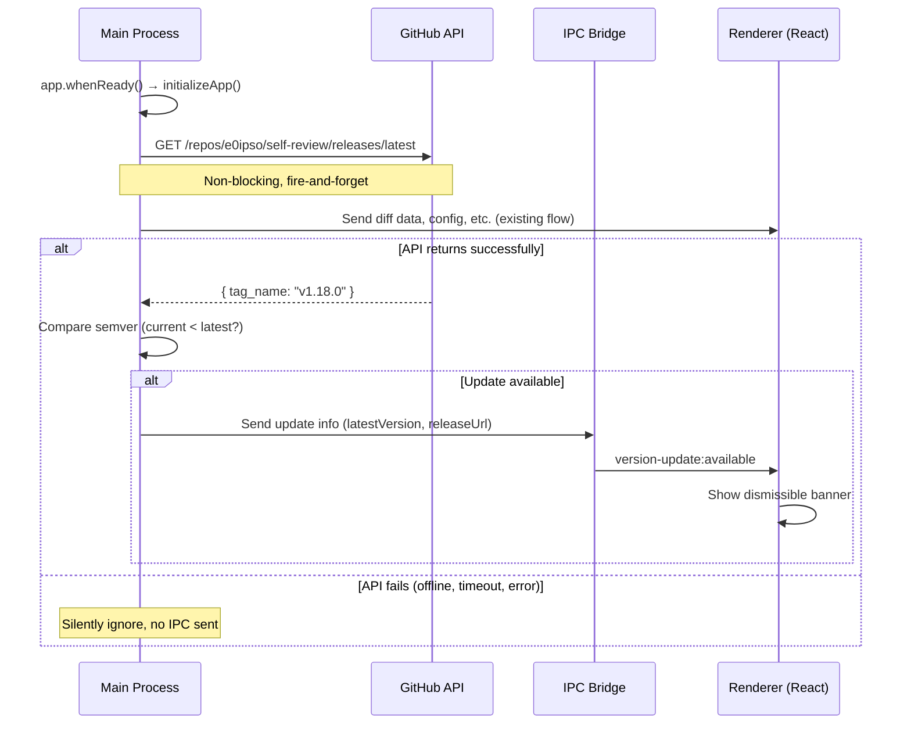
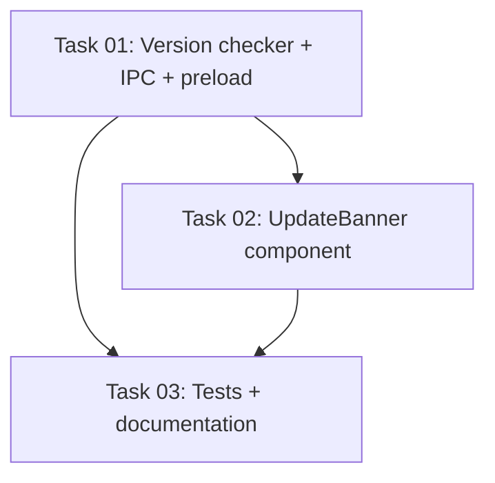

# Plan: Version Update Check via GitHub Releases

## Original Work Order

> I want to have a system that checks if the user is running the latest version of self-review. The system will know by comparing the current version against the latest version in GitHub releases for the https://www.github.com/e0ipso/self-review repo
>
> If the user is not running the latest version there should be a visual cue to invite the user to upgrade to the latest version linking to the latest release in GitHub.

## Plan Clarifications

| Question | Answer |
|----------|--------|
| AGENTS.md says "No network access" — relax for this? | Yes, allow a narrow exception for version checking only. Fail silently on error. |
| Behavior on network failure (offline, firewall, etc.)? | Silently ignore — show nothing, don't bother the user or the process. |
| When should the check happen? | On app startup only, non-blocking. |

## Executive Summary

This plan adds a single, non-blocking network request on app startup to compare the current app version (from `package.json`) against the latest GitHub Release for `e0ipso/self-review`. If a newer version is available, a subtle, dismissible banner appears in the UI linking to the release page. If the check fails for any reason (offline, timeout, API error), it fails silently with zero impact on the user experience.

This is the first network request the app will ever make, requiring a documented exception to the "no network access" convention in AGENTS.md.

## Context

### Current State vs Target State

| Current State | Target State | Why? |
|---|---|---|
| App makes zero network requests | App makes one optional request on startup to GitHub API | Needed to fetch latest release version |
| No awareness of available updates | Banner shown when a newer version exists | Users running old versions don't know updates are available |
| AGENTS.md says "No network access" | AGENTS.md documents a narrow exception for version checking | Convention must reflect the new reality |

### Background

The app currently reads its own version from `package.json` via `require('../../package.json')` in `cli.ts` for the `--version` flag. The GitHub Releases API endpoint `https://api.github.com/repos/e0ipso/self-review/releases/latest` returns a JSON payload with a `tag_name` field (e.g., `"v1.17.1"`) that can be compared via semver against the local version. This endpoint requires no authentication and has generous rate limits (60 req/hour for unauthenticated).

## Architectural Approach

### Main Process: Version Checker Module

**Objective**: Fetch the latest release version from GitHub and send it to the renderer if an update is available.

A new module `src/main/version-checker.ts` will export a single async function `checkForUpdate()`. It will:

1. Read the current version from `package.json`.
2. Use Node.js built-in `https` module (or Electron's `net` module) to GET `https://api.github.com/repos/e0ipso/self-review/releases/latest`. The `net` module from Electron is preferred because it respects system proxy settings and works correctly in Electron's main process.
3. Parse the `tag_name` from the JSON response, strip the leading `v` if present.
4. Compare using semver: if `latest > current`, return `{ latestVersion, releaseUrl }`.
5. Wrap the entire function in a try-catch that silently swallows all errors (network failures, JSON parse errors, invalid responses).
6. Use a short timeout (5 seconds) to avoid hanging on slow connections.

This function is called from `initializeApp()` after the window is created, using a fire-and-forget pattern (`checkForUpdate(...).catch(() => {})`). It does not block startup.

### IPC Channel: Version Update

**Objective**: Deliver update availability information from main to renderer.

Add a new IPC channel `version-update:available` to `src/shared/ipc-channels.ts`. Add a new type `VersionUpdateInfo` to `src/shared/types.ts` containing `latestVersion: string` and `releaseUrl: string`. Extend the `ElectronAPI` interface with `onVersionUpdate(callback)` and add the corresponding handler in `preload.ts`.

### Renderer: Update Banner Component

**Objective**: Show a subtle, dismissible banner when an update is available.

A new component `src/renderer/components/UpdateBanner.tsx` renders a thin banner (similar in style to the toolbar) positioned at the top of the app, above the toolbar. It will:

1. Listen for the `version-update:available` IPC event via the preload bridge.
2. Display a message like: "Self Review vX.Y.Z is available" with a link to the GitHub release page.
3. Include a dismiss (X) button that hides the banner for the session.
4. The link opens in the user's default external browser using Electron's `shell.openExternal` (exposed via preload).

The banner is rendered in `AppContent` (in `App.tsx`) above the `<Toolbar />` component, only when update info is present and not dismissed.

### External Link Support

**Objective**: Allow opening the GitHub release URL in the user's default browser.

Add a new IPC handler and preload bridge method `openExternal(url: string)` that calls Electron's `shell.openExternal(url)` in the main process. This is the standard Electron pattern for opening URLs externally from a renderer with `contextIsolation: true`.

## Risk Considerations and Mitigation Strategies

Technical Risks

- **GitHub API rate limiting**: Unauthenticated requests are limited to 60/hour per IP. Since this app is used by individual developers running it occasionally, this is effectively unlimited.
    - **Mitigation**: One request per app launch is well within limits. No retry logic.
- **Network request blocking startup**: A slow or hung network request could delay the UI.
    - **Mitigation**: The check is fully asynchronous and fire-and-forget. The UI loads immediately. A 5-second timeout ensures the request doesn't hang indefinitely.
- **Semver parsing edge cases**: Release tags might not follow strict semver.
    - **Mitigation**: Use a lightweight semver comparison. If parsing fails, silently ignore (treat as "no update").

Implementation Risks

- **Breaking the "no network" convention**: This is the first network request, which could set a precedent.
    - **Mitigation**: Document the exception narrowly in AGENTS.md. The request is optional, non-blocking, and fails silently.

## Success Criteria

### Primary Success Criteria

1. When a newer version exists on GitHub Releases, the app displays a visible, dismissible banner with the version number and a link to the release.
2. When the user is on the latest version, no banner is shown.
3. When the network request fails (any reason), no error is shown and the app behaves identically to before this feature.
4. The version check does not delay app startup or block the UI in any way.

## Documentation

- Update `AGENTS.md` to document the narrow network exception for version checking under the "No network access" convention.
- Add `version-checker.ts` to the project structure listing in `AGENTS.md`.
- Add the new IPC channels to the IPC channel table in `AGENTS.md`.

## Resource Requirements

### Development Skills

- Electron main process (Node.js `net` module or Electron `net` for HTTPS requests)
- React component development with shadcn/ui
- IPC channel setup (main ↔ preload ↔ renderer)

### Technical Infrastructure

- No new dependencies required. Use Electron's built-in `net` module for HTTPS and simple string-based semver comparison (the version format is `MAJOR.MINOR.PATCH`, no need for a full semver library).

## Execution Blueprint

### Dependency Diagram

**Validation Gates:**
- Reference: `/config/hooks/POST_PHASE.md`

### ✅ Phase 1: Backend Infrastructure
**Parallel Tasks:**
- ✔️ Task 01: Implement version checker module, IPC channel, and preload bridge

### ✅ Phase 2: Frontend UI
**Parallel Tasks:**
- ✔️ Task 02: Implement UpdateBanner component and integrate in App.tsx (depends on: 01)

### ✅ Phase 3: Quality & Documentation
**Parallel Tasks:**
- ✔️ Task 03: Write unit tests for version checker and update documentation (depends on: 01, 02)

### Post-phase Actions
- Run `npm run test:unit` to verify all tests pass
- Manual smoke test: launch app and verify banner appears (or doesn't) correctly

### Execution Summary
- Total Phases: 3
- Total Tasks: 3
- Maximum Parallelism: 1 task (sequential dependency chain)
- Critical Path Length: 3 phases

## Execution Summary

**Status**: ✅ Completed Successfully
**Completed Date**: 2026-02-27

### Results
All 3 tasks executed successfully across 3 phases. The version update check feature is fully implemented:
- `src/main/version-checker.ts` — fetches latest release from GitHub API on startup
- `src/renderer/components/UpdateBanner.tsx` — dismissible banner shown when update available
- IPC channels, preload bridge, and `openExternal` handler wired up
- 8 unit tests for `compareVersions` logic, all passing
- AGENTS.md updated with version check exception, new IPC channels, and project structure

### Noteworthy Events
- Feature branch created from `main` after switching from `feature/25--emoji-shortcode-support`
- The "No network access" convention in AGENTS.md was amended to document the narrow exception for version checking

### Recommendations
- Manual smoke test recommended: build the app and verify the banner appears when a newer version exists on GitHub Releases
