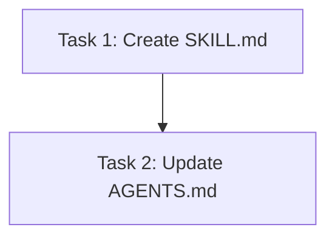

# Plan: Self-Review Critique Skill

## Original Work Order
> I need a skill that an AI assistant can use to critique a diff and propose changes using the review.xml format. This file should be able to be loaded to the diff using self-review so a human can validate the proposed changes.

## Plan Clarifications

| Question | Answer |
|----------|--------|
| Trigger mechanism | Explicit invocation via `/self-review-critique` with git diff args or paths |
| Diff source | Same args as self-review CLI (unstaged by default) |
| Categories | Read from `.self-review.yaml`, fall back to defaults |
| XML validation | Validate with `xmllint` if available, skip gracefully if not |

## Executive Summary

This plan creates a new Claude Code skill at `.claude/skills/self-review-critique/` that enables an AI assistant to act as a code reviewer. The skill reads a git diff, analyzes the changes, and produces a `review.xml` file conforming to the self-review XSD schema. The human developer can then load this review into self-review via `--resume-from review.xml` to inspect, accept, or reject the AI's suggestions in the familiar diff review UI.

The skill is purely a prompt-based skill (like the existing `self-review-apply` skill) — it contains instructions for the AI assistant, not executable code. The AI uses its existing tools (Bash for git diff, Read for file context, Write for XML output) to perform the review.

## Context

### Current State vs Target State

| Current State | Target State | Why? |
|---|---|---|
| AI can apply review.xml feedback (self-review-apply skill) | AI can also generate review.xml feedback | Completes the AI-in-the-loop workflow: AI critiques → human validates → AI applies |
| No structured way for AI to propose code changes as reviewable comments | AI outputs XSD-valid review.xml with line-level comments and suggestions | Structured output enables human validation in the self-review UI |
| Human must manually review all AI-generated code | Human reviews AI critique in familiar PR-style UI, accepting/rejecting individual suggestions | Faster, more granular human oversight |

### Background

The self-review app already supports loading comments from an XML file via `--resume-from`. The XML parser (`src/main/xml-parser.ts`) reads the file and maps comments back to diff lines. The skill only needs to generate valid XML — the loading infrastructure already exists.

The existing `self-review-apply` skill provides a good template for the new skill's structure and conventions.

## Architectural Approach

The skill is a single `SKILL.md` file with structured instructions for the AI assistant. No application code changes are needed — the skill leverages existing self-review infrastructure.

### Skill File Structure
**Objective**: Define the skill metadata and step-by-step instructions for the AI.

The skill lives at `.claude/skills/self-review-critique/SKILL.md` with the XSD schema referenced from the existing `self-review-apply/assets/` directory (shared asset, no duplication).

Key sections in the skill instructions:
1. **Parse arguments** — extract git diff args from `$ARGUMENTS`, default to unstaged
2. **Load categories** — read `.self-review.yaml` if present, otherwise use defaults (question, bug, security, style, task, nit)
3. **Run git diff** — execute `git diff <args>` to get the unified diff
4. **Read file context** — for each changed file, read the full current file content to understand surrounding code
5. **Critique the diff** — analyze changes for bugs, style issues, security concerns, missing edge cases, etc.
6. **Build review XML** — construct XML with proper namespace, line numbers, categories, and suggestions where applicable
7. **Validate** — run `xmllint --schema` if available
8. **Write output** — write to `review.xml` (or the path from `.self-review.yaml` `output-file`)

### XML Generation Rules
**Objective**: Ensure the generated XML is valid and compatible with self-review's `--resume-from` parser.

Critical rules the skill instructions must encode:
- Root `<review>` element with `xmlns="urn:self-review:v1"`, `timestamp`, `git-diff-args`, and `repository` attributes
- One `<file>` per changed file, with `path`, `change-type`, and `viewed="true"`
- Comments use `new-line-start`/`new-line-end` for added/context lines, `old-line-start`/`old-line-end` for deleted lines
- `<body>` contains markdown-formatted review commentary
- `<category>` must match one of the categories from config
- `<suggestion>` with `<original-code>` and `<proposed-code>` for concrete code change proposals
- XML-escape all text content (`&`, `<`, `>`, `"`, `'`)
- Files with no comments still appear as self-closing `<file ... />`

### Review Quality Guidelines
**Objective**: Guide the AI to produce useful, actionable review comments.

The skill instructions should direct the AI to:
- Focus on substantive issues (bugs, security, logic errors) over stylistic nitpicks
- Use `suggestion` blocks for concrete code fixes rather than just describing what to change
- Reference specific line numbers accurately based on the diff output
- Use appropriate categories to help the human prioritize
- Keep comment bodies concise and actionable
- Skip files that look correct — don't force comments on every file

## Risk Considerations and Mitigation Strategies

Technical Risks

- **Line number accuracy**: The AI must map diff hunks to correct file line numbers. The `new-line-start`/`new-line-end` attributes reference the post-change file, which is what `git diff` shows in the `+` line numbers.
    - **Mitigation**: The skill instructions include explicit rules for line number mapping from unified diff format.

- **XML validity**: Malformed XML would prevent loading in self-review.
    - **Mitigation**: The skill includes an xmllint validation step and provides a complete XML template the AI can follow.

Implementation Risks

- **Large diffs**: Very large diffs may exceed context window limits.
    - **Mitigation**: The skill instructs the AI to process files incrementally and prioritize files with the most significant changes.

## Success Criteria

### Primary Success Criteria
1. Running `/self-review-critique --staged` produces a valid `review.xml` file
2. The generated XML passes `xmllint --schema` validation against the XSD
3. Running `self-review --staged --resume-from review.xml` loads the AI's comments correctly in the review UI
4. Comments have accurate line numbers, appropriate categories, and actionable suggestions

## Documentation

- Update `AGENTS.md` to document the new skill and its usage
- The skill's own `SKILL.md` serves as its primary documentation

## Resource Requirements

### Development Skills
- Prompt engineering for Claude Code skill authoring
- Understanding of the self-review XML schema and unified diff format

### Technical Infrastructure
- Existing XSD schema at `.claude/skills/self-review-apply/assets/self-review-v1.xsd`
- `xmllint` for optional validation (already used by `self-review-apply`)

## Execution Blueprint

**Validation Gates:**
- Reference: `/config/hooks/POST_PHASE.md`

### ✅ Phase 1: Core Implementation
**Parallel Tasks:**
- ✔️ Task 1: Create the self-review-critique SKILL.md

### ✅ Phase 2: Documentation
**Parallel Tasks:**
- ✔️ Task 2: Update AGENTS.md with skill documentation (depends on: 1)

### Execution Summary
- Total Phases: 2
- Total Tasks: 2
- Maximum Parallelism: 1 task (in Phase 1)
- Critical Path Length: 2 phases

## Execution Summary

**Status**: Completed Successfully
**Completed Date**: 2026-02-28

### Results
Created the `self-review-critique` skill at `.claude/skills/self-review-critique/SKILL.md` and documented it in `AGENTS.md`. The skill instructs an assistant to critique a git diff and produce XSD-valid `review.xml` output that can be loaded via `self-review --resume-from`.

### Noteworthy Events
No significant issues encountered.

### Recommendations
- Test the skill end-to-end by running `/self-review-critique --staged` on a real diff and loading the output in self-review.
