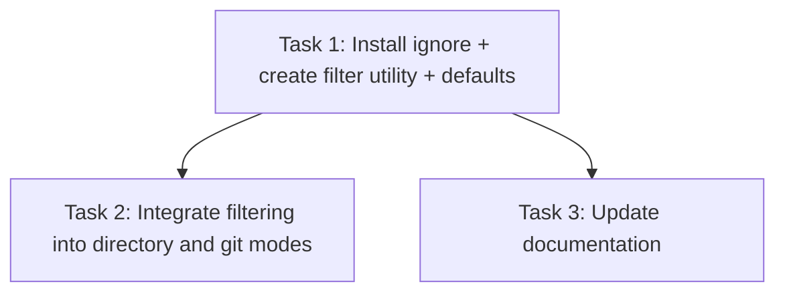

# Plan: Implement Ignore Pattern Filtering

## Original Work Order
> I want to introduce a configuration option that is an array of strings. The format is globs compatible with .gitignore. When opening a directory, all the files that match any of the globs should not be considered in self-review. Ensure compatibility with the .gitignore format, research the format specificaiton online.
>
> Then make the default value for this configuration option to be the typical vendor directories for the different tech stacks: .git, node_modules, vendor, ...
>
> Remember to update PRD.md, AGENTS.md, and README.md according to their current style and conciseness.

## Executive Summary

The `ignore` configuration option already exists in `AppConfig` (type: `string[]`, default: `[]`) and is parsed from `.self-review.yaml`, but it is never applied to filter files. This plan activates the existing `ignore` field by:

1. Adding the [`ignore`](https://www.npmjs.com/package/ignore) npm package for gitignore-spec-compatible pattern matching.
2. Applying ignore filtering in both directory mode and git mode (post-parse filtering of `DiffFile[]`).
3. Setting sensible default patterns for common vendor/build directories.
4. Updating PRD.md, AGENTS.md, and README.md documentation.

The `ignore` npm package was chosen because it is the de-facto standard for gitignore-compatible matching in Node.js (used by ESLint, Prettier, and many others). It handles all gitignore spec rules: `**` globs, negation with `!`, trailing slash for directories, leading slash anchoring, and comment/blank line handling.

## Context

### Current State vs Target State

| Current State | Target State | Why? |
|---|---|---|
| `ignore: []` default, parsed but never used | `ignore` patterns applied as a post-parse filter on `DiffFile[]` in all modes | Users scanning large directories get flooded with vendor files |
| Default is empty array | Default includes common vendor directories (`.git`, `node_modules`, `vendor`, etc.) | Out-of-box experience should exclude obvious non-review files |
| No gitignore-compatible matching library | Uses `ignore` npm package | Correct implementation of gitignore spec (negation, `**`, directory markers) |
| PRD documents `ignore` as glob syntax | PRD documents `ignore` as gitignore-compatible with defaults listed | Documentation accuracy |

### Background

The gitignore format (documented at [git-scm.com/docs/gitignore](https://git-scm.com/docs/gitignore)) supports:
- Standard glob patterns (`*.js`, `dist/**`)
- `**` for matching across directories
- Trailing `/` to match only directories
- Leading `!` to negate (re-include) a pattern
- Leading `/` to anchor to the root
- `#` for comments, blank lines ignored

The `ignore` npm package implements this spec faithfully and is the most widely adopted solution in the Node.js ecosystem.

## Architectural Approach

```mermaid
flowchart TD
    A[Config loads ignore patterns] --> B[Create ignore filter]
    B --> C{Mode?}
    C -->|Directory| D[scanDirectory collects files]
    C -->|Git| E[git diff parsed to DiffFile[]]
    C -->|File| F[Single file - no filtering]
    D --> G[Filter filePaths with ignore]
    E --> H[Filter DiffFile[] with ignore]
    G --> I[Generate synthetic diffs for remaining files]
    H --> J[Return filtered DiffFile[]]
```

### Ignore Filter Utility

**Objective**: Create a reusable filter function that takes `string[]` patterns and returns a predicate for filtering file paths.

A small utility module (`src/main/ignore-filter.ts`) wraps the `ignore` package to create a filter from the config's `ignore` array. This filter is used in both `scanDirectory` (filters relative paths before generating diffs) and in `main.ts` (filters `DiffFile[]` after parsing in git mode). The function signature: `createIgnoreFilter(patterns: string[]): (path: string) => boolean` returns `true` if the path should be **kept** (not ignored).

### Directory Mode Integration

**Objective**: Filter out ignored files during directory scanning before generating synthetic diffs.

In `scanDirectory`, after collecting `filePaths` and before generating synthetic diffs, apply the ignore filter. The filter operates on relative paths (already computed). This is the most impactful integration since directory mode currently includes everything recursively.

### Git Mode Integration

**Objective**: Filter out ignored files from git diff results.

In `main.ts` (or `git-diff-loader.ts`), after `parseDiff()` returns `DiffFile[]`, filter out files whose `newPath` (or `oldPath` for deletions) matches ignore patterns. This handles cases where git diff includes files the user wants to exclude from review (e.g., lock files).

### Default Patterns

**Objective**: Provide sensible defaults that work across common tech stacks.

The default `ignore` array in `config.ts` will include:

```
.git
node_modules
vendor
.vendor
__pycache__
.venv
venv
.env
dist
build
.next
.nuxt
.svelte-kit
target
*.min.js
*.min.css
package-lock.json
yarn.lock
pnpm-lock.yaml
composer.lock
Gemfile.lock
Cargo.lock
poetry.lock
go.sum
```

These cover: git internals, JS/TS (Node), PHP (Composer), Python, Ruby, Rust, Go, and common build outputs. Users can override with an empty array or customize in `.self-review.yaml`.

### Documentation Updates

**Objective**: Update PRD.md, AGENTS.md, and README.md to reflect the new defaults and gitignore compatibility.

- **PRD.md**: Update Section 7.4 config example to show defaults and mention gitignore compatibility.
- **AGENTS.md**: No structural changes needed; the config section already mentions `ignore`.
- **README.md**: Update the `ignore` config description to mention gitignore format and default patterns.

## Risk Considerations and Mitigation Strategies

<details>
<summary>Technical Risks</summary>

- **Pattern compatibility edge cases**: The `ignore` package is battle-tested (used by ESLint, Prettier) so edge cases are minimal.
    - **Mitigation**: Use the package as-is without custom pattern transformation.
- **Performance on large directories**: The `ignore` package compiles patterns into regex for fast matching.
    - **Mitigation**: Filter is applied to relative path strings, not filesystem operations — negligible overhead.
</details>

<details>
<summary>Implementation Risks</summary>

- **Default patterns too aggressive**: Users may be surprised that files are excluded by default.
    - **Mitigation**: Defaults target only universally-agreed vendor/build directories. Users can override with `ignore: []` in config.
</details>

## Success Criteria

### Primary Success Criteria
1. Directory mode excludes files matching ignore patterns (verified by unit test)
2. Git mode excludes files matching ignore patterns from the diff view
3. Default patterns exclude common vendor directories without configuration
4. Existing `ignore` config in `.self-review.yaml` works with gitignore syntax (negation, `**`, etc.)
5. PRD.md, AGENTS.md, and README.md are updated

## Documentation

- **PRD.md** Section 7.4: Update ignore config description, add defaults list, mention gitignore compatibility
- **README.md**: Update `ignore` line in configuration table to mention gitignore format and defaults
- **AGENTS.md**: Minor update if needed to reflect default ignore behavior

## Resource Requirements

### Development Skills
- TypeScript, Node.js, Electron main process

### Technical Infrastructure
- `ignore` npm package (MIT license, ~300KB unpacked, zero dependencies)

## Execution Blueprint

**Validation Gates:**
- Reference: `/config/hooks/POST_PHASE.md`

### Dependency Diagram



### ✅ Phase 1: Foundation
**Parallel Tasks:**
- ✔️ Task 1: Install `ignore` package, create filter utility, set default patterns, add unit tests

### ✅ Phase 2: Integration & Documentation
**Parallel Tasks:**
- ✔️ Task 2: Integrate filtering into directory and git modes (depends on: 1)
- ✔️ Task 3: Update documentation - PRD.md, AGENTS.md, README.md (depends on: 1)

### Post-phase Actions

### Execution Summary
- Total Phases: 2
- Total Tasks: 3
- Maximum Parallelism: 2 tasks (in Phase 2)
- Critical Path Length: 2 phases

## Execution Summary

**Status**: ✅ Completed Successfully
**Completed Date**: 2026-03-03

### Results
All 3 tasks completed across 2 phases. The `ignore` config option is now fully functional with gitignore-compatible pattern matching via the `ignore` npm package. Default patterns cover common vendor/build directories across JS, Python, PHP, Ruby, Rust, and Go ecosystems. Filtering is applied in directory mode, git mode, and the welcome screen browse flow. All 244 unit tests pass.

### Noteworthy Events
- The `ignore` config field and YAML parsing already existed but were never wired up — no type changes needed.
- PRD.md incorrectly stated patterns would merge; corrected to reflect the actual replace behavior.

### Recommendations
No follow-up actions needed.
