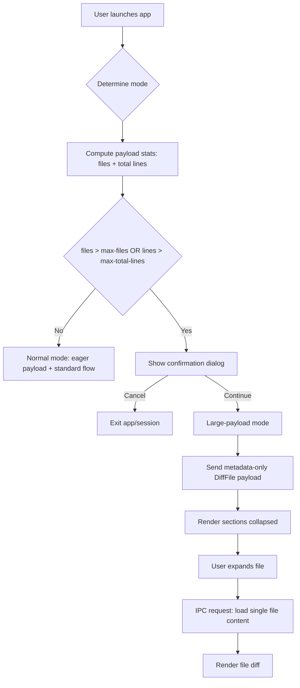
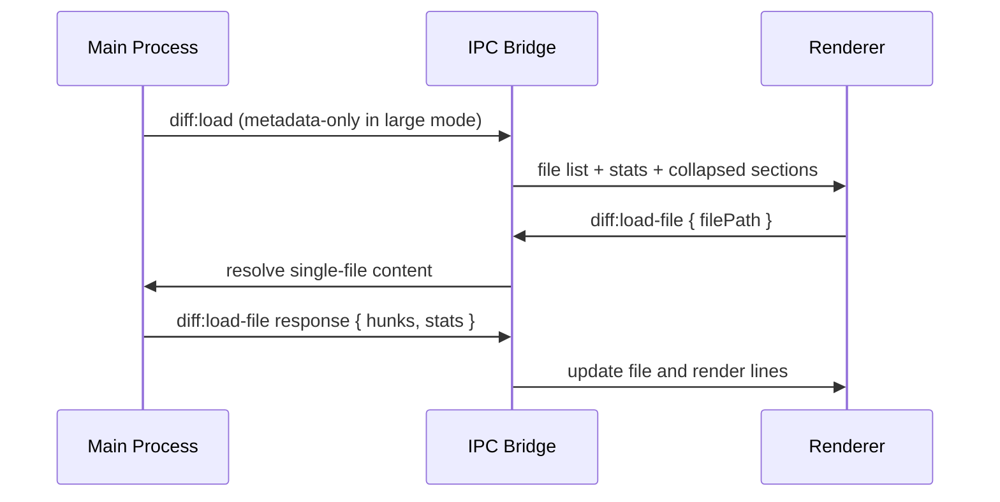
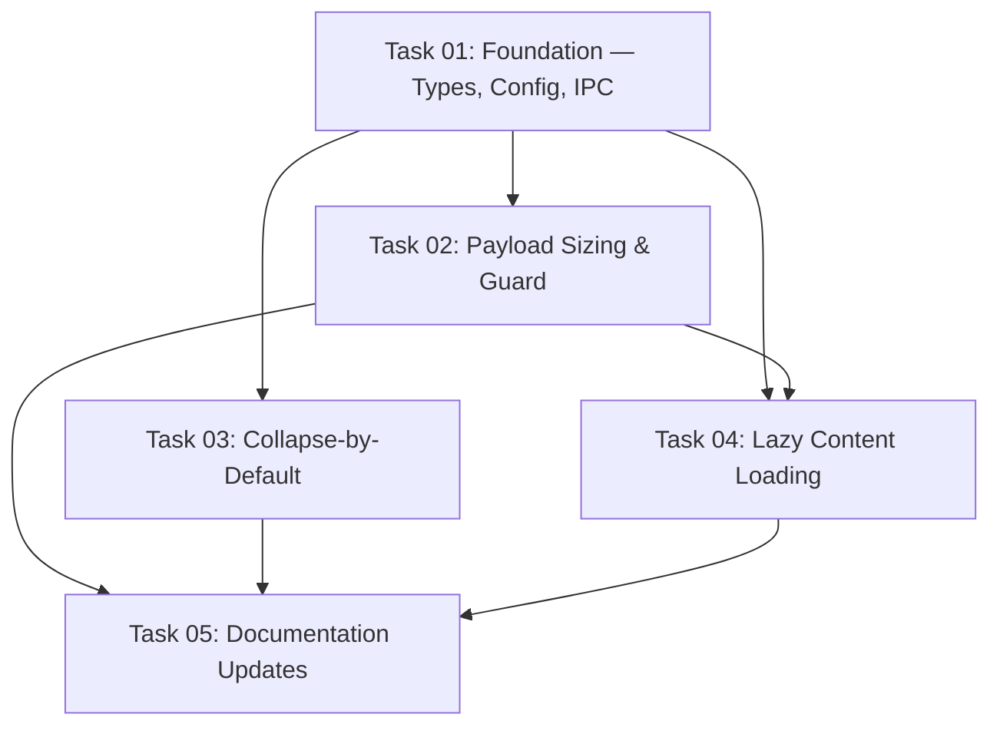

# Plan: Large Payload Guard — Prevent Crashes on Big Directories and Diffs

## Original Work Order

> with #1 + #2 + #3 together
>
> Context: The application crashes when loading large directories or big git diffs because it tries
> to load all files and render them simultaneously. Implement three complementary mitigations:
> 1. File count / total line guard with early bail-out
> 2. Collapse-by-default for large diffs
> 3. Lazy content loading (render file content on expand)

## Plan Clarifications

| Question | Answer |
|---|---|
| Guard trigger policy? | Trigger guard when either file count or total line count exceeds threshold. |
| Default thresholds? | `500` files and `100000` total lines. |
| Should thresholds be configurable now? | Yes. Add both `max-files` and `max-total-lines`. |
| Are documentation updates in scope? | Yes. Include full documentation updates. |
| Cancel behavior at guard dialog? | Exit app/session when the user selects Cancel. |
| Lazy loading policy? | `large_only`: lazy-load file content only in large-payload mode. |
| Is `max-files` still needed if `max-total-lines` exists? | Yes. `max-files` protects file-cardinality overhead (file tree entries, per-file section/state/observer overhead) that total-line thresholds do not bound. |
| Could `max-files` be removed later? | Only after virtualization and a non-`large_only` lazy strategy materially reduce file-cardinality overhead; out of scope for this work order. |

## Executive Summary

The current load path is eager and all-at-once. Directory reviews read and synthesize every file
upfront, and git reviews can parse and transmit large diffs in a single payload. This creates peak
memory and rendering pressure that can crash or freeze the app on large inputs.

This refinement implements three coordinated controls: (1) an early guard based on both file count
and total line count, (2) collapse-by-default rendering when file counts are high, and (3)
large-only lazy loading so expensive content is fetched only when needed for truly large reviews.
*Clarification reference: guard triggers on either threshold, and lazy loading is `large_only`.*
Line-only guarding is insufficient for this architecture because renderer overhead also scales with
file cardinality.

The result is deterministic behavior: small/normal reviews preserve existing eager UX, while large
reviews become explicit opt-in via a confirmation dialog and then render safely with bounded
payload size and incremental file expansion.

## Context

### Current State vs Target State

| Current State | Target State | Why? |
|---|---|---|
| `scanDirectory` reads every file's content with `readFileSync` regardless of size | Perform a sizing pass first (files + lines), show guard dialog when either threshold is exceeded, and only proceed on explicit confirmation | Prevents crash before heavy work begins |
| Git path can do expensive diff work before any size gate | Add an early stats step (`git diff --numstat` + untracked line counts) and gate before full payload delivery | Preserves the "early bail-out" intent in git mode |
| No total-line guard exists | Add `max-total-lines` guard dimension (default `100000`) | Captures "few huge files" cases file-count alone misses |
| No configurable threshold for line-based guard | Add both `max-files` and `max-total-lines` in merged app config | Matches confirmed scope and gives user control |
| Line totals can stay low while file count is high (many tiny/binary/empty files) | Keep `max-files` guard alongside `max-total-lines` | Prevents high-cardinality payloads from bypassing guard |
| Large file sets render expanded by default | Collapse sections by default when file count exceeds internal collapse threshold (`50`) | Reduces initial DOM pressure and visual overload |
| Initial IPC payload includes all hunks/lines | In large-payload mode, send metadata-only payload, then load hunks on expand | Keeps startup payload small for large reviews |
| Lazy loading behavior is not explicitly scoped | Apply lazy loading only in large-payload mode; keep eager behavior for normal payloads | Preserves current small-review UX while protecting large reviews |

### Background

The mitigation is a layered defense, but with explicit mode boundaries:

- **Guard layer**: first decision point. If either `max-files` or `max-total-lines` is exceeded,
  show confirmation before expensive payload flow proceeds.
- **Collapse layer**: controls renderer load even for medium sets by collapsing initial view when
  file count is high.
- **Lazy layer**: activated only for large-payload mode after user confirmation.

Large-payload mode is entered when the guard threshold is exceeded and the user selects Continue.
If the user selects Cancel, the app exits by design. *Clarification reference: cancel behavior is
exit.*

## Architectural Approach

### Shared Payload Sizing Utility (Main Process)
**Objective**: Reuse one sizing algorithm across launch paths so guard behavior is consistent and
maintainable.

Implement a shared helper (for example `estimatePayloadSize`) that returns:
`{ fileCount, totalLines, exceedsFiles, exceedsLines, exceedsAny }`.

- **Directory mode**: enumerate eligible files first, then count lines in a lightweight pass
  without retaining file content in memory; short-circuit counting when either threshold is
  exceeded.
- **Git mode**: compute changed-file and changed-line totals from `git diff --numstat` for tracked
  changes, and add line counts for untracked files. Gate before sending/rendering full payloads.
- **Welcome-screen directory start**: use the same helper path as CLI directory mode.

This extraction improves code reuse and keeps thresholds/logic in one place.

### Guard Layer and Config Integration
**Objective**: Enforce confirmed guard semantics with explicit user control.

Add both config keys to `AppConfig` and YAML parsing:

- `max-files` (default `500`)
- `max-total-lines` (default `100000`)

Validation: non-negative integers. `0` disables that specific guard dimension.

Guard triggers when either active dimension exceeds threshold. Dialog text must include both
observed values and threshold values. Continue enters large-payload mode; Cancel exits.
*Clarification reference: dual-threshold trigger + configurable keys + cancel exits.*
`max-files` is the cardinality guard and `max-total-lines` is the content-volume guard; both are
required because the renderer and IPC shape still scale with file count even when line totals are
small.

### Collapse-by-Default Layer (Renderer)
**Objective**: Reduce initial render pressure when many files are present.

In `DiffViewer.tsx`, initialize `expandedState` based on file count:

- `<= 50` files: keep current expanded-default behavior
- `> 50` files: initialize collapsed

Apply the same rule when new files are loaded/replaced so behavior is stable across mode changes.
This threshold remains an internal constant (not user config) because it is a UI default, not a
guard policy.
Collapse-by-default improves initial rendering but does not eliminate per-file metadata/state costs,
so it cannot replace the file-count guard.

### Lazy Content Loading Layer (Main Process + Renderer, `large_only`)
**Objective**: Keep large-mode startup payload minimal and fetch content on demand.

In large-payload mode only:

1. Initial `diff:load` payload contains metadata and precomputed stats, with empty hunks.
2. Expanding a file triggers a `diff:load-file` request for that file.
3. Main process returns hunks for that single file.
4. Renderer updates per-file state and renders content.

Do not keep a full in-memory cache of all hunks for large mode. Prefer per-file retrieval to avoid
reintroducing memory pressure.

For normal mode (below guard thresholds), keep eager loading to preserve current UX.
Because lazy loading is `large_only`, a file-count guard is necessary to route high-cardinality
inputs into protected large mode.

## Risk Considerations and Mitigation Strategies

Technical Risks

- **Stat estimation mismatch vs rendered diff**: Size estimation and final rendered hunks could
  diverge if command scopes differ.
    - **Mitigation**: Ensure estimation and content retrieval use the same git scope/filters and
      document any known approximation limits.

- **Repo or filesystem changes between initial load and lazy fetch**: File content might change or
  disappear after startup.
    - **Mitigation**: Handle per-file fetch errors gracefully with inline error state + retry.
      Keep review session alive.

- **Line counting pass costs too much on huge directories**: Counting lines can still be expensive.
    - **Mitigation**: Short-circuit line counting as soon as threshold is exceeded; avoid retaining
      buffers/content.

- **High-cardinality, low-line payload bypass**: If file-count guarding is removed, many tiny or
  binary/empty files could bypass guard while still causing renderer pressure.
    - **Mitigation**: Keep OR semantics across `max-files` and `max-total-lines`, and add test
      fixtures for high-file-count/low-line payloads.

Implementation Risks

- **Dual-path complexity (`large_only` + normal eager path)**: Divergent code paths can regress.
    - **Mitigation**: Centralize mode selection in one utility and cover both paths in tests.

- **Rapid multi-file expand creates duplicate IPC work**: Users may trigger repeated loads.
    - **Mitigation**: Track per-file load status (`idle/loading/loaded/error`) and suppress
      duplicate in-flight requests.

- **File identity mismatch for renames/moves**: Wrong file could be requested in lazy mode.
    - **Mitigation**: Use stable file identifiers derived from diff metadata and validate request
      mapping in IPC handlers.

Quality Risks

- **Guard/cancel behavior regressions across launch entry points**: CLI and welcome-start flows may
  diverge.
    - **Mitigation**: Add explicit acceptance coverage for directory CLI, git CLI, and
      welcome-screen directory start, each with Continue and Cancel outcomes.

## Success Criteria

### Primary Success Criteria

1. For inputs exceeding either threshold (`500` files or `100000` lines by default), a guard dialog
   appears before full payload delivery to the renderer.
2. Selecting Cancel from the guard exits the app/session cleanly (no hang/crash).
3. Selecting Continue enters large-payload mode: initial view loads metadata, file tree renders,
   and sections are collapsed by default.
4. In large-payload mode, expanding a file loads and renders only that file's content (no global
   eager hydration).
5. For inputs below both guard thresholds, current eager-load UX remains intact (no guard dialog,
   no mandatory lazy fetch path).
6. Inputs where `files > max-files` but `lines <= max-total-lines` still trigger the guard and
   enter large-payload mode.
7. Inputs with many binary/empty/tiny files and low aggregate line counts are still guarded via
   `max-files`.

## Documentation

- Update `README.md` option reference to include `max-files` and `max-total-lines`.
- Update `docs/PRD.md` config examples and behavior notes for dual-threshold guarding.
- Update `AGENTS.md` architecture + IPC channel table for `diff:load-file` and large-only lazy flow.
- Update `test/features` scenarios to cover:
  - guard trigger by file count and by line count
  - cancel exits
  - continue enters large mode with collapsed defaults
  - per-file lazy load behavior

## Resource Requirements

### Development Skills

- Electron IPC design and preload bridge typing
- Node.js filesystem + git command integration
- React per-file loading state management

### Technical Infrastructure

- No new dependencies required
- Existing Vitest unit tests for main/renderer logic
- Existing Playwright+Cucumber E2E framework (run on host, not in dev container)

## Notes

### Decision Log

- Use dual-threshold guard (`max-files`, `max-total-lines`) with OR semantics.
- Keep collapse threshold as internal UI constant (`50`), separate from guard thresholds.
- Use `large_only` lazy loading to preserve small-review eager UX.
- Canceling at guard exits the app/session.

### Change Log

- 2026-03-04: Added Plan Clarifications table with resolved policy decisions.
- 2026-03-04: Revised architecture to include true file-or-line early guard and large-only lazy mode.
- 2026-03-04: Added explicit risk mitigations, measurable success criteria, and docs/test update scope.
- 2026-03-04: Clarified why `max-files` remains necessary even with `max-total-lines` (cardinality protection).
- 2026-03-04: Generated 5 tasks and execution blueprint.

## Dependency Diagram

## Execution Blueprint

**Validation Gates:**
- Reference: `/config/hooks/POST_PHASE.md`

### ✅ Phase 1: Foundation
**Parallel Tasks:**
- ✔️ Task 01: Foundation — Types, Config, IPC Channels, and Preload Bridge

### ✅ Phase 2: Core Features
**Parallel Tasks:**
- ✔️ Task 02: Payload Sizing Utility and Guard Dialog (depends on: 01)
- ✔️ Task 03: Collapse-by-Default for Large File Sets (depends on: 01)

### ✅ Phase 3: Lazy Loading
**Parallel Tasks:**
- ✔️ Task 04: Lazy Content Loading in Large-Payload Mode (depends on: 01, 02)

### ✅ Phase 4: Documentation
**Parallel Tasks:**
- ✔️ Task 05: Documentation Updates (depends on: 02, 03, 04)

### Execution Summary
- Total Phases: 4
- Total Tasks: 5
- Maximum Parallelism: 2 tasks (in Phase 2)
- Critical Path Length: 4 phases (01 → 02 → 04 → 05)

## Execution Summary

**Status**: ✅ Completed Successfully
**Completed Date**: 2026-03-04

### Results
All 5 tasks executed successfully across 4 phases. The large payload guard feature is fully implemented with:
- Dual-threshold guard (max-files: 500, max-total-lines: 100000) with Electron native confirmation dialog
- Collapse-by-default when >50 files (internal constant)
- Lazy content loading in large-payload mode (metadata-only IPC, on-demand file content via diff:load-file)
- 268 unit tests passing (204 main + 64 renderer), TypeScript clean
- Documentation updated in README.md, docs/PRD.md, and AGENTS.md

### Noteworthy Events
- ConfigContext.tsx required an additional fix for the new required AppConfig fields (maxFiles, maxTotalLines defaults) — caught by TypeScript after Task 01.
- Guard dialog integration required handling 3 separate launch paths: git CLI, directory CLI, and welcome-screen REVIEW_START_DIRECTORY (both file and directory sub-paths).

### Recommendations
- E2E tests for guard dialog behavior should be added on host machine (cannot run in dev container)
- Consider adding a user-configurable collapse threshold in a future iteration if user feedback warrants it
