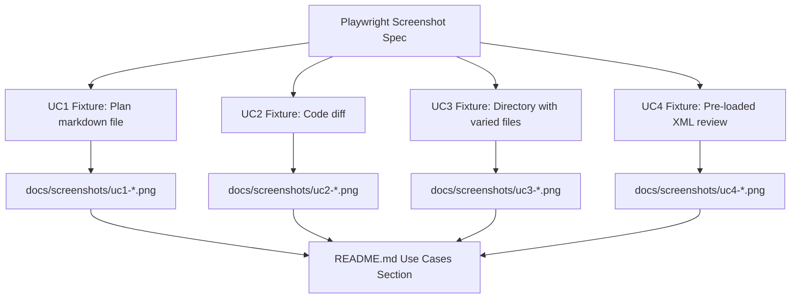
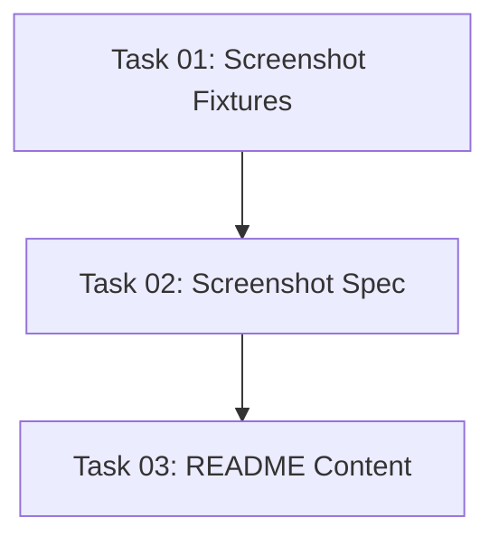

# Plan: README Use Cases Section with Screenshots

## Original Work Order

> Add a "Use Cases" section to the README explaining 4 use cases for self-review: (1) Reviewing AI assistant plans, (2) Reviewing AI-generated code locally, (3) Codebase exploration/annotation, (4) AI-assisted review validation. Each use case gets a heading with a summary and collapsible details. Screenshots are generated via a Playwright script using dedicated test fixtures per use case, arranged in 2-column table grids. Writing should be concise, factual, with highlighted key terms — no hype.

## Plan Clarifications

| Question | Answer |
|----------|--------|
| Screenshot generation in dev container? | Write Playwright script only; user runs on host. Add npm script. |
| 3 or 4 use cases? | 4 separate use cases, each with own heading + collapsible details. |
| Benefits of local review vs GitHub PR? | Include all four: faster iteration, clean git history, privacy, no wasted CI. |
| Screenshot scenarios? | Dedicated test fixture per use case for realistic screenshots. |
| README placement? | After intro paragraph, before Installation section. |

## Executive Summary

The README currently has a brief intro that only describes one use case (reviewing AI-generated code diffs). This plan adds a dedicated "Use Cases" section placed between the intro and Installation, covering four distinct workflows. Each use case has a visible summary line and a collapsible `<details>` block with the full explanation and screenshot grid.

Screenshots are generated by a standalone Playwright spec (`tests/screenshots/use-case-screenshots.spec.ts`) that launches the Electron app with tailored test fixtures for each use case. The spec captures multiple screenshots per use case and saves them to `docs/screenshots/`. An npm script (`npm run screenshots`) runs the spec. Since we're in a dev container, the script is written but not executed — the user runs it on the host machine.

## Context

### Current State vs Target State

| Current State | Target State | Why? |
|---|---|---|
| README intro mentions only one use case (AI code diff review) | 4 clearly articulated use cases with visual examples | Users don't understand the breadth of what self-review can do |
| Single `docs/screenshot.png` for the whole app | Multiple targeted screenshots per use case in `docs/screenshots/` | Each use case needs its own visual context |
| No screenshot generation tooling | Playwright spec + npm script for reproducible screenshot capture | Screenshots must be regenerable as UI evolves |

### Background

The existing `tests/recording/demo-recording.spec.ts` demonstrates how to launch Electron via Playwright, interact with the UI, and capture output. The `tests/fixtures/test-repo.ts` provides a reusable pattern for creating deterministic test repos. The screenshot spec will follow these established patterns.

## Architectural Approach



### Test Fixtures for Screenshots

**Objective**: Create 4 dedicated scenario fixtures that produce realistic, compelling screenshots for each use case.

**UC1 — Plan Review**: A git repo containing a markdown plan file (e.g., `plan.md`) with headings, bullet points, and a mermaid diagram. The diff shows this file as newly added. The screenshot captures: (a) the raw diff view of the plan, (b) the rendered markdown view with the plan readable, (c) a comment left inline on a specific section of the plan.

**UC2 — Code Review**: Reuse/extend the existing `createTestRepo()` pattern. Show a multi-file code diff with comments and suggestions inline. Captures: (a) split diff view with a comment, (b) a suggestion block showing proposed vs original code.

**UC3 — Codebase Exploration**: A directory-mode launch (no git context) with several source files. The screenshot captures: (a) the file tree showing the directory structure, (b) a file with multiple categorized comments (improvement, question, needs-docs), (c) the category selector dropdown.

**UC4 — AI-Assisted Review**: Same repo as UC2 but launched with `--resume-from` using a pre-generated XML file containing AI-written comments. Captures: (a) the diff view showing pre-loaded AI comments, (b) a user adding their own comment alongside the AI ones.

### Playwright Screenshot Spec

**Objective**: A single Playwright test file that generates all screenshots in one run.

The spec follows the same patterns as `demo-recording.spec.ts`: launch Electron, interact with the UI, capture screenshots via `page.screenshot()`. Each use case is a separate test within the spec. Screenshots are saved to `docs/screenshots/` with descriptive filenames.

An npm script `screenshots` is added to `package.json` that runs the spec via Playwright.

### README Content

**Objective**: Add the use cases section to README.md with concise, factual descriptions and screenshot grids.

Structure per use case:
1. `### Use Case Title` — bold one-line summary
2. 2-3 sentence explanation with **key terms highlighted**
3. `<details><summary>Learn more</summary>` — expanded description with screenshot grid

Screenshot grids use a 2-column markdown table:
```markdown
| | |
|---|---|
|  |  |
```

The writing style is direct and factual. No superlatives, no "revolutionary", no "game-changing". Focus on what the feature does and why it's useful.

## Risk Considerations and Mitigation Strategies

<details>
<summary>Technical Risks</summary>

- **Screenshots may look different across OS/display**: The Playwright spec runs on the host machine with real display. Screenshots depend on font rendering and theme.
    - **Mitigation**: Use a fixed window size and dark theme for consistency. Document that screenshots are captured on a specific platform.
- **Electron app UI may change, making screenshots stale**: Future UI changes will require re-running the screenshot script.
    - **Mitigation**: The npm script makes regeneration trivial. Screenshots are not committed to CI.
</details>

<details>
<summary>Implementation Risks</summary>

- **Directory mode fixture (UC3) requires launching without git context**: Need to verify that the app's directory-picker/welcome screen flow works in test context.
    - **Mitigation**: Pass directory as CLI argument per existing app behavior.
</details>

## Success Criteria

### Primary Success Criteria
1. README contains 4 use case sections with summaries and collapsible details
2. `npm run screenshots` Playwright spec exists and captures all screenshots when run on host
3. Screenshot image references in README point to correct paths in `docs/screenshots/`
4. Writing is concise, factual, and uses text highlighting for key terms

## Documentation

- **README.md**: Primary deliverable — new Use Cases section
- **AGENTS.md**: No changes needed (this is a documentation-only change)

## Resource Requirements

### Development Skills
- Playwright + Electron testing (screenshot capture)
- Markdown authoring
- TypeScript (test fixtures)

### Technical Infrastructure
- Existing Playwright + Electron test infrastructure
- Host machine with display for running screenshot generation

## Dependency Diagram



## Execution Blueprint

**Validation Gates:**
- Reference: `/config/hooks/POST_PHASE.md`

### ✅ Phase 1: Fixture Creation
**Parallel Tasks:**
- ✔️ Task 01: Create screenshot test fixtures

### ✅ Phase 2: Screenshot Tooling
**Parallel Tasks:**
- ✔️ Task 02: Create Playwright screenshot spec (depends on: 01)

### ✅ Phase 3: Documentation
**Parallel Tasks:**
- ✔️ Task 03: Write README use cases section (depends on: 02)

### Execution Summary
- Total Phases: 3
- Total Tasks: 3
- Maximum Parallelism: 1 task (linear dependency chain)
- Critical Path Length: 3 phases

## Execution Summary

**Status**: Completed Successfully
**Completed Date**: 2026-03-04

### Results
- Created `tests/screenshots/screenshot-fixtures.ts` with 4 dedicated test fixtures
- Created `tests/screenshots/use-case-screenshots.spec.ts` Playwright spec for screenshot capture
- Added `screenshots` project to `playwright.config.ts` and `npm run screenshots` script
- Added Use Cases section to README.md with 4 use cases, collapsible details, and screenshot grids

### Noteworthy Events
- Running in dev container prevented screenshot generation. The Playwright spec is written but screenshots must be generated on the host machine via `npm run screenshots`.
- All tasks executed sequentially due to linear dependency chain (fixtures -> spec -> README).

### Recommendations
- Run `npm run screenshots` on the host machine to generate the actual screenshot images before merging
- Consider adding the screenshot spec to CI as a visual regression check in the future
