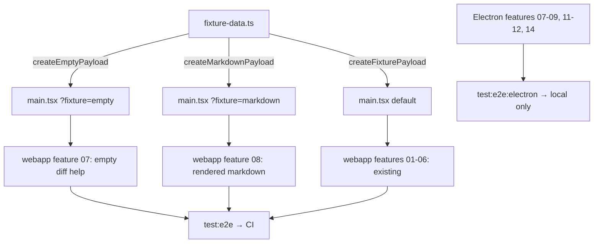
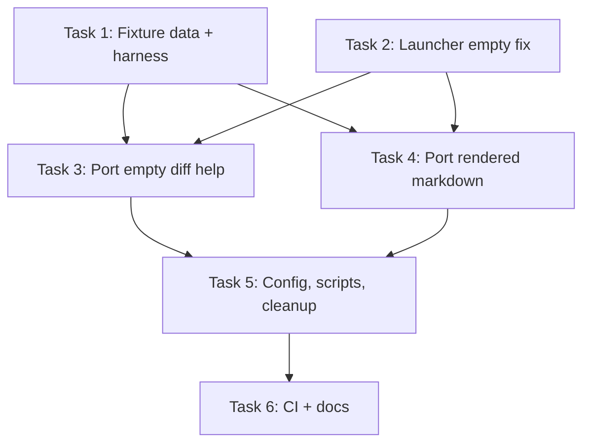

# Plan: Consolidate E2E Tests — Webapp as Primary, Electron as Supplementary

## Original Work Order

> Make webapp e2e the primary suite running in CI, port easily-portable features (10, 13) to the webapp suite, keep Electron-only tests as a separate `test:e2e:electron` command (not in CI), remove duplicate Electron features 01-06, and add e2e to the CI pipeline.

## Executive Summary

The project has two overlapping e2e suites: Electron (14 features, flaky in CI, requires packaging + xvfb) and webapp (6 features, lightweight Vite + Chromium). Features 01-06 are duplicated across both. This plan promotes the webapp suite to primary (`test:e2e`), ports features 10 (empty diff help) and 13 (rendered markdown) from Electron to webapp, removes duplicated Electron features, renames Playwright projects, and adds the webapp e2e job to CI.

Feature 14 (find-in-page) stays Electron-only because `FindBar.tsx` lives in `src/renderer/components/`, not in the `@self-review/react` package.

## Context

### Current State vs Target State

| Aspect | Current State | Target State | Why? |
|--------|--------------|--------------|------|
| Primary e2e suite | Electron (14 features) | Webapp (8 features) | Webapp tests are fast, reliable, CI-compatible |
| CI e2e coverage | None (disabled as "too flaky") | Webapp e2e runs in CI | Automated regression coverage on every PR |
| `test:e2e` script | Packages Electron + xvfb | Runs webapp tests via Vite | Fast, no packaging needed |
| Electron tests | All 14 features | 6 features (07-09, 11-12, 14) | Only Electron-specific behavior needs Electron |
| Features 10, 13 | Electron-only | Ported to webapp | UI-only tests that don't need Electron |
| Playwright project names | `e2e` = Electron, `webapp` = webapp | `e2e` = webapp, `electron` = Electron | Primary suite gets the primary name |

### Background

The webapp test harness (`tests/webapp/`) mocks the `ReviewAdapter` with static fixture data. It supports URL params (`?categories=`, `?theme=`, `?view=`) to control behavior. The `launchWebapp()` helper in `tests/webapp-steps/app.ts` starts Vite on port 5199 and navigates Playwright to the correct URL.

Key constraint: `launchWebapp()` currently waits for `[data-testid^="file-entry-"]` to appear (line 146 of `app.ts`), which will timeout on an empty diff. This must be fixed for feature 07.

## Architectural Approach



### 1. Fixture Data Extensions (`tests/webapp/fixture-data.ts`)

**`createEmptyPayload(gitDiffArgs?: string)`** — Returns `{ files: [], source: { type: 'git', gitDiffArgs, repository: '/mock-test-repo' } }`. This triggers the empty diff help message in the UI.

**`createMarkdownPayload()`** — Returns 3 files:
- `docs/new-docs.md` — `changeType: 'added'`, content with heading, multi-line paragraph, list, code block, and mermaid block. This triggers the "Rendered" toggle.
- `src/index.ts` — `changeType: 'added'`, TypeScript content. No rendered toggle.
- `README.md` — `changeType: 'modified'`, simple change. No rendered toggle (modified `.md` files don't get the toggle).

The markdown file needs content that produces a multi-line rendered block (paragraph spanning lines 3-4) for the gutter line-range test, and a mermaid block for SVG rendering.

### 2. Webapp Test Harness Updates (`tests/webapp/main.tsx`)

Add `?fixture=` URL param routing:

```
?fixture=empty       → createEmptyPayload(gitDiffArgs)
?fixture=markdown    → createMarkdownPayload()
(default)            → createFixturePayload()
```

Also add `?gitDiffArgs=` param forwarded to `createEmptyPayload()` for the "arguments shown" scenario.

The adapter's `loadDiff` calls the selected factory function.

### 3. Webapp Launcher Fix (`tests/webapp-steps/app.ts`)

`launchWebapp()` must handle the empty fixture case. When `queryParams.fixture === 'empty'`, wait for `[data-testid="empty-diff-help"]` instead of `[data-testid^="file-entry-"]`.

### 4. New Webapp Feature Files

**`tests/webapp-features/07-empty-diff-help.feature`** — Port 5 of 6 scenarios from Electron feature 10:

| Electron Scenario | Port? | Reason |
|---|---|---|
| Help message displayed | Yes | Pure UI assertion |
| Common usage examples | Yes | Pure UI assertion |
| Arguments shown | Yes | Via `?gitDiffArgs=` param |
| Not displayed when files exist | Yes | Default fixture |
| File tree empty state | Yes | Pure UI assertion |
| Valid XML on close | **No** | Requires file I/O + process exit code |

**`tests/webapp-features/08-rendered-markdown.feature`** — Port all 8 scenarios from Electron feature 13:

| Scenario | Notes |
|---|---|
| New .md shows rendered toggle | `docs/new-docs.md` is added |
| Non-.md no toggle | `src/index.ts` |
| Modified .md no toggle | `README.md` is modified |
| Toggle switches view | Click toggle, check `.rendered-markdown-view` |
| Gutter line ranges | Multi-line paragraph → "3-4" |
| Comment on rendered block | Gutter mousedown → comment input |
| Comments persist across toggle | Add comment → switch to raw → verify |
| Mermaid SVG | Check `.rendered-markdown-view svg` (10s timeout) |

### 5. New Webapp Step Files

**`tests/webapp-steps/07-empty-diff-help.steps.ts`** — Given steps call `launchWebapp({ fixture: 'empty' })`. Then steps are identical to Electron's (same `data-testid` selectors: `empty-diff-help`, `file-tree`, `file-section-*`).

**`tests/webapp-steps/08-rendered-markdown.steps.ts`** — Given steps call `launchWebapp({ fixture: 'markdown' })`. When/Then steps are identical to Electron's (same selectors: `file-header-*`, `.rendered-markdown-view`, `.rendered-gutter`, `.rendered-block`).

### 6. Playwright Config (`playwright.config.ts`)

Rename projects:
- `"e2e"` → `"electron"` (Electron tests, features dir)
- `"webapp"` → `"e2e"` (webapp tests, webapp-features dir)

Set explicit `outputDir` for both BDD configs to avoid conflicts.

### 7. Package Scripts (`package.json`)

| Script | Command |
|---|---|
| `test:e2e` | `npx bddgen && npx playwright test --project e2e` |
| `test:e2e:headed` | `npx bddgen && npx playwright test --project e2e --headed` |
| `test:e2e:electron` | `npm run package && npx bddgen && xvfb-run --auto-servernum npx playwright test --project electron` |
| `test:e2e:electron:headed` | `npm run package && npx bddgen && npx playwright test --project electron --headed` |

Remove `test:e2e:webapp` (merged into `test:e2e`).

### 8. Electron Feature Cleanup

**Delete** (duplicated by webapp 01-06):
- `tests/features/01-*.feature` through `tests/features/06-*.feature`
- `tests/steps/01-*.steps.ts` through `tests/steps/06-*.steps.ts`

**Delete** (ported to webapp 07-08):
- `tests/features/10-empty-diff-help.feature` + `tests/steps/10-empty-diff-help.steps.ts`
- `tests/features/13-rendered-markdown.feature` + `tests/steps/13-rendered-markdown.steps.ts`

No shared step imports exist between these files and the remaining Electron steps (verified).

**Remaining Electron features**: 07 (xml-output), 08 (resume), 09 (error-handling), 11 (welcome-screen), 12 (expand-context), 14 (find-in-page).

### 9. CI Workflow (`.github/workflows/ci.yml`)

Add `e2e` job:
- `npm ci` → `npx playwright install --with-deps chromium` → `npm run test:e2e`
- Upload `test-results/` on failure
- No packaging, no xvfb needed
- Update header comment to remove "E2E tests are disabled" note

### 10. Documentation (`AGENTS.md`)

Update the E2E Tests section to document the two-tier approach:
- `npm run test:e2e` — webapp e2e (CI)
- `npm run test:e2e:electron` — Electron e2e (local only)
- Remove `test:e2e:webapp` references

## Risk Considerations and Mitigation Strategies

<details>
<summary>Technical Risks</summary>

- **`launchWebapp()` timeout on empty diff**: The function waits for file-entry elements. Empty fixture has none → 15s hang then failure.
  - **Mitigation**: Conditional wait based on `queryParams.fixture`. Check for `empty-diff-help` testid when fixture is `empty`.

- **Mermaid async rendering**: Mermaid initialization is slow and async. May flake in CI.
  - **Mitigation**: Use 10-second timeout (matching Electron step). Mermaid is bundled via `@self-review/react`, no CDN dependency.

- **Step definition duplication**: Webapp steps 07-08 duplicate Then-step logic from Electron steps.
  - **Mitigation**: This is inherent to `playwright-bdd` scoping — each project needs its own step files. The assertions are identical because they target the same React components.
</details>

<details>
<summary>Implementation Risks</summary>

- **Markdown fixture line numbers**: The gutter line-range test expects specific ranges (e.g., "3-4"). If the fixture markdown content structure doesn't match, the test will fail.
  - **Mitigation**: Design the markdown content so the multi-line paragraph starts at line 3 and ends at line 4 (matching the original Electron test's "3-4" expectation).

- **`defineBddConfig` output directory conflicts**: Renaming projects may cause stale generated files.
  - **Mitigation**: Set explicit `outputDir` for both BDD configs. Run `npx bddgen` to regenerate.
</details>

## Success Criteria

1. `npm run test:e2e` runs 8 webapp features (01-08) and all pass
2. `npx bddgen` generates test files for both projects without errors
3. CI `e2e` job passes on a PR to main
4. Electron features 01-06, 10, 13 are deleted; remaining 6 Electron features (07-09, 11-12, 14) still pass locally with `test:e2e:electron`
5. No `test:e2e:webapp` script remains

## Documentation

- **AGENTS.md**: Update E2E Tests section, Running tests section, remove `test:e2e:webapp` references
- **CI header comment**: Remove "E2E tests are disabled because they are too flaky" note

## Resource Requirements

### Development Skills
- Playwright BDD (`playwright-bdd`) configuration
- React component test selectors (`data-testid`)
- Vite dev server for testing

### Technical Infrastructure
- GitHub Actions (ubuntu-latest runner with Chromium)
- Vite dev server (port 5199)
- Playwright with `playwright-bdd`

## Files to Modify

| File | Action |
|------|--------|
| `tests/webapp/fixture-data.ts` | Edit — add `createEmptyPayload()`, `createMarkdownPayload()` |
| `tests/webapp/main.tsx` | Edit — add `?fixture=` and `?gitDiffArgs=` URL param routing |
| `tests/webapp-steps/app.ts` | Edit — conditional wait in `launchWebapp()` for empty fixture |
| `tests/webapp-features/07-empty-diff-help.feature` | Create |
| `tests/webapp-steps/07-empty-diff-help.steps.ts` | Create |
| `tests/webapp-features/08-rendered-markdown.feature` | Create |
| `tests/webapp-steps/08-rendered-markdown.steps.ts` | Create |
| `playwright.config.ts` | Edit — rename projects |
| `package.json` | Edit — update npm scripts |
| `.github/workflows/ci.yml` | Edit — add e2e job |
| `AGENTS.md` | Edit — update test docs |
| `tests/features/01-06, 10, 13` (8 feature files) | Delete |
| `tests/steps/01-06, 10, 13` (8 step files) | Delete |

## Dependency Diagram



## Execution Blueprint

**Validation Gates:**
- Reference: `/config/hooks/POST_PHASE.md`

### ✅ Phase 1: Foundation — Test Infrastructure
**Parallel Tasks:**
- ✔️ Task 1: Fixture data extensions and webapp harness updates
- ✔️ Task 2: Webapp launcher fix for empty fixture

### ✅ Phase 2: Feature Porting
**Parallel Tasks:**
- ✔️ Task 3: Port feature 10 (empty diff help) to webapp suite (depends on: 1, 2)
- ✔️ Task 4: Port feature 13 (rendered markdown) to webapp suite (depends on: 1, 2)

### ✅ Phase 3: Configuration, Cleanup, CI, and Documentation
**Parallel Tasks:**
- ✔️ Task 5: Playwright config rename, package scripts, Electron cleanup (depends on: 3, 4)
- ✔️ Task 6: CI workflow and documentation updates (depends on: 5)

### Post-phase Actions

### Blueprint Summary
- Total Phases: 3
- Total Tasks: 6
- Maximum Parallelism: 2 tasks (in Phases 1, 2, 3)
- Critical Path Length: 3 phases

## Execution Summary

**Status**: ✅ Completed Successfully
**Completed Date**: 2026-03-05

### Results
- Webapp e2e suite promoted to primary (`test:e2e`) with 8 features (01-08)
- Electron e2e suite demoted to supplementary (`test:e2e:electron`) with 6 features (07-09, 11-12, 14)
- Features 10 (empty diff help) and 13 (rendered markdown) ported to webapp with fixture-based data
- 16 duplicated Electron test files deleted (features 01-06, 10, 13 + their step files)
- Shared Electron step definitions extracted to `tests/steps/shared.steps.ts`
- CI `e2e` job added to `.github/workflows/ci.yml`
- `bddgen` generates successfully for both projects
- All lint and unit tests pass

### Noteworthy Events
- Deleting Electron features 01-06 removed shared Background step definitions used by remaining features (07-09, 11-12, 14). Created `tests/steps/shared.steps.ts` to extract the shared steps (Given/When/Then for repo setup, app launch, common UI actions, and common assertions).

### Recommendations
- Run `npm run test:e2e` on a host machine (not dev container) to verify the webapp e2e suite passes end-to-end before merging
- Run `npm run test:e2e:electron` locally to verify the remaining Electron features still work with the shared steps extraction
