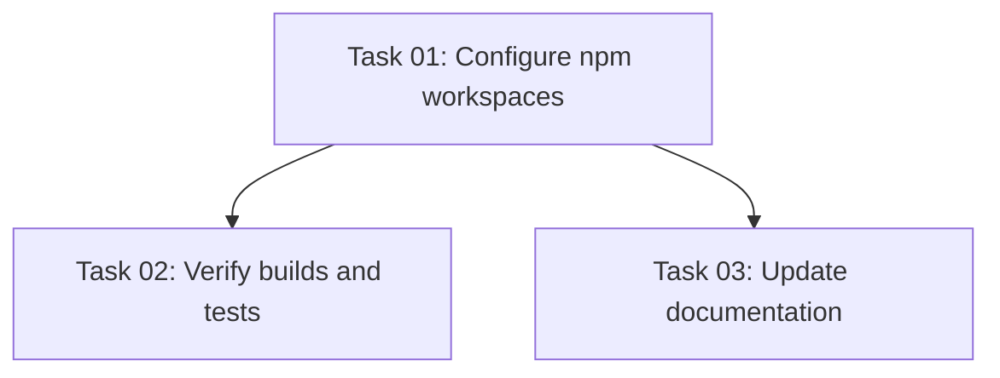

# Plan: Set Up npm Workspaces for Monorepo

## Original Work Order
> Set up workspaces for the monorepo

## Plan Clarifications

| Question | Answer |
|----------|--------|
| Which package manager? | npm (already in use, pnpm not installed) |
| Should the Electron app import via workspace packages? | No — keep relative imports from `src/main/` to `packages/*/src/`. Packages exist for external consumers, not the host Electron app. |

## Executive Summary

The current branch (`claude/extract-review-tool-package-CEklY`) extracted `@self-review/core` and `@self-review/react` into `packages/`, but left the workspace configuration incomplete: a `pnpm-workspace.yaml` exists, `workspace:*` protocol is used in `@self-review/react`, but pnpm is not installed and the project uses npm with `package-lock.json`. The `@self-review/*` packages are not present in `node_modules`.

This plan replaces the pnpm workspace config with npm's native `"workspaces"` field, adjusts the `workspace:*` protocol reference, and verifies the setup works end-to-end. The Electron app continues using relative path imports to package source — workspaces only manage the package-to-package dependency (`@self-review/react` → `@self-review/core`).

## Context

### Current State vs Target State

| Current State | Target State | Why? |
|---|---|---|
| `pnpm-workspace.yaml` declares packages but pnpm is not installed | `"workspaces"` field in root `package.json` | npm is the project's package manager; pnpm config is dead weight |
| `@self-review/react` uses `"@self-review/core": "workspace:*"` | Uses `"*"` or `"file:../core"` (npm-compatible) | `workspace:*` is pnpm/yarn-only protocol; npm doesn't support it |
| `@self-review/*` not in `node_modules` | Symlinked in `node_modules/@self-review/` after `npm install` | Required for `@self-review/react` to resolve `@self-review/core` at build time |
| `package-lock.json` doesn't reference workspace packages | Lock file includes workspace package resolution | Ensures reproducible installs |

### Background

npm has supported workspaces natively since v7. The `"workspaces"` field in root `package.json` tells npm to:
1. Symlink workspace packages into root `node_modules`
2. Hoist shared dependencies
3. Allow cross-package references

The `workspace:*` version protocol is specific to pnpm and yarn. npm uses standard semver ranges or `"*"` for workspace dependencies — npm resolves them to the local package via the symlink.

## Architectural Approach

```mermaid
graph TD
    A[Root package.json] -->|workspaces: packages/*| B[npm install]
    B --> C[node_modules/@self-review/core → packages/core]
    B --> D[node_modules/@self-review/react → packages/react]
    D -->|depends on @self-review/core| C

    E[Electron app src/main/] -->|relative imports| F[packages/core/src/]
    E -->|relative imports| G[packages/react/src/]

    H[External consumers] -->|npm install @self-review/react| D
```

### Root package.json Configuration
**Objective**: Declare workspace packages so npm manages them as part of the monorepo.

Add the `"workspaces"` field pointing to `"packages/*"`. Remove `pnpm-workspace.yaml` since it serves no purpose without pnpm.

### Dependency Protocol Fix
**Objective**: Replace pnpm-specific `workspace:*` with npm-compatible version reference.

In `packages/react/package.json`, change `"@self-review/core": "workspace:*"` to `"@self-review/core": "*"`. npm will resolve `*` to the local symlink because the workspace package satisfies any version range.

### Lock File Regeneration
**Objective**: Ensure `package-lock.json` reflects the workspace topology.

Run `npm install` to regenerate the lock file with workspace package entries. Verify that `node_modules/@self-review/core` and `node_modules/@self-review/react` are symlinks to their respective `packages/` directories.

### Verification
**Objective**: Confirm the workspace setup works for the actual use case — building packages.

Verify that `@self-review/react` can build (via `tsup`) and correctly resolves `@self-review/core`. Run existing unit tests for both packages.

## Risk Considerations and Mitigation Strategies

<details>
<summary>Technical Risks</summary>

- **Electron Forge webpack resolution**: Adding workspaces changes `node_modules` structure (hoisting). Webpack might resolve modules differently.
    - **Mitigation**: Run `npm start` (electron-forge start) after setup to verify the Electron app still boots.
- **npm workspace hoisting conflicts**: Shared deps at different versions could cause resolution issues.
    - **Mitigation**: Both packages share the same versions for common deps (typescript ~5.9.0, vitest ^4.0.18). Low risk.
</details>

<details>
<summary>Implementation Risks</summary>

- **Lock file churn**: Regenerating `package-lock.json` will produce a large diff.
    - **Mitigation**: This is expected and unavoidable. The lock file must reflect the new workspace topology.
- **CI compatibility**: If CI runs `npm ci`, the regenerated lock file must be committed.
    - **Mitigation**: Commit the updated lock file as part of this change.
</details>

## Success Criteria

### Primary Success Criteria
1. `npm install` from root creates symlinks at `node_modules/@self-review/core` and `node_modules/@self-review/react`
2. `npm run build --workspace=packages/core` and `npm run build --workspace=packages/react` succeed
3. `npm run test:unit` (root) passes — existing Electron app tests unaffected
4. `pnpm-workspace.yaml` is removed; no pnpm-specific configuration remains

## Documentation

- Update AGENTS.md to mention the npm workspaces setup under Project Structure (add a brief note about the monorepo layout)

## Resource Requirements

### Development Skills
- npm workspaces configuration
- Understanding of Node.js module resolution and symlinks

### Technical Infrastructure
- npm >= 7 (currently npm 10.9.4 — satisfies requirement)

## Notes

- The `tests/webapp/vite.config.ts` uses a path alias (`@self-review/core` → `../../packages/core/src`) for dev-time source access. This alias is independent of npm workspaces and should continue to work unchanged.
- The Electron app's relative imports (`../../packages/core/src/config`) bypass the workspace symlinks entirely. This is intentional — it avoids requiring a build step during development.

## Dependency Diagram



## Execution Blueprint

**Validation Gates:**
- Reference: `/config/hooks/POST_PHASE.md`

### ✅ Phase 1: Workspace Configuration
**Parallel Tasks:**
- ✔️ Task 01: Configure npm workspaces and fix dependency protocol

### ✅ Phase 2: Verification and Documentation
**Parallel Tasks:**
- ✔️ Task 02: Verify builds and tests (depends on: 01)
- ✔️ Task 03: Update documentation (depends on: 01)

### Post-phase Actions

### Execution Summary
- Total Phases: 2
- Total Tasks: 3
- Maximum Parallelism: 2 tasks (in Phase 2)
- Critical Path Length: 2 phases

## Execution Summary

**Status**: ✅ Completed Successfully
**Completed Date**: 2026-03-05

### Results
- Replaced pnpm workspace configuration with npm-native `"workspaces"` field in root `package.json`
- Fixed `workspace:*` protocol to npm-compatible `"*"` in `packages/react/package.json`
- Removed dead `pnpm-workspace.yaml`
- Regenerated `package-lock.json` with workspace topology
- Verified symlinks at `node_modules/@self-review/core` and `node_modules/@self-review/react`
- Both workspace packages build successfully (`tsup`)
- All 100 unit tests pass (36 main + 64 renderer)
- Updated AGENTS.md with npm workspaces documentation

### Noteworthy Events
- The `packages/core` build emits a warning about `"types"` condition ordering in its `exports` field — this is a pre-existing issue, not introduced by this change.
- Lock file diff is large (~350 lines) due to workspace topology being added — this is expected and unavoidable.

### Recommendations
- Consider fixing the `packages/core/package.json` exports field to place `"types"` before `"import"` and `"require"` to resolve the tsup/esbuild warning.
