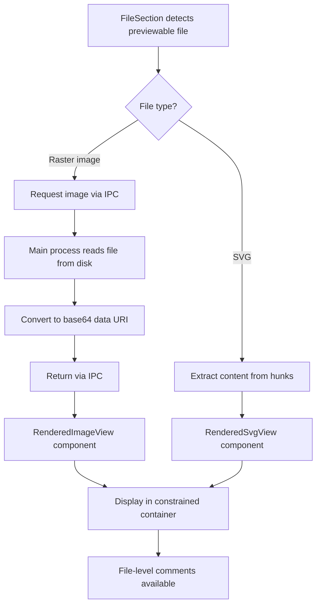
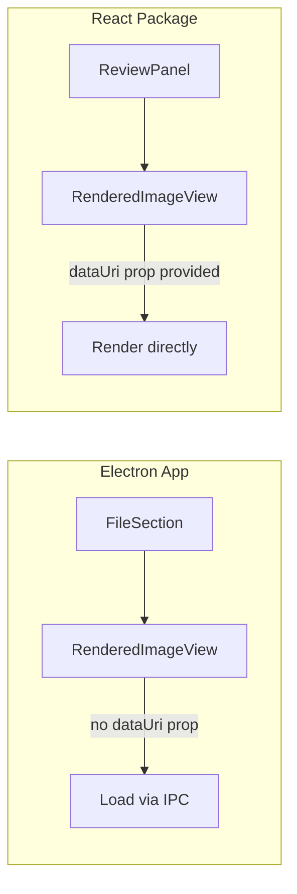
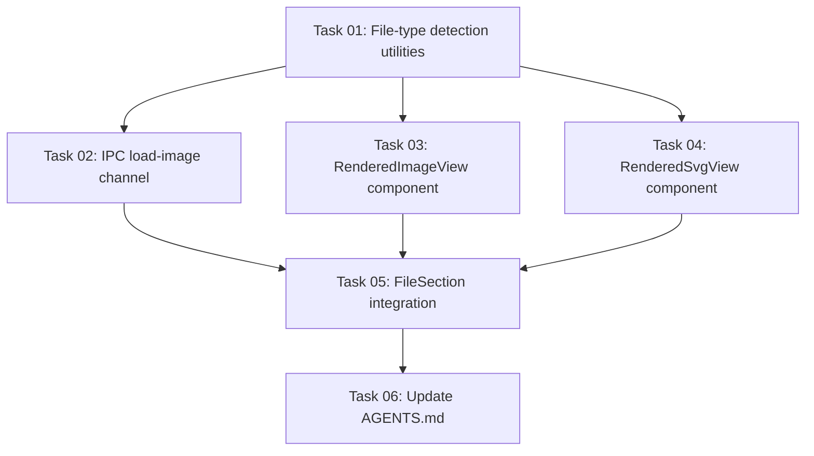

# Plan: Rendered File Previews for Images and SVGs

## Original Work Order

> I want to have the ability to preview some types of files that are nowadays shown as un-previewable because they are binary. I am thinking about images, JPG, JPG, etc. I'd like to be able to have a rendered version like we do with Markdown files. Just like with Markdown files, we will only support this if the files are completely new. Additionally, I want to give this rendered view for SVGs as well, even though they are not binary. What other previews would be interesting?

## Plan Clarifications

| Question | Answer |
|----------|--------|
| Image sizing | Natural size with max-width/max-height constraints to fit the panel |
| SVG display mode | Raw/Rendered toggle in file header (same UX pattern as Markdown) |
| Additional formats beyond images + SVG | None — keep scope to raster images and SVG only |
| Image content source | Read from working tree (filesystem) — simpler, only for files on disk |
| Directory mode support | Yes — preview works in both git-diff and directory-scan modes |
| Comments on previews | File-level comments only (no line-level) |

## Executive Summary

Currently, binary files (images, etc.) display a static "Binary file — no diff available" message, and SVG files show raw XML diffs. This plan adds rendered previews for newly added image files and SVGs, following the same pattern already established for Markdown files: a Raw/Rendered toggle in the file header, restricted to `changeType === 'added'` only.

For raster images (JPG, PNG, GIF, WebP, ICO, BMP), the main process reads the file from disk, converts it to a base64 data URI, and sends it to the renderer via IPC. The renderer displays the image in a constrained container. For SVGs, the existing text diff is preserved as the "Raw" view, and a new "Rendered" view renders the SVG content inline. File-level comments remain available on both views.

## Context

### Current State vs Target State

| Current State | Target State | Why? |
|---------------|-------------|------|
| Binary image files show "Binary file — no diff available" | New binary images show a rendered preview of the image | Reviewing AI-generated code often includes new assets; seeing the actual image aids review |
| SVG files show raw XML diff | New SVG files have a Raw/Rendered toggle showing the graphic | SVGs are visual assets; rendered view is far more useful than reading XML paths |
| No mechanism to load file content for binary files | IPC channel delivers base64 image data for preview | Required infrastructure to transport binary content to the renderer |
| Only Markdown files have the Raw/Rendered toggle | Images and SVGs also get the toggle (images default to rendered) | Consistent UX pattern for all previewable file types |

### Background

The Markdown rendered view (`RenderedMarkdownView.tsx`) is the established pattern. It works by:
1. Detecting eligibility: `changeType === 'added'` and `.md`/`.markdown` extension
2. Extracting content from diff addition lines
3. Rendering via `react-markdown` with a line-mapped gutter for comments
4. Toggling between Raw/Rendered via a `ToggleGroup` in `FileSection.tsx`

For images, the approach differs because:
- Binary files have no hunks/lines — content must be loaded separately
- Raster images need base64 encoding to display in Electron's renderer
- SVGs are text files with hunks, so content extraction follows the Markdown pattern
- No line-level comments are possible on images (file-level only)

The app runs with `nodeIntegration: false`, so all file reads must go through IPC via the preload bridge.

## Architectural Approach

### Previewable File Detection

**Objective**: Determine which files are eligible for rendered preview, using the same eligibility pattern as Markdown.

A file is eligible for rendered preview when:
- `changeType === 'added'` (newly added files only — same constraint as Markdown)
- File extension matches a known previewable format

Two categories of previewable files:
1. **Raster images**: `.jpg`, `.jpeg`, `.png`, `.gif`, `.webp`, `.ico`, `.bmp` — these are binary (`isBinary: true`)
2. **SVG**: `.svg` — this is a text file (`isBinary: false`) with hunks available

The detection logic should be a shared utility (e.g., `isPreviewableImage(path)` and `isPreviewableSvg(path)`) to avoid duplicating extension checks across components. These utilities belong in `@self-review/core` alongside the existing types since they represent file-type classification logic.

### Image Content Loading (IPC)

**Objective**: Transport binary image data from the main process to the renderer for display.

New IPC channel: `diff:load-image`
- **Direction**: Renderer → Main → Renderer (request/response)
- **Request payload**: `{ filePath: string }` — the file path to load
- **Response payload**: `{ dataUri: string }` — the base64-encoded data URI (e.g., `data:image/png;base64,...`)
- **Error handling**: If file doesn't exist on disk, return an error message to display in the UI

Main process handler:
- Reads the file from disk using `fs.readFile`
- Determines MIME type from extension (simple mapping, no dependency needed)
- Encodes as base64 data URI
- Returns to renderer

For directory mode: the file path is already absolute and on disk, so the same handler works.

For git mode: since we only support `changeType === 'added'` and reading from the working tree, the file path is relative to the repo root. The handler resolves it against the working directory.

### Rendered Image View Component

**Objective**: Display a raster image preview with file-level comment support.

New component: `RenderedImageView.tsx` in `src/renderer/components/DiffViewer/`

Behavior:
- On mount, calls the `diff:load-image` IPC channel to fetch the base64 data URI
- Shows a loading spinner while fetching
- Displays the image in an `` tag with `max-width: 100%` and `max-height: 80vh` constraints
- Centers the image in the container
- Shows image natural dimensions as metadata (e.g., "1920 × 1080")
- On error (file not found), shows a graceful error message

This component does NOT handle comments — file-level comments are rendered by the existing `FileSection` comment logic that already sits above the content area.

### Rendered SVG View Component

**Objective**: Display an SVG rendered as a graphic, extracted from diff hunks.

New component: `RenderedSvgView.tsx` in `src/renderer/components/DiffViewer/`

Behavior:
- Extracts SVG content from addition lines in hunks (same technique as `RenderedMarkdownView` uses for Markdown)
- Renders the SVG using `dangerouslySetInnerHTML` inside a sandboxed container, or preferably by converting to a data URI and displaying via `` tag (safer — prevents script execution in SVGs)
- Same size constraints as raster images: `max-width: 100%`, `max-height: 80vh`
- Centers in the container

**Security consideration**: SVGs can contain `<script>` tags and event handlers. Rendering via `` is the safest approach as browsers block script execution in `` tags.

### FileSection Integration

**Objective**: Wire the new preview components into the existing rendering pipeline.

Changes to `FileSection.tsx`:
1. Add eligibility checks using the shared utilities: `isPreviewableImage(path)` and `isPreviewableSvg(path)`
2. For **raster images** (`isBinary && isPreviewableImage`):
   - Replace the "Binary file — no diff available" message with `RenderedImageView`
   - Add Raw/Rendered toggle in file header (default to "Rendered")
   - Raw view shows the existing "Binary file — no diff available" message
3. For **SVGs** (`isPreviewableSvg`):
   - Add Raw/Rendered toggle in file header (same as Markdown, default to "Raw")
   - Rendered view shows `RenderedSvgView`
   - Raw view shows the existing unified/split diff

The existing `markdownViewMode` state and toggle can be generalized to `renderViewMode` to cover all three previewable types (Markdown, images, SVGs). The toggle UI in the file header is already extracted — it just needs the eligibility condition broadened.

### Preload Bridge Extension

**Objective**: Expose the new IPC channel to the renderer.

Add to `preload.ts`:
- `loadImage(filePath: string): Promise<{ dataUri: string } | { error: string }>` method on the `electronAPI` object

Add the channel constant to `ipc-channels.ts`.

### `@self-review/react` Package Updates

**Objective**: Ensure the embeddable React package also supports rendered previews.

The `@self-review/react` package exposes review UI components. The new preview components should work there too. Since `@self-review/react` receives data rather than using IPC, the image loading mechanism needs to differ:
- For the React package, image content should be passed as props (data URI or URL)
- The IPC-based loading is Electron-specific; the React package should accept pre-loaded content

This means `RenderedImageView` should accept an optional `dataUri` prop. When provided, it skips IPC loading. When absent (Electron context), it loads via IPC.

## Risk Considerations and Mitigation Strategies

Technical Risks

- **Large image files causing memory pressure**: A high-resolution image encoded as base64 is ~33% larger than the binary. For very large images (e.g., 50MB PSD-exported PNGs), this could cause performance issues.
    - **Mitigation**: Add a file size check before loading (e.g., 10MB limit). Show a warning with option to load anyway for files exceeding the threshold.
- **SVG security (script injection)**: Malicious SVGs could contain JavaScript.
    - **Mitigation**: Render SVGs via `` tag with data URI, which blocks all script execution. Never use `dangerouslySetInnerHTML` for SVG content.

Implementation Risks

- **File not on disk**: If reviewing a historical diff range, the file may not exist in the working tree.
    - **Mitigation**: Show a clear message: "Image preview unavailable — file not found on disk." The user chose working-tree-only loading, accepting this limitation.
- **Directory mode path resolution**: Directory mode uses absolute paths while git mode uses relative paths.
    - **Mitigation**: The IPC handler should handle both cases — check if path is absolute, otherwise resolve against CWD.

## Success Criteria

### Primary Success Criteria
1. Newly added raster image files (JPG, PNG, GIF, WebP, ICO, BMP) display a rendered preview instead of "Binary file — no diff available"
2. Newly added SVG files have a Raw/Rendered toggle showing the SVG graphic in rendered mode
3. File-level comments can be added on both image and SVG previews
4. Preview works in both git-diff mode and directory-scan mode
5. The Raw/Rendered toggle follows the same UX pattern as Markdown files

## Documentation

- Update `AGENTS.md` to document the new preview capabilities, supported file formats, and the new IPC channel (`diff:load-image`)
- Update the IPC Channels table in `AGENTS.md` with the new channel
- No PRD.md update needed — this is a natural extension of the existing rendered view feature

## Resource Requirements

### Development Skills
- Electron IPC patterns (main ↔ renderer communication)
- React component development with TypeScript
- Understanding of base64 encoding and MIME types
- Security awareness for SVG rendering

### Technical Infrastructure
- No new dependencies required
- `fs.readFile` for binary file loading (Node.js built-in)
- Base64 encoding via `Buffer.from().toString('base64')` (Node.js built-in)

## Notes

- The "only new files" constraint (`changeType === 'added'`) is intentional and matches the Markdown precedent. Modified images would require side-by-side comparison which is out of scope.
- ICO files may contain multiple sizes; the `` tag will render the largest available — no special handling needed.
- Animated GIFs will animate naturally in the `` tag.
- The working-tree-only approach was a deliberate scope choice. Git-blob-based loading can be added later if needed for historical diff review.

---

## Execution Blueprint

### Dependency Diagram

### Phase 1: Foundation
**Parallel Tasks:**
- Task 01: File-type detection utilities (no dependencies)

### Phase 2: IPC Infrastructure + SVG Component
**Parallel Tasks:**
- Task 02: IPC load-image channel (depends on: 01)
- Task 04: RenderedSvgView component (depends on: 01)

### Phase 3: Image Component
**Parallel Tasks:**
- Task 03: RenderedImageView component (depends on: 01, 02)

### Phase 4: FileSection Integration
**Parallel Tasks:**
- Task 05: FileSection integration (depends on: 02, 03, 04)

### Phase 5: Documentation
**Parallel Tasks:**
- Task 06: Update AGENTS.md (depends on: 05)

### Execution Summary
- Total Phases: 5
- Total Tasks: 6
- Maximum Parallelism: 2 tasks (Phase 2)
- Critical Path Length: 5 phases

---

**Note**: Manually archived on 2026-03-11
