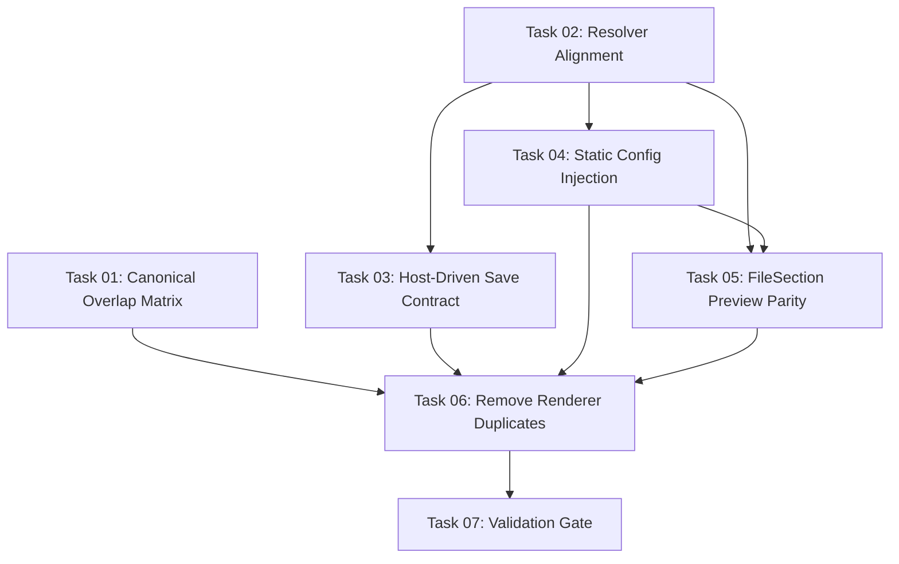

# Plan: Renderer Component Deduplication (Issue #51)

## Original Work Order
> Fix [issue #51](https://github.com/e0ipso/self-review/issues/51) by removing renderer/package component duplication so shared UI logic has one canonical implementation.

## Plan Clarifications

| Question | Answer |
|---|---|
| Which save lifecycle should be used after deduplication? | Use a **host-driven** save flow: renderer pushes final review state on save. |
| If main-driven save were kept, where should `review:request` live? | **Not applicable** (host-driven chosen). |
| Who owns config IPC after deduplication? | Use **static initial config only** for package providers; keep runtime config IPC concerns out of package contexts. |
| Is image/SVG preview migration to `packages/react` in scope? | **Yes, in scope now** to eliminate `FileSection` divergence. |
| Minimum test gate before deleting renderer duplicates? | Run **root unit tests + `@self-review/react` unit tests**. |
| Should docs/tests update decisions be explicit even when no changes are needed? | **Yes** - record explicit yes/no with rationale. |
| Type import strategy during migration? | Use **direct `@self-review/core` imports** where possible. |

## Executive Summary

The renderer currently duplicates a large set of components, hooks, and utilities that also exist in `packages/react/src/`. This plan consolidates those implementations into a single source of truth by making the Electron renderer consume package source directly, while keeping only Electron-shell responsibilities in `src/renderer/`.

The refinement locks three key architectural decisions to avoid regressions: (1) save is host-driven (renderer submits review state at save time), (2) package contexts receive static initial config and do not own runtime config IPC, and (3) image/SVG rendered preview parity is completed in `packages/react` now so `FileSection` can be fully deduplicated.

This approach reduces dual-maintenance risk, aligns with the existing package-first architecture documented in `AGENTS.md`, and adds explicit validation gates so deduplication does not remove coverage or break Electron-only behavior.

## Context

### Current State vs Target State

| Current State | Target State | Why? |
|---|---|---|
| Renderer and package contain overlapping component/hook implementations | Shared logic lives in `packages/react/src`; renderer keeps only Electron-shell composition and bridge code | Removes double maintenance and bug-fix drift |
| Save flow relies on main requesting state (`review:request`) from renderer | Save flow is host-driven: renderer submits `ReviewState` when user triggers save | Matches selected clarification and simplifies lifecycle boundaries |
| Renderer config is loaded via IPC listeners in local context | Package providers receive static initial config/output path values from renderer shell | Preserves clear platform boundary and avoids package IPC coupling |
| `FileSection` diverges because image/SVG rendered previews are renderer-only | Preview support is implemented in package-side `FileSection` via adapter contracts | Eliminates last substantive shared-component fork |
| Shared files use mixed type import patterns (`../../shared/types`, package imports) | Shared paths normalize to direct `@self-review/core` imports | Aligns type source-of-truth and removes shim-driven divergence |
| Root unit tests do not include package unit tests | Validation explicitly runs root unit tests and package unit tests before cleanup | Prevents coverage loss during duplicate file deletion |

### Background

`AGENTS.md` already establishes the package-first direction: Electron imports workspace package source directly without requiring package build artifacts. `src/main` already follows this with `packages/core`; this plan applies the same principle to renderer-side UI code.

The previous inventory in this plan was approximate and stale. During execution, a canonical matrix must be regenerated before deletion to classify each overlapping file as one of: `identical`, `import-only`, or `behavioral`. That matrix is the authority for cleanup scope.

*Clarification references: save contract, config ownership, preview scope, and type strategy are derived from the Plan Clarifications table.*

## Architectural Approach

```mermaid
graph TD
    subgraph Electron Shell
        A[src/renderer/App.tsx] --> B[Renderer bridge layer]
        B --> C[window.electronAPI]
    end

    subgraph Shared UI Package
        D[packages/react/src/context/*] --> E[packages/react/src/components/*]
        E --> F[@self-review/core types]
    end

    A --> D
```

### Canonical Inventory and Scope Lock

**Objective**: Prevent stale assumptions and scope creep before code movement starts.

Generate a current overlap matrix across renderer/package paths and classify candidates into:
- `identical`: remove renderer copy and import package source
- `import-only`: normalize imports, then remove renderer copy
- `behavioral`: resolve divergence explicitly before deletion

Only files proven by that matrix are in dedup scope; no extra abstractions are added beyond what is required for deduplication.

### Resolver and Tooling Alignment

**Objective**: Ensure package source imports resolve consistently across build, type-checking, and tests.

Add and verify `@self-review/core` resolution where required (webpack, TypeScript path resolution, and relevant Vitest config paths) so package source compiles in renderer context without local shims for shared code.

Type strategy is explicit: shared deduplicated code uses direct `@self-review/core` imports. Renderer-only Electron bridge files may keep local renderer/main shared imports when platform-specific.

### Host-Driven Save Contract

**Objective**: Remove ambiguous lifecycle behavior by standardizing review submission timing.

Adopt host-driven save behavior: when save is triggered, renderer constructs current `ReviewState` and submits it through existing submission IPC (`review:submit`) as part of save handling; deduplication must not depend on `review:request` pull semantics.

Implementation detail boundaries:
- `packages/react` remains platform-agnostic through adapter interfaces.
- Electron-specific orchestration stays in renderer bridge code.
- `review:request` listeners are not required in package contexts under this decision.

### Static Initial Config Ownership

**Objective**: Keep runtime config IPC concerns out of package contexts.

Renderer shell continues owning config IPC interaction (`requestConfig`, `onConfigLoad`, `onOutputPathChanged`) and passes static initial config/output-path values into package providers at mount time. Package contexts manage runtime in-memory state from those initial values and adapter results (for example, output-path changes initiated by package UI actions).

This avoids coupling package context internals to Electron IPC while preserving behavior.

### FileSection Preview Parity in Package

**Objective**: Resolve the last substantive component divergence in scope.

Move image/SVG rendered preview parity into package-side `FileSection` by extending adapter contracts with explicit semantics (including image load success/error handling and SVG extraction contract) so package component behavior matches current Electron UX for supported files and error states.

Renderer-specific preview implementations become package-owned where they are part of shared diff-view behavior.

### Renderer Cleanup and Import Consolidation

**Objective**: Delete duplicate renderer files only after parity and validation gates are met.

After parity and resolver alignment:
1. Remove `identical` renderer duplicates.
2. Remove `import-only` duplicates after import normalization.
3. Remove `behavioral` duplicates once validated parity is complete.

Retain only Electron-shell files (app composition, dialogs/banners/find bar/welcome, and bridge code). Entry references must use current paths (for example `src/renderer.ts`, not obsolete `src/renderer/index.tsx`).

## Risk Considerations and Mitigation Strategies

<details>
<summary>Technical Risks</summary>

- **Save-flow regression from lifecycle change**: Switching to host-driven submission can break close/save behavior if not aligned with main-process expectations.
  - **Mitigation**: Define one authoritative save contract in implementation notes; validate save via manual smoke (`Finish Review`, close-dialog save path) and IPC log assertions.

- **Resolution mismatch across tooling**: Alias/path config may compile in webpack but fail in test/type tooling.
  - **Mitigation**: Update and verify resolution in webpack + TypeScript + Vitest as one checklist item before large file deletions.

- **Preview contract drift**: Package `FileSection` may not preserve Electron image/SVG error behavior.
  - **Mitigation**: Define adapter method semantics explicitly (success/error/result shape) and validate with sample added image/SVG files including oversize/error cases.

</details>

<details>
<summary>Implementation Risks</summary>

- **Deleting duplicates before complete parity**: Early deletion can hide missing behavior.
  - **Mitigation**: Enforce matrix classification and deletion order (`identical` -> `import-only` -> `behavioral`) with validation after each class.

- **Coverage gap during migration**: Root unit scripts omit package tests by default.
  - **Mitigation**: Require both root and package unit test runs before cleanup is considered complete.

</details>

<details>
<summary>Scope Risks</summary>

- **Refactor expansion beyond dedup goals**: It is easy to introduce unrelated abstractions while touching many files.
  - **Mitigation**: Scope lock to dedup + required adapter/resolver/config boundary changes only; defer unrelated enhancements.

</details>

## Success Criteria

### Primary Success Criteria

1. Shared component/hook logic has a single canonical implementation in `packages/react/src` and no renderer duplicate remains for files classified in the overlap matrix.
2. Save lifecycle is host-driven and does not rely on renderer `review:request` listeners for normal save completion.
3. Config ownership is explicit: package providers are initialized from renderer-provided static values, with no package-owned runtime config IPC subscription.
4. Image/SVG rendered preview behavior is available through package-side `FileSection` with parity for supported-file and error states.
5. Validation gate passes: `npm run test:unit` and `npm run --workspace @self-review/react test:unit` both succeed.

## Self Validation

1. Regenerate overlap inventory and confirm each duplicate candidate is classified (`identical`, `import-only`, `behavioral`) before cleanup.
2. Run `npm run test:unit`.
3. Run `npm run --workspace @self-review/react test:unit`.
4. Run `rg "review:request|onRequestReview" src/renderer packages/react/src` and confirm no dependency on pull-based save flow remains in shared deduplicated paths.
5. Run `rg "window\\.electronAPI" packages/react/src` and confirm Electron API calls are not embedded in shared package components.
6. Build the app with `npm run package` to validate bundling and module resolution.
7. Manual smoke on host machine:
   - Open app with a representative diff and verify diff navigation, emoji autocomplete, and toolbar actions.
   - Validate rendered image and SVG previews (including an error scenario such as oversized/invalid image load).
   - Trigger save (`Finish Review` and close-dialog save path) and confirm XML output is written correctly.

## Documentation

- `docs/PRD.md`: **No update required by default** (internal architectural dedup without product-surface change). If execution changes user-visible behavior, add a focused PRD note.
- `tests/features`: **No net-new feature specs required by default**; update only if save lifecycle or preview behavior changes visible workflow semantics.
- `tests/webapp-features`: **No required update by default**; add or adjust scenarios only when shared package behavior changes expected outputs.
- This explicit yes/no documentation stance satisfies post-plan governance and should be re-checked during implementation review.

## Resource Requirements

### Development Skills
- React context/provider migration and adapter boundary design
- Electron IPC lifecycle understanding
- TypeScript module resolution across workspace packages
- Incremental refactor validation and regression testing

### Technical Infrastructure
- Existing Electron Forge + webpack pipeline
- `packages/react/src` adapter/context architecture
- `@self-review/core` type exports and renderer preload bridge
- Vitest configs for root and package test execution

## Integration Strategy

Integrate in small, verifiable slices: resolver alignment first, then lifecycle/config boundary updates, then component deduplication by classification class. Keep renderer app composition stable while migrating internals to package imports.

## Notes

### Decision Log

- Save contract: host-driven submission selected.
- Config ownership: static initial config injection into package providers selected.
- Preview scope: image/SVG parity migration is in scope now.
- Type strategy: direct `@self-review/core` imports for shared deduplicated code.
- Test gate: root + package unit tests required before duplicate-file deletion.

### Change Log

- 2026-03-11: Added clarification table, locked save/config/type decisions, replaced stale inventory assumptions with canonical classification requirement, strengthened validation gates, and documented explicit PRD/tests update expectations.

## Overlap Matrix

*(Populated by Task 01 — canonical classification as of execution)*

### Components — identical (delete renderer copy, update imports to package path)

| File | Renderer Path | Package Path | Classification |
|------|--------------|--------------|----------------|
| CategorySelector.tsx | src/renderer/components/Comments/CategorySelector.tsx | packages/react/src/components/Comments/CategorySelector.tsx | identical |
| EmojiAutocomplete.tsx | src/renderer/components/Comments/EmojiAutocomplete.tsx | packages/react/src/components/Comments/EmojiAutocomplete.tsx | identical |
| DiffViewer.tsx | src/renderer/components/DiffViewer/DiffViewer.tsx | packages/react/src/components/DiffViewer/DiffViewer.tsx | identical |
| EmptyLinePane.tsx | src/renderer/components/DiffViewer/EmptyLinePane.tsx | packages/react/src/components/DiffViewer/EmptyLinePane.tsx | identical |
| ExpandContextBar.tsx | src/renderer/components/DiffViewer/ExpandContextBar.tsx | packages/react/src/components/DiffViewer/ExpandContextBar.tsx | identical |
| HunkHeader.tsx | src/renderer/components/DiffViewer/HunkHeader.tsx | packages/react/src/components/DiffViewer/HunkHeader.tsx | identical |
| MermaidBlock.tsx | src/renderer/components/DiffViewer/MermaidBlock.tsx | packages/react/src/components/DiffViewer/MermaidBlock.tsx | identical |
| HintOverlay.tsx | src/renderer/components/HintOverlay.tsx | packages/react/src/components/HintOverlay.tsx | identical |
| KeyboardNavigationManager.tsx | src/renderer/components/KeyboardNavigationManager.tsx | packages/react/src/components/KeyboardNavigationManager.tsx | identical |
| Layout.tsx | src/renderer/components/Layout.tsx | packages/react/src/components/Layout.tsx | identical |
| ReviewProgress.tsx | src/renderer/components/ReviewProgress.tsx | packages/react/src/components/ReviewProgress.tsx | identical |
| TruncatedPath.tsx | src/renderer/components/TruncatedPath.tsx | packages/react/src/components/TruncatedPath.tsx | identical |
| ui/alert-dialog.tsx | src/renderer/components/ui/alert-dialog.tsx | packages/react/src/components/ui/alert-dialog.tsx | identical |
| ui/badge.tsx | src/renderer/components/ui/badge.tsx | packages/react/src/components/ui/badge.tsx | identical |
| ui/button.tsx | src/renderer/components/ui/button.tsx | packages/react/src/components/ui/button.tsx | identical |
| ui/card.tsx | src/renderer/components/ui/card.tsx | packages/react/src/components/ui/card.tsx | identical |
| ui/checkbox.tsx | src/renderer/components/ui/checkbox.tsx | packages/react/src/components/ui/checkbox.tsx | identical |
| ui/dropdown-menu.tsx | src/renderer/components/ui/dropdown-menu.tsx | packages/react/src/components/ui/dropdown-menu.tsx | identical |
| ui/input.tsx | src/renderer/components/ui/input.tsx | packages/react/src/components/ui/input.tsx | identical |
| ui/resizable.tsx | src/renderer/components/ui/resizable.tsx | packages/react/src/components/ui/resizable.tsx | identical |
| ui/scroll-area.tsx | src/renderer/components/ui/scroll-area.tsx | packages/react/src/components/ui/scroll-area.tsx | identical |
| ui/select.tsx | src/renderer/components/ui/select.tsx | packages/react/src/components/ui/select.tsx | identical |
| ui/separator.tsx | src/renderer/components/ui/separator.tsx | packages/react/src/components/ui/separator.tsx | identical |
| ui/textarea.tsx | src/renderer/components/ui/textarea.tsx | packages/react/src/components/ui/textarea.tsx | identical |
| ui/toggle-group.tsx | src/renderer/components/ui/toggle-group.tsx | packages/react/src/components/ui/toggle-group.tsx | identical |
| ui/tooltip.tsx | src/renderer/components/ui/tooltip.tsx | packages/react/src/components/ui/tooltip.tsx | identical |
| useDiffNavigation.ts | src/renderer/hooks/useDiffNavigation.ts | packages/react/src/hooks/useDiffNavigation.ts | identical |
| useEmojiAutocomplete.ts | src/renderer/hooks/useEmojiAutocomplete.ts | packages/react/src/hooks/useEmojiAutocomplete.ts | identical |
| useKeyboardNavigation.ts | src/renderer/hooks/useKeyboardNavigation.ts | packages/react/src/hooks/useKeyboardNavigation.ts | identical |
| lib/utils.ts | src/renderer/lib/utils.ts | packages/react/src/lib/utils.ts | identical |

### Components — import-only (normalize imports in package copy, delete renderer copy)

| File | Renderer Path | Package Path | Classification | Divergence Notes |
|------|--------------|--------------|----------------|------------------|
| AttachmentThumbnail.tsx | src/renderer/components/Comments/AttachmentThumbnail.tsx | packages/react/src/components/Comments/AttachmentThumbnail.tsx | import-only | `../../../shared/types` → `@self-review/core` |
| CommentInput.tsx | src/renderer/components/Comments/CommentInput.tsx | packages/react/src/components/Comments/CommentInput.tsx | import-only | `../../../shared/types` → `@self-review/core` |
| SuggestionBlock.tsx | src/renderer/components/Comments/SuggestionBlock.tsx | packages/react/src/components/Comments/SuggestionBlock.tsx | import-only | `../../../shared/types` → `@self-review/core` |
| RenderedMarkdownView.tsx | src/renderer/components/DiffViewer/RenderedMarkdownView.tsx | packages/react/src/components/DiffViewer/RenderedMarkdownView.tsx | import-only | `../../../shared/types` → `@self-review/core` |
| SplitView.tsx | src/renderer/components/DiffViewer/SplitView.tsx | packages/react/src/components/DiffViewer/SplitView.tsx | import-only | `../../../shared/types` → `@self-review/core` |
| SyntaxLine.tsx | src/renderer/components/DiffViewer/SyntaxLine.tsx | packages/react/src/components/DiffViewer/SyntaxLine.tsx | import-only | `../../../shared/types` → `@self-review/core` |
| UnifiedView.tsx | src/renderer/components/DiffViewer/UnifiedView.tsx | packages/react/src/components/DiffViewer/UnifiedView.tsx | import-only | `../../../shared/types` → `@self-review/core` |
| diff-utils.ts | src/renderer/components/DiffViewer/diff-utils.ts | packages/react/src/components/DiffViewer/diff-utils.ts | import-only | `../../../shared/types` → `@self-review/core` |
| DiffViewer.test.tsx | src/renderer/components/DiffViewer/DiffViewer.test.tsx | packages/react/src/components/DiffViewer/DiffViewer.test.tsx | import-only | `../../../shared/types` → `@self-review/core` |
| useReviewState.ts | src/renderer/hooks/useReviewState.ts | packages/react/src/hooks/useReviewState.ts | import-only | `../../shared/types` → `@self-review/core` |
| DiffNavigationContext.tsx | src/renderer/context/DiffNavigationContext.tsx | packages/react/src/context/DiffNavigationContext.tsx | import-only | Type assertions added for TypeScript stricter jsdom typing (same runtime behavior) |
| diff-styles.ts | src/renderer/utils/diff-styles.ts | packages/react/src/utils/diff-styles.ts | import-only | `../../shared/types` → `@self-review/core` |
| emoji-data.ts | src/renderer/utils/emoji-data.ts | packages/react/src/utils/emoji-data.ts | import-only | `../../shared/types` → `@self-review/core` |
| remark-emoji.ts | src/renderer/utils/remark-emoji.ts | packages/react/src/utils/remark-emoji.ts | import-only | `../../shared/types` → `@self-review/core` |

### Components — behavioral (divergence resolved by Tasks 03–05, then deleted)

| File | Renderer Path | Package Path | Classification | Divergence Notes |
|------|--------------|--------------|----------------|------------------|
| CommentDisplay.tsx | src/renderer/components/Comments/CommentDisplay.tsx | packages/react/src/components/Comments/CommentDisplay.tsx | behavioral | Renderer uses `window.electronAPI` for attachments; package uses `adapter?.readAttachment` |
| FileSection.tsx | src/renderer/components/DiffViewer/FileSection.tsx | packages/react/src/components/DiffViewer/FileSection.tsx | behavioral | Renderer has image/SVG preview (`RenderedImageView`, `RenderedSvgView`); package lacks them (Task 05 adds parity) |
| RenderedImageView.tsx | src/renderer/components/DiffViewer/RenderedImageView.tsx | (new) packages/react/src/components/DiffViewer/RenderedImageView.tsx | behavioral | Renderer calls `window.electronAPI.loadImage`; package uses adapter (Task 05) |
| RenderedSvgView.tsx | src/renderer/components/DiffViewer/RenderedSvgView.tsx | (new) packages/react/src/components/DiffViewer/RenderedSvgView.tsx | behavioral | Import path only; moved to packages in Task 05 |
| FileTree.tsx | src/renderer/components/FileTree.tsx | packages/react/src/components/FileTree.tsx | behavioral | Renderer uses `window.electronAPI.changeOutputPath()`; package uses `adapter?.changeOutputPath()` |
| Toolbar.tsx | src/renderer/components/Toolbar.tsx | packages/react/src/components/Toolbar.tsx | behavioral | Renderer calls `window.electronAPI.saveAndQuit()`; package uses `onFinishReview` prop (Task 03) |
| ConfigContext.tsx | src/renderer/context/ConfigContext.tsx | packages/react/src/context/ConfigContext.tsx | behavioral | Renderer uses IPC to load config; package accepts `initialConfig`/`initialOutputPath` props (Task 04) |
| ReviewContext.tsx | src/renderer/context/ReviewContext.tsx | packages/react/src/context/ReviewContext.tsx | behavioral | Renderer uses `review:request` pull semantics + IPC; package uses adapter pattern (Task 03) |

### Renderer-only (not in packages/react — keep as-is)

| File | Renderer Path | Notes |
|------|--------------|-------|
| CloseConfirmDialog.tsx | src/renderer/components/CloseConfirmDialog.tsx | Electron-shell: window close dialog |
| FindBar.tsx | src/renderer/components/FindBar.tsx | Electron-shell: Chromium find-in-page |
| WelcomeScreen.tsx | src/renderer/components/WelcomeScreen.tsx | Electron-shell: directory picker welcome |
| UpdateBanner.tsx | src/renderer/components/UpdateBanner.tsx | Electron-shell: version update notification |
| image-utils.ts | src/renderer/utils/image-utils.ts | Renderer-only: image resize for attachment upload |

## Execution Blueprint

**Validation Gates:**
- Reference: `/config/hooks/POST_PHASE.md`

### Phase 1: Preparation (Parallel)
**Parallel Tasks:**
- Task 01: Generate canonical overlap matrix
- Task 02: Resolver alignment for package source imports

### Phase 2: Lifecycle & Config Boundaries (Parallel, depends on Phase 1)
**Parallel Tasks:**
- Task 03: Implement host-driven save contract (depends on: 02)
- Task 04: Static initial config injection into package providers (depends on: 02)

### Phase 3: Preview Parity (depends on Phase 2)
**Parallel Tasks:**
- Task 05: FileSection image/SVG preview parity in packages/react (depends on: 02, 04)

### Phase 4: Deduplication (depends on Phases 1–3)
**Parallel Tasks:**
- Task 06: Remove renderer duplicate files (depends on: 01, 03, 04, 05)

### Phase 5: Validation (depends on Phase 4)
**Parallel Tasks:**
- Task 07: Validation gate (depends on: 06)



### Execution Summary
- Total Phases: 5
- Total Tasks: 7
- Maximum Parallelism: 2 tasks (Phase 1 and Phase 2)
- Critical Path Length: 5 phases

## Execution Summary

**Status:** Completed
**Date:** 2026-03-11
**Branch:** feature/35--renderer-deduplication

### Phases Completed

| Phase | Tasks | Status |
|-------|-------|--------|
| Phase 1 | Task 01 (overlap matrix), Task 02 (resolver alignment) | ✅ |
| Phase 2 | Task 03 (host-driven save), Task 04 (static config injection) | ✅ |
| Phase 3 | Task 05 (FileSection preview parity) | ✅ |
| Phase 4 | Task 06 (remove renderer duplicates) | ✅ |
| Phase 5 | Task 07 (validation gate) | ✅ |

### Noteworthy Events

- **Pre-existing test failure fixed:** `@testing-library/react` v16 cleanup requires `globals: true` in vitest config. Added to `packages/react/vitest.config.ts`.
- **Commit hook enforcement:** Git pre-commit hook blocks AI attribution and enforces 50-char subject / 72-char body lines.
- **vitest renderer config updated:** `vitest.config.renderer.ts` now runs `packages/react/src/**/*.test.{ts,tsx}` instead of deleted renderer tests.

### Outcome

- 57 renderer duplicate files deleted from `src/renderer/`
- `src/renderer/` reduced to 6 electron-shell files: `App.tsx`, `CloseConfirmDialog.tsx`, `FindBar.tsx`, `UpdateBanner.tsx`, `WelcomeScreen.tsx`, `image-utils.ts`
- All tests pass: 36 main + 64 react package = 100 total
- No `window.electronAPI` in `packages/react/src`
- No `review:request` pull pattern in renderer or package code
- `tsc --noEmit` clean
