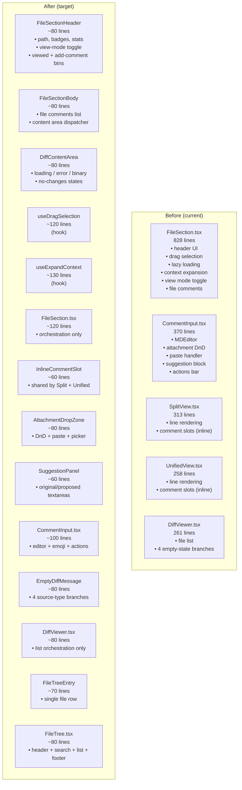
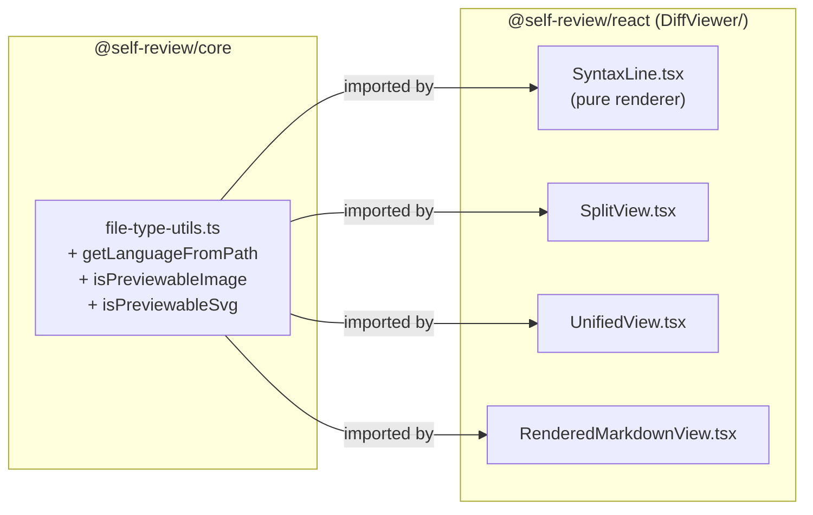
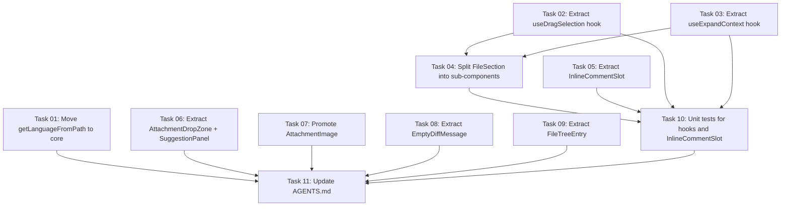

# Plan: Component Granularity Refactor

## Original Work Order

> Create a comprehensive plan for splitting larger React components in the self-review project into
> smaller, semantically related elements for better granularity and maintainability.
>
> The project is an Electron desktop app with npm workspaces. There are two packages:
> - `packages/core/` — `@self-review/core` — headless diff parsing & review logic
> - `packages/react/` — `@self-review/react` — React components for review UI
>
> The main app is in `src/renderer/components/`.

## Plan Clarifications

| Question | Answer |
|---|---|
| Should `<=250` lines be a hard success gate for every component file? | No. Treat `<=250` as a soft target; allow justified exceptions to avoid over-splitting. |
| Should extracted units be publicly exported from `@self-review/react` by default? | No. Use selective exports only for clearly reusable external surfaces. Keep most extracted units internal. |
| What validation bar should this refactor require? | Require unit tests + webapp e2e. Electron smoke checks are host-only optional evidence, not mandatory in container workflows. |
| Should `packages/react` and `src/renderer/components` remain synchronized in scope? | Yes. Keep strict 1:1 parity within the same change set. |

## Executive Summary

The `@self-review/react` package contains several components that have grown to absorb multiple
distinct responsibilities within a single file. The largest offender is `FileSection.tsx` at 828
lines, which alone manages file header UI, expand/collapse state, lazy content loading, drag-to-select
line ranges, scroll compensation, context expansion, and rendered-view mode switching. `CommentInput.tsx`
(370 lines) conflates the markdown editor, image attachment handling (drag-and-drop, paste, file
picker), and the suggestion code block into one monolith. `SplitView.tsx` and `UnifiedView.tsx`
(313 and 258 lines) duplicate the inline comment/comment-input rendering pattern with no shared
abstraction. The `DiffViewer.tsx` orchestrator (261 lines) embeds multi-branch empty-state UI
directly rather than delegating it.

The approach is to extract sub-components and shared utilities that align with distinct semantic
concerns—file header actions, diff content loading states, line-drag comment triggering, attachment
management, inline comment slots, and empty diff messaging—without changing any visible behaviour.
Extracted units remain internal by default, with only selective exports where external reuse is
clear. *This export policy is clarified in the Plan Clarifications table.*

Because the Electron app imports from package source directly (no build step), and the mirrored
files under `src/renderer/components/` must stay in sync, the refactor applies identically to both
locations in the same delivery scope. *This strict parity decision is clarified in the Plan
Clarifications table.* The line-count guardrail remains a soft heuristic rather than a hard gate,
so decomposition is driven by semantic cohesion instead of arbitrary file slicing.

This refactor does not introduce new features, new configuration options, or new IPC channels. It
applies the Single Responsibility Principle at the component level to reduce cognitive load when
reading, debugging, or extending any individual file.

## Context

### Current State vs Target State

| Current State | Target State | Why? |
|---|---|---|
| `FileSection.tsx` is 828 lines with 6+ distinct concerns | Split into `FileSectionHeader`, `FileSectionBody`, `DiffContentArea`, and hook `useExpandContext` | Each unit addresses one concern; drag logic and loading states become independently understandable |
| Drag-to-select and mouse event management live inside `FileSection.tsx` as large imperative blocks | Extracted into a `useDragSelection` hook | Isolates complex imperative DOM event logic from declarative JSX; hook is independently testable |
| `CommentInput.tsx` (370 lines) contains editor, attachment management, suggestion block, and action bar | Extract `AttachmentDropZone` wrapper and `SuggestionPanel` as separate components | Each sub-concern is readable in isolation and can be composed without understanding the whole form |
| `SplitView.tsx` and `UnifiedView.tsx` each independently render inline comment rows using identical JSX patterns | Shared `InlineCommentSlot` component consumed by both views | Eliminates duplication; a bug fix or style change applies in one place |
| `DiffViewer.tsx` contains four separate multi-line empty-state branches inline | Extract `EmptyDiffMessage` component | Empty-state messaging is distinct from file rendering orchestration |
| `getLanguageFromPath` is defined inside `SyntaxLine.tsx` and re-exported ad-hoc | Move to `@self-review/core` file-type utilities alongside existing `isPreviewableImage` and `isPreviewableSvg` | Centralises all file-type detection in the headless package; `SyntaxLine` becomes a pure renderer |
| `AttachmentImage` is a private function component defined at the top of `CommentDisplay.tsx` | Promote to a named component in the `Comments/` folder | Enables direct testing and reuse without importing the full display component |
| `FileTree.tsx` renders a file entry row inline within a `map()` callback | Extract `FileTreeEntry` component | Separates per-file row rendering logic from list and header concerns |

### Background

The project follows a policy of strict code reuse and no duplication (documented in AGENTS.md).
The component structure was grown incrementally as features were added (context expansion, lazy
loading, image attachments, rendered previews), with each feature naturally placed in the nearest
existing component. The result is files that are individually correct but too large to navigate
efficiently. No architectural decisions need reversing—only decomposition along existing semantic
seams.

The Electron app in `src/renderer/components/` mirrors `packages/react/src/components/` but imports
from relative paths rather than via workspace symlinks. Any file split must be applied to both
locations identically. This is an existing constraint; the plan respects it.

## Architectural Approach

### 1. Extract `useDragSelection` Hook

**Objective**: Remove the 130-line imperative drag-tracking block from `FileSection` into a
self-contained hook that encapsulates all document-level `mousemove`/`mouseup` listeners, drag
state, and the unified-vs-split line resolution logic.

The hook accepts the `sectionRef`, the current `effectiveViewMode`, and the per-hunk map data
structures as inputs. It returns `dragState`, `handleDragStart`, and a `handleCommentRange`
callback that the parent component invokes when a final selection is committed. All DOM event
registration happens inside the hook's effect, keeping `FileSection.tsx` declarative. The
`trigger-line-comment` custom-event listener for keyboard hint triggering is also absorbed into
this hook since it is part of the same "how does a comment range get initiated" concern.

### 2. Extract `useExpandContext` Hook

**Objective**: Remove the ~170-line context expansion imperative logic from `FileSection` into a
hook that manages per-hunk budget tracking, scroll compensation, git fetch caching, and hunk
trimming.

The hook accepts `file`, `filePath`, `isExpandable`, and `adapter` as inputs. It returns
`expandLoading`, `totalLines`, `handleExpandContext`, and `sectionRef` (since the ref is only used
for scroll compensation within this logic). This is the most complex extraction target;
encapsulating it reduces `FileSection`'s scroll-compensation `useLayoutEffect` and the long
`useCallback` handler to a single hook call.

### 3. Split `FileSection` into `FileSectionHeader`, `FileSectionBody`, and `DiffContentArea`

**Objective**: After the two hook extractions, decompose the remaining JSX of `FileSection` into
three focused presentational components so that each maps to one visual region of the file panel.

`FileSectionHeader` receives the file metadata, badge/stats data, viewed state, the rendered-view
toggle, and callbacks for the viewed-toggle and add-comment buttons. It produces the sticky header
bar. `FileSectionBody` receives file-level comments, the file-comment input visibility flag, and
renders those alongside `DiffContentArea`. `DiffContentArea` is a pure dispatcher: it handles
the loading spinner, error retry, binary-file notice, no-changes notice, and the branch that
selects among `SplitView`, `UnifiedView`, and `RenderedMarkdownView`. The parent `FileSection.tsx`
is reduced to orchestration: calling the two hooks, assembling props, and composing the three
layout components.

### 4. Extract `InlineCommentSlot` from `SplitView` and `UnifiedView`

**Objective**: Eliminate duplicated inline comment rendering that appears identically in both view
components.

Both `SplitView` and `UnifiedView` render the same structure after each line row: existing
`CommentDisplay` items for lines whose range ends here, then a `CommentInput` when the active
comment range ends here. This pattern is extracted into `InlineCommentSlot`, which accepts
`commentsToRender`, `showCommentInput`, `commentRange`, `filePath`, `originalCode`, and
`onCancel`/`onSaved` callbacks. Both views import and compose `InlineCommentSlot` rather than
duplicating the JSX. The `ml-[100px]` offset specific to unified view is passed as a prop.

### 5. Extract `AttachmentDropZone` and `SuggestionPanel` from `CommentInput`

**Objective**: Isolate the two largest non-editor sub-concerns within `CommentInput` into
separately renderable components.

`AttachmentDropZone` wraps any `children` with drag-enter, drag-leave, drag-over, drop, and paste
handlers. It maintains `isDragging` state and renders the drop overlay. `CommentInput` passes
its editor and action bar as children, removing ~80 lines of event handler boilerplate from the
form component. `SuggestionPanel` renders the two labelled textareas (original disabled,
proposed editable) with the separator; it receives `originalCode`, `proposedCode`, and
`onProposedChange` as props. `CommentInput` conditionally renders `SuggestionPanel` when
`showSuggestion` is true, removing another ~35 lines of inline JSX.

### 6. Promote `AttachmentImage` to a Named Component

**Objective**: The private `AttachmentImage` function at the top of `CommentDisplay.tsx` handles
blob URL creation, adapter-based file reading, error display, and an image click-to-open flow.
It warrants its own file in `Comments/` so it can be imported in tests and by future consumers
without loading all of `CommentDisplay`.

The component is moved to `Comments/AttachmentImage.tsx` (distinct from the existing
`AttachmentThumbnail.tsx` which serves the input-side thumbnail). `CommentDisplay.tsx` imports it
as a named import.

### 7. Extract `EmptyDiffMessage` from `DiffViewer`

**Objective**: The four empty-state branches (welcome/loading pass-through, file-mode error,
directory-mode message, git-mode detailed help table) total ~120 lines of JSX within
`DiffViewer.tsx`. They belong to a distinct concern—communicating diff source status to the user—
and can be extracted as a standalone `EmptyDiffMessage` component.

`EmptyDiffMessage` accepts `diffSource` and renders the appropriate message. `DiffViewer.tsx`
calls it when `diffFiles.length === 0`. The git-mode usage examples table stays within
`EmptyDiffMessage` because it is part of the same messaging concern.

### 8. Extract `FileTreeEntry` from `FileTree`

**Objective**: The `map()` callback in `FileTree.tsx` that renders each file row spans ~70 lines
of JSX including change-type badge, truncated path, stats, comment count, and the viewed toggle.
Extracting it as `FileTreeEntry` makes the list rendering in `FileTree` a trivial `map()` call
and gives the row its own prop surface for future styling or accessibility improvements.

`FileTreeEntry` receives `file`, `isActive`, `commentCount`, `viewed`, and `onScrollToFile` /
`onToggleViewed` callbacks. The parent `FileTree` iterates `filteredFiles` and maps each to
`<FileTreeEntry />`.

### 9. Move `getLanguageFromPath` to `@self-review/core`

**Objective**: The language detection function in `SyntaxLine.tsx` is pure data-mapping logic with
no UI dependency. It belongs alongside `isPreviewableImage` and `isPreviewableSvg` in
`packages/core/src/file-type-utils.ts`, which is the declared home for all file-type detection
utilities.

The function is moved to `file-type-utils.ts`, exported from the core package index, and
`SyntaxLine.tsx` imports it from `@self-review/core`. Import sites in `SplitView.tsx` and
`UnifiedView.tsx` (which import it re-exported from `SyntaxLine`) update their import path
accordingly.

### 10. Preserve a Deliberate Public API Boundary

**Objective**: Keep the refactor focused on maintainability, not package-surface expansion.

Most extracted components/hooks (`FileSectionHeader`, `FileSectionBody`, `DiffContentArea`,
`InlineCommentSlot`, `AttachmentDropZone`, `SuggestionPanel`, `FileTreeEntry`, `useDragSelection`,
`useExpandContext`) remain internal implementation details. Only selectively valuable, stable
surfaces should be exported from `@self-review/react`, and each new export should include explicit
rationale in the implementation PR. *This boundary follows the Plan Clarifications decision on
selective exports.*

## Risk Considerations and Mitigation Strategies

Technical Risks

- **Ref stability across hook boundaries**: `useExpandContext` needs `sectionRef` for scroll
  compensation; if the ref is created inside the hook and also needed in `FileSectionHeader` for
  `data-file-path` attribute anchoring, prop threading is required.
    - **Mitigation**: Create `sectionRef` in the parent `FileSection` and pass it to both the hook
      and the layout components, keeping ref ownership at the orchestration layer.

- **Custom event coupling between `FileTree` and `DiffViewer`**: The expand/collapse toggle uses
  a `CustomEvent('toggle-all-sections')` dispatched from `FileTree` and listened to in `DiffViewer`.
  This is unchanged by the refactor but is a fragile coupling point.
    - **Mitigation**: The refactor does not alter this event contract; it is noted as a pre-existing
      risk to address in a future, dedicated decoupling effort.

Implementation Risks

- **Dual-location sync (`src/renderer/` mirrors `packages/react/src/`)**: Every new file and
  every changed import must be applied in both locations. A partial sync leaves the Electron app
  broken.
    - **Mitigation**: Apply changes to both locations atomically within each task. CI unit tests
      cover both entry points and will surface any import divergence immediately.

- **Props explosion on extracted components**: Extracting `FileSectionHeader` and `FileSectionBody`
  risks creating components with wide prop lists that simply proxy everything the parent received.
    - **Mitigation**: Where the parent already consumes context hooks (`useReview`, `useConfig`),
      extracted child components call the same hooks directly rather than receiving values as props.
      Only genuinely local state (e.g., `commentRange`, `dragState`) is threaded as props.

- **Accidental API surface growth**: Introducing many new files can unintentionally expand
  `@self-review/react` exports and create long-term maintenance obligations.
    - **Mitigation**: Apply a selective-export policy; new modules remain internal unless there is a
      documented external-consumer use case and ownership for ongoing compatibility.

- **Hook extraction changes React's component tree**: Extracting logic into hooks does not create
  new React elements, so no reconciliation or key concerns arise. However, moving state from the
  component body into hooks requires care that no closure captures stale references.
    - **Mitigation**: Hooks use `useRef` for mutable stable references (the existing pattern in
      `FileSection` for `dragStateRef`, `hunkLineMapRef`) and `useCallback` with explicit
      dependencies, consistent with the current implementation style.

Quality Risks

- **Unit test gaps**: Several of the components targeted for extraction have limited or no unit
  tests. Extracting without tests makes regressions harder to detect.
    - **Mitigation**: The plan covers the most complex extractions (hooks, `InlineCommentSlot`,
      `AttachmentDropZone`) as prime candidates for new unit tests. The existing e2e suite provides
      a safety net for user-visible behaviour.

## Success Criteria

### Primary Success Criteria

1. Targeted large files (`FileSection.tsx`, `CommentInput.tsx`, `SplitView.tsx`, `UnifiedView.tsx`,
   `DiffViewer.tsx`, `FileTree.tsx`) are materially reduced in size, with `<=250` lines treated as
   a soft target and any justified exceptions documented.
2. `getLanguageFromPath` is exported from `@self-review/core` and no longer defined in any
   renderer file; all existing callers import it from the core package.
3. `SplitView.tsx` and `UnifiedView.tsx` share `InlineCommentSlot` with zero duplicated
   comment-slot JSX remaining in either file.
4. The `packages/react/src/components/` and `src/renderer/components/` trees maintain strict 1:1
   structure and import parity after each extraction step.
5. All existing unit tests pass without modification to test assertions; no test-specific
   workarounds are introduced.
6. The webapp e2e suite passes after the refactor.

## Self Validation

1. Run `npm run test:unit` from the workspace root and confirm zero failures.
2. Run `npm run test:e2e` from the workspace root and confirm zero failures.
3. (Optional host-only evidence) Open the Electron app with `git diff HEAD~1` as input; verify the
   diff renders with syntax highlighting, comment input opens on line click, drag selection works,
   and "Finish Review" writes a valid XML file.
4. Search the codebase for `getLanguageFromPath` definitions (not imports) and confirm exactly one
   result exists, in `packages/core/src/file-type-utils.ts`.
5. Measure file lengths for the targeted large files and confirm substantial reduction; when any
   file remains above 250 lines, include explicit rationale tied to semantic cohesion.
6. Verify the `src/renderer/components/` tree is structurally identical to
   `packages/react/src/components/` (same file names, same subdirectory layout).

## Documentation

AGENTS.md documents the mirror relationship between `src/renderer/components/` and
`packages/react/src/components/`. After this refactor, the list of components in the Project
Structure section should be updated to include the new file names (`FileSectionHeader`,
`FileSectionBody`, `DiffContentArea`, `InlineCommentSlot`, `AttachmentDropZone`,
`SuggestionPanel`, `AttachmentImage`, `EmptyDiffMessage`, `FileTreeEntry`) and the two new hooks
(`useDragSelection`, `useExpandContext`). The `@self-review/core` exports table in AGENTS.md
should note that `getLanguageFromPath` is now exported from the core package.

For `@self-review/react`, document only the intentionally public extracted exports (if any) and
explicitly keep internal-only modules out of package-level export lists.

PRD.md (`docs/PRD.md`) does not need updating—this is an internal code quality refactor with no
change to user-visible features or IPC contracts.

The Cucumber feature files under `test/features` document user workflows, not component
internals, so no test file changes are required.

## Resource Requirements

### Development Skills

- React component composition patterns and hook extraction
- TypeScript prop interface design
- Knowledge of the existing context architecture (`ReviewContext`, `ConfigContext`,
  `ReviewAdapterContext`) to determine which values are better obtained via hook vs. prop threading

### Technical Infrastructure

- Existing Vitest unit test suite (for verifying hook behaviour post-extraction)
- Existing Playwright + Cucumber e2e suite (for regression assurance)
- Node.js workspace tooling (`npm workspaces`) already configured

## Integration Strategy

Implement each extraction as a mirrored pair update: first in `packages/react/src/components/`, then
immediately in `src/renderer/components/`, followed by import verification in both trees. This
reduces parity drift risk and keeps each commit reviewable. Sequence the highest-risk extractions
(`useExpandContext`, `useDragSelection`, `InlineCommentSlot`) before low-risk presentational splits
so behavioural parity is validated early.

## Notes

### Decision Log

- 2026-03-11: Confirmed line-count threshold is a soft target, not a hard gate.
- 2026-03-11: Confirmed selective export policy for extracted `@self-review/react` modules.
- 2026-03-11: Confirmed unit + webapp e2e as required validation baseline; Electron smoke is host-only optional.
- 2026-03-11: Confirmed strict same-scope parity between `packages/react` and `src/renderer/components`.

### Refinement Change Log

- 2026-03-11: Added Plan Clarifications table and propagated decisions into scope, architecture, risks, success criteria, and validation sections.
- 2026-03-11: Added explicit public API boundary strategy and mitigation for accidental export surface growth.
- 2026-03-11: Added Integration Strategy section to enforce strict mirrored implementation sequencing.

## Execution Blueprint

**Validation Gates:**
- Reference: `/config/hooks/POST_PHASE.md`

### Dependency Diagram

### Phase 1: Independent Extractions (Parallel)
**Parallel Tasks:**
- Task 01: Move `getLanguageFromPath` to `@self-review/core`
- Task 02: Extract `useDragSelection` hook from `FileSection`
- Task 03: Extract `useExpandContext` hook from `FileSection`
- Task 05: Extract `InlineCommentSlot` from `SplitView` and `UnifiedView`
- Task 06: Extract `AttachmentDropZone` and `SuggestionPanel` from `CommentInput`
- Task 07: Promote `AttachmentImage` to named component
- Task 08: Extract `EmptyDiffMessage` from `DiffViewer`
- Task 09: Extract `FileTreeEntry` from `FileTree`

### Phase 2: FileSection Decomposition
**Parallel Tasks:**
- Task 04: Split `FileSection` into `FileSectionHeader`, `FileSectionBody`, `DiffContentArea` (depends on: 02, 03)

### Phase 3: Testing
**Parallel Tasks:**
- Task 10: Unit tests for `useDragSelection`, `useExpandContext`, and `InlineCommentSlot` (depends on: 02, 03, 04, 05)

### Phase 4: Documentation
**Parallel Tasks:**
- Task 11: Update `AGENTS.md` documentation (depends on: 01, 02, 03, 04, 05, 06, 07, 08, 09, 10)

### Execution Summary
- Total Phases: 4
- Total Tasks: 11
- Maximum Parallelism: 8 tasks (Phase 1)
- Critical Path Length: 4 phases

## EXECUTION SUMMARY

- **Completed:** 2026-03-12
- **Status:** All 11 tasks completed successfully
- **All tests passing:** 80 unit tests (36 main + 44 renderer)

### New files created

**packages/react/src/components/DiffViewer/**
- `useDragSelection.ts` — drag-to-select comment range hook
- `useExpandContext.ts` — expand context lines via git hook
- `InlineCommentSlot.tsx` — shared inline comment row (Split+Unified)
- `EmptyDiffMessage.tsx` — empty-state messaging by diff source type
- `FileSectionHeader.tsx` — sticky file header: path, badges, toggles
- `FileSectionBody.tsx` — file comments + DiffContentArea wrapper
- `DiffContentArea.tsx` — loading/error/binary/view dispatcher

**packages/react/src/components/Comments/**
- `AttachmentDropZone.tsx` — drag-and-drop/paste attachment wrapper
- `SuggestionPanel.tsx` — original/proposed code textareas
- `AttachmentImage.tsx` — blob URL lifecycle + image display

**packages/react/src/components/**
- `FileTreeEntry.tsx` — per-file row: badge, path, stats, viewed toggle

**packages/core/src/**
- `getLanguageFromPath` extracted to `file-type-utils.ts` and exported

### Key decisions

- `isDragging` state for AttachmentDropZone lifted to CommentInput
  (controls outer border style) and passed as `isDragging`+`onDragChange`
- `useExpandContext` uses stable refs to avoid stale closures with
  empty useEffect dependency array
- Sub-components call context hooks directly to avoid prop-drilling
