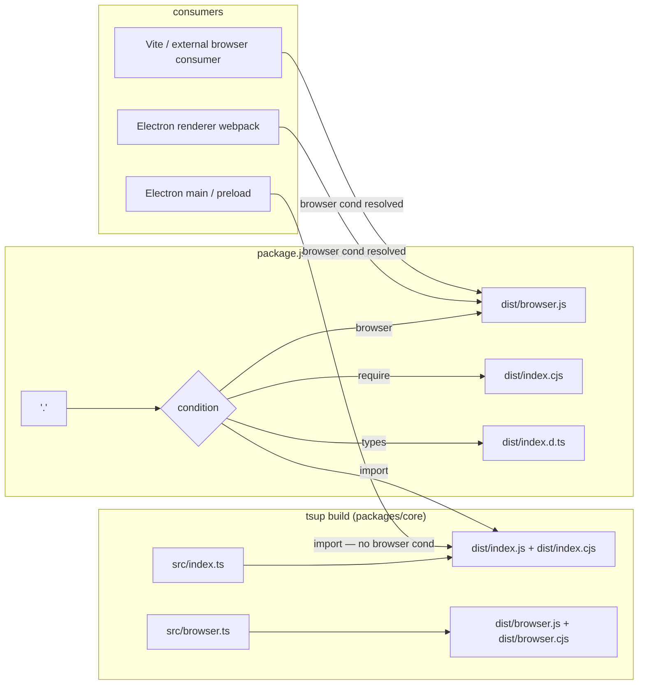
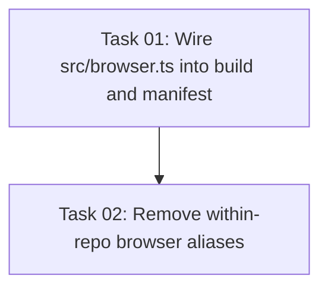

# Plan: Add Browser Conditional Export to @self-review/core

## Original Work Order

> Split @self-review/core into browser-safe and Node.js-only exports using conditional exports in package.json. The problem: @self-review/core ships a single entry point that bundles Node.js-only code (child_process, fs, util, os) alongside pure browser-safe utilities (isPreviewableImage, isPreviewableSvg). Any browser consumer that imports @self-review/react (which depends on @self-review/core) gets Node.js code in their bundle. Fix: Either (a) use conditional exports with a browser field pointing to a dist/browser.js that exports only pure functions, or (b) move isPreviewableImage/isPreviewableSvg into @self-review/react directly since they are 15 lines with zero dependencies.

## Plan Clarifications

| # | Question | Answer |
|---|---|---|
| 1 | Should the existing `@self-review/core` aliases in `webpack.renderer.config.ts` and `tests/webapp/vite.config.ts` be removed as part of this plan? | Yes — remove both. This proves the conditional export works end-to-end and eliminates redundant workarounds. A pre-built core dist is now required before starting the Electron dev server or running webapp e2e tests. |

## Executive Summary

`@self-review/core` already ships a `src/browser.ts` entry point that exports only browser-safe code (types, `parseDiff`, `isPreviewableImage`, `isPreviewableSvg`, `createIgnoreFilter`). However, this file is never built: `tsup.config.ts` only has `src/index.ts` as its entry, and `package.json` exports have no `browser` condition. As a result, any browser bundler (Vite, webpack) resolves the Node.js entry and pulls in `child_process`, `fs`, `util`, and `os`.

The fix is minimal: add `src/browser.ts` to the tsup entry list so it compiles to `dist/browser.js`, then register a `browser` conditional export in `package.json`. No new code needs to be written — the abstraction already exists.

Two existing within-repo aliases that pointed directly to `packages/core/src/browser.ts` source (`webpack.renderer.config.ts` and `tests/webapp/vite.config.ts`) are removed as part of this plan. Their removal validates end-to-end resolution via the conditional export and eliminates the redundant workarounds. As a consequence, `packages/core` must be built (`npm run build` inside `packages/core`) before starting the Electron dev server or running webapp e2e tests.

Approach (b) — moving the functions into `@self-review/react` — is explicitly rejected. `@self-review/react` imports `isPreviewableImage` / `isPreviewableSvg` from `@self-review/core` (see `FileSection.tsx`). Duplicating them into the react package would create two sources of truth and break the existing Electron app that also uses the core package directly.

## Context

### Current State vs Target State

| Aspect | Current State | Target State | Why |
|---|---|---|---|
| tsup entry points | `['src/index.ts']` only | `['src/index.ts', 'src/browser.ts']` | `dist/browser.js` must exist to be referenced |
| `package.json` exports | No `browser` field | `browser: ./dist/browser.js` condition added | Tells bundlers which entry to use in browser environments |
| Built artifacts | `dist/index.js`, `dist/index.cjs`, `dist/index.d.ts` | Same + `dist/browser.js`, `dist/browser.cjs`, `dist/browser.d.ts` | New artifact for browser consumers |
| `webpack.renderer.config.ts` alias | `'@self-review/core'` → `packages/core/src/browser.ts` source | Alias removed | Redundant once conditional export is in place; webpack `electron-renderer` target picks up `browser` condition |
| `tests/webapp/vite.config.ts` alias | `'@self-review/core'` → `packages/core/src/browser.ts` source | Alias removed | Validates end-to-end Vite resolution; Vite resolves `browser` condition by default |
| Browser consumer experience | Gets Node.js built-ins → runtime error / build warning | Gets pure-JS bundle, zero Node.js APIs | Eliminates consumer shim workaround |
| Dev workflow | No core build required before starting dev server | `npm run build` in `packages/core` required first | Electron renderer and webapp e2e now depend on compiled dist |

### Background

`src/browser.ts` was added at some point as a manual browser subset, but the build system was never updated to compile it. Two within-repo consumers resorted to a `resolve.alias` workaround pointing directly at the TypeScript source:
- `webpack.renderer.config.ts:40` (Electron renderer webpack config)
- `tests/webapp/vite.config.ts:14` (webapp e2e Vite dev server)

Downstream consumers (e.g. Dalia) used a similar `self-review-core-shim.ts` + `resolve.alias` approach. The correct fix is to wire the existing `browser.ts` into the build and package manifest, not to maintain per-consumer aliases.

**Why removing the aliases is safe:** `@self-review/react` is published with `@self-review/core` as a runtime dependency (not bundled — tsup externalises all `dependencies` by default). Browser bundlers consuming `@self-review/react` therefore resolve `@self-review/core` themselves and apply their own condition logic, picking up `dist/browser.js` via the new `browser` condition. The Electron renderer's webpack `electron-renderer` target resolves the `browser` condition by default in webpack 5; the preload and main configs use `electron-preload` / `electron-main` targets which do **not** resolve `browser`, so they continue to use `dist/index.js`.

## Architectural Approach



### Build Configuration

**Objective**: Produce `dist/browser.js` and its type declarations alongside the existing Node.js artifacts.

Add `'src/browser.ts'` to the `entry` array in `packages/core/tsup.config.ts`. The format remains `['esm', 'cjs']`; tsup will emit `dist/browser.js` (ESM) and `dist/browser.cjs` (CJS) automatically with `dts: true` so `dist/browser.d.ts` is generated.

The existing `external` list (`xmllint-wasm`, `fast-xml-parser`, `yaml`, `ignore`) stays unchanged — the browser entry only uses the `ignore` package which is already marked external and is browser-safe.

### Package Manifest

**Objective**: Expose the `browser` conditional so bundlers select the right entry without any consumer-side configuration.

Update `packages/core/package.json` exports:

```json
".": {
  "browser": "./dist/browser.js",
  "import": "./dist/index.js",
  "require": "./dist/index.cjs",
  "types": "./dist/index.d.ts"
}
```

The existing `"files": ["dist"]` glob covers `dist/browser.js` and `dist/browser.d.ts` automatically — no change needed there.

### Alias Removal

**Objective**: Remove the two within-repo `resolve.alias` workarounds so that webpack and Vite resolve `@self-review/core` via the conditional export, proving correctness end-to-end.

1. **`webpack.renderer.config.ts`**: Remove the `alias` key (or its `'@self-review/core'` entry) from `resolve`. Webpack `electron-renderer` target includes `browser` in its default `conditionNames`, so it will resolve `dist/browser.js`.
2. **`tests/webapp/vite.config.ts`**: Remove the `alias` key (or its `'@self-review/core'` entry) from `resolve`. Vite resolves the `browser` condition by default in browser mode.

Both changes require `packages/core` to have been built before the consumer starts. Document this in the development setup instructions.

### Validation

**Objective**: Confirm the browser entry resolves correctly and contains no Node.js imports.

After building, inspect `dist/browser.js` with a static import scan to assert that none of `child_process`, `fs`, `util`, `os`, `path`, `stream` appear. This can be done with a simple `grep` in CI or manually post-build.

## Risk Considerations and Mitigation Strategies

<details>
<summary>Technical Risks</summary>

- **`ignore` package browser compatibility**: `src/browser.ts` re-exports `createIgnoreFilter` which depends on the `ignore` npm package. The `ignore` package is documented as browser-safe (no Node.js APIs), but if a future version regresses, the browser bundle would break.
  - **Mitigation**: The `external` list already externalises `ignore`, so downstream bundlers resolve it separately. Any issue would surface immediately in the consumer's bundle rather than silently at runtime.

- **Type declaration mismatch**: tsup generates both `dist/browser.d.ts` (browser subset) and `dist/index.d.ts` (full declarations). The `types` condition in the export map points to `dist/index.d.ts`, so TypeScript consumers in browser contexts see the full type surface even though the runtime is restricted to the browser subset. This means TypeScript will not error if code imports Node.js-only exports — those imports would fail at runtime.
  - **Mitigation**: Acceptable for now. A follow-up could add a `browser` condition inside a `types` entry to `dist/browser.d.ts`, but this is out of scope per YAGNI.

</details>

<details>
<summary>Implementation Risks</summary>

- **Dev workflow breakage after alias removal**: Removing the webpack renderer alias means `dist/browser.js` must exist before `npm start`. If a developer checks out a fresh repo and runs `npm start` without building core first, webpack will fail to resolve `@self-review/core` for the renderer.
  - **Mitigation**: Add a `prebuild` or `prestart` script at the workspace root that runs `npm run build --workspace=packages/core`, or document the prerequisite clearly. _Per clarification Q1, the pre-build requirement is accepted._

- **Electron renderer webpack `browser` condition**: After alias removal, webpack resolves `@self-review/core` for `electron-renderer` using the `browser` condition (webpack 5 default for that target). This produces `dist/browser.js` — correct for the renderer (Chromium context). The main and preload webpack configs (`electron-main`, `electron-preload` targets) do **not** resolve `browser`, so they continue to receive the full Node.js bundle.
  - **Mitigation**: Verified via inspection: the main webpack config (`webpack.main.config.ts`) and preload config (`webpack.preload.config.ts`) have no `@self-review/core` alias and use non-browser targets, so they are unaffected.

</details>

## Success Criteria

### Primary Success Criteria
1. `npm run build` in `packages/core` produces `dist/browser.js` without errors.
2. `dist/browser.js` contains zero references to Node.js built-in module names (`child_process`, `fs`, `util`, `os`, `path`, `stream`, `net`, `crypto`).
3. The webapp e2e tests (`npm run test:e2e`) pass without the `@self-review/core` alias in `tests/webapp/vite.config.ts`.
4. The existing Electron app (`npm run make` or `npm start` after building core) continues to work without any alias or shim configuration.
5. All existing unit tests in `packages/core` pass unchanged.

## Self Validation

1. Run `npm run build` inside `packages/core` and confirm the output lists `dist/browser.js` and `dist/browser.d.ts`.
2. Run `grep -E "(child_process|\"fs\"|\"os\"|\"util\"|\"path\"|\"stream\")" packages/core/dist/browser.js` — expect zero matches.
3. Run `npm run test:unit` — all tests must pass.
4. In `packages/react`, run `npm run build` to confirm the react package still builds with no resolution errors.
5. Run `npm run test:e2e` from the workspace root. The webapp e2e Vite dev server starts without the `@self-review/core` alias and all scenarios pass, confirming Vite resolves `dist/browser.js` via the conditional export.
6. Optionally run `npm start` (requires a display) to confirm the Electron renderer loads without webpack resolution errors after the alias removal.

## Resource Requirements

### Development Skills
- Node.js package authoring (conditional exports spec)
- tsup configuration
- webpack 5 condition names (`electron-renderer` vs `electron-main`)

### Technical Infrastructure
- Node.js + npm workspaces
- tsup bundler

## Notes

- **No PRD.md update needed**: This is a build infrastructure change with no user-visible behaviour change.
- **No AGENTS.md update needed**: The project structure and architecture are unchanged; only the build config and package manifest are modified.

### Change Log
- 2026-03-11: Initial plan created.
- 2026-03-11: Refined — added alias removal scope for `webpack.renderer.config.ts` and `tests/webapp/vite.config.ts` per clarification Q1; updated risk section with dev workflow dependency on pre-built core dist; made validation step 5 explicit (webapp e2e, not "if available"); added architecture detail on webpack target condition resolution.

## Execution Blueprint

**Validation Gates:**
- Reference: `/config/hooks/POST_PHASE.md`

### Dependency Diagram



### ✅ Phase 1: Build Infrastructure
**Parallel Tasks:**
- ✔️ Task 01: Wire `src/browser.ts` into the core build and package manifest (status: completed)

### ✅ Phase 2: Alias Removal and Validation
**Parallel Tasks:**
- ✔️ Task 02: Remove within-repo browser aliases (depends on: 01) (status: completed)

### Post-phase Actions
After Phase 2, run the full self-validation sequence from the plan:
1. `cd packages/core && npm run build` — confirm `dist/browser.js` and `dist/browser.d.ts` appear in output
2. `grep -E "(child_process|\"fs\"|\"os\"|\"util\"|\"path\"|\"stream\")" packages/core/dist/browser.js` — expect zero matches
3. `npm run test:unit` — all unit tests pass
4. `cd packages/react && npm run build` — react package builds without resolution errors
5. `npm run test:e2e` — all webapp e2e scenarios pass

### Execution Summary
- Total Phases: 2
- Total Tasks: 2
- Maximum Parallelism: 1 task (each phase has one task)
- Critical Path Length: 2 phases

## Execution Summary

**Status**: ✅ Completed Successfully
**Completed Date**: 2026-03-11

### Results
- Phase 1: Added `src/browser.ts` to the tsup entry array in `packages/core/tsup.config.ts` and registered a `browser` conditional export in `packages/core/package.json`. The build produces `dist/browser.js`, `dist/browser.cjs`, and `dist/browser.d.ts` with zero Node.js built-in references.
- Phase 2: Removed `resolve.alias` for `@self-review/core` from both `webpack.renderer.config.ts` and `tests/webapp/vite.config.ts`. All 46 webapp e2e tests pass, confirming Vite resolves `dist/browser.js` via the conditional export automatically.
- All 186 core unit tests and 100 workspace unit tests pass. The `@self-review/react` package builds without errors.

### Noteworthy Events
- The tsup build produces a tiny `dist/browser.js` (238 bytes ESM) plus a shared chunk `dist/chunk-XUSMSTS6.js` (5.47 KB) containing the actual browser-safe exports — this is expected tsup code-splitting behavior.
- The `"types"` condition in the exports map generates a benign esbuild warning about unreachable conditions; this is pre-existing and acceptable per the plan's risk section.

### Recommendations
- Developers must run `npm run build` inside `packages/core` before starting the Electron dev server (`npm start`) or the webapp e2e tests, since both now depend on the compiled `dist/browser.js`.
- A follow-up could add a `prestart` script at the workspace root to build core automatically, reducing friction for new contributors.
