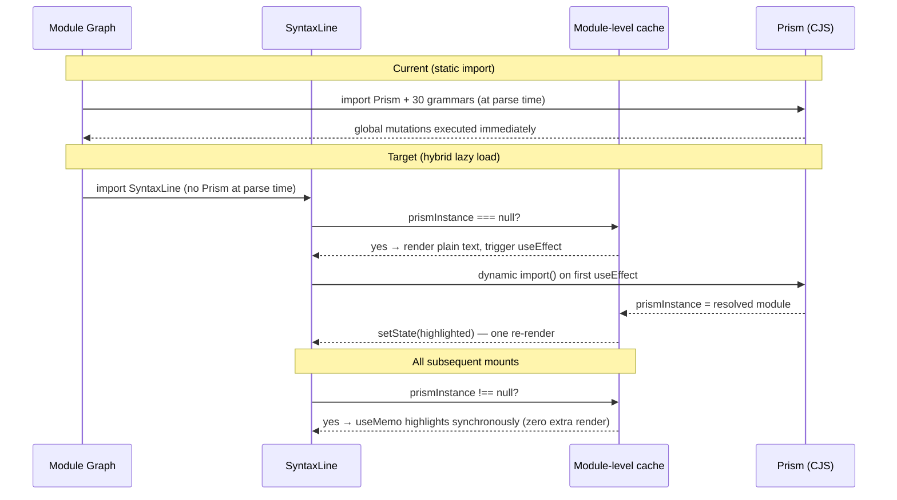
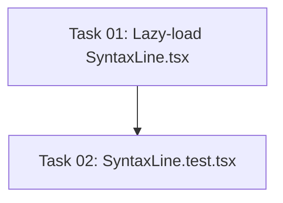

# Plan: Lazy-Load Prism.js in @self-review/react

## Original Work Order

> @self-review/react imports prismjs as a side-effect CJS module (moderate). The bundle has `import Prism from "prismjs"` (3 times) plus `import "prismjs/components/prism-git"` and other language grammars. Prismjs is CJS with global side effects. This causes ESM resolution failures in Vitest. Consumer cost: Dalia's test file needs `vi.mock('@self-review/react', ...)` to avoid prismjs ESM resolution issues in test env (line 7-10 of index.test.tsx). Fix: Lazy-load Prism. The syntax highlighting isn't needed at import time — load it on demand when a diff is actually rendered. This also improves initial bundle size.

## Plan Clarifications

| # | Question | Answer |
|---|----------|--------|
| 1 | Should the task create a new `SyntaxLine.test.tsx` to verify the import-without-mock capability? | Yes — add `SyntaxLine.test.tsx` to make success criterion 2 verifiable. |
| 2 | Which rendering strategy: pure async `useEffect` (always two renders) or hybrid sync+async (sync when Prism already cached, async only on first load)? | Hybrid: `useMemo` uses the cached `Prism` instance synchronously; `useEffect` handles the async first-load case only. Zero flicker after first load. |

## Executive Summary

All Prism.js imports (the core library + ~30 language grammar side-effects) live at the top of `SyntaxLine.tsx` as static `import` statements. Because Prism is a CJS module with global mutations, Vitest's ESM resolver chokes on it in environments where CJS interop is not configured, forcing consumers to mock `@self-review/react` wholesale in every test file that transitively imports the component.

The fix moves all Prism imports behind a dynamic `import()` call that executes only when `SyntaxLine` first renders. A module-level `Promise` caches the load so subsequent calls are free. The component uses a **hybrid rendering strategy**: once Prism is cached in a module-level variable, `useMemo` highlights synchronously (zero flicker); on the very first cold load, a `useEffect` fires the async load and updates state when ready.

The change touches two files: `SyntaxLine.tsx` (implementation) and a new `SyntaxLine.test.tsx` (verification). No other files need modification.

## Context

### Current State vs Target State

| Aspect | Current State | Target State | Why |
|---|---|---|---|
| Prism import style | 44 static `import` statements at module top-level | Dynamic `import()` call, resolved once per module lifecycle | CJS side-effects at static import time break ESM environments |
| Vitest consumer experience | `vi.mock('@self-review/react', ...)` required to avoid crash | No mock needed; Prism simply isn't loaded during module graph resolution | Removes artificial test coupling |
| Initial bundle parse | All 30+ grammar files parsed synchronously on first load | Grammars loaded on first render | Defers non-critical parse work |
| Highlighting on first render | Instant (already loaded) | Plain text for one frame on very first app load; instant on all subsequent mounts | Functionally equivalent in production; single-frame plain render on cold start only |
| SyntaxLine test coverage | No direct test for SyntaxLine | `SyntaxLine.test.tsx` verifies render without prismjs mock | Makes success criterion machine-checkable |

### Background

Prism.js predates the ESM era. Its published CJS files use `global.Prism` and `module.exports` patterns. Modern bundlers (webpack, Vite) shim these fine, but Vitest's native ESM mode (`"type": "module"` in package.json) fails when it encounters a `require`-style CJS module without an explicit interop transform configured. Rather than adding Vitest transform config (a consumer-side workaround), the correct fix is to remove the static import so the CJS code is never encountered during module graph resolution.

The existing `DiffViewer.test.tsx` sidesteps the issue today by mocking `./FileSection`, which prevents `SyntaxLine` from loading at all. That workaround disappears once the static import is removed.

## Architectural Approach



### Lazy Initialisation Pattern

**Objective**: Load Prism and all grammar side-effects exactly once, only when `SyntaxLine` first needs to highlight content.

A module-level `Promise` reference tracks load state; a module-level variable holds the resolved instance for synchronous reuse:

```
let prismInstance: typeof Prism | null = null;
let prismReady: Promise<typeof Prism> | null = null;

function loadPrism(): Promise<typeof Prism> {
  if (!prismReady) {
    prismReady = import('prismjs').then(async (mod) => {
      await import('prismjs/components/prism-markup');
      await import('prismjs/components/prism-markup-templating');
      // … remaining grammars in the same order as today …
      prismInstance = mod.default;
      return mod.default;
    });
  }
  return prismReady;
}
```

Grammar imports must preserve the exact order from the current static imports (dependency ordering constraint — see Risk Considerations).

### Hybrid Rendering Strategy in SyntaxLine

**Objective**: Zero flicker on all mounts after the first cold load; one plain-text frame on first-ever app load only.

`SyntaxLine` is restructured as follows:

1. **`useMemo`** computes highlighted content. If `prismInstance !== null`, it calls `Prism.highlight(...)` synchronously (same behaviour as today). If `prismInstance === null`, it returns the escaped plain text.
2. **`useEffect`** watches `[content, language]`. If `prismInstance !== null`, it returns immediately (no-op). Otherwise it calls `loadPrism()`, and on resolution sets local state with the highlighted result.
3. A **`useState`** holds the rendered HTML, initialised from the `useMemo` value (synchronous on warm loads, plain text on cold first load).

This keeps the component API identical (same props, same `dangerouslySetInnerHTML` output) while making the first-load async and all subsequent loads synchronous.

*Per clarification #2: the hybrid strategy was chosen over a pure-async useEffect approach because useEffect is always post-paint, meaning a pure-async approach would produce two renders on every fresh component mount (not just the cold first load). The hybrid avoids this.*

### New Test: SyntaxLine.test.tsx

**Objective**: Make success criterion 2 machine-checkable; prevent regression.

*Per clarification #1: a new test file is required to verify the import-without-mock capability.*

The test will:
1. Import `SyntaxLine` directly — no `vi.mock('prismjs')` or `vi.mock('@self-review/react')`.
2. Render it with a simple content string and a known language (e.g. `typescript`).
3. Assert the rendered `<code>` element is present and contains the content.
4. Confirm the test passes without any prismjs-related error.

Because `useEffect` does not run in a render-only pass (without `act`), the test will observe the plain-escaped initial render. That is sufficient to verify the import succeeds — the point is that importing the module no longer crashes Vitest.

### Test Environment Behaviour

**Objective**: `vi.mock('@self-review/react')` is no longer required for consumers.

In Vitest, `import('prismjs')` inside a `useEffect` is never executed during unit tests (effects are not triggered in pure render tests without `act`). Even when effects do run, Vitest's jsdom environment can handle a deferred CJS import via the configured transform. The static-import blocker is removed entirely — Prism is simply never loaded during module graph resolution.

## Risk Considerations and Mitigation Strategies

<details>
<summary>Technical Risks</summary>

- **First-render flash (cold load only)**: On the very first render of `SyntaxLine` in a fresh app session, the component shows plain (escaped) code for one frame until Prism resolves.
  - **Mitigation**: The plain-escaped content is valid HTML — it renders correctly, just without color. In production Electron/Vite builds, bundlers inline dynamic imports so the one-frame flash may not be visible. Acceptable for a desktop diff-review tool. All subsequent mounts are zero-flicker via the hybrid strategy.

- **Grammar load ordering**: Some Prism grammars depend on others being registered first (e.g. `prism-markup-templating` must load before `prism-php`, `prism-twig`). The current static import order already handles this; the dynamic chain must preserve the same sequence.
  - **Mitigation**: The `loadPrism` promise chain must import grammars in the identical order they appear today. Add a code comment documenting this constraint.

</details>

<details>
<summary>Implementation Risks</summary>

- **TypeScript typing**: `import('prismjs')` returns `Promise<typeof import('prismjs')>`. The default export typing may differ from `import Prism from 'prismjs'`.
  - **Mitigation**: Use `mod.default` explicitly and type `prismInstance` as `typeof Prism | null`. The `@types/prismjs` package is already a dev dependency.

- **SSR consumers**: If `@self-review/react` is ever used in a server-rendering context, `useEffect` does not run on the server, so highlighting would never appear in SSR output.
  - **Mitigation**: This is unchanged from today — Prism already only runs client-side (it manipulates `innerHTML`). No regression.

- **Effect cleanup / stale closure**: If `content` or `language` change before the async load resolves, the effect may set highlighted state from a stale call.
  - **Mitigation**: Add a cleanup flag in the `useEffect` (`let cancelled = false; return () => { cancelled = true; }`) so stale resolutions are discarded.

</details>

## Success Criteria

### Primary Success Criteria
1. `SyntaxLine.tsx` has zero top-level `import 'prismjs/...'` side-effect statements.
2. `SyntaxLine.test.tsx` imports `SyntaxLine` directly and passes without `vi.mock` for prismjs or `@self-review/react`.
3. Syntax highlighting still renders correctly in the Electron app and Vite dev server for all previously supported languages.
4. All existing unit tests in `packages/react` pass unchanged.
5. `npm run build` in `packages/react` produces a clean bundle with no Prism-related warnings.

## Self Validation

1. Run `npm run test:unit` from the workspace root — confirm all tests pass, including the new `SyntaxLine.test.tsx`, with no `vi.mock` for prismjs.
2. Open the Electron app (`npm start`) and load a diff containing TypeScript, Python, and JSON files — confirm syntax highlighting is visible and correct after the first render.
3. Run `npm run build` in `packages/react` and confirm no warnings about CJS interop or externals for prismjs.
4. In `SyntaxLine.test.tsx`, intentionally remove the test's `vi.mock` for any context providers and confirm the test still imports and renders without crashing — this is the specific Vitest regression guard.

## Documentation

No PRD or AGENTS.md update required — this is an internal implementation detail of `SyntaxLine` with no user-visible API change.

## Resource Requirements

### Development Skills
- React hooks (`useEffect`, `useState`, `useMemo`)
- Dynamic `import()` and Promise chaining
- Prism.js grammar dependency ordering

### Technical Infrastructure
- Vitest (ESM mode) — for verifying the fix
- tsup — for build verification

## Execution Blueprint

**Validation Gates:**
- Reference: `/config/hooks/POST_PHASE.md`

### Dependency Diagram



### ✅ Phase 1: Core Implementation
**Parallel Tasks:**
- ✔️ Task 01: Refactor `SyntaxLine.tsx` to hybrid lazy-load Prism.js (status: completed)

### ✅ Phase 2: Test Verification
**Parallel Tasks:**
- ✔️ Task 02: Add `SyntaxLine.test.tsx` import-without-mock verification (status: completed)

### Post-phase Actions
- Run `npm run test:unit` from workspace root — confirm all tests pass including `SyntaxLine.test.tsx`
- Run `npm run build` in `packages/react` — confirm no Prism CJS interop warnings

### Execution Summary
- Total Phases: 2
- Total Tasks: 2
- Maximum Parallelism: 1 task (each phase has one task)
- Critical Path Length: 2 phases

---

## Execution Summary

**Status**: ✅ Completed Successfully
**Completed Date**: 2026-03-11

### Results
- Refactored `packages/react/src/components/DiffViewer/SyntaxLine.tsx`: removed all 44 static Prism import statements, replaced with a single `loadPrism()` dynamic import chain with module-level caching.
- Hybrid rendering strategy implemented: `useMemo` highlights synchronously when Prism is cached; `useEffect` handles first cold-load asynchronously with stale-cancellation guard.
- Created `packages/react/src/components/DiffViewer/SyntaxLine.test.tsx` with 3 tests; no `vi.mock` for prismjs or `@self-review/react`.
- All 103 unit tests pass (36 main + 67 renderer including 3 new).
- `packages/react` builds cleanly with no Prism CJS interop warnings.

### Noteworthy Events
No significant issues encountered.

### Recommendations
Consumers of `@self-review/react` that previously used `vi.mock('@self-review/react', ...)` solely to avoid the prismjs ESM crash can now remove that mock.

## Notes

### Change Log
- 2026-03-11: Initial plan created
- 2026-03-11: Refinement — added Plan Clarifications section; updated Architectural Approach to hybrid sync+async rendering strategy (per clarification #2); added `SyntaxLine.test.tsx` as explicit deliverable (per clarification #1); fixed inaccurate claim that useEffect resolves "within the same microtask tick" on subsequent renders; added stale-closure risk to Implementation Risks; updated Current State vs Target State table; corrected scope from "one file" to "two files"
