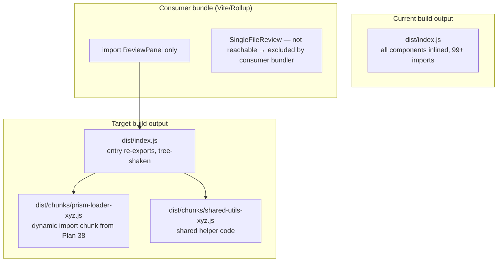
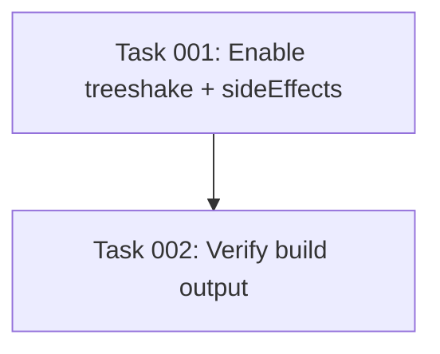

# Plan: Enable Tree-Shaking in @self-review/react

## Original Work Order

> @self-review/react doesn't tree-shake (minor). The bundle has 99 import statements and ships everything in a single dist/index.js. Consumers get the full component library even if they only use ReviewPanel. Fix: Configure tsup with treeshake: true or use multiple entry points so bundlers can eliminate unused code.

## Plan Clarifications

| Question | Answer |
|---|---|
| Should `"sideEffects": ["./dist/styles.css"]` be added to package.json? | Yes — it is part of this plan. Downstream bundlers need it to tree-shake at the consumer level. |
| Plan 38 (Prism lazy-loading) is not yet executed. How to handle the dependency? | Plan 38 is a prerequisite for Plan 39. Plan 39 must run after Plan 38 completes so that Prism's static CJS side-effect imports are already removed. |
| Should the architecture diagram be corrected to reflect actual `splitting:true` behaviour? | Yes — splitting only creates chunks at dynamic import boundaries, not per component. Diagram updated accordingly. |
| Verification step 6 references a Vite consumer test app that does not exist. What to do? | Inspect the built dist/index.js directly with grep/ripgrep to confirm unused component code is absent from the artifact. |

## Executive Summary

`@self-review/react` is built by tsup with a single `src/index.ts` entry and no tree-shaking configuration. The resulting `dist/index.js` is a pre-bundled monolith. Even if a consumer imports only `ReviewPanel`, they receive the full bundle including `SingleFileReview`, all context providers, all diff viewer sub-components, Prism grammar loaders, and Mermaid.

The fix has two parts:

1. Add `treeshake: true` to the tsup config. This instructs tsup (Rollup internally) to perform dead-code elimination during the build, so only reachable code from each import path is included.
2. Add `"sideEffects": ["./dist/styles.css"]` to `packages/react/package.json`. Without this field, downstream bundlers (webpack, Vite, Rollup) must conservatively assume every file has side effects and cannot safely eliminate unused modules — even if tsup has already tree-shaken the output. The CSS entry is the only file with real side effects; all other output is side-effect-free.

`splitting: true` is also added to allow tsup to emit shared code into separate chunk files at dynamic import boundaries (e.g., Prism lazy-loading from Plan 38), preventing code duplication between chunks.

**Prerequisite**: Plan 38 (Prism lazy-loading) must be completed before executing this plan. Plan 38 moves all static Prism CJS side-effect imports to dynamic `import()` calls, making tree-shaking of `SyntaxLine.tsx` safe. Running Plan 39 before Plan 38 could allow Rollup to incorrectly eliminate Prism grammar side-effects.

## Context

### Current State vs Target State

| Aspect | Current State | Target State | Why |
|---|---|---|---|
| tsup `treeshake` option | Not set (defaults to `false`) | `treeshake: true` | Enables Rollup dead-code elimination during build |
| tsup `splitting` option | Not set | `splitting: true` | Emits shared code as chunks at dynamic import boundaries; avoids duplication between chunks |
| `"sideEffects"` in package.json | Absent (bundlers assume all files have side effects) | `["./dist/styles.css"]` | Signals to downstream bundlers that only the CSS has side effects, enabling consumer-level tree-shaking |
| Output artifact | Single `dist/index.js` (~99 imports, all components inlined) | `dist/index.js` with only reachable code; shared chunks in `dist/chunks/` for dynamic imports | Smaller payload for consumers using a subset of the library |
| Consumer tree-shaking | Consumer bundler cannot eliminate unused components because they are pre-bundled | Consumer bundler can eliminate based on its own import graph | Standard ESM library best practice |

### Background

tsup defaults `treeshake` to `false` when building libraries, because tree-shaking can inadvertently remove intentional side effects. For `@self-review/react`, all side effects are either properly flagged (CSS imports go through the separate `styles.css` artifact) or are inside components that are only reached if the component is imported. Once Plan 38 is complete, Prism's static CJS side-effect imports will be gone; enabling `treeshake: true` is then safe.

`splitting: true` is paired with `treeshake` to let tsup split the bundle at dynamic import boundaries (e.g., Prism lazy-loading from Plan 38) and shared utilities, preventing code duplication across chunks.

## Architectural Approach



*Note: `splitting: true` creates chunks only at dynamic `import()` boundaries and for shared utilities — not one chunk per component. Per-component elimination happens at the consumer's bundler level, guided by the `sideEffects` field.*

### tsup Configuration Change

**Objective**: Enable dead-code elimination and chunk splitting with minimal configuration change.

In `packages/react/tsup.config.ts`, add two options to the existing `defineConfig` call:

- `treeshake: true` — activates Rollup's tree-shaker for the ESM output.
- `splitting: true` — enables code splitting at dynamic import boundaries and shared module extraction.

No other changes to `tsup.config.ts`. The existing `external` list, `dts: true`, `format: ['esm']`, and `sourcemap: true` remain unchanged.

### package.json `sideEffects` Field

**Objective**: Signal to downstream bundlers which files have side effects so they can eliminate unused modules.

*Per clarification: this change is part of this plan, not deferred.*

In `packages/react/package.json`, add:

```json
"sideEffects": ["./dist/styles.css"]
```

This tells webpack, Vite, and Rollup that only `dist/styles.css` has observable side effects. All other output files (JS chunks, the main entry) are safe to drop if unused. Without this field, downstream bundlers conservatively treat every file as having side effects, negating the benefit of tsup's tree-shaking.

### Verification of Side-Effect Safety

**Objective**: Confirm that `treeshake: true` does not accidentally drop intentional side effects.

The `src/` directory has no top-level side-effect files. After Plan 38 completes, Prism grammar imports will be dynamic — no static CJS side-effects remain. CSS is emitted as a separate artifact. After enabling tree-shaking, run the full test suite and manually verify the Electron app to confirm no silent removals occurred.

## Risk Considerations and Mitigation Strategies

<details>
<summary>Technical Risks</summary>

- **Chunk filename instability**: When `splitting: true` is enabled, tsup generates content-hashed chunk names. If consumers pin to specific chunk paths (they should not — only the main entry is public API), this could break.
  - **Mitigation**: The public API is `dist/index.js` via the `exports` map. Chunk files are internal. No consumer should import chunks directly.

- **Plan 38 not complete**: Enabling tree-shaking before Plan 38 removes Prism's static side-effect imports could cause Rollup to incorrectly eliminate those imports.
  - **Mitigation**: Plan 38 is an explicit prerequisite. Do not execute Plan 39 tasks until Plan 38 is archived.

</details>

<details>
<summary>Implementation Risks</summary>

- **Build output size regression**: In rare cases, `splitting: true` can increase total artifact size if Rollup creates many small chunks with higher per-chunk overhead than a single bundle.
  - **Mitigation**: Compare `dist/` total size before and after. If size increases, drop `splitting` and keep only `treeshake: true`.

</details>

## Success Criteria

### Primary Success Criteria
1. `npm run build` in `packages/react` succeeds with no errors or warnings.
2. `dist/index.js` file size is equal to or smaller than before the change.
3. A grep of `dist/index.js` for `SingleFileReview` returns no results when tree-shaking has eliminated it from the entry (confirm via bundle inspection — see Self Validation step 6).
4. All existing unit tests in `packages/react` pass unchanged.
5. The Electron app continues to work correctly after the package is rebuilt.

## Self Validation

1. Record the size of `dist/index.js` before the change (`wc -c packages/react/dist/index.js`).
2. Apply the tsup config change and `sideEffects` field, then run `npm run build` in `packages/react`.
3. Record the new size and confirm it has not increased.
4. Run `npm run test:unit` in `packages/react` — all tests must pass.
5. In the Electron app, run `npm start` and load a diff — confirm the UI renders and syntax highlighting works.
6. Inspect `dist/index.js` directly: run `grep -c "SingleFileReview" packages/react/dist/index.js`. If tree-shaking is working, this count should be lower than before (ideally zero for a pure entry file), confirming dead-code elimination at build time. Alternatively run `npx rollup-plugin-visualizer` against the dist to visualise what was included.

## Documentation

No PRD or AGENTS.md update required — this is a build configuration change with no user-visible API change.

## Resource Requirements

### Development Skills
- tsup / Rollup configuration
- ESM module bundling concepts (tree-shaking, side effects, `sideEffects` package.json field)

### Technical Infrastructure
- tsup bundler
- Node.js + npm workspaces

## Notes

### Change Log
- 2026-03-11: Initial plan created.
- 2026-03-11: Refinement — added `sideEffects` package.json change as explicit implementation step (was only in Risk mitigation before); corrected Executive Summary which incorrectly stated no package.json changes were needed; added Plan 38 as explicit prerequisite with rationale; corrected architecture diagram to show realistic chunk output (dynamic import boundaries only, not per-component); replaced unverifiable "Vite consumer test app" verification step with direct `grep` inspection of `dist/index.js`; updated Q&A table with all four clarifications.

---

## Execution Blueprint

**Validation Gates:**
- Reference: `/config/hooks/POST_PHASE.md`

### ✅ Phase 1: Configuration Changes
**Parallel Tasks:**
- ✔️ Task 001: Enable treeshake, splitting, and sideEffects in @self-review/react

### ✅ Phase 2: Verification
**Parallel Tasks:**
- ✔️ Task 002: Verify build output (depends on: 001)

### Post-phase Actions
None.

### Execution Summary
- Total Phases: 2
- Total Tasks: 2
- Maximum Parallelism: 1 task (each phase has one task)
- Critical Path Length: 2 phases


