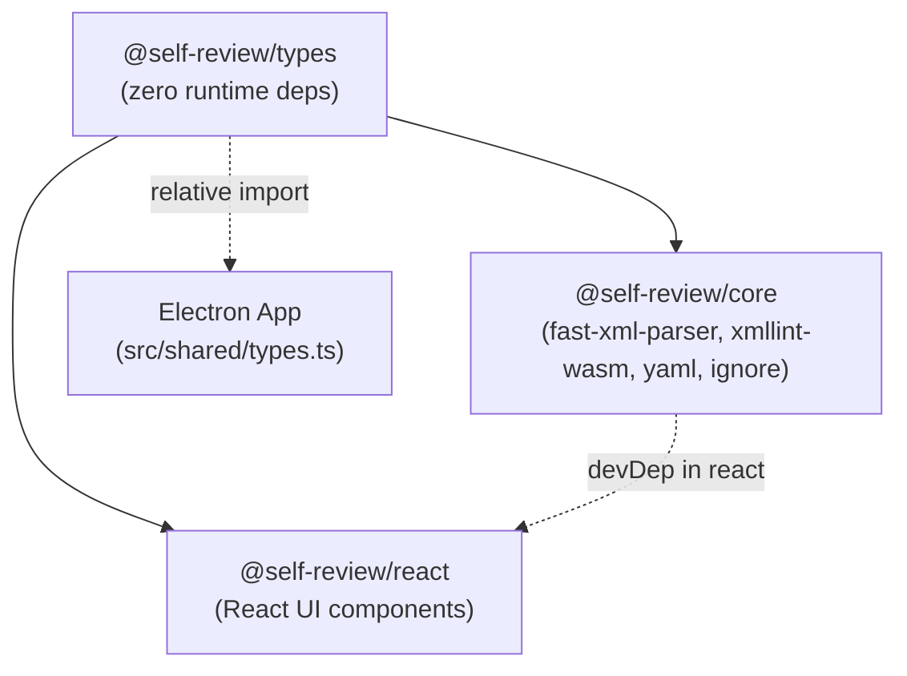
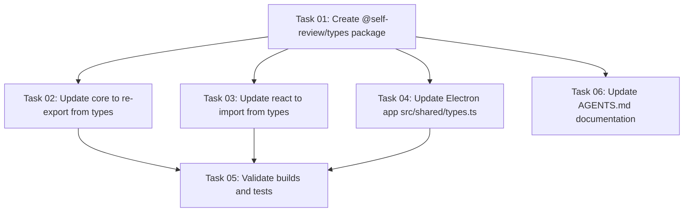

# Plan: Separate @self-review/types Package

## Original Work Order
> to Separate @self-review/types package as per above.

## Executive Summary

All shared TypeScript types currently live in `packages/core/src/types.ts` and are exported from `@self-review/core`. The `@self-review/react` package lists `@self-review/core` as a runtime dependency, but every single import from core in react is `import type` — no runtime code from core is ever called. This forces consumers of `@self-review/react` to install core's heavy runtime deps (`fast-xml-parser`, `xmllint-wasm`, `yaml`, `ignore`) unnecessarily.

A new `@self-review/types` package will hold all shared types with zero runtime dependencies. Both `@self-review/core` and `@self-review/react` will depend on it. The Electron app's `src/shared/types.ts` will also update its relative import. No types change — this is purely structural.

`ImageLoadResult` is currently defined twice (in `packages/core/src/types.ts` and redefined locally in `src/shared/types.ts`). The refactor consolidates it to a single definition in `@self-review/types`.

## Context

### Current State vs Target State

| Aspect | Current State | Target State | Why |
|--------|--------------|--------------|-----|
| Types location | `packages/core/src/types.ts` | `packages/types/src/index.ts` | Own zero-dep home |
| React → Core dep | `@self-review/core` in `dependencies` | `@self-review/types` in `dependencies`; core removed | No heavy runtime deps for react consumers |
| `ImageLoadResult` | Defined in core types AND redefined in `src/shared/types.ts` | Single definition in `@self-review/types` | Eliminate duplication |
| `src/shared/types.ts` | Re-exports from `../../packages/core/src/types` | Re-exports from `../../packages/types/src/index` | Points to canonical source |
| Package count | 2 (`core`, `react`) | 3 (`types`, `core`, `react`) | Types get dedicated home |

### Background

The project uses npm workspaces with `"workspaces": ["packages/*"]`, so the new `packages/types/` directory will be automatically included. Both `core` and `react` build with `tsup`, so the new package follows the same pattern. The Electron app uses relative path imports to package source files, bypassing workspace symlinks.

## Architectural Approach

### New `@self-review/types` Package

**Objective**: A standalone, zero-runtime-dependency package containing all shared TypeScript interfaces and type aliases.

The package mirrors the structure of `core` and `react`: `package.json`, `tsconfig.json`, `tsup.config.ts`, and `src/index.ts`. It exports both ESM and CJS (matching core) so it is usable from both the Node.js main process and browser renderer without any special handling.

All types from `packages/core/src/types.ts` move verbatim into `packages/types/src/index.ts`, including `ImageLoadResult` (currently also duplicated in `src/shared/types.ts`).

### Update `@self-review/core`

**Objective**: Core continues to re-export all types so existing consumers have zero breaking changes.

`packages/core/src/types.ts` becomes a re-export barrel pointing at `@self-review/types`. `packages/core/package.json` adds `@self-review/types: "*"` as a dependency. Core's `index.ts` and all other source files that import from `./types` continue to work unchanged.

### Update `@self-review/react`

**Objective**: React depends only on `@self-review/types`, eliminating `@self-review/core` as a runtime dep.

In `packages/react/package.json`, `@self-review/core` is removed from `dependencies` and replaced by `@self-review/types: "*"`. All `import type { ... } from '@self-review/core'` statements in react source files are updated to `import type { ... } from '@self-review/types'`. The `index.ts` re-export block is similarly updated. `@self-review/core` is moved to `devDependencies` so the react package's build tooling can resolve it (only needed at build/type-check time, not at runtime).

### Update Electron App (`src/shared/types.ts`)

**Objective**: The Electron app's re-export shim points to the new canonical location.

`src/shared/types.ts` currently re-exports from `../../packages/core/src/types`. This changes to `../../packages/types/src/index`. Since `ImageLoadResult` will now be in `@self-review/types`, `src/shared/types.ts` can import it from there instead of redefining it, eliminating the duplication.

## Risk Considerations and Mitigation Strategies

Technical Risks

- **Circular dependency**: If `core` imports from `@self-review/types` and `types` accidentally imports from `core`, a cycle forms.
  - **Mitigation**: `@self-review/types` has zero imports — pure type definitions only.

- **tsup external config**: tsup must not bundle `@self-review/types` into `core` or `react` outputs — it should remain an external peer.
  - **Mitigation**: Add `@self-review/types` to the `external` array in both `core/tsup.config.ts` and `react/tsup.config.ts`.

Implementation Risks

- **npm workspace resolution**: New package must be installed via `npm install` at the root so workspace symlinks are created.
  - **Mitigation**: Run `npm install` at root after creating the package.

- **Relative import in `src/shared/types.ts`**: The Electron app does not use the built dist, it imports from source directly. The relative path `../../packages/types/src/index` must exist and be valid TypeScript.
  - **Mitigation**: The new package's `src/index.ts` is plain TypeScript with no build required for development use.

## Success Criteria

1. `packages/types/` package exists, builds successfully (`npm run build` in that directory), and exports all types.
2. `npm run build` succeeds in both `packages/core/` and `packages/react/`.
3. `@self-review/react`'s published `dependencies` no longer includes `@self-review/core`.
4. All unit tests pass (`npm run test:unit` from root).
5. TypeScript compilation of the Electron app (`src/`) succeeds with no type errors.
6. `ImageLoadResult` is defined exactly once (in `packages/types/src/index.ts`).

## Self Validation

1. Run `npm install` at workspace root and confirm no resolution errors.
2. Run `npm run build` in `packages/types/`, `packages/core/`, `packages/react/` in order — all should exit 0.
3. Run `npm run test:unit` from workspace root — all tests should pass.
4. Run `npx tsc --noEmit` in `packages/react/` — zero type errors.
5. Run `npx tsc --noEmit` in `packages/core/` — zero type errors.
6. Inspect `packages/react/package.json` — confirm `@self-review/core` is absent from `dependencies` and present in `devDependencies`, and `@self-review/types` is in `dependencies`.
7. Search for `ImageLoadResult` across the codebase — confirm exactly one `=` definition (in `packages/types/src/index.ts`).

## Documentation

- `AGENTS.md` — update the `packages/` section to mention `@self-review/types` and its purpose. Update the `packages/react` file-type-utils entry to note the new package structure. No behavioral changes; updates are additive only.

## Resource Requirements

### Development Skills
- TypeScript package authoring, npm workspaces, tsup build tooling.

### Technical Infrastructure
- Node.js / npm (already present), tsup (already used by core and react).

## Execution Blueprint

**Validation Gates:**
- Reference: `/config/hooks/POST_PHASE.md`

### Phase 1: Scaffold New Package
**Parallel Tasks:**
- Task 01: Create `@self-review/types` package (no dependencies)

### Phase 2: Propagate Type Source Across Consumers
**Parallel Tasks:**
- Task 02: Update `@self-review/core` to re-export from types (depends on: 01)
- Task 03: Update `@self-review/react` to import from types (depends on: 01)
- Task 04: Update Electron app `src/shared/types.ts` (depends on: 01)
- Task 06: Update AGENTS.md documentation (depends on: 01)

### Phase 3: Validation
**Parallel Tasks:**
- Task 05: Validate builds and tests (depends on: 02, 03, 04)

### Execution Summary
- Total Phases: 3
- Total Tasks: 6
- Maximum Parallelism: 4 tasks (Phase 2)
- Critical Path Length: 3 phases

## Execution Summary

**Status**: Completed Successfully
**Completed Date**: 2026-03-12

### Results

- Created `packages/types/` as a new zero-dependency workspace package (`@self-review/types`) exporting all shared TypeScript interfaces (ESM + CJS + DTS).
- `packages/core/src/types.ts` converted to a re-export barrel (`export type * from '@self-review/types'`); core's `package.json` and `tsup.config.ts` updated accordingly.
- All 35 `import type { ... } from '@self-review/core'` statements in `packages/react/src/` updated to `@self-review/types`. The single runtime import in `FileSection.tsx` (`isPreviewableImage`, `isPreviewableSvg`) remains as `@self-review/core`.
- `@self-review/react`'s `package.json` updated: `@self-review/core` moved to `devDependencies`, `@self-review/types` added to `dependencies`.
- `src/shared/types.ts` updated to re-export from `../../packages/types/src/index`; duplicate `ImageLoadResult` definition removed.
- `AGENTS.md` updated to document the new three-package structure.
- Fixed a pre-existing TypeScript error: `RefObject<HTMLElement | null>` in `useDragSelection` and `useExpandContext` hook param types.
- All 116 unit tests pass; all three packages build cleanly; `tsc --noEmit` reports zero errors.

### Noteworthy Events

- The `npm run build` for `@self-review/react` had a pre-existing DTS build failure (TypeScript React 19 ref nullability: `RefObject<HTMLDivElement | null>` not assignable to `RefObject<HTMLElement>`). Fixed by updating hook parameter types to `RefObject<HTMLElement | null>`.

### Recommendations

- Consider running `npm run build` in CI for all packages to catch DTS errors earlier.

---

**Note**: Manually archived on 2026-03-14
