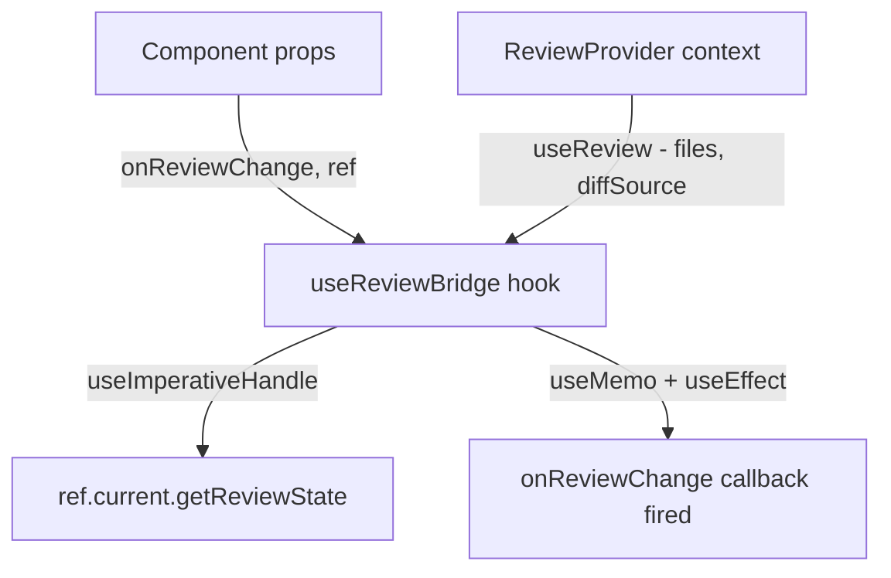
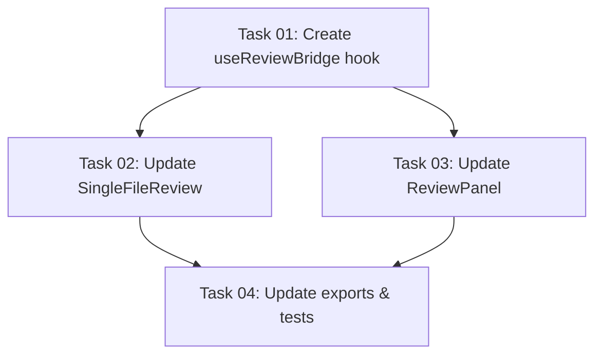

# Plan: Unify Review State Access Across Both Components

## Original Work Order

> `SingleFileReview` in `@self-review/react` accepts an `onReviewChange` prop but destructures it as `_onReviewChange` and never uses it. Consumers relying on this callback to read comments out of the component get nothing -- buttons gated on `comments.length > 0` stay permanently disabled.

## Executive Summary

Both review components (`SingleFileReview` and `ReviewPanel`) need to expose review state to consumers, but each currently offers only one access pattern — and `SingleFileReview`'s is broken. This plan unifies both components to support both patterns:

| Pattern | Use case | Currently on |
|---|---|---|
| `onReviewChange` callback (push) | Reactive UI: badge counts, button enabling | `SingleFileReview` (broken) |
| Imperative ref handle (pull) | One-shot reads: submit, serialize | `ReviewPanel` |

After this change, both components support both patterns. Consumers pick whichever fits their use case — or use both.

## Context

### Current State vs Target State

| Component | Current | Target |
|---|---|---|
| `SingleFileReview` | `onReviewChange` declared but unused (`_onReviewChange`); no ref handle | `onReviewChange` works; ref handle added via `forwardRef` |
| `ReviewPanel` | Ref handle works (`getReviewState()`); no callback | Ref handle still works; `onReviewChange` callback added |

### Background

Both components wrap content in the same provider hierarchy: `ReviewAdapterProvider > ConfigProvider > ReviewProvider > DiffNavigationProvider > TooltipProvider`. Review state lives inside `ReviewProvider` context, accessed via `useReview()`. Neither the callback nor the ref handle can work from the outer component directly — both need a child component inside the provider tree to bridge context state outward.

`ReviewPanel` already solves this with `ReviewPanelInner` (uses `useImperativeHandle` + `useReview()`). `SingleFileReview` has no equivalent inner component.

## Architectural Approach

Extract a single **`useReviewBridge` hook** that encapsulates both access patterns (callback + ref handle). Both components call this one hook from their inner component — no logic duplication.



### 1. Shared useReviewBridge Hook

**File**: `packages/react/src/hooks/useReviewBridge.ts`

A hook that consolidates all context-to-consumer bridging:

```ts
function useReviewBridge(
  ref: ForwardedRef<ReviewHandle>,
  onReviewChange?: (comments: ReviewComment[]) => void,
): void
```

Internally it:
- Calls `useReview()` to access `files` and `diffSource`
- Stores both in refs for stable `getReviewState()` reads (same pattern as current `ReviewPanelInner`)
- Calls `useImperativeHandle(ref, ...)` to expose `getReviewState()` — no-ops when ref is null
- Derives flat `comments` via `useMemo(() => files.flatMap(f => f.comments), [files])`
- Fires `onReviewChange(comments)` in a `useEffect` — skipped when callback is undefined

This replaces the ref logic currently in `ReviewPanelInner` and the proposed `ReviewChangeNotifier` with a single reusable hook.

### 2. Shared ReviewHandle Type

**File**: `packages/react/src/hooks/useReviewBridge.ts` (co-located with the hook)

```ts
export interface ReviewHandle {
  getReviewState: () => ReviewState;
}
```

Both `ReviewPanelHandle` and `SingleFileReviewHandle` become type aliases for `ReviewHandle`. This avoids maintaining two identical interface definitions. The existing `ReviewPanelHandle` export is preserved as a type alias for backwards compatibility.

### 3. SingleFileReview Changes

**File**: `packages/react/src/SingleFileReview.tsx`

- Remove the `_onReviewChange` rename — use `onReviewChange` directly
- Convert to `forwardRef<ReviewHandle, SingleFileReviewProps>`
- Add a `SingleFileReviewInner` component that calls `useReviewBridge(ref, onReviewChange)` and renders the `FileSection` content
- Export `SingleFileReviewHandle` (alias for `ReviewHandle`) from the package

### 4. ReviewPanel Changes

**File**: `packages/react/src/ReviewPanel.tsx`

- Add `onReviewChange?: (comments: ReviewComment[]) => void` to `ReviewPanelProps`
- Replace the manual `useReview()` + `useImperativeHandle` + refs logic in `ReviewPanelInner` with a single `useReviewBridge(ref, onReviewChange)` call
- `ReviewPanelHandle` becomes a type alias for `ReviewHandle` (backwards-compatible)

### 5. Package Exports

**File**: `packages/react/src/index.ts`

- Export `ReviewHandle` type (the canonical shared type)
- Export `SingleFileReviewHandle` type alias

## Files to Modify

| File | Change |
|---|---|
| `packages/react/src/hooks/useReviewBridge.ts` | **New** — shared hook + `ReviewHandle` type |
| `packages/react/src/SingleFileReview.tsx` | Fix `onReviewChange`, add `forwardRef` via `useReviewBridge` |
| `packages/react/src/ReviewPanel.tsx` | Add `onReviewChange`, replace manual ref logic with `useReviewBridge` |
| `packages/react/src/index.ts` | Export `ReviewHandle`, `SingleFileReviewHandle` |

## Risk Considerations and Mitigation Strategies

<details>
<summary>Technical Risks</summary>

- **Excessive re-renders from effect firing**: If `files` changes frequently, the effect could fire too often for consumers with expensive `onReviewChange` handlers.
    - **Mitigation**: `useMemo` ensures the flat comment array is only recomputed when `files` changes. Consumers with expensive handlers can debounce on their side (standard React callback contract).

- **Stale callback reference**: If the consumer passes a non-memoized `onReviewChange`, the effect could close over a stale version.
    - **Mitigation**: Include `onReviewChange` in the `useEffect` dependency array.

- **Breaking change on SingleFileReview**: Converting to `forwardRef` changes the component signature.
    - **Mitigation**: `forwardRef` is backwards-compatible — consumers not passing a ref see no change. The ref is optional.

</details>

## Success Criteria

1. `SingleFileReview` fires `onReviewChange` with current `ReviewComment[]` on every comment change.
2. `SingleFileReview` supports an imperative ref handle (`getReviewState()`) matching `ReviewPanel`'s API.
3. `ReviewPanel` fires `onReviewChange` with current `ReviewComment[]` on every comment change.
4. `ReviewPanel`'s existing ref handle continues to work unchanged.
5. When neither `onReviewChange` nor ref is passed, both components behave identically to today (no overhead).
6. All existing unit tests pass without modification.

## Self Validation

- Run `npm run test:unit` — all existing tests pass.
- Write unit tests for both components verifying:
  - `onReviewChange` fires when comments change
  - Ref handle returns correct `ReviewState`
- Verify `SingleFileReviewHandle` is exported from `@self-review/react`.

## Documentation

No external documentation updates required. The `onReviewChange` prop on `SingleFileReview` is already documented in its JSDoc. The new `onReviewChange` prop on `ReviewPanel` and the new ref handle on `SingleFileReview` will be documented via JSDoc on their respective interfaces.

## Resource Requirements

### Development Skills

- React context and hooks patterns (useContext, useMemo, useEffect, forwardRef, useImperativeHandle)
- TypeScript with strict mode

### Technical Infrastructure

- Existing Vitest test infrastructure for unit testing
- No new dependencies required

---

## Execution Blueprint

**Validation Gates:**
- Reference: `/config/hooks/POST_PHASE.md`

### Dependency Diagram



### Phase 1: Foundation
**Parallel Tasks:**
- Task 01: Create `useReviewBridge` hook + `ReviewHandle` type

### Phase 2: Component Updates
**Parallel Tasks:**
- Task 02: Update `SingleFileReview` — fix `onReviewChange`, add `forwardRef` (depends on: 01)
- Task 03: Update `ReviewPanel` — add `onReviewChange`, replace manual ref logic (depends on: 01)

### Phase 3: Integration
**Parallel Tasks:**
- Task 04: Update `index.ts` exports + write unit tests (depends on: 02, 03)

### Post-phase Actions

- Run `npm run test:unit` to verify all tests pass

### Execution Summary
- Total Phases: 3
- Total Tasks: 4
- Maximum Parallelism: 2 tasks (Phase 2)
- Critical Path Length: 3 phases
