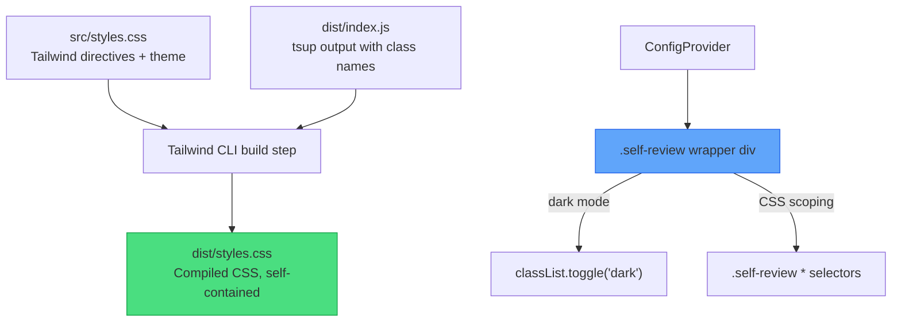
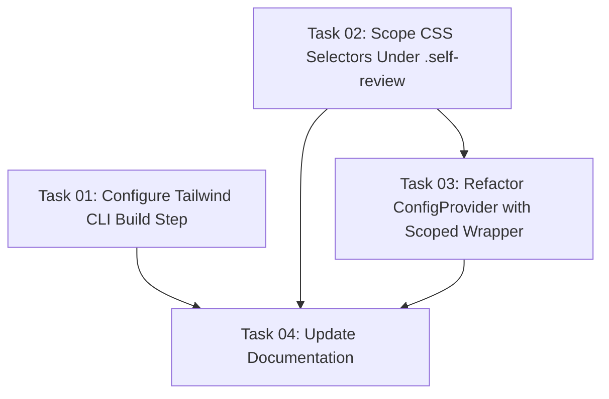

# Plan: Fix @self-review/react — Ship CSS & Scope Theme Side-Effects

## Original Work Order

> Host apps consuming `@self-review/react` hit two issues:
> 1. `dist/styles.css` does not exist — the build does not produce it despite package.json declaring the export
> 2. ConfigProvider mutates `document.documentElement` — the `dark` class toggle is a global side-effect that conflicts with host apps managing their own theme
>
> Fix 1: Ship compiled Tailwind CSS via a build step. Fix 2: Scope the theme class to a container element owned by the library.

## Plan Clarifications

| Question | Answer |
|----------|--------|
| Global CSS selectors (`*`) in styles.css — scope, leave, or remove? | Scope to a `.self-review` container selector |
| Move `tailwindcss` from peerDependencies to devDependencies? | Yes — host apps only need the compiled CSS |
| Backward compatibility for `@source` pattern? | Not needed — compiled CSS is the new canonical approach |
| Single wrapper div for both dark class and CSS scoping? | Yes — one `.self-review` div handles both |

## Executive Summary

The `@self-review/react` package has two packaging defects that make it a poor citizen in host applications. First, `package.json` declares a `./styles.css` export pointing to `dist/styles.css`, but the tsup build never produces this file — forcing host apps to configure Tailwind `@source` directives pointing at `node_modules`. Second, `ConfigProvider` toggles the `dark` class on `document.documentElement`, a global DOM mutation that conflicts with any host app managing its own theme.

This plan adds a Tailwind CLI build step to produce self-contained compiled CSS, and introduces a `.self-review` scoping wrapper in `ConfigProvider` that contains both the `dark` class toggle and all CSS side-effects within the library's DOM subtree. After this change, host apps simply `import '@self-review/react/styles.css'` with no Tailwind dependency and no global side-effects.

## Context

### Current State vs Target State

| Current State | Target State | Why? |
|---|---|---|
| `dist/styles.css` does not exist | `dist/styles.css` ships compiled Tailwind utilities + theme CSS | Host apps need a working CSS import without Tailwind toolchain |
| `tailwindcss` is a peerDependency | `tailwindcss` is a devDependency | Host apps shouldn't need Tailwind installed to use the library |
| `@tailwindcss/typography` is a peerDependency | `@tailwindcss/typography` is a devDependency | Typography plugin classes are compiled into the shipped CSS |
| `ConfigProvider` toggles `dark` on `document.documentElement` | `dark` class scoped to a `.self-review` wrapper div | Prevents global DOM side-effects conflicting with host theme |
| Global `*` selectors (border-color, scrollbar) apply to entire page | Selectors scoped under `.self-review` | Prevents style leakage into host app |
| `ConfigProvider` renders no DOM — pure context provider | `ConfigProvider` renders a `.self-review` wrapper div | Single element handles both theme scoping and CSS containment |

### Background

- The library uses **Tailwind CSS v4** with `@custom-variant dark (&:is(.dark *))` syntax. This means `dark:` utilities activate when any ancestor has the `.dark` class — scoping to a wrapper div works natively.
- The source `styles.css` contains: Tailwind `@theme inline` block, `:root`/`.dark` CSS variable definitions, global `*` selectors, MDEditor overrides, and prose styling overrides.
- The current build uses `tsup` (ESM-only, dts, sourcemap, treeshake). It does not process CSS.
- The Electron app (the original host) has its own `src/index.css` that duplicates the theme definitions and uses Webpack + PostCSS to compile Tailwind. This plan does not change the Electron app's build.
- This is a companion to Dalia plan 97 which addresses the host-app side workarounds.

## Architectural Approach

### Component 1: Tailwind CLI Build Step

**Objective**: Produce `dist/styles.css` containing all compiled Tailwind utility classes used by the library's components, plus the theme variables and component overrides.

The approach uses the **Tailwind CSS v4 CLI** (`@tailwindcss/cli`) as a build-time tool:

1. Create a build entrypoint CSS file (e.g., `src/build-styles.css`) that imports Tailwind and the library's `styles.css`. This file is build-only and not shipped.
2. Add `@tailwindcss/cli` as a devDependency.
3. Add a `build:css` npm script that runs `npx @tailwindcss/cli -i src/build-styles.css -o dist/styles.css --minify` with `--content dist/index.js` to scan the bundled JS for class names (Tailwind v4 auto-detects content sources, but we may need to configure the scan path).
4. Update the `build` script to run `tsup && npm run build:css` (CSS build depends on JS output existing first for class name scanning).
5. Move `tailwindcss` and `@tailwindcss/typography` from `peerDependencies` to `devDependencies`. Add `@tailwindcss/cli` to `devDependencies`.

**Key detail**: Tailwind v4's CLI auto-detects source files by looking for known content extensions. Since we want it to scan `dist/index.js` specifically, we'll use `@source` in the build entrypoint CSS to point at the dist directory.

### Component 2: CSS Scoping Under `.self-review`

**Objective**: Ensure all global CSS selectors in `styles.css` only affect DOM within the library's subtree, not the host application.

Refactor `src/styles.css` to nest global selectors under `.self-review`:

- `* { border-color: ... }` → `.self-review * { border-color: ... }` (or via CSS nesting: `.self-review { & * { ... } }`)
- `* { scrollbar-width: thin }` → same scoping
- All scrollbar pseudo-element selectors → scoped
- `.token.table` override → scoped
- `:root` variable definitions remain global (they define CSS custom properties used by `hsl(var(--...))` references — these are inert without the utility classes)
- `.dark` variable overrides → these already work correctly since they'll be scoped by the wrapper

The `.self-review` class will be applied by the wrapper div rendered by `ConfigProvider`.

### Component 3: Theme Scoping in ConfigProvider

**Objective**: Replace the global `document.documentElement.classList.toggle('dark', ...)` with a scoped class toggle on a wrapper element owned by the library.

Changes to `ConfigProvider`:

1. Add a `useRef<HTMLDivElement>` for the wrapper element.
2. Render a `
` wrapping `{children}`.
3. In the theme effect, replace `document.documentElement.classList.toggle('dark', isDark)` with `themeRef.current?.classList.toggle('dark', isDark)`.
4. The Prism theme `<style>` injection can remain global — it targets elements by class name and doesn't leak side-effects.
5. The wrapper div should use `display: contents` or receive appropriate CSS to avoid introducing layout side-effects. Since `ReviewPanelInner` already renders a `
`, and `ConfigProvider` sits above it in the tree, the wrapper needs to not interfere with the host's layout expectations.

**Important consideration**: `display: contents` makes the element invisible to layout but it still participates in the DOM for CSS matching (`.self-review *` selectors work). However, `display: contents` has known accessibility issues with some screen readers. An alternative is to make the wrapper `display: flex; flex-direction: column; height: 100%; width: 100%` or simply inherit the parent's layout. Given that `ReviewPanel` is typically rendered as a full-viewport component, a flex column wrapper is safe.

### Component 4: Electron App Alignment

**Objective**: Ensure the Electron app (the primary consumer) continues to work after these changes.

The Electron app has its own `src/index.css` with duplicated theme definitions and its own Webpack + PostCSS build. It imports `ConfigProvider` from `@self-review/react` via source path. After this change:

- The `ConfigProvider` will render the `.self-review` wrapper div — the Electron app's CSS needs to handle this. Since the Electron app's `src/index.css` uses global selectors (not scoped), its styles will still apply inside the wrapper.
- The `dark` class will now be on the `.self-review` wrapper instead of `<html>`. The Electron app's `src/index.css` defines `.dark { ... }` at the root level for CSS variable overrides — these will still work because CSS custom properties inherit through the DOM tree regardless of which element defines them, as long as the `.dark` selector matches. The `.self-review.dark` element's variable values will cascade to its children.
- The Electron app does NOT import `dist/styles.css` — it compiles its own CSS via Webpack. So the new compiled CSS file is irrelevant to the Electron app build.

## Risk Considerations and Mitigation Strategies

Technical Risks

- **Tailwind v4 CLI content scanning**: The CLI needs to find all class names used in `dist/index.js`. Tailwind v4 auto-detects content by default but may need explicit `@source` configuration for the dist directory.
    - **Mitigation**: Use `@source "../dist"` in the build entrypoint CSS to explicitly point Tailwind at the compiled JS.

- **CSS custom property inheritance with scoped `.dark`**: Moving `.dark` from `<html>` to a nested `
` changes which elements inherit the dark-mode CSS variable values. Variables defined on `.dark { --background: ... }` will only cascade to children of the wrapper, not to elements outside it (e.g., portals, modals rendered at document body).
    - **Mitigation**: Identify any components that render via React portals (tooltips, dropdowns, dialogs). Radix primitives used by shadcn/ui render portals to `document.body`. These portal elements will NOT be inside the `.self-review` wrapper and will lose dark-mode variable values. This needs to be addressed — likely by passing the portal container to Radix components so they render inside the wrapper, or by using Radix's `container` prop.

- **`display: contents` accessibility**: Some screen readers don't properly handle elements with `display: contents`.
    - **Mitigation**: Use a flex layout wrapper instead of `display: contents`.

Implementation Risks

- **Radix/shadcn portals escaping the scoped wrapper**: This is the highest-risk item. Components like `AlertDialog`, `Tooltip`, `Select`, and `Popover` render portals to `document.body` by default. These portals would be outside the `.self-review` wrapper and lose both dark-mode styling and CSS variable values.
    - **Mitigation**: Audit all shadcn/ui components used in the library. For each portal-based component, configure the portal container to render inside the wrapper. Radix primitives accept a `container` prop on their `Portal` sub-component. The `TooltipProvider` already wraps content — ensure tooltip portals target the wrapper.

- **Build order dependency**: CSS build must run after tsup (needs `dist/index.js` for class scanning).
    - **Mitigation**: Chain commands in the build script: `tsup && npm run build:css`.

## Success Criteria

### Primary Success Criteria

1. `npm run build` in `packages/react` produces both `dist/index.js` and `dist/styles.css`
2. `dist/styles.css` contains compiled Tailwind utilities including all `dark:` variants used by the library
3. A host app that imports `@self-review/react/styles.css` renders correctly without Tailwind installed
4. The host app's `<html>` element is never modified by the library — no `dark` class toggle on `document.documentElement`
5. Dark mode works correctly within the library's `.self-review` wrapper (including portal-based UI like tooltips and dialogs)
6. The Electron app continues to work with no visual regressions
7. All existing unit tests pass (`npm run test:unit` in `packages/react`)

## Self Validation

1. Run `cd packages/react && npm run build` — verify `dist/styles.css` exists and is non-empty
2. Inspect `dist/styles.css` — confirm it contains `dark\:` variant rules (search for representative classes like `bg-emerald-900` or `text-red-400`)
3. Run `npm run test:unit` in `packages/react` — confirm all tests pass
4. Run `npm run test:unit` at root — confirm no regressions in the Electron app
5. Run `npm run test:e2e` — confirm webapp e2e tests pass (these test the react package components)
6. In the Electron app, toggle between light/dark/system themes and verify correct rendering
7. Verify that tooltip and dialog components render with correct theme inside the scoped wrapper

## Documentation

- Update `packages/react/AGENTS.md` to document:
  - The `.self-review` wrapper div rendered by `ConfigProvider` and its dual purpose (theme + CSS scoping)
  - The Tailwind CLI build step and `build:css` script
  - That `tailwindcss` is now a devDependency, not a peerDependency
- Update `packages/react/src/styles.css` header comment to reflect that it's a build input, not a direct import
- Update `AGENTS.md` (root) if it references the theme toggle on `document.documentElement`

## Resource Requirements

### Development Skills

- Tailwind CSS v4 CLI configuration and content scanning
- CSS scoping strategies and CSS custom property inheritance
- React portal container management (Radix UI)
- npm package build pipelines (tsup + post-build steps)

### Technical Infrastructure

- `@tailwindcss/cli` (new devDependency)
- Existing: `tsup`, `tailwindcss`, `@tailwindcss/typography`

## Notes

- The `:root` CSS variable definitions in `styles.css` are intentionally left global — they define default values for the theme variables. When `.dark` is active on the scoped wrapper, the dark variable values override within that subtree via CSS inheritance.
- The Radix portal issue is the most architecturally significant part of this work. A thorough audit of all shadcn/ui components used in the library is essential before implementation.
- The Electron app's `src/index.css` duplicates the theme variable definitions from the react package's `styles.css`. This duplication is pre-existing and out of scope for this plan.

## Execution Blueprint

**Validation Gates:**
- Reference: `/config/hooks/POST_PHASE.md`

### ✅ Phase 1: Build Tooling & CSS Scoping
**Parallel Tasks:**
- ✔️ Task 01: Configure Tailwind CLI Build Step (status: completed)
- ✔️ Task 02: Scope CSS Selectors Under `.self-review` (status: completed)

### ✅ Phase 2: Component Refactoring
**Parallel Tasks:**
- ✔️ Task 03: Refactor ConfigProvider with Scoped `.self-review` Wrapper (status: completed)

### ✅ Phase 3: Documentation
**Parallel Tasks:**
- ✔️ Task 04: Update Documentation (status: completed)

### Execution Summary

**Status**: ✅ Completed Successfully
**Completed Date**: 2026-03-14

#### Results

- `npm run build` in `packages/react` produces both `dist/index.js` (181 KB) and `dist/styles.css`
  (62 KB compiled CSS with 28 dark-variant utility classes)
- `dist/styles.css` contains compiled Tailwind utilities scoped under `.self-review` with dark
  variant rules using `&:is(.dark *)` selectors
- `ConfigProvider` renders a `
`
  wrapper; dark class is toggled on this wrapper, never on `document.documentElement`
- All portal-based UI components (AlertDialog, DropdownMenu, Select, Tooltip) use
  `portalContainer` from ConfigContext to render inside the scoped subtree
- All 139 unit tests pass (36 main process + 103 renderer)
- Lint passes with no errors

#### Noteworthy Events

- The dropdown-menu, select, and tooltip components use `@base-ui/react` (not Radix UI as the
  task description assumed). The Base UI `Portal` component accepts a `container` prop via
  `FloatingPortal.Props`, so the same pattern worked correctly.
- `styles.css` did not previously import `tailwindcss` base styles, so `build-styles.css`
  needed `@import "tailwindcss"` and `@plugin "@tailwindcss/typography"` in addition to
  `@import "./styles.css"` to generate utility classes.
- The `dark:` class check in the success criteria used literal string `dark:` but compiled CSS
  escapes the colon as `dark\:`, confirmed via regex: 28 dark-variant utility classes present.

#### Recommendations

- The Electron app's `src/index.css` duplicates theme variable definitions from the react
  package — this pre-existing duplication remains out of scope but could be cleaned up later.
- Consider adding a CI check that `dist/styles.css` is non-empty after build.

- Total Phases: 3
- Total Tasks: 4
- Maximum Parallelism: 2 tasks (Phase 1)
- Critical Path Length: 3 phases
