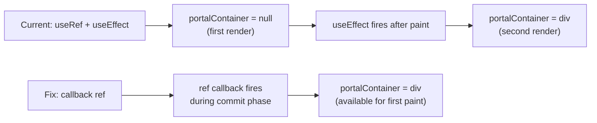
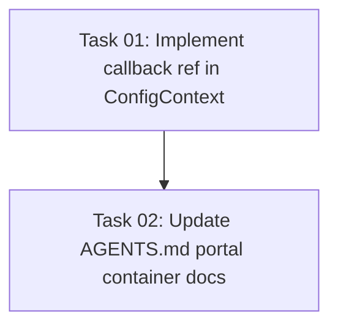

# Plan: Fix Portal Container Null on First Render

## Original Work Order

> GitHub Issue #60: fix(react): portal container is null on first render
>
> In `ConfigContext.tsx`, `portalContainer` is `null` on the first render and only set after mount
> via `useEffect`. Any Radix/Base UI portal-based component that renders immediately (e.g., a dialog
> with `defaultOpen`, a tooltip with `delayDuration={0}`) will portal to `document.body` instead of
> the `.self-review` wrapper — inheriting no CSS custom properties and no dark mode class.

## Executive Summary

`@self-review/react` is a library package consumed by host applications (the Electron app, the
webapp e2e harness, and potentially third-party integrations). Its `ConfigProvider` exports a
`portalContainer` context value that all Radix portal-based components rely on for theme scoping
and CSS containment.

The current `useRef` + `useEffect` pattern leaves `portalContainer` as `null` during the first
render cycle. Any host app that renders a portal-based component immediately (e.g., a dialog with
`defaultOpen`, a tooltip with `delayDuration={0}`) will have that portal escape to `document.body`,
losing the `.self-review` wrapper's dark mode class and CSS custom properties.

The fix replaces the `useRef` + `useEffect` approach with a callback ref that sets state
synchronously during ref assignment. This eliminates the null-on-first-render window without
blocking the browser paint (unlike `useLayoutEffect`). The change is internal to the library —
no API changes, no breaking changes for consumers.

## Context

### Current State vs Target State

| Current State | Target State | Why? |
|---|---|---|
| `portalContainer` is `null` on first render | `portalContainer` is set synchronously when the wrapper div mounts | Portal-based components rendering immediately (e.g., `defaultOpen` dialogs) go to `document.body`, losing theme scoping |
| Uses `useRef` + `useEffect` to capture wrapper div | Uses callback ref to set state on ref assignment | Callback ref fires synchronously during commit phase, before effects |
| AGENTS.md documents the null-on-first-render as known behavior | AGENTS.md reflects that portal container is available immediately | Documentation should match actual behavior |

### Background

The issue was identified during adversarial review of PR #58. This is a bug in the
`@self-review/react` package's `ConfigProvider` component. Two consumers share this code path:

1. **Electron app** — `src/renderer/App.tsx` imports `ConfigProvider` directly from
   `packages/react/src/context/ConfigContext` and wraps the entire `AppContent` tree with it.
2. **Webapp e2e harness** (and any future external consumers) — imports `ConfigProvider` from
   the `@self-review/react` package entry point.

Both consumers use the same `ConfigProvider`, so the fix in `ConfigContext.tsx` covers both
automatically. While neither consumer currently triggers the race condition (no components use
`defaultOpen` or zero-delay patterns today), any standard Radix pattern could hit it.

Five internal UI components consume `portalContainer`: `alert-dialog`, `dropdown-menu`, `select`,
`tooltip`, and their sub-variants. All pass it as the `container` prop to Radix `Portal` primitives.

## Architectural Approach

### Callback Ref Implementation

**Objective**: Eliminate the null-on-first-render window by setting `portalContainer` synchronously
when React attaches the ref to the DOM node.

Replace the current pattern:

- Remove `useRef<HTMLDivElement>(null)` for `wrapperRef`
- Remove the `useEffect` that sets `portalContainer` from `wrapperRef.current`
- Create a callback ref function (stabilized with `useCallback`) that calls `setPortalContainer`
  when invoked with a non-null node
- Pass the callback ref as `ref` on the wrapper `
`

The callback ref fires during React's commit phase — after DOM mutations but before effects. This
means `portalContainer` will be set by the time any child `useEffect` or `useLayoutEffect` runs,
and critically, before the browser paints.

The theme-application `useEffect` currently references `wrapperRef.current` directly. Since
`wrapperRef` is being removed, the theme effect must be updated to use the `portalContainer` state
variable instead (which is the same DOM node, just accessed differently).

### Documentation Update

**Objective**: Update AGENTS.md to reflect the new behavior.

The `packages/react/AGENTS.md` section "Radix/Base UI portal containers" currently documents:
> The `portalContainer` is `null` on the first render (portals fall back to `document.body`) and
> is set to the wrapper div after mount via `useEffect`.

This text must be updated to reflect that the portal container is now available synchronously via
a callback ref.

## Risk Considerations and Mitigation Strategies

Technical Risks

- **Theme effect depends on wrapperRef**: The theme-application `useEffect` references
  `wrapperRef.current` directly. After removing `wrapperRef`, it must use `portalContainer` instead.
    - **Mitigation**: Update the theme effect's dependency and reference to use the state variable.
      Since the state is set synchronously via callback ref, `portalContainer` will be non-null by
      the time the theme effect runs.

- **Callback ref called with null on unmount**: React calls callback refs with `null` when the
  component unmounts.
    - **Mitigation**: Guard the `setPortalContainer` call with a null check — only set when the
      node is non-null.

Implementation Risks

- **Minimal blast radius**: Only `ConfigContext.tsx` and `AGENTS.md` change. No consumer components
  need modification since they already read `portalContainer` from context.
    - **Mitigation**: The `portalContainer` context value type and contract remain unchanged.

## Success Criteria

### Primary Success Criteria

1. `portalContainer` is non-null by the time any child component's first render completes
2. All existing unit tests pass without modification
3. The theme effect continues to work correctly (dark mode toggling on the wrapper div)
4. No TypeScript compilation errors

## Self Validation

1. Run `npm run test:unit:renderer` to confirm all existing renderer tests pass
2. Run `npm run test:unit:main` to confirm main process tests are unaffected
3. Run TypeScript type-check to verify no type errors in both `packages/react` and `src/renderer`
4. Inspect `ConfigContext.tsx` to confirm `useRef` and the portal-setting `useEffect` are removed
5. Confirm the callback ref guards against null (unmount case)
6. Confirm the theme `useEffect` references `portalContainer` state instead of `wrapperRef.current`
7. Verify the Electron app's `App.tsx` import of `ConfigProvider` still compiles (no API change)

## Documentation

- Update `packages/react/AGENTS.md` — "Radix/Base UI portal containers" section to reflect the
  callback ref pattern and removal of the null-on-first-render caveat

## Resource Requirements

### Development Skills

- React hooks (callback refs, `useCallback`, `useState`)
- Radix UI portal containment model

### Technical Infrastructure

- Existing test suite (Vitest + jsdom)
- TypeScript compiler for type verification

## Execution Blueprint

**Validation Gates:**
- Reference: `/config/hooks/POST_PHASE.md`

### Dependency Diagram

### ✅ Phase 1: Implement Fix

**Parallel Tasks:**
- ✔️ Task 01: Implement callback ref pattern in ConfigContext (no dependencies)

### ✅ Phase 2: Update Documentation

**Parallel Tasks:**
- ✔️ Task 02: Update AGENTS.md portal container docs (depends on: 01)

### Post-phase Actions

- Run `npm run test:unit:renderer` to confirm all renderer tests pass
- Run `npm run test:unit:main` to confirm main process tests are unaffected
- Run TypeScript type-check across `packages/react` and `src/renderer`

### Execution Summary

- Total Phases: 2
- Total Tasks: 2
- Maximum Parallelism: 1 task (each phase has 1 task)
- Critical Path Length: 2 phases

## Execution Summary

**Status**: ✅ Completed Successfully
**Completed Date**: 2026-03-14

### Results

- Replaced `useRef` + `useEffect` in `ConfigProvider` with a `useCallback`-stabilized callback ref that sets `portalContainer` synchronously during React's commit phase, eliminating the null-on-first-render window.
- Updated `packages/react/AGENTS.md` to remove the null-on-first-render caveat and document the new callback ref behavior.
- All 140 unit tests (104 renderer + 36 main) pass. TypeScript type checks pass for both `packages/react` and `src/renderer`.

### Noteworthy Events

No significant issues encountered. The pre-commit hook enforces a 50-char subject line limit; commit messages were adjusted accordingly.

### Recommendations

No follow-up actions required. The fix covers all five Radix portal consumers (`alert-dialog`, `dropdown-menu`, `select`, `tooltip`, and sub-variants) automatically via the shared context.
