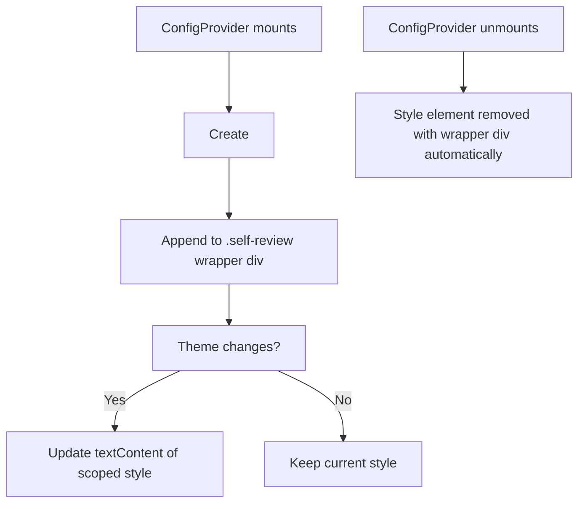

# Plan: Scope Prism Theme Style Tag Per ConfigProvider Instance

## Original Work Order

> to fix #59

GitHub Issue #59: **fix(react): scope Prism theme style tag per ConfigProvider instance**

## Plan Clarifications

| Question | Answer |
|---|---|
| Should the fix target only `@self-review/react` or also the Electron app? | Both — but since the Electron app imports `ConfigProvider` from the react package, fixing `packages/react/src/context/ConfigContext.tsx` covers both consumers in a single change. |

## Executive Summary

`ConfigContext.tsx` in `packages/react/` injects a Prism syntax theme via a single global `<style id="prism-theme">` element in `document.head`. When multiple `ConfigProvider` instances exist (e.g., two `SingleFileReview` components with different themes in a host app importing `@self-review/react`), they fight over the same style tag — last write wins.

The fix is to inject the `<style>` element inside the `.self-review` wrapper div instead of `document.head`, so it's naturally scoped to that subtree. This aligns with the CSS scoping work done in PR #58 and eliminates the collision without adding complexity. Since the Electron app also imports `ConfigProvider` from `packages/react/`, the fix applies to both consumers through a single code change.

## Context

### Current State vs Target State

| Current State | Target State | Why? |
|---|---|---|
| Single global `<style id="prism-theme">` in `document.head` | `<style>` element inside the `.self-review` wrapper div per instance | Multiple ConfigProviders fight over the same style tag |
| Style element looked up by hardcoded `id="prism-theme"` | Style element created/updated via ref within the wrapper | Hardcoded ID prevents multiple coexisting instances |
| Prism theme CSS applies globally | Prism theme CSS scoped to each `.self-review` subtree | Host apps or sibling instances shouldn't be affected |

### Background

PR #58 scoped CSS custom properties from `:root` to `.self-review` / `.self-review.dark`, preventing variable leakage into host apps. However, the Prism theme injection was missed — it still uses a global `<style>` element in `document.head` with a hardcoded `id`. This issue was found during adversarial review of PR #58.

## Architectural Approach

### Inject Style Inside Wrapper Div

**Objective**: Replace the global `document.head` style injection with a locally-scoped `<style>` element inside the `.self-review` wrapper div.

The `applyTheme` function in `ConfigContext.tsx` currently queries `document.getElementById('prism-theme')` and creates/updates a `<style>` element in `document.head`. Instead:

1. Use a `useRef` to hold a reference to a `<style>` element created within the wrapper div.
2. On mount (when `wrapperRef.current` is available), create the `<style>` element and append it to the wrapper div.
3. On theme changes, update the `textContent` of the ref'd style element.
4. On unmount, the style element is automatically cleaned up when the wrapper div is removed from the DOM. An explicit cleanup in the effect's teardown ensures no leak if the wrapper persists.

This approach requires scoping the Prism CSS selectors. Since Prism applies classes like `.token.comment` to `` elements, and a `<style>` inside the wrapper div will naturally apply to descendants, no CSS selector rewriting is needed — CSS cascade handles it. The `<style>` element inside the wrapper naturally scopes to that subtree since all Prism-highlighted code lives within the same wrapper.

### Cleanup of Global Style ID

**Objective**: Remove the hardcoded `id="prism-theme"` pattern entirely.

The `document.getElementById('prism-theme')` lookup and the `styleEl.id = 'prism-theme'` assignment should be removed completely. The style element is now tracked via a React ref, not a DOM ID.

## Risk Considerations and Mitigation Strategies

Technical Risks

- **CSS specificity conflicts**: A `<style>` inside the wrapper has the same specificity as one in `<head>`. If the host app also loads Prism themes globally, there could be specificity fights.
    - **Mitigation**: The scoped style is closer to the target elements in the DOM tree, and appears later in document order, so it will naturally win. This is the same behavior as today but without cross-instance conflicts.

Implementation Risks

- **Style element not created before first render**: If the wrapper ref isn't available on the first effect run, the style element won't exist yet.
    - **Mitigation**: Use the existing `wrapperRef` which is already set up with this pattern — the portal container effect already handles this timing.

## Success Criteria

### Primary Success Criteria

1. Two `ConfigProvider` instances with different themes (light/dark) can coexist on the same page without interfering with each other's Prism syntax highlighting.
2. The global `<style id="prism-theme">` element is no longer created in `document.head`.
3. Existing unit and e2e tests continue to pass.

## Self Validation

1. Run `npm run test:unit` and verify all tests pass.
2. Run `npm run test:e2e` and verify all webapp e2e tests pass.
3. Inspect the `ConfigContext.tsx` source and confirm no references to `document.getElementById('prism-theme')` or `document.head.appendChild` remain.
4. Search the entire codebase for `prism-theme` to confirm the hardcoded ID is fully removed from source files (may still appear in docs/PRD).

## Documentation

- Update `docs/PRD.md` if it references the `prism-theme` style tag mechanism (minor, only if the reference is prescriptive).
- No AGENTS.md or README changes needed — this is an internal implementation detail.

## Resource Requirements

### Development Skills

- React (refs, effects, cleanup)
- CSS scoping / cascade behavior
- TypeScript

### Technical Infrastructure

- Existing Vitest and Playwright test suites

## Execution Blueprint

**Validation Gates:**
- Reference: `/config/hooks/POST_PHASE.md`

### ✅ Phase 1: Implement Scoped Prism Style Injection
**Parallel Tasks:**
- ✔️ Task 01: Scope Prism theme style tag to wrapper div `status: completed`

### Post-phase Actions
- Run `npm run test:unit` and `npm run test:e2e` to confirm all tests pass.
- Search for `prism-theme` in source files to confirm no stale references remain.

### Execution Summary
- Total Phases: 1
- Total Tasks: 1
- Maximum Parallelism: 1 task (Phase 1)
- Critical Path Length: 1 phase
