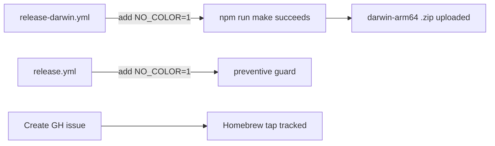

# Plan: Fix macOS Build & Homebrew Follow-Up

## Original Work Order

> to address https://github.com/e0ipso/self-review/issues/57

Issue #57 reports: (1) no prebuilt darwin-arm64 assets in recent releases, and (2) a request for Homebrew distribution support on macOS.

## Plan Clarifications

| Question | Answer |
|----------|--------|
| Should the plan cover both the build fix and Homebrew? | Both: fix the build + create a GitHub issue for Homebrew |
| What form should the Homebrew work take? | GitHub issue only — no code changes for Homebrew |
| Which fix approach for the build? | `NO_COLOR=1` env var — the no-color.org standard |

## Executive Summary

The macOS release workflow (`release-darwin.yml`) has been broken since v1.28.2 (2026-03-12). The `npm run make` step crashes with `RangeError: Maximum call stack size exceeded` in `colorette@2.0.20`'s `replaceClose()` function. This was triggered by the large refactor in commit `d74b28d` which added ~60 new files, increasing webpack's output volume past the point where colorette's unbounded recursion overflows the stack.

The fix is setting `NO_COLOR=1` in the macOS workflow environment, which makes colorette use identity functions and eliminates the recursive code path entirely. The same fix should be applied to the Linux workflow for consistency and prevention. A separate GitHub issue will be created to track Homebrew tap support as future work.

## Context

### Current State vs Target State

| Current State | Target State | Why? |
|---|---|---|
| macOS build crashes with colorette stack overflow | macOS build succeeds and produces darwin-arm64 .zip | Users cannot install on macOS |
| v1.28.2–v1.28.5 have no macOS assets | All future releases include macOS assets | darwin-arm64 users are stuck on v1.28.1 |
| No Homebrew distribution | GitHub issue tracking Homebrew tap work | Provide a roadmap for easier macOS updates |
| Linux workflow has no NO_COLOR guard | Linux workflow also sets NO_COLOR=1 | Prevent same failure if module count grows further |

### Background

- **colorette@2.0.20** is the latest version — no upstream fix exists.
- The `replaceClose()` function (line 49-57 in `colorette/index.cjs`) uses unbounded recursion to strip nested ANSI close sequences from strings.
- In GitHub Actions, `isCI=true` enables color processing in colorette (line 41-47), which activates the recursive `replaceClose` path.
- The v1.28.2 refactor (`d74b28d`) added ~60 new source files, significantly increasing the number of webpack modules and the size of webpack's ANSI-colored console output.
- `NO_COLOR` is a widely adopted standard (https://no-color.org/) that all major CLI tools respect.

## Architectural Approach

### Fix macOS Build Workflow

**Objective**: Eliminate the colorette stack overflow in the macOS release pipeline.

Add `NO_COLOR=1` as a workflow-level environment variable in `.github/workflows/release-darwin.yml`. This disables colorette's ANSI processing globally for the entire workflow run. The `env` block goes at the top level so it applies to all steps, including `npm run make`.

### Apply Same Fix to Linux Workflow

**Objective**: Prevent the same failure from occurring in the Linux release pipeline as the codebase continues to grow.

Add `NO_COLOR=1` to `.github/workflows/release.yml` at the workflow level. The Linux build currently succeeds because it uses Node 24 which may have a larger default stack, but this is a fragile situation.

### Create Homebrew GitHub Issue

**Objective**: Track Homebrew tap support as a follow-up work item.

Create a GitHub issue on `e0ipso/self-review` documenting the request for a Homebrew Cask distribution, referencing issue #57. The issue should outline the high-level approach: create a `homebrew-tap` repo with a Cask formula pointing to the darwin-arm64 .zip release asset, and optionally automate formula bumps in the release CI.

### Re-run Failed Builds

**Objective**: Verify the fix works and produce macOS assets for the latest release.

After merging the workflow fix, manually trigger the `release-darwin.yml` workflow for the latest tag (v1.28.5) to produce the missing macOS asset.

## Risk Considerations

Technical Risks

- **CI log readability**: `NO_COLOR=1` removes ANSI color codes from workflow logs.
    - **Mitigation**: GHA logs are still fully readable without colors. All information is preserved — only formatting is lost.
- **Other tools affected by NO_COLOR**: Some tools may change behavior when `NO_COLOR` is set.
    - **Mitigation**: `NO_COLOR` is a well-established standard. All major tools handle it gracefully by simply omitting color codes.

Implementation Risks

- **Fix doesn't resolve the issue**: The stack overflow could have a different trigger.
    - **Mitigation**: The stack trace clearly shows `replaceClose` recursion. `NO_COLOR` bypasses this code path entirely (line 33: `isDisabled = "NO_COLOR" in env`). This is deterministic.

## Success Criteria

### Primary Success Criteria

1. `release-darwin.yml` workflow completes successfully when triggered for v1.28.5
2. A `Self.Review-darwin-arm64-*.zip` asset is uploaded to the GitHub Release
3. A GitHub issue for Homebrew tap support exists, referencing issue #57
4. Both `release.yml` and `release-darwin.yml` have `NO_COLOR=1` set

## Self Validation

1. After merging, trigger the macOS workflow manually: `gh workflow run release-darwin.yml -f tag=v1.28.5 --repo e0ipso/self-review`
2. Monitor the run: `gh run list --workflow=release-darwin.yml --repo e0ipso/self-review --limit 1`
3. Once complete, verify the release has a macOS asset: `gh release view v1.28.5 --repo e0ipso/self-review --json assets --jq '[.assets[].name]'`
4. Verify the Homebrew issue was created: `gh issue list --repo e0ipso/self-review --label enhancement --search "Homebrew"`

## Documentation

- Update AGENTS.md if any workflow behavior changes are significant enough to document (unlikely for this change).
- The Homebrew GitHub issue itself serves as documentation for the future work.

## Resource Requirements

### Development Skills

- GitHub Actions workflow configuration
- Understanding of Node.js environment variables and the NO_COLOR standard

### Technical Infrastructure

- GitHub CLI (`gh`) for issue creation and workflow triggering
- Write access to `.github/workflows/` directory

## Execution Blueprint

**Validation Gates:**
- Reference: `/config/hooks/POST_PHASE.md`

### ✅ Phase 1: CI Fix & Homebrew Issue
**Parallel Tasks:**
- ✔️ Task 01: Add NO_COLOR=1 to release-darwin.yml and release.yml
- ✔️ Task 02: Create Homebrew tap GitHub issue

### Post-phase Actions
Run POST_PHASE.md validation gate after Phase 1.

### Execution Summary
- Total Phases: 1
- Total Tasks: 2
- Maximum Parallelism: 2 tasks (in Phase 1)
- Critical Path Length: 1 phase

## Execution Summary

**Status**: ✅ Completed Successfully
**Completed Date**: 2026-03-14

### Results
- Added `NO_COLOR: "1"` workflow-level env to both `release-darwin.yml` and `release.yml`, fixing the colorette stack overflow that broke macOS builds since v1.28.2
- Created GitHub issue #62 tracking Homebrew Cask distribution support, referencing issue #57

### Noteworthy Events
- The `.ai/task-manager/` directory is gitignored, so task manager files were not included in the commit. Only the workflow files were committed.
- Post-merge self-validation (triggering `release-darwin.yml` for v1.28.5 and verifying macOS assets) must be performed manually after the PR is merged.

### Recommendations
- After merging, trigger the macOS workflow: `gh workflow run release-darwin.yml -f tag=v1.28.5 --repo e0ipso/self-review`
- Monitor the run to confirm the fix works and macOS assets are uploaded
