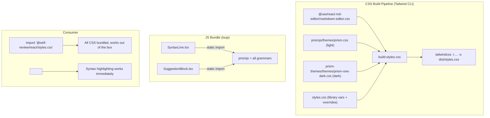
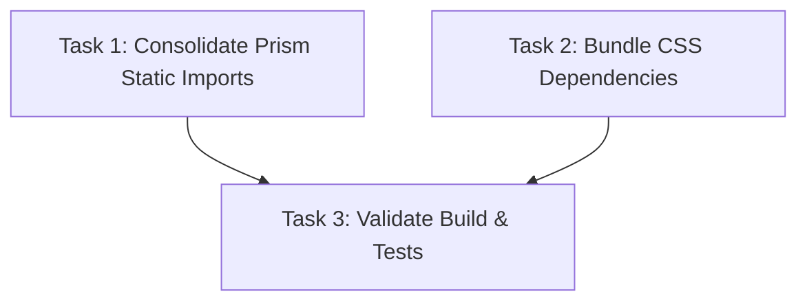

# Plan: Fix Dark Mode Editor & Syntax Highlighting in @self-review/react

## Original Work Order

> Fix: Dark mode WYSIWYG editor unreadable + diff viewer missing syntax highlighting
>
> There are two bugs in @self-review/react when consumed by a host application:
>
> Bug 1: WYSIWYG comment editor unreadable in dark mode — @uiw/react-md-editor textarea has dark text on dark background.
>
> Bug 2: Diff viewer has no syntax highlighting colors — all code renders as plain monochrome text.

## Executive Summary

The `@self-review/react` package has two CSS-related bugs when consumed by external applications. Both stem from the same root cause: the package's CSS build pipeline (`tailwindcss -i src/build-styles.css -o dist/styles.css`) only includes Tailwind utilities and the library's own CSS variables — it does **not** bundle the CSS from third-party dependencies (`@uiw/react-md-editor` and Prism themes). Additionally, the `SyntaxLine` component uses dynamic `import('prismjs')` which fails when tsup externalizes prismjs, while a working static import already exists in `SuggestionBlock`.

The fix consolidates Prism loading to a single static import path and bundles all required CSS (md-editor + Prism themes) into `dist/styles.css` so the package works out of the box.

## Context

### Current State vs Target State

| Current State | Target State | Why? |
|---|---|---|
| `build-styles.css` only imports Tailwind + library styles | `build-styles.css` also imports md-editor CSS and Prism theme CSS | Consumers get unstyled editor and unhighlighted code |
| `dist/styles.css` has 0 `.token` selectors | `dist/styles.css` contains scoped Prism light+dark theme selectors | Syntax highlighting must work without consumer passing CSS strings |
| `dist/styles.css` has 0 `wmde-markdown` / `data-color-mode` selectors | `dist/styles.css` contains md-editor dark mode selectors | Editor text invisible in dark mode |
| `SyntaxLine` uses dynamic `import('prismjs')` via `loadPrism()` | `SyntaxLine` uses static `import Prism from 'prismjs'` directly | Dynamic imports fail when tsup externalizes prismjs |
| Two separate Prism loading paths (static in SuggestionBlock, dynamic in SyntaxLine) | Single static Prism import shared across both | Eliminates redundancy and bundling issues |
| Static imports cover 11 languages; dynamic covers ~35 | Static imports cover all ~35 languages | No language regression after removing dynamic path |
| `prismLightCss`/`prismDarkCss` props required for syntax colors | Props still available as override, but defaults work out of the box | Library should be zero-config for common use cases |

### Background

**Build pipeline:** The package uses tsup for JS bundling and a separate Tailwind CLI step for CSS. tsup marks CSS imports as external (does not inject them). The Tailwind CLI only processes what's imported in `build-styles.css`. This means any third-party CSS not explicitly imported there is lost.

**Prism architecture:** `SuggestionBlock.tsx` statically imports `Prism` + 11 language grammars. `SyntaxLine.tsx` uses a dynamic `loadPrism()` that lazily imports `Prism` + ~35 language grammars. The dynamic approach was likely chosen to avoid loading all grammars upfront, but since tsup bundles everything into a single ESM chunk anyway, the dynamic imports just create bundling problems without saving any payload.

**Theme matching:** The Electron app uses `prismjs/themes/prism.css` (light) and `prism-themes/themes/prism-one-dark.css` (dark). The bundled defaults should match these choices for visual consistency.

## Architectural Approach

### CSS Bundling: md-editor Styles

**Objective**: Make the WYSIWYG comment editor readable in dark mode by bundling `@uiw/react-md-editor`'s CSS into `dist/styles.css`.

Add `@import '@uiw/react-md-editor/markdown-editor.css'` to `build-styles.css`. This CSS includes `[data-color-mode="dark"]` selectors that set white text on dark backgrounds. The Tailwind CLI will inline this into the final `dist/styles.css`.

The md-editor's CSS should be scoped by wrapping it inside `.self-review { ... }` to avoid leaking styles to the consumer's page. This can be done with a Tailwind v4 `@layer` or CSS nesting.

### CSS Bundling: Prism Themes

**Objective**: Make syntax highlighting work out of the box by bundling default Prism theme CSS.

Import `prismjs/themes/prism.css` (light) and `prism-themes/themes/prism-one-dark.css` (dark) in `build-styles.css`, scoped to `.self-review` and `.self-review.dark` respectively. This matches what the Electron app already uses.

Scoping approach using CSS nesting:
- `.self-review:not(.dark) { /* prism light theme selectors */ }`
- `.self-review.dark { /* prism dark theme selectors */ }`

The existing `prismLightCss`/`prismDarkCss` props remain as override escape hatches. When a consumer passes them, the injected `<style>` element takes precedence over the bundled defaults (assuming it appears later in the DOM). No changes needed to `ConfigContext.tsx`.

### Prism Loading Consolidation

**Objective**: Eliminate the broken dynamic import path and use a single, reliable static import.

`SyntaxLine.tsx` currently uses a module-level `loadPrism()` function with dynamic `import('prismjs')` + 35 language grammar imports. This is replaced with a static `import Prism from 'prismjs'` at the top of the file, plus static imports for all language grammars.

Changes to `SyntaxLine.tsx`:
1. Replace `import type Prism from 'prismjs'` with `import Prism from 'prismjs'` (value import, not type-only)
2. Add static imports for all ~35 language grammars (matching the order from `loadPrism()`)
3. Remove `prismInstance`, `prismReady` module-level variables
4. Remove `loadPrism()` function entirely
5. Simplify the component: remove the cold/warm hybrid rendering. Since Prism is always available synchronously via static import, `useMemo` with `highlight(Prism, content, language)` is sufficient. Remove `useState`, the sync `useEffect`, and the async `useEffect`.

`SuggestionBlock.tsx` already uses static imports for 11 languages. After the change, it will share the same Prism instance (since ES module imports are singletons). Its existing static imports for the 11 languages become redundant (SyntaxLine imports a superset) but are harmless — Prism grammar registration is idempotent. Leave them for explicitness and independence.

### Language Grammar Coverage

The static import block in `SyntaxLine.tsx` must include all languages from the current `loadPrism()` function. The complete ordered list (preserving dependency order):

**Base:** markup, markup-templating, css, clike
**JS family:** javascript, typescript, jsx, tsx
**Common:** python, json, bash, yaml, markdown, java, go, rust, sql, c, cpp, ruby, php, twig
**Config:** ini, toml, csv, diff
**Web/infra:** scss, sass, graphql, nginx, docker
**DB/tooling:** mongodb, makefile, git, vim, xml-doc

## Risk Considerations and Mitigation Strategies

Technical Risks

- **CSS specificity conflicts**: Bundled Prism/md-editor CSS may conflict with consumer's global styles
    - **Mitigation**: Scope all imported CSS under `.self-review` selector. This is already the library's isolation boundary.

- **CSS bundle size increase**: Adding Prism themes + md-editor CSS will increase `dist/styles.css`
    - **Mitigation**: The increase is modest (Prism themes are ~5KB each, md-editor CSS ~15KB). This is acceptable for out-of-the-box functionality.

- **Tailwind CSS nesting for scoping**: Tailwind v4's handling of `@import` with nesting wrappers may require specific syntax
    - **Mitigation**: Test the build output to verify scoping works. If CSS nesting doesn't work with `@import`, create intermediate CSS files that wrap the imports.

Implementation Risks

- **Static Prism import increases initial bundle**: Loading all 35 grammars upfront instead of lazily
    - **Mitigation**: tsup was already bundling Prism (it's not in `external`), so the grammar code was already in the bundle. The dynamic imports just deferred parsing, not downloading. Net size impact is near zero.

- **Breaking `prismLightCss`/`prismDarkCss` override behavior**: Bundled defaults might take precedence over consumer-provided CSS
    - **Mitigation**: CSS specificity should favor the consumer's `<style>` element (injected in `ConfigContext`) over bundled `<link>` styles. Verify during testing.

## Success Criteria

### Primary Success Criteria

1. `dist/styles.css` contains `.token` selectors (Prism theme rules) — verifiable with `grep -c '\.token' dist/styles.css`
2. `dist/styles.css` contains `[data-color-mode="dark"]` or `.wmde-markdown` selectors — verifiable with `grep -c 'wmde-markdown\|data-color-mode' dist/styles.css`
3. `dist/index.js` does not contain the `loadPrism` function — verifiable with `grep -c 'loadPrism' dist/index.js` returning 0
4. Unit tests pass: `npm run test:unit`
5. Package builds without errors: `npm run build` (in `packages/react`)

## Self Validation

1. Run `npm run build` in `packages/react` and verify it completes without errors
2. Run `grep -c '\.token' packages/react/dist/styles.css` — expect a count > 50 (Prism theme rules)
3. Run `grep -c 'wmde-markdown\|data-color-mode' packages/react/dist/styles.css` — expect a count > 0
4. Run `grep -c 'loadPrism' packages/react/dist/index.js` — expect 0
5. Run `npm run test:unit` from the project root — all tests pass
6. Inspect `packages/react/dist/styles.css` and verify Prism token rules are scoped under `.self-review` (not global)

## Documentation

- No AGENTS.md or PRD.md changes needed — these are bug fixes to existing behavior, not new features
- No test feature files needed — these are CSS bundling fixes verified by build output inspection

## Resource Requirements

### Development Skills

- CSS architecture (nesting, scoping, specificity)
- Tailwind v4 build pipeline configuration
- tsup bundling behavior (external vs bundled dependencies)
- Prism.js grammar dependency ordering

### Technical Infrastructure

- Node.js, npm workspaces
- Tailwind CLI v4
- tsup
- Existing `prism-themes` and `@uiw/react-md-editor` dependencies (already installed)

## Notes

- The Electron app (`src/renderer/App.tsx`) uses Vite's `?raw` import to pass Prism CSS strings to `ConfigProvider`. After this fix, the Electron app will have both bundled defaults AND the prop overrides. The prop-injected `<style>` element should take precedence. If any visual differences are noticed, the Electron app can simply stop passing the props (but this is out of scope for this plan).
- `SuggestionBlock.tsx`'s static imports (11 languages) are a subset of what `SyntaxLine.tsx` will import. They are redundant but harmless. Removing them would be a separate cleanup task.

## Execution Blueprint

**Validation Gates:**
- Reference: `/config/hooks/POST_PHASE.md`

### Dependency Diagram

### ✅ Phase 1: Core Fixes
**Parallel Tasks:**
- ✔️ Task 1: Consolidate Prism loading to static imports in SyntaxLine.tsx
- ✔️ Task 2: Bundle md-editor and Prism theme CSS into build-styles.css

### ✅ Phase 2: Validation
**Parallel Tasks:**
- ✔️ Task 3: Validate build output and run tests (depends on: 1, 2)

### Post-phase Actions
- Verify no regressions in Electron app build

### Execution Summary
- Total Phases: 2
- Total Tasks: 3
- Maximum Parallelism: 2 tasks (in Phase 1)
- Critical Path Length: 2 phases

## Execution Summary

**Status**: ✅ Completed Successfully
**Completed Date**: 2026-03-16

### Results
All three tasks completed successfully. The `@self-review/react` package now:
- Uses static Prism imports (35 grammars) instead of broken dynamic imports
- Bundles md-editor CSS (82 selectors) and Prism light/dark theme CSS (127 token selectors) in `dist/styles.css`
- All vendor CSS is scoped under `.self-review` to prevent style leakage
- Build output verified: 0 references to `loadPrism` in `dist/index.js`
- All 140 unit tests pass (36 main + 104 renderer)

### Noteworthy Events
- CSS `@import` cannot be nested inside selector blocks per CSS spec, so vendor CSS was manually copied and wrapped in scoping selectors (as anticipated in the plan's fallback approach)
- Minified CSS output required word-count (`grep -o`) instead of line-count (`grep -c`) for verification since Tailwind minifies to single lines

### Recommendations
- The Electron app can optionally stop passing `prismLightCss`/`prismDarkCss` props since bundled defaults now match — this is a separate cleanup task
- Consider adding a CI step to verify `dist/styles.css` contains `.token` selectors to prevent CSS bundling regressions
