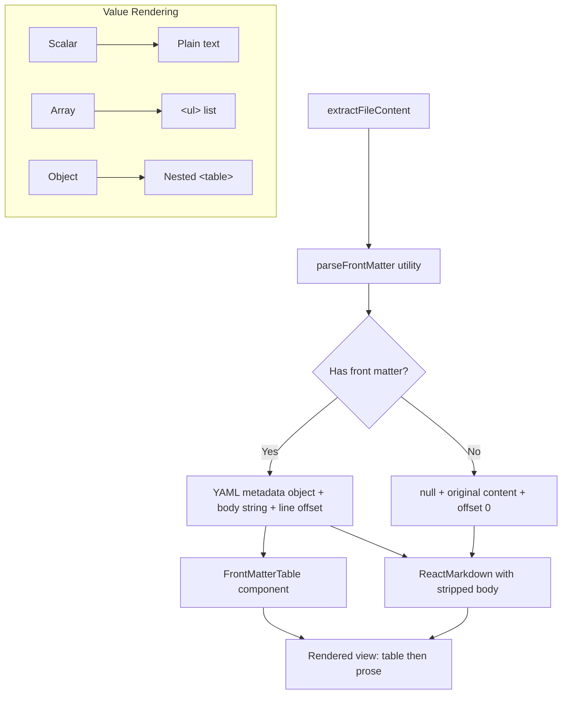
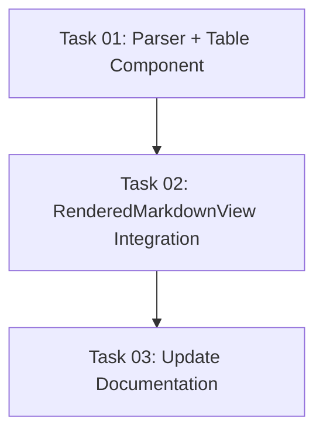

# Plan: Render YAML Front Matter as Table in Markdown Preview

## Original Work Order

> When rendering markdown files that have a front matter render the front matter as a table. The keys in YAML are the headers, and the values are the table values. If a value is an array, render it as a `<ul>`. If it's an object, render it as a `<table>`.

## Executive Summary

When markdown files containing YAML front matter (`---` delimited blocks at the top) are viewed in the Rendered Markdown View, the front matter should be parsed and displayed as a styled table above the markdown prose. The raw YAML block should be stripped from the markdown body so it doesn't appear twice.

This is a self-contained renderer-side feature. The front matter parsing happens in the React rendering pipeline — no changes to the main process, IPC, or diff parser are needed. The `yaml` package (already a project dependency) will be used to parse the YAML content.

## Context

### Current State vs Target State

| Current State | Target State | Why? |
|---|---|---|
| YAML front matter renders as raw text or gets swallowed silently by `react-markdown` | Front matter is parsed and rendered as a structured table above the prose | Users reviewing markdown files with front matter (common in Hugo, Jekyll, Docusaurus, etc.) need to see the metadata clearly |
| No visual distinction between metadata and content | Clean separation: table for metadata, prose for content | Improves readability and review experience |
| Array/object values in front matter are not meaningfully presented | Arrays render as `<ul>`, nested objects render as nested `<table>` | Structured data should have structured presentation |

### Background

- The `RenderedMarkdownView` component in `packages/react/src/components/DiffViewer/RenderedMarkdownView.tsx` is the sole rendering surface for markdown preview
- It extracts file content from diff addition lines via `extractFileContent()`, then passes it to `react-markdown`
- The `yaml` package (v2.8.2) is already installed in the project for config parsing — it can be reused for front matter extraction
- There is an existing `remark-gfm` plugin and a custom `remark-emoji` plugin — a custom remark plugin for front matter stripping fits this pattern
- Line position tracking is critical: the gutter line numbers must account for front matter lines being stripped (offset adjustment needed)
- `react-markdown` does not natively handle YAML front matter — it will either render it as text or break on it

## Architectural Approach

### Front Matter Parsing Utility

**Objective**: Extract YAML front matter from markdown content, returning the parsed metadata, the remaining body, and the line offset for gutter number correction.

A new utility function `parseFrontMatter(content: string)` will be created in `packages/react/src/utils/`. It will:

1. Detect the `---` delimited block at the start of the content
2. Parse the YAML using the existing `yaml` package
3. Return `{ metadata: Record<string, unknown>, body: string, lineOffset: number }` or `null` if no valid front matter is found
4. The `lineOffset` is the number of lines consumed by the front matter block (including both `---` delimiters), used to adjust gutter line numbers so they still map correctly to source lines

### FrontMatterTable Component

**Objective**: Render the parsed YAML metadata as a styled table matching the app's design system.

A new React component `FrontMatterTable` will render the metadata object as a two-column table (Key | Value). Value rendering is recursive:

- **Scalar** (string, number, boolean, null): render as plain text
- **Array**: render as a `<ul>` with each item as an `<li>` (items themselves go through the same recursive rendering)
- **Object**: render as a nested `<table>` with the same Key/Value structure (recursive)

The component will use shadcn/ui's `<Table>` components for consistent styling within the `prose` container. It sits above the `<ReactMarkdown>` output inside the existing `.prose` wrapper div.

### RenderedMarkdownView Integration

**Objective**: Wire the parsing utility and table component into the existing rendering pipeline without disrupting line-position-based commenting.

Changes to `RenderedMarkdownView.tsx`:

1. After `extractFileContent()`, call `parseFrontMatter()` on the content
2. If front matter exists, render `<FrontMatterTable>` above `<ReactMarkdown>`
3. Pass the stripped `body` (instead of full `content`) to `<ReactMarkdown>`
4. Adjust the `node.position.start.line` / `end.line` values in the block renderers by adding the `lineOffset` — this ensures gutter line numbers still point to the correct source lines in the diff, not the stripped body lines

The line offset adjustment is the most critical correctness concern. Without it, clicking a gutter line number in the rendered view would create a comment on the wrong source line.

## Risk Considerations and Mitigation Strategies

Technical Risks

- **Line offset miscalculation**: If the offset is wrong, comments will attach to incorrect lines
    - **Mitigation**: The offset is deterministic (count lines between first `---` and second `---` inclusive). Unit tests with known front matter lengths will verify correctness.

- **Malformed YAML front matter**: Files may have `---` delimiters but invalid YAML
    - **Mitigation**: Wrap `yaml.parse()` in try/catch. On failure, treat as no front matter and render the full content as-is.

- **False positive front matter detection**: A file starting with `---` (e.g., a horizontal rule) could be misidentified
    - **Mitigation**: Require the opening `---` to be the very first line AND a closing `---` to exist. This matches the standard front matter convention used by all major static site generators.

Implementation Risks

- **Deeply nested objects**: Recursive rendering could produce awkward UI for very deeply nested YAML
    - **Mitigation**: The recursive renderer handles it naturally. Deeply nested YAML front matter is rare in practice.

## Success Criteria

### Primary Success Criteria

1. Markdown files with valid YAML front matter display a structured table above the rendered prose
2. Arrays render as `<ul>`, objects render as nested `<table>`, scalars render as text
3. The raw YAML front matter block does not appear in the prose below the table
4. Gutter line numbers remain correct — clicking a gutter number creates a comment on the right source line
5. Files without front matter render identically to before (no regression)

## Self Validation

1. Create a test markdown file with YAML front matter containing scalar, array, and object values. Run the app with `self-review` against a diff that adds this file. Visually confirm the front matter table renders above the prose with correct formatting.
2. In the rendered view, click a gutter line number on a paragraph BELOW the front matter. Verify the comment input appears and that the line range in the comment matches the source diff line (not an offset-shifted line).
3. Test a markdown file WITHOUT front matter to confirm it renders identically to the current behavior.
4. Test a markdown file with malformed YAML between `---` delimiters to confirm graceful fallback (renders as raw text, no crash).

## Documentation

- Update `AGENTS.md` to mention front matter table rendering in the "Rendered previews" section under the Markdown bullet point.

## Resource Requirements

### Development Skills

- React component development (recursive rendering pattern)
- YAML parsing
- Understanding of the `react-markdown` AST position system

### Technical Infrastructure

- `yaml` package (already installed, v2.8.2)
- shadcn/ui `<Table>` components (already available)
- Vitest for unit tests (already configured)

## Notes

- The `remark-frontmatter` npm package exists and could strip front matter at the remark AST level, but using it would complicate line offset tracking. A simpler string-level parse-and-split before passing to `react-markdown` is more predictable and easier to test.
- The `yaml` package is currently only used in `packages/core/src/config.ts`. This feature will add it as a dependency of `packages/react` as well. Since it's already in the workspace, this is a trivial addition.

## Dependency Diagram

## Execution Blueprint

**Validation Gates:**
- Reference: `/config/hooks/POST_PHASE.md`

### ✅ Phase 1: Foundation
**Parallel Tasks:**
- ✔️ Task 01: Create front matter parser utility, shadcn Table component, and FrontMatterTable component

### ✅ Phase 2: Integration
**Parallel Tasks:**
- ✔️ Task 02: Integrate into RenderedMarkdownView (depends on: 01)

### ✅ Phase 3: Documentation
**Parallel Tasks:**
- ✔️ Task 03: Update AGENTS.md documentation (depends on: 02)

### Execution Summary
- Total Phases: 3
- Total Tasks: 3
- Maximum Parallelism: 1 task (all phases)
- Critical Path Length: 3 phases

## Execution Summary

**Status**: Completed Successfully
**Completed Date**: 2026-03-26

### Results
All 3 tasks completed across 3 phases. The feature adds YAML front matter rendering as a styled table above prose content in the Rendered Markdown View. Key deliverables:
- `parseFrontMatter` utility with 10 unit tests
- shadcn/ui Table component
- `FrontMatterTable` recursive renderer with 6 unit tests
- `RenderedMarkdownView` integration with line offset adjustment for correct gutter numbers
- AGENTS.md documentation updated

### Noteworthy Events
- ESLint config required an update to ignore `.claude/worktrees/` directories that were causing lint failures from agent worktree copies. This was a pre-existing issue unrelated to the feature work.

### Recommendations
- Manual visual testing recommended: run `self-review` against a diff containing a markdown file with YAML front matter to verify the table renders correctly and gutter line numbers map to the right source lines.
