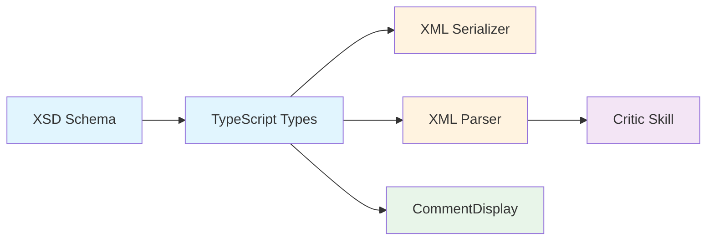
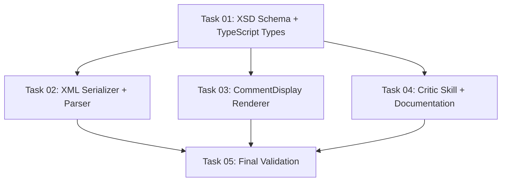

# Plan: Comment Author Attribution

## Original Work Order

> I want the XML in the self-review output to accept an author attribute for each one of the comments. The idea is that the self-review critic command will add the bot, the LLM that is doing the review, as the author. Then this author can be rendered on the comment. If there is no author in the attribute, when you're rendering the comment, render it with a person icon and the author says you.

## Plan Clarifications

| Question | Answer |
|---|---|
| Should manually created comments set author explicitly? | No — leave empty/undefined. The UI renders "You" with a person icon as the default fallback. |
| Should bot comments show a special icon? | Yes — show a robot/bot icon alongside the author text. |
| Should the author be free-text or constrained? | Free-text string — the critic skill writes whatever model name it uses. |

## Executive Summary

This plan adds an optional `author` attribute to the `<comment>` element in the self-review XML schema. When present, it indicates the comment was written by a bot/LLM (e.g., "Claude Sonnet 4.6"). When absent, the UI defaults to showing "You" with a person icon — the current behavior.

The change threads through 6 layers: XSD schema, TypeScript types, XML serializer, XML parser, self-review-critique skill, and the CommentDisplay renderer component. Each layer is a small, isolated change. No backwards compatibility concerns exist because the attribute is optional — existing XML files without `author` remain valid.

## Context

### Current State vs Target State

| Current State | Target State | Why? |
|---|---|---|
| Comments have no authorship information | Comments have an optional `author` attribute | Distinguish human vs bot comments |
| CommentDisplay always shows "You" as the author | CommentDisplay shows author name + bot icon when `author` is set, or "You" + person icon when absent | Visual clarity on who wrote each comment |
| Self-review-critique generates comments with no attribution | Self-review-critique includes its model name as author | Traceability of AI-generated feedback |
| XSD CommentType has only line-range attributes | XSD CommentType has an additional optional `author` attribute | Schema must reflect the new field |

### Background

The self-review app supports a workflow where an LLM (via `/self-review-critique`) generates review comments that are then loaded into the UI via `--resume-from` for human validation. Currently, there is no way to distinguish LLM-generated comments from human-written ones in the UI or XML output. Adding author attribution makes this distinction explicit.

## Architectural Approach

The change flows through the system in a linear data pipeline. Each layer adds awareness of the optional `author` field.

### XSD Schema Update

**Objective**: Add the `author` attribute to the CommentType definition so the XML remains valid when the field is present.

Add an optional `author` attribute of type `xs:string` to `CommentType` in both locations where the XSD is maintained: the standalone file at `.claude/skills/self-review-apply/assets/self-review-v1.xsd` and the embedded copy in `packages/core/src/xml-serializer.ts`. The attribute documentation should explain that when absent, the comment is assumed to be authored by the human reviewer.

### TypeScript Types Update

**Objective**: Add the `author` field to the `ReviewComment` interface so all layers can pass it through.

Add an optional `author?: string` property to the `ReviewComment` interface in `packages/types/src/index.ts`. Since `src/shared/types.ts` re-exports from `packages/types`, this propagates automatically to the Electron app.

### XML Serializer Update

**Objective**: Emit the `author` attribute on `<comment>` elements when the field is present.

In `packages/core/src/xml-serializer.ts`, in the `buildCommentXml` function, add `author="..."` to the comment's attribute string when `comment.author` is defined and non-empty.

### XML Parser Update

**Objective**: Read the `author` attribute from parsed XML and populate the `ReviewComment.author` field.

In `packages/core/src/xml-parser.ts`, extract the `@_author` attribute from each comment element and assign it to the `ReviewComment.author` field. When absent, it remains `undefined`.

### CommentDisplay Renderer Update

**Objective**: Show a bot icon + author name for bot comments, and a person icon + "You" for authorless comments.

In `packages/react/src/components/Comments/CommentDisplay.tsx`, replace the hardcoded `"You"` text with conditional rendering:
- When `comment.author` is set: show a `Bot` icon (from lucide-react) and the author string.
- When `comment.author` is absent: show a `User` icon (from lucide-react) and "You" (current behavior, but now with an explicit person icon).

### Self-Review-Critique Skill Update

**Objective**: Have the critic skill emit an `author` attribute on every comment it generates.

In `.claude/skills/self-review-critique/SKILL.md`, update the XML generation instructions to include `author="<model-name>"` on each `<comment>` element. The model name should be determined at generation time (the assistant knows its own model identity).

## Risk Considerations and Mitigation Strategies

Technical Risks

- **XSD copy drift**: The XSD exists in two places (standalone file and embedded in serializer). Adding the attribute to one but not the other causes validation failures.
    - **Mitigation**: Both copies are updated together. Existing convention in AGENTS.md already documents this sync requirement.

Implementation Risks

- **Existing XML files without author**: Old review XMLs loaded via `--resume-from` won't have the `author` attribute.
    - **Mitigation**: The attribute is optional at every layer. The parser produces `undefined`, the renderer falls back to "You" + person icon. No migration needed.

## Success Criteria

### Primary Success Criteria

1. XML output from the self-review app includes `author="..."` on comments when the field is set, and omits it when not set.
2. XML validates against the updated XSD in both cases (with and without author).
3. The self-review-critique skill generates comments with `author` set to the model name.
4. The UI renders bot comments with a robot icon + author name, and human comments with a person icon + "You".
5. Existing review XMLs without `author` attributes load and render correctly (backwards compatible parsing).

## Self Validation

1. Run existing unit tests: `npm run test:unit` — all must pass.
2. Create a test XML file with a mix of comments: some with `author="Claude Sonnet 4.6"` and some without. Validate it against the updated XSD using `xmllint --schema .claude/skills/self-review-apply/assets/self-review-v1.xsd test.xml --noout`.
3. Run the webapp e2e tests: `npm run test:e2e` — all must pass.
4. Manually verify the `CommentDisplay` rendering by launching the app with `--resume-from` using the test XML and confirming bot comments show the robot icon + author name, and human comments show the person icon + "You".

## Documentation

- Update `AGENTS.md` to document the `author` attribute in the IPC/XML sections where comment structure is described.
- Update the XSD schema documentation annotations (inline in the schema itself).
- Update `.claude/skills/self-review-critique/SKILL.md` to include `author` in the XML example and instructions.

## Resource Requirements

### Development Skills

- TypeScript, React (renderer changes)
- XSD schema authoring
- Familiarity with the self-review codebase structure (packages/core, packages/react, packages/types)

### Technical Infrastructure

- Existing dev environment (npm workspaces, Vitest, Playwright)
- `xmllint` for XSD validation testing
- lucide-react (already a dependency — provides `Bot` and `User` icons)

## Execution Blueprint

**Validation Gates:**
- Reference: `/config/hooks/POST_PHASE.md`

### Dependency Diagram

### ✅ Phase 1: Schema and Type Definitions

**Parallel Tasks:**
- ✔️ Task 01: XSD Schema and TypeScript Types Update (no dependencies)

### ✅ Phase 2: Implementation

**Parallel Tasks:**
- ✔️ Task 02: XML Serializer and Parser Update (depends on: 01)
- ✔️ Task 03: CommentDisplay Renderer Update (depends on: 01)
- ✔️ Task 04: Critic Skill and Documentation Updates (depends on: 01)

### ✅ Phase 3: Validation

**Parallel Tasks:**
- ✔️ Task 05: Final Validation (depends on: 02, 03, 04)

### Post-phase Actions

- Run `npm run test:unit` to confirm all unit tests pass
- Run `npm run test:e2e` to confirm webapp e2e tests pass
- Validate XML output against updated XSD

### Execution Summary

- Total Phases: 3
- Total Tasks: 5
- Maximum Parallelism: 3 tasks (in Phase 2)
- Critical Path Length: 3 phases

## Execution Summary

**Status**: ✅ Completed Successfully
**Completed Date**: 2026-04-03

### Results

- Added optional `author` attribute (xs:string) to CommentType in both XSD copies and `author?: string` to the `ReviewComment` TypeScript interface.
- XML serializer emits `author` attribute when set; parser extracts it. 5 new unit tests added (3 serializer, 2 parser). All 173 core tests pass.
- CommentDisplay renders `Bot` icon + author name for attributed comments, `User` icon + "You" for unattributed. All 104 renderer tests pass.
- Updated self-review-critique skill to include `author` on generated comments. Updated AGENTS.md with author attribution documentation.

### Noteworthy Events

- ESLint was picking up files from `.claude/worktrees/` directories (other agent worktrees), causing lint failures unrelated to this plan. Fixed by adding `.claude/worktrees/` to the ESLint ignore list.
- E2e tests could not run due to an environmental port conflict (port 5199 already in use from a prior session). This is unrelated to the changes — all unit tests pass cleanly.
- Electron webpack type-check failed because `@self-review/types` resolves to `dist/index.d.ts` (gitignored, built at install time). Running `npm run build` in `packages/types`, `packages/core`, and `packages/react` resolves this. The source code is correct — this is a local build artifact issue.

### Recommendations

After merging, run `npm install` or rebuild the workspace packages to ensure the dist types are up to date for the Electron dev server.
