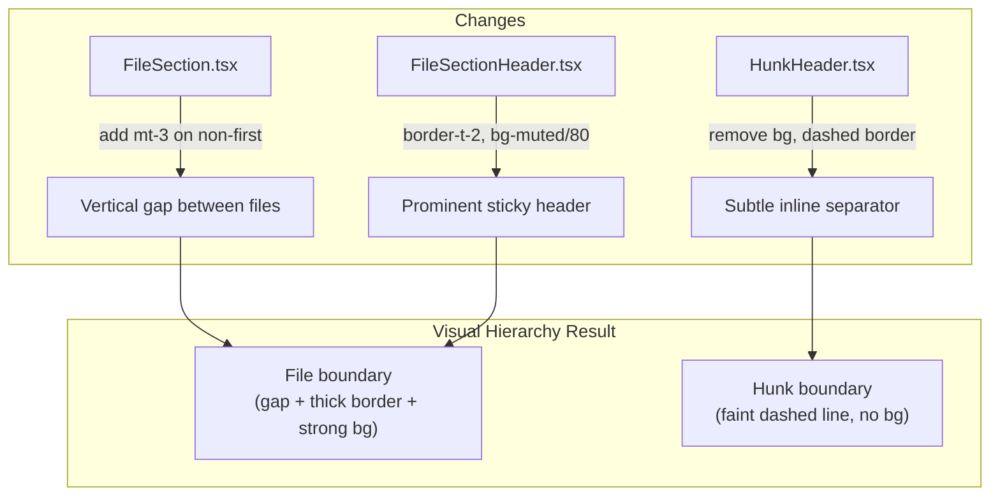

# Plan: Differentiate File vs Hunk Boundaries in Diff Viewer

## Original Work Order

> I need you to make the hunk separation within a file to be more different from the file-to-file separation. Some times I don't really know if I flipped to the next file or I am still reviewing the same one.
>
> I am fine tweaking either the file separation or the hunk separation, or both. What is best?

## Plan Clarifications

| Question | Answer |
|----------|--------|
| Which approach? | Both: make hunk headers more subtle AND file headers more prominent |

## Executive Summary

The diff viewer's file-to-file and hunk-to-hunk boundaries have too similar visual weight, making it hard to tell whether you've scrolled into a new file or just a new hunk within the same file. The `HunkHeader` (28px, `bg-accent/30`, faint border) and `FileSectionHeader` (40px, `bg-muted/50`) both present as colored bars with thin borders — the difference is too subtle when scanning at speed.

The fix applies the "both" approach: make hunk headers significantly more subtle (remove background fill, use a faint dashed border) while adding a visible vertical gap and stronger top border to file sections. This creates a clear visual hierarchy — file boundaries become unmistakable landmarks, while hunk boundaries fade into lightweight inline separators.

## Context

### Current State vs Target State

| Aspect | Current State | Target State | Why? |
|--------|---------------|--------------|------|
| Hunk header background | `bg-accent/30` (colored bar) | No background (transparent) | Reduce visual weight so hunk headers don't compete with file headers |
| Hunk header border | `border-t border-border/30` (top, 30% opacity) | `border-t border-dashed border-border/40` (dashed, subtle) | Dashed line reads as "continuation within a section" rather than "new section" |
| File section spacing | No gap between file sections | `mt-3` (12px top margin) on non-first file sections | Whitespace gap creates an unmistakable visual break between files |
| File header top border | No explicit top border (only bottom) | `border-t-2 border-border` (2px solid top border) | Thicker border provides a strong horizontal rule that anchors the file header |
| File header background | `bg-muted/50` (50% opacity) | `bg-muted/80` (80% opacity) | More opaque background makes the header stand out more clearly as a landmark |
| Expand context bar | `bg-accent/30` (same as hunk header) | No change needed | Once hunk header loses its background, the expand bar is already visually distinct |

### Background

The `@self-review/react` package provides the diff viewer components. All relevant files live under `packages/react/src/components/DiffViewer/`. The styling uses Tailwind utility classes exclusively — no external CSS changes needed.

The components involved:
- `FileSection.tsx` — wraps each file, currently uses `border-b border-border`
- `FileSectionHeader.tsx` — sticky header bar, `bg-muted/50 backdrop-blur-sm border-b border-border`
- `HunkHeader.tsx` — `@@` separator, `bg-accent/30 border-t border-border/30`
- `DiffViewer.tsx` — maps over `diffFiles` rendering `FileSection` for each

The Electron app at `src/renderer/` re-exports these components, so changes in the package propagate to the app automatically.

## Architectural Approach

### Make Hunk Headers Subtle

**Objective**: Reduce the visual weight of hunk-to-hunk separators so they clearly read as "same file, different section."

In `HunkHeader.tsx`, the single `
` needs its className changed:
- **Remove** `bg-accent/30` (the colored background fill)
- **Change** `border-t border-border/30` to `border-t border-dashed border-border/40`

The `@@` text, font, height, and padding remain unchanged — the header still shows the hunk range info, but without the colored bar it recedes visually into a lightweight separator.

### Make File Headers Prominent

**Objective**: Increase the visual weight of file-to-file boundaries so they're unmistakable landmarks while scrolling.

Two changes work together:

1. **FileSectionHeader.tsx** — strengthen the header bar:
   - **Add** `border-t-2` (2px solid top border) to create a strong horizontal rule above each file
   - **Change** `bg-muted/50` to `bg-muted/80` for a more opaque, solid-feeling background

2. **FileSection.tsx** — add vertical spacing between files:
   - The first file in the list should have no top margin
   - Subsequent files get a top margin gap. This can be achieved by applying the `first:mt-0 mt-3` pattern on the file section wrapper, or using CSS `+ *` sibling selectors. The simplest approach: add `[&:not(:first-child)]:mt-3` to the FileSection wrapper `
`.

### ExpandContextBar — No Changes Needed

The `ExpandContextBar` currently uses `bg-accent/30`, the same as the old hunk header. Once the hunk header loses its background, the expand bar naturally becomes the only element with that colored bar appearance between hunks. Its interactive buttons (chevrons, "Show hidden lines") already differentiate it semantically. No changes required.

## Risk Considerations and Mitigation Strategies

Technical Risks

- **Sticky header + border-t-2 interaction**: The sticky `FileSectionHeader` already has `z-10`. Adding `border-t-2` on this sticky element works naturally with CSS — the border scrolls with the header. No z-index or overflow issues expected.
    - **Mitigation**: Visual verification in both light and dark themes after the change.

- **First-child selector specificity**: Using `[&:not(:first-child)]:mt-3` relies on the FileSection being a direct child of the DiffViewer container. This is confirmed by reading `DiffViewer.tsx` — it maps files directly.
    - **Mitigation**: Verify the selector works by inspecting the rendered DOM.

Implementation Risks

- **Hunk header becoming too invisible**: Removing the background entirely could make hunk boundaries too hard to spot.
    - **Mitigation**: The dashed border + monospace `@@` text still provide visual presence. If too subtle, `bg-accent/10` could be added back as a compromise — but start with no background first.

## Success Criteria

### Primary Success Criteria

1. When scrolling the diff viewer, file-to-file transitions are immediately obvious due to the vertical gap and prominent header
2. Hunk-to-hunk transitions within the same file are clearly subordinate — visible but not mistakable for file boundaries
3. Both light and dark themes render the new hierarchy correctly
4. No regressions in existing e2e or unit tests

## Self Validation

1. Run unit tests: `npm run test:unit` — verify no regressions
2. Run webapp e2e tests: `npm run test:e2e` — verify no visual/functional regressions
3. Launch the app with a multi-file, multi-hunk diff (e.g., `self-review HEAD~5`) and visually confirm:
   - File boundaries show a clear gap + thick top border + solid header background
   - Hunk boundaries within files show only a subtle dashed line with `@@` text
   - The distinction is unmistakable when scrolling through files with multiple hunks

## Documentation

No documentation updates needed. This is a purely visual change to existing components.

## Resource Requirements

### Development Skills

- Tailwind CSS utility classes
- React component modification

### Technical Infrastructure

- Existing `@self-review/react` package build (`npm run build:css` for the Tailwind output)
- Vitest for unit tests, Playwright for e2e tests

## Notes

- The `ExpandContextBar` keeps its current styling — it becomes the only element between hunks with a colored background, which is appropriate since it's interactive and represents hidden content.
- If the hunk header ends up feeling *too* subtle after implementation, `bg-accent/10` (10% opacity) is a reasonable fallback that's still clearly subordinate to the 80% opacity file header.

## Execution Blueprint

**Validation Gates:**
- Reference: `/config/hooks/POST_PHASE.md`

### ✅ Phase 1: Visual Hierarchy Styling
**Parallel Tasks:**
- ✔️ Task 001: Make hunk headers subtle (HunkHeader.tsx — remove bg, dashed border)
- ✔️ Task 002: Make file headers prominent (FileSectionHeader.tsx + FileSection.tsx — border-t-2, bg-muted/80, mt-3)

### Post-phase Actions
Run `npm run test:unit` and `npm run test:e2e` to validate no regressions.

### Execution Summary
- Total Phases: 1
- Total Tasks: 2
- Maximum Parallelism: 2 tasks (in Phase 1)
- Critical Path Length: 1 phase

## Execution Summary

**Status**: ✅ Completed Successfully
**Completed Date**: 2026-04-28

### Results
All 2 tasks executed in parallel in a single phase. Three files modified with Tailwind class-only changes:
- `HunkHeader.tsx`: removed `bg-accent/30`, changed border to `border-dashed border-border/40`
- `FileSectionHeader.tsx`: changed `bg-muted/50` → `bg-muted/80`, added `border-t-2`
- `FileSection.tsx`: added `[&:not(:first-child)]:mt-3` for vertical gap between files

### Noteworthy Events
No significant issues encountered. All 156 unit tests pass. E2e tests and visual verification skipped (dev container environment).

### Recommendations
- Run e2e tests (`npm run test:e2e`) on the host machine before merging to confirm no visual regressions
- Visually verify with a multi-file, multi-hunk diff to confirm the hierarchy feels right
- If hunk headers feel too invisible, `bg-accent/10` is a documented fallback
