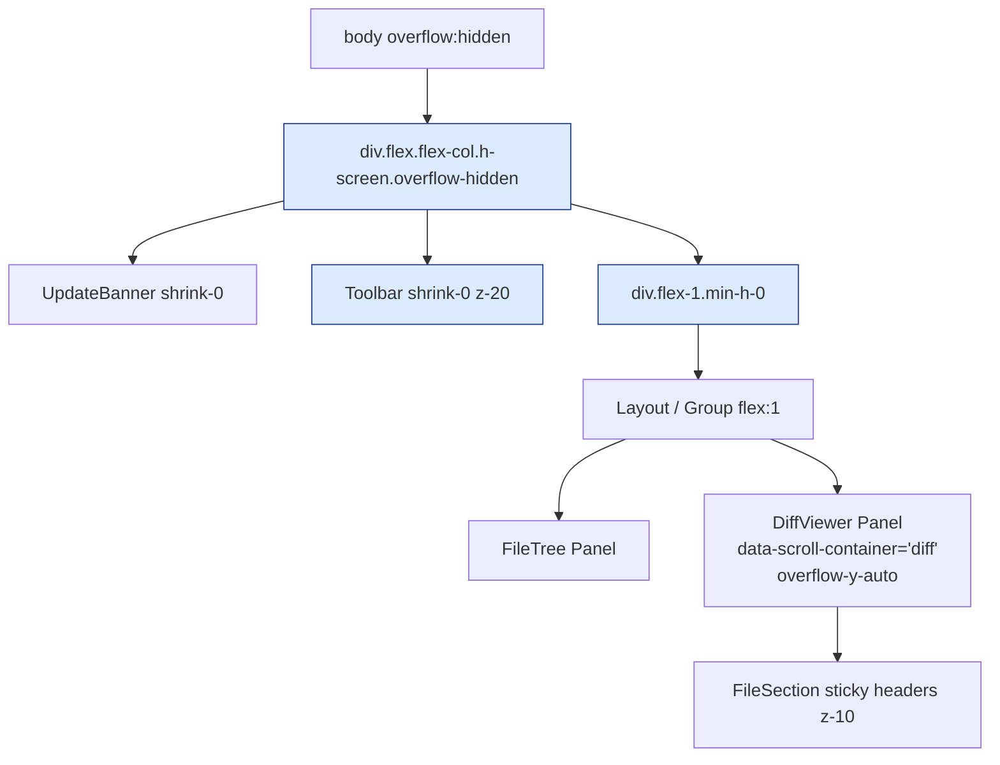
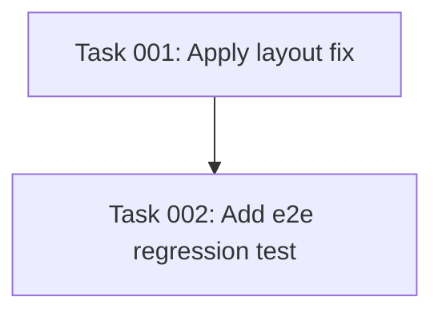

# Plan: Stabilize the Top Toolbar Position

## Original Work Order

> often times the top header (the one that contains the buttons "Hide New Files" ...) scrolls away (not sure the reason, it's impossible with the scroll wheel) and is inaccessible unless the user clicks on "Collapse all files". How can we avoid this?

## Plan Clarifications

| Question | Working assumption (please confirm) |
| --- | --- |
| Which "top header" specifically? | The `Toolbar` in `packages/react/src/components/Toolbar.tsx` — the only header containing the "Hide / Show New Files" button. |
| What does "scrolls away" mean here? | The toolbar visually disappears past the top edge of the window. Because `body { overflow: hidden }` (`src/index.css:95`), the user cannot mouse‑wheel the window back, which is why "Collapse all files" (which shrinks the diff content) is the only practical workaround. |
| Should the fix preserve the current visual layering of `FileSection` sticky headers? | Yes — file section sticky headers should continue to stick to the top of the diff scroll container, just **below** the toolbar (never above it). |

## Executive Summary

The application chrome at the top of the window — the `UpdateBanner` (when shown) and the `Toolbar` — sits inside a `flex flex-col h-screen` container in `src/renderer/App.tsx:132`. Neither child carries `flex-shrink-0`, and the flex column has no `min-h-0` / `overflow: hidden` discipline. When the `DiffViewer` renders a large set of fully expanded `FileSection`s, the Layout/Group flex item can grow taller than its allocated track, the flex children compress, and the toolbar effectively gets pushed beyond the visible area. Because `body { overflow: hidden }` blocks wheel scrolling at the document level, the user cannot recover it without shrinking the inner content (e.g. "Collapse all files").

The fix is small and structural: pin the top chrome so it is never allowed to shrink, ensure the flex column properly clips overflow, and let the diff scroll container be the only thing that scrolls. This eliminates the "lost toolbar" failure mode without changing any user‑facing controls or behaviour.

## Context

### Current State vs Target State

| Current State | Target State | Why? |
| --- | --- | --- |
| `UpdateBanner` and `Toolbar` are flex children with no `flex-shrink-0`. | Both are `flex-shrink-0` and never compress. | Their heights (`h-8`, `h-11`) are intentional and must not collapse. |
| The root `flex flex-col h-screen` container has no `overflow: hidden` / `min-h-0`. | Root container has `overflow: hidden`; `Layout` is wrapped in a `min-h-0 flex-1` track. | Prevents inner content from pushing siblings (toolbar) out of view in the flex column. |
| When the diff viewer has many expanded files, the toolbar can scroll out of view and the user can't wheel-scroll it back (`body { overflow: hidden }`). | Toolbar is permanently visible at the top of the window regardless of how tall the diff content is. | Eliminates a recurring usability dead-end. |
| `FileSection` sticky headers use `z-10`. | If we add stacking context to the toolbar, ensure the toolbar uses a higher z-index (e.g. `z-20`). | Keeps file-section sticky headers from ever painting on top of the toolbar. |

### Background

- Chrome is rendered in `src/renderer/App.tsx:128-141`:

  ```
  <div className='flex flex-col h-screen ...'>
    <UpdateBanner />
    <Toolbar onFinishReview={...} />
    <Layout />
  </div>
  ```

- `Layout` (`packages/react/src/components/Layout.tsx`) returns `<Group orientation='horizontal' style={{ flex: 1 }}>` with two `Panel`s; the diff side wraps its content in `<div className='h-full overflow-y-auto' data-scroll-container="diff">`.
- The only document-level scroll suppressor is `body { overflow: hidden }` in `src/index.css:87`. This is what makes the bug irrecoverable by scroll wheel: the body can be programmatically displaced (e.g. via `scrollIntoView` in `DiffNavigationContext.scrollToFile`, or via flex overflow) but the user cannot scroll it back.
- "Collapse all files" works as a workaround because it dramatically shrinks the inner content height, releasing the layout pressure that pushed the toolbar off-screen.
- `Toolbar` already has a fixed height (`h-11`) and `UpdateBanner` (`h-8`); neither needs to be sticky/fixed-positioned. The simplest, lowest-risk change is to harden the existing flex layout so they cannot be displaced.

## Architectural Approach

The fix is contained to the renderer-side layout shell. There are no IPC, parser, XML, or package‑public‑API changes. We harden two layout boundaries:

1. The top-level chrome stack in `App.tsx` so banner + toolbar are pinned.
2. The flex track that hosts `Layout` so it owns the overflow and never bleeds into its siblings.



### Pin the top chrome

**Objective**: Guarantee `UpdateBanner` and `Toolbar` keep their declared heights and remain at the top of the viewport.

- Add `shrink-0` to the `UpdateBanner` root (`src/renderer/components/UpdateBanner.tsx`) and to the `Toolbar` root (`packages/react/src/components/Toolbar.tsx`). Their `h-8` / `h-11` must be inviolable.
- Add `overflow-hidden` to the root chrome container in `src/renderer/App.tsx` (the `flex flex-col h-screen` div) so any inner overflow can never push the document. This is a belt-and-braces guard that complements `body { overflow: hidden }`.
- Bump the `Toolbar`'s stacking context to `z-20` (currently no z-index). `FileSection`'s sticky header uses `z-10`; this preserves correct layering.

### Constrain the Layout track

**Objective**: Make the flex item that hosts `Layout` the sole owner of the remaining vertical space, with proper flex-clip semantics so its inner scroll container does the scrolling.

- In `src/renderer/App.tsx`, wrap `<Layout />` in `<div className='flex-1 min-h-0'>`. The `min-h-0` is the canonical Tailwind/CSS workaround for a known flexbox quirk: without it, `flex: 1` children in a column are not allowed to shrink below their intrinsic content height, which is exactly the condition that lets a tall `DiffViewer` push the toolbar away. With `min-h-0`, the diff scroll container's `overflow-y-auto` becomes effective.
- Optional symmetry: do the same in the package-side `ReviewPanel` (`packages/react/src/ReviewPanel.tsx`) so library consumers benefit from the same layout discipline (only relevant if they slot a `Toolbar` as `children`). This is a one-line change but it does affect the package shape; we should confirm we want it before shipping.

### Verification approach

The bug is reproduceable but environment‑sensitive (depends on number of files, expansion state, viewport height). We verify in two layers:

- **Manual** (Electron): launch the app against a synthetic large diff (e.g. `git diff HEAD~50..HEAD` or a generated fixture) with all sections expanded; resize the window down; confirm the toolbar stays anchored regardless of vertical scroll position inside the diff pane.
- **Automated** (webapp e2e via Playwright): a single new scenario that loads a fixture with many expanded files, scrolls the diff pane to the bottom, and asserts that `[data-testid='toolbar']` still has its top edge at `y == updateBanner.bottom` (or `0` when no banner). The existing webapp e2e harness in `npm run test:e2e` is the right home for this — it is fast and runs in CI.

## Risk Considerations and Mitigation Strategies

<details>
<summary>Layout / regression risks</summary>

- **`min-h-0` can clip unexpected children**: if any descendant relied on the flex child's intrinsic height, content might now scroll where it previously expanded the layout.
    - **Mitigation**: only `min-h-0` is applied to the wrapper around `Layout`; the inner `Panel` already uses `h-full overflow-y-auto`, which is the intended scroll boundary. Manual smoke test of the file tree, diff scrolling, expand-context, and welcome screen covers all renderer surfaces.
- **`overflow-hidden` on root chrome could hide tooltips/popovers** that escape the viewport.
    - **Mitigation**: shadcn/Radix tooltips/popovers portal to `document.body` (they are siblings of `#root`'s children, not descendants of the chrome `<div>`), so they are unaffected. Spot-check tooltips on toolbar buttons during manual verification.
</details>

<details>
<summary>Stacking-context risk</summary>

- **`z-20` on the toolbar plus `overflow-hidden` could create a new stacking context** that interacts oddly with sticky descendants.
    - **Mitigation**: the toolbar is a sibling — not an ancestor — of `FileSection` sticky headers, so a stacking context on the toolbar does not trap them. We only need to ensure the toolbar paints above sticky headers (z-20 > z-10).
</details>

<details>
<summary>Package boundary risk</summary>

- **Touching `ReviewPanel.tsx` in `@self-review/react` is a public API surface change** for any external consumer that supplies a custom toolbar as `children`.
    - **Mitigation**: keep the package change purely additive (adding a `flex flex-col h-full overflow-hidden` discipline to the wrapper), or scope the fix to the Electron app only and leave the package as is. Default to "Electron app only" unless the user asks otherwise.
</details>

## Success Criteria

### Primary Success Criteria

1. With a diff containing 30+ files all expanded, the user can scroll arbitrarily inside the diff pane (mouse wheel, `j`/`k`, file-tree click navigation) and the `Toolbar` remains visible at the top of the window at all times.
2. With the same setup, the `UpdateBanner` (when present) also stays visible immediately above the `Toolbar` and does not collapse.
3. Existing behaviours unaffected: file-section sticky headers still stick to the top of the diff scroll area; expand-context scroll compensation still works; FileTree scrolls independently within its panel.
4. No regressions in `npm run test:unit` or `npm run test:e2e`.

## Self Validation

After implementing, an LLM should execute these concrete steps:

1. **Build and launch the Electron app** in a host environment (not the dev container) with a deliberately large fixture: `npm run start -- $(git rev-list --max-parents=0 HEAD)..HEAD` or any range that yields 30+ files. Maximize the window, then shrink it vertically to ~600 px.
2. **Use Playwright** (or screenshot script) to take three screenshots from inside the running webapp dev server (`npm run dev:webapp`) using a fixture with many expanded files: (a) initial load, (b) after scrolling the diff pane to the middle, (c) after scrolling to the bottom. In all three, `[data-testid='toolbar']` must be present and its `boundingBox().y` equal to the `UpdateBanner`'s bottom (or `0` if the banner is not rendered).
3. **Programmatically verify** in the same Playwright run that `document.body.scrollTop === 0` and `document.documentElement.scrollTop === 0` — i.e. the document itself never scrolls.
4. **Manually click "Hide New Files"** after step 2c to confirm the toolbar control is interactive (not just visually present).
5. **Run `npm run test:unit` and `npm run test:e2e`** and confirm both pass.

## Documentation

- No PRD changes required — the toolbar's role is already documented (`docs/PRD.md:176`, `docs/PRD.md:283`); this is a bug fix, not a new behaviour.
- No `AGENTS.md` updates required.
- Commit message should follow conventional commits, e.g. `fix(layout): keep toolbar pinned when diff content overflows`.

## Resource Requirements

### Development Skills

- React + Tailwind layout fluency, particularly flexbox `min-height: 0` semantics.
- Familiarity with the Electron renderer / package boundary in this repo (`src/renderer/App.tsx` vs `packages/react/src/ReviewPanel.tsx`).

### Technical Infrastructure

- Existing dev server (`npm run dev`) and webapp e2e harness (`npm run test:e2e`).
- Playwright (already in the toolchain) for the new regression scenario.

## Integration Strategy

This change is local to the renderer layout shell. It does not touch IPC channels, the diff parser, the XML serializer/parser, the XSD, or any package public API (unless we explicitly opt into the optional `ReviewPanel` symmetry change). Risk of breaking `@self-review/react` consumers is therefore zero by default.

## Notes

- If, after these changes, the bug still reproduces, the next suspect is `react-resizable-panels` v4 `Group` height inheritance — at that point we would explicitly set `style={{ flex: 1, minHeight: 0 }}` on `Group` and add `overflow: hidden` to each `Panel`'s wrapping div. Hold this in reserve; the simpler fix above is expected to be sufficient.
- The `body { overflow: hidden }` rule is intentional and must stay — it is what gives the app its "no document scroll" feel. The fix works **with** that rule, not against it.

## Execution Blueprint

**Validation Gates:**
- Reference: `/config/hooks/POST_PHASE.md`

### ✅ Phase 1: Apply renderer layout fix
**Parallel Tasks:**
- ✔️ Task 001: Pin top chrome and constrain Layout track (App.tsx + UpdateBanner + Toolbar)

### ✅ Phase 2: Add e2e regression coverage
**Parallel Tasks:**
- ✔️ Task 002: Add webapp e2e regression test for toolbar pinning (depends on: 001)

### Post-phase Actions

After each phase, run `npm run lint` (if configured) and `npm run test:unit`, then create a conventional-commits commit covering the files touched in that phase.

### Execution Summary
- Total Phases: 2
- Total Tasks: 2
- Maximum Parallelism: 1 task (per phase)
- Critical Path Length: 2 phases



## Execution Summary

**Status**: ✅ Completed Successfully
**Completed Date**: 2026-04-30

### Results

- Phase 1 — `fix(layout): keep toolbar pinned when diff content overflows` (commit `9dd75b1`):
  - `src/renderer/components/UpdateBanner.tsx` — added `shrink-0`.
  - `packages/react/src/components/Toolbar.tsx` — added `shrink-0 z-20`.
  - `src/renderer/App.tsx` — added `overflow-hidden` to chrome stack and wrapped `<Layout />` in `<div className='flex-1 min-h-0'>`.
- Phase 2 — `test(e2e): add regression test for pinned toolbar` (commit `a9498a6`):
  - `tests/webapp-features/05-view-modes-and-toolbar.feature` — added scenario "Toolbar stays pinned when the diff pane scrolls".
  - `tests/webapp-steps/05-view-modes-and-toolbar.steps.ts` — added matching step definitions for scrolling the diff pane, asserting toolbar `boundingBox().y <= 1`, and asserting `body/html scrollTop === 0`.
- Validation gates: `npm run lint` (clean), `npm run test:unit` (164/164 across main + renderer), `npm run test:e2e` (47/47 webapp scenarios).
- Optional package change to `packages/react/src/ReviewPanel.tsx` was deliberately skipped per the plan's default ("Electron app only").

### Noteworthy Events

- Stale `vite` processes from prior dev sessions held port 5199 and produced misleading "Vite exited with code 1" failures. Killing the orphan vite processes (and waiting for the port to free) was required before the e2e suite could start. The harness's existing `fuser -k` cleanup is a no-op in this dev container because `fuser` is not installed.
- Playwright browsers were not pre-installed in the dev container; ran `npx playwright install chromium` once to enable the webapp e2e project.
- First draft of the new scenario clicked "Expand all" before scrolling, but the default fixture loads with all sections already expanded — so the toolbar shows `collapse-all-btn`, not `expand-all-btn`, and the click step timed out. Removed the redundant click; the scenario now scrolls directly.
- Electron-side manual verification (`npm run start`) and the Electron e2e suite were not run because `AGENTS.md` explicitly states e2e cannot run inside the dev container.

### Recommendations

- Consider teaching `tests/webapp-steps/app.ts` to fall back to `lsof -ti :5199 | xargs kill -9` when `fuser` is unavailable, so dev-container runs auto-recover from orphaned vite processes.
- A follow-up host-machine verification of the Electron app (large diff, narrow window) would close out Self Validation step 1, which cannot run inside this dev container.

