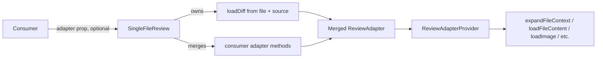
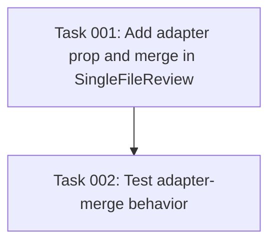

# Plan: SingleFileReview adapter prop for parity with ReviewPanel

## Original Work Order

> for https://github.com/e0ipso/self-review/issues/92
>
> **Title:** SingleFileReview: expose adapter/callback for expandContext (parity with ReviewPanel)
>
> **Motivation.** `SingleFileReview` gives consumers no way to wire context expansion. Its props accept `file`, `source`, `config`, `onReviewChange`, etc., but no `adapter` and no `onExpandContext` callback. The component constructs an internal adapter containing only `loadDiff`, so when a user clicks an expand-context button (e.g. "Show N hidden lines"), the library's `expandFileContext` short-circuits (`if (!adapter?.expandContext) return null;`) and the click becomes a silent no-op. `ReviewPanel` already exposes the full `ReviewAdapter` so consumers can implement `expandContext` there; this request is to bring `SingleFileReview` to parity. Discovered while debugging Dalia, which embeds the diff viewer in three places — one uses `ReviewPanel` (fixable downstream), the other two use `SingleFileReview` and are blocked on this.
>
> **Proposed Solution.** Add a `Partial<ReviewAdapter>` prop to `SingleFileReview`. The component merges the user-supplied adapter on top of the internally-generated `loadDiff`, preserving the auto-generated diff loader while letting the consumer wire `expandContext`, `loadFileContent`, `loadImage`, `readAttachment`, etc. Consumer-supplied `loadDiff` should be ignored since the file/source props are the source of truth for `SingleFileReview`.
>
> **Acceptance.**
> - `<SingleFileReview>` consumers can implement `expandContext` and the click-through actually invokes their implementation.
> - The same `adapter` prop also accepts `loadFileContent`, `loadImage`, `readAttachment`, etc. — full parity with the `ReviewAdapter` surface used by `ReviewPanel`.
> - `ExpandContextRequest` / `ExpandContextResponse` types remain exported from `@self-review/types` so consumers can satisfy them cleanly.
> - Existing consumers that pass no `adapter` continue to work unchanged.

## Executive Summary

`SingleFileReview` currently constructs its own minimal `ReviewAdapter` containing only `loadDiff`, which means optional adapter methods such as `expandContext`, `loadFileContent`, `loadImage`, and `readAttachment` are unreachable from the public API. The "Show N hidden lines" affordance silently no-ops for any consumer of this component, and there is no workaround short of switching to `ReviewPanel` and re-implementing its surrounding chrome.

This plan adds a single optional `adapter?: Partial<ReviewAdapter>` prop to `SingleFileReview`. The component continues to own `loadDiff` (since `file` + `source` are the source of truth for a single-file flow) and merges any consumer-supplied adapter methods on top. This mirrors the mental model already established by `ReviewPanel`, scales to every existing and future optional adapter method without further API churn, and is fully backwards compatible — consumers who pass no `adapter` see no behavior change.

The implementation is intentionally narrow: a prop addition, an adapter merge, and a focused test confirming `expandContext` is invoked when wired. No new features, no new exports, no migration surface.

## Context

### Current State vs Target State

| Current State | Target State | Why? |
| ------------- | ------------ | ---- |
| `SingleFileReviewProps` exposes no adapter prop. | `SingleFileReviewProps` accepts `adapter?: Partial<ReviewAdapter>`. | Consumers need a wiring point for optional adapter methods. |
| Internal adapter only implements `loadDiff`. | Internal `loadDiff` is preserved; consumer's adapter methods are merged on top. | Lets `expandContext`, `loadFileContent`, `loadImage`, `readAttachment` reach the library while keeping `file`/`source` as the source of truth. |
| Clicking "Show N hidden lines" is a silent no-op. | Clicking "Show N hidden lines" invokes the consumer's `expandContext` when supplied; remains a no-op when not. | Resolves the reported Dalia blocker without breaking existing consumers. |
| Consumer-supplied `loadDiff` cannot be passed (no adapter prop exists). | If a consumer passes `loadDiff`, it is ignored in favor of the internally-generated one. | `file`/`source` props are the contract for single-file mode; allowing override would create two competing sources of truth. |

### Background

`ReviewPanel` requires a full `ReviewAdapter` because it has no implicit data source — the consumer must tell it what to render. `SingleFileReview` was added later as a smaller primitive: the consumer hands in one `DiffFile` and an optional `DiffSource`, and the component synthesizes the adapter internally. That synthesis was implemented as a closed object, not an extension point, which is the gap this plan closes.

The relevant code is concentrated in `packages/react/src/SingleFileReview.tsx`; the `useMemo` that constructs the internal adapter is the only call site that needs to change. `ReviewAdapter` already lives in `packages/react/src/adapter.ts` with all methods except `loadDiff` typed as optional, which means `Partial<ReviewAdapter>` is a clean fit for the merge pattern.

The downstream consumer (Dalia) has been verified to need exactly this surface — its `VerificationsReviewDialog.tsx` and `SpecChat.tsx` already implement `expandContext` for their `ReviewPanel` integration and need to share that same implementation with their `SingleFileReview` integrations.

## Architectural Approach

### API Surface Change

**Objective**: Expose a single, optional, additive prop that gives consumers access to every optional `ReviewAdapter` method without growing the API surface per-method.

`SingleFileReviewProps` gains an optional `adapter?: Partial<ReviewAdapter>` field. `Partial<>` is the right shape because the internally-generated `loadDiff` is the only required method on `ReviewAdapter`, and the component continues to provide it. Consumers can pass any subset of the optional methods (`expandContext`, `loadFileContent`, `loadImage`, `readAttachment`, `loadResumedComments`, `submitReview`, `changeOutputPath`) and they will be invoked through the existing `ReviewAdapterProvider` plumbing.

The prop type uses the already-exported `ReviewAdapter` interface from `@self-review/react`, so no new type exports are required. `ExpandContextRequest` and `ExpandContextResponse` are already re-exported from the package index per the issue's acceptance criteria — no change needed.

### Adapter Merge Strategy

**Objective**: Combine the consumer's partial adapter with the internally-generated `loadDiff` such that `loadDiff` cannot be overridden, while every other method falls through to the consumer.

The `useMemo` in `SingleFileReview.tsx` is rewritten so that the consumer's adapter is spread first, then the internally-generated `loadDiff` is applied last. This guarantees:

- The internal `loadDiff` always wins, even if the consumer supplies one. This preserves the contract that `file` + `source` are the single source of truth in single-file mode.
- Every other adapter method comes from the consumer's object, untouched.
- The memo dependency list adds the consumer's adapter reference so identity changes flow through correctly. Consumers are responsible for memoizing their own adapter object (this is the same expectation `ReviewPanel` already places on them — no new burden).

A consumer-supplied `loadDiff` is silently ignored rather than warned about. A runtime warning would be noise for the common case (consumers spreading a shared adapter object that happens to include `loadDiff` for `ReviewPanel` use); the type signature and JSDoc make the behavior explicit, which is sufficient.

### Backwards Compatibility

**Objective**: Existing `SingleFileReview` consumers see zero behavior change.

The prop is optional. When omitted, the merge collapses to exactly the current implementation (just `loadDiff`). The expand-context button continues to no-op for those consumers, matching today's behavior. No existing prop is renamed, removed, or repurposed.

## Risk Considerations and Mitigation Strategies

Technical Risks

- **Adapter object identity churn causing useMemo to re-fire every render.** A consumer who constructs `{ expandContext: ... }` inline on every render will defeat the memo and force `ReviewAdapterProvider` to see a new value each commit.
    - **Mitigation**: Document in the JSDoc that the `adapter` prop should be memoized by the consumer, mirroring the same expectation `ReviewPanel` already documents. No code-level mitigation is warranted — this is an established React pattern.

- **Consumer overriding `loadDiff` and being surprised it does not take effect.** A consumer who spreads a shared adapter into the prop may include `loadDiff` and expect it to override the internal one.
    - **Mitigation**: Spread order in the merge guarantees the internal `loadDiff` wins, and the JSDoc on the prop calls this out explicitly. The contract is intentional — the issue's proposed solution explicitly chose this behavior.

Implementation Risks

- **Tests rely on internals not exposed in the public API.** The `expandFileContext` helper that consumes `adapter.expandContext` is internal; testing that the wiring works end-to-end requires either rendering the component and clicking the affordance, or asserting at the provider boundary.
    - **Mitigation**: Add a focused unit/component test that renders `SingleFileReview` with a stub `expandContext` and asserts it is invoked when expand-context is triggered. If a UI-level click is too brittle, assert via the `ReviewAdapterProvider` context value or by invoking the relevant hook directly with a test renderer. The existing test infrastructure (`useReviewState.test.ts`, `InlineCommentSlot.test.tsx`) provides a precedent for both styles.

Integration Risks

- **Type drift between `@self-review/react` and `@self-review/types`.** The acceptance criteria call out that `ExpandContextRequest` / `ExpandContextResponse` must remain exported from `@self-review/types`. They already are (verified in `packages/react/src/index.ts:31-32`), but a future refactor could regress this.
    - **Mitigation**: No action needed in this plan — the existing re-exports satisfy the criterion. A test that imports those types from the package index would catch regressions, but is out of scope for this change.

## Success Criteria

### Primary Success Criteria

1. `SingleFileReviewProps` declares an optional `adapter?: Partial<ReviewAdapter>` field, type-checked against the existing `ReviewAdapter` interface.
2. Rendering `<SingleFileReview file={...} source={...} adapter={{ expandContext: stub }} />` and triggering expand-context invokes `stub` with the expected `ExpandContextRequest`.
3. Rendering `<SingleFileReview file={...} />` with no `adapter` prop produces identical behavior to the current implementation (verified by existing tests continuing to pass and a regression test for the no-adapter path).
4. A consumer-supplied `loadDiff` in the `adapter` prop does not override the internal `loadDiff` — the file/source-derived diff is still what the component renders.
5. Type checks pass for consumers passing any subset of `Partial<ReviewAdapter>`, including all optional methods (`expandContext`, `loadFileContent`, `loadImage`, `readAttachment`, `loadResumedComments`, `submitReview`, `changeOutputPath`).

## Self Validation

After implementation, run the following concrete checks:

1. **Typecheck**: `npm run typecheck` (or the workspace's equivalent) passes for both `@self-review/react` and the host Electron app.
2. **Unit tests**: `npm run test:unit` passes, including any new test added for the adapter merge behavior.
3. **Adapter merge inspection**: Add a temporary log or use a test renderer to confirm that when both an internal and consumer `loadDiff` exist, the function reference exposed via `useAdapter()` is the internal one (the one that returns `{ files: [file], source }`). Remove the temporary log before completion.
4. **Expand-context invocation**: In a test or scratch consumer, render `SingleFileReview` for a file with collapsed context, supply a stub `expandContext` via the new prop, simulate a click on the expand-context affordance (or invoke the relevant hook directly), and confirm the stub receives a well-formed `ExpandContextRequest`.
5. **No-adapter regression**: Render `SingleFileReview` without the new prop, click the expand-context affordance, and confirm the existing no-op behavior is preserved with no console errors or unhandled promise rejections.
6. **Build**: `npm run build` for `@self-review/react` produces a `dist/` whose `SingleFileReview` types include the new `adapter` prop.

## Documentation

- Update the JSDoc on `SingleFileReview` and `SingleFileReviewProps` (in `packages/react/src/SingleFileReview.tsx`) to describe the new `adapter` prop, including the rule that consumer-supplied `loadDiff` is ignored and the expectation that the adapter object is memoized by the consumer.
- Update the package-level usage example in `packages/react/AGENTS.md` (or the closest equivalent README/AGENTS file inside `packages/react/`) only if it currently shows a `SingleFileReview` example — add the optional `adapter` prop to that example. If no such example exists, no documentation update is needed; the JSDoc is sufficient.
- No update required to top-level `AGENTS.md` or `docs/PRD.md`: this is a small additive prop on a library component and does not change the Electron app's user-facing behavior or the product's overall surface.

## Resource Requirements

### Development Skills

- TypeScript and React (forwardRef, useMemo, context).
- Familiarity with the `ReviewAdapter` interface and the `ReviewAdapterProvider` plumbing inside `@self-review/react`.
- Vitest + React Testing Library for the regression and wiring test.

### Technical Infrastructure

- Existing workspace tooling: npm workspaces, Vitest, the package's existing build pipeline.
- No new dependencies.

## Integration Strategy

This change is internal to `@self-review/react`. The Electron app does not use `SingleFileReview` directly (it uses `ReviewPanel` via `Layout`), so no main/renderer changes are needed. Downstream consumers (e.g. Dalia) opt in by adding the new `adapter` prop on their existing `SingleFileReview` call sites — no breaking change is forced on anyone.

## Notes

- The issue body references compiled line numbers in `dist/index.js` for reproducibility; the source-of-truth file for the change is `packages/react/src/SingleFileReview.tsx` (specifically the `useMemo` at lines 77–82 in the current source).
- Per the issue, an alternative `onExpandContext` callback was rejected because it does not scale to additional optional adapter methods. This plan honors that decision — the `Partial<ReviewAdapter>` prop is the only API addition.

## Execution Blueprint

**Validation Gates:**
- Reference: `/config/hooks/POST_PHASE.md`

### Dependency Diagram

### ✅ Phase 1: Implement adapter prop and merge
**Parallel Tasks:**
- ✔️ Task 001: Add `adapter?: Partial<ReviewAdapter>` prop, merge with internal `loadDiff`, JSDoc

### ✅ Phase 2: Verify wiring with focused tests
**Parallel Tasks:**
- ✔️ Task 002: Test consumer `expandContext` is invoked, internal `loadDiff` wins, no-adapter regression (depends on: 001)

### Post-phase Actions

After each phase, run linting and create a conventional commit summarizing the phase.

### Execution Summary
- Total Phases: 2
- Total Tasks: 2
- Maximum Parallelism: 1 task per phase (linear)
- Critical Path Length: 2 phases

## Execution Summary

**Status**: ✅ Completed Successfully
**Completed Date**: 2026-05-02

### Results

- `SingleFileReview` now accepts an optional `adapter?: Partial<ReviewAdapter>` prop. Consumer methods (`expandContext`, `loadFileContent`, `loadImage`, `readAttachment`, `loadResumedComments`, `submitReview`, `changeOutputPath`) are merged underneath the internally-generated `loadDiff`, which always wins so `file`/`source` remain the source of truth in single-file mode.
- New unit test `packages/react/src/SingleFileReview.test.tsx` verifies the three load-bearing rules: consumer `expandContext` reaches the merged adapter, consumer `loadDiff` is ignored, and the no-adapter case exposes only `loadDiff`.
- Built `dist/index.d.ts` declares `adapter?: Partial<ReviewAdapter>` on `SingleFileReviewProps` — downstream consumers (Dalia) can now wire context expansion in their `SingleFileReview` integrations.
- Full renderer suite: 123 tests pass (3 added). Lint and typecheck clean. `npm run build` for `@self-review/react` succeeds.

### Noteworthy Events

- **Working-tree gating.** The repo started on `fix/file-tree-entry-nested-button` with an untracked `self-review-p1.patch`. Switched to `main`, pulled origin (4 commits behind), stashed the untracked patch with `--include-untracked` so `create-feature-branch.cjs` could verify a clean tree, then created `feature/53--single-file-review-adapter-prop`. The stash (`stash@{0}`: `On main: plan-53-setup-park-untracked`) is preserved for the user to restore.
- **jsdom polyfills required for the new test.** The `SingleFileReview` providers (DiffNavigation + Config) call `IntersectionObserver` and `window.matchMedia` during their passive effects, neither of which jsdom implements. Polyfilled both at the top of `SingleFileReview.test.tsx` rather than introducing a global setup file, since this is the only test that actually mounts the full provider tree.
- **Documentation update scope.** Per the plan, `packages/react/AGENTS.md` was checked for an existing `SingleFileReview` example — none present, so no AGENTS.md change is needed; JSDoc on the new prop is the documentation surface.

### Recommendations

- Pop the parked stash (`git stash pop`) once the user is back on a branch where they want `self-review-p1.patch` restored.
- Open a PR titled `feat(react): expose adapter prop on SingleFileReview` and reference issue #92.
- No follow-up scheduled agent is warranted — this is an additive, fully-shipped API change with no flag, soak window, or cleanup TODO.

---

Plan Summary:
- Plan ID: 53
- Plan File: /workspace/.ai/task-manager/plans/53--single-file-review-adapter-prop/plan-53--single-file-review-adapter-prop.md
