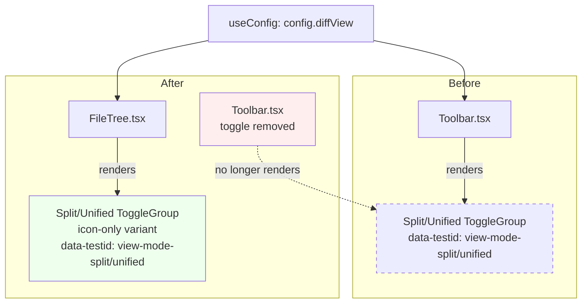
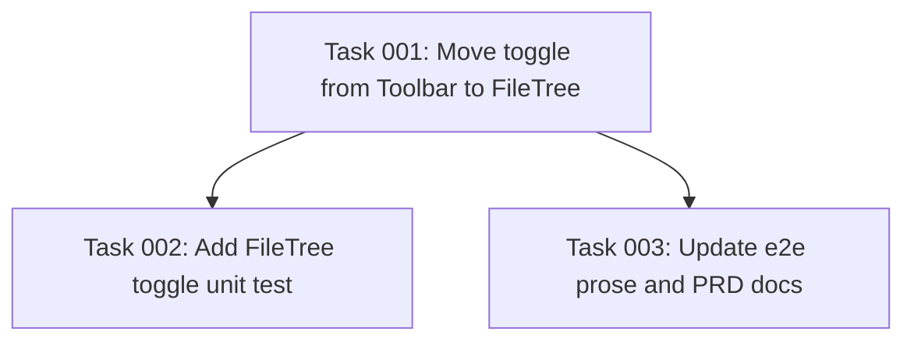

# Plan: Move Split/Unified View Toggle from Toolbar to FileTree Header

## Original Work Order

> for https://github.com/e0ipso/self-review/issues/91
>
> **Description**
>
> Move the Split/Unified view-mode toggle out of the application `Toolbar` and into the `FileTree` header so the control travels with the file list. When the `@self-review/react` package is embedded in other applications, those hosts may render their own top-level toolbar (or none at all) but will typically still mount the file tree alongside the diff viewer. Keeping the diff-view selector inside `FileTree` ensures the toggle remains available regardless of whether the host app uses the bundled `Toolbar`.
>
> **Acceptance Criteria**
>
> - The Split/Unified `ToggleGroup` (currently at `packages/react/src/components/Toolbar.tsx:110-143`) is removed from `Toolbar.tsx`, along with its `handleViewModeChange` handler and now-unused icon imports (`Columns2`, `AlignJustify`).
> - The same toggle is rendered inside `FileTree.tsx` header, reads/writes `config.diffView` via `useConfig()`, and preserves the existing `data-testid` values (`view-mode-split`, `view-mode-unified`) so e2e tests continue to pass.
> - The toggle continues to work when `FileTree` is rendered standalone (without `Toolbar`) in a host application — verified by importing `FileTree` from `@self-review/react` in isolation.
> - The `FileTree` header layout still accommodates the existing controls (keyboard-shortcuts tooltip, expand/collapse-all, file-count badge) without overflow at the default sidebar width.
> - Unit and e2e tests are updated as needed and pass (`npm run test:unit`, `npm run test:e2e`).
>
> **Additional Context**
>
> The toggle currently lives in the left group of `Toolbar.tsx` and dispatches changes through `useConfig().updateConfig({ diffView })`. The same `useConfig` hook is already imported in `FileTree.tsx`, so no new wiring is required. Consider whether the icon-only variant (matching the other `FileTree` header buttons) is more space-efficient than the labeled variant currently used in the toolbar.

## Executive Summary

The Split/Unified diff-view toggle currently lives in the application-level `Toolbar`, which is bundled but optional for hosts embedding `@self-review/react`. Hosts that mount only `FileTree` + `DiffViewer` lose access to the control. This plan moves the toggle into the `FileTree` header so it travels with the file list — a component every embedder is expected to render — while leaving every other Toolbar control where it is.

The change is intentionally narrow: it relocates a UI element that already reads and writes `config.diffView` through the shared `useConfig()` hook. No state, persistence, or context plumbing changes. The toggle is re-rendered as an icon-only segmented control to fit the constrained sidebar width and match the visual language of the surrounding `FileTree` header buttons (keyboard-shortcuts, expand/collapse-all). Existing `data-testid` selectors are preserved verbatim so e2e tests that locate the buttons continue to work; the human-readable test prose ("in the toolbar") and PRD section 5.5 are updated to reflect the new location.

The result: `FileTree` becomes a self-sufficient sidebar that exposes the diff-view selector regardless of whether a host mounts the bundled `Toolbar`.

## Context

### Current State vs Target State

| Current State | Target State | Why? |
|---|---|---|
| Split/Unified `ToggleGroup` rendered inside `Toolbar.tsx` (lines 110–143) | `ToggleGroup` removed from `Toolbar.tsx`; only theme/wrap/comments/finish-review controls remain | Hosts embedding `@self-review/react` may not render `Toolbar`; the toggle would be lost |
| `handleViewModeChange` handler + `Columns2`/`AlignJustify` icon imports declared in `Toolbar.tsx` | Handler and icon imports removed from `Toolbar.tsx` | Dead code after the toggle moves |
| `FileTree` header contains: keyboard-shortcuts tooltip, expand/collapse-all button, file-count badge | Same controls plus a compact icon-only Split/Unified segmented toggle, sourced from the same `useConfig()` already imported in this file | Toggle must travel with the file list so embedders that mount only `FileTree`+`DiffViewer` retain the control |
| Labeled variant (`Split` / `Unified` text + icon, `gap-1.5 px-2.5`) | Icon-only variant (`h-5 w-5 p-0`) matching the other `FileTree` header icon buttons | Sidebar default width is ~20–25% of the viewport; labeled toggles overflow. Icon-only matches the existing visual language. Tooltips already provide labels. |
| `data-testid="view-mode-split"` / `data-testid="view-mode-unified"` on the toolbar toggle items | Same `data-testid` values on the file-tree toggle items | E2E selectors and webapp step definitions locate the buttons by `data-testid`; preserving these prevents regressions |
| E2E feature file `tests/webapp-features/05-view-modes-and-toolbar.feature` describes clicking "in the toolbar" | Feature file describes clicking the toggle in the file tree header | Test prose must reflect the actual UI location |
| PRD section 5.5 lists "View mode toggle" as a toolbar control; section 5.2 (File Tree Navigator) does not mention it | PRD section 5.2 documents the toggle in the file tree header; section 5.5 no longer lists it | Documentation must reflect the new location |

### Background

- The Electron application composes `Toolbar` + `Layout` (which contains `FileTree` + `DiffViewer`). When the React package is embedded elsewhere — e.g., a host CMS or a documentation viewer — the consumer often renders only `FileTree` + `DiffViewer` and provides its own chrome. In that configuration, the Split/Unified toggle currently disappears.
- `FileTree.tsx` already imports `useConfig` (used to read/write `outputPathInfo`), so adding `config.diffView` access requires no new context wiring.
- The `data-testid` values are referenced in:
  - `tests/webapp-steps/05-view-modes-and-toolbar.steps.ts` (lines 15, 17)
  - `tests/recording/demo-recording.spec.ts` (line 298)
  Both locate elements by `data-testid` — so as long as the IDs are preserved, the steps continue to work mechanically. The Gherkin prose ("in the toolbar") still needs to be updated for accuracy.
- The two pieces of in-tree UI documentation that mention the toggle's location are PRD §5.5 (Toolbar control table, line 360) and PRD §5.2 (File Tree Navigator, lines 223–242, currently silent on view-mode controls).
- No persistence layer is touched: `config.diffView` is already managed by `ConfigContext` and rehydrated identically regardless of which component dispatches the update.

## Architectural Approach

The change is a UI relocation with three clean layers of impact: component code (the actual move), test prose (Gherkin descriptions, not selectors), and product documentation (PRD). Selectors and the underlying state contract are deliberately untouched.

### Component Relocation

**Objective**: Physically move the toggle markup and handler from `Toolbar.tsx` into `FileTree.tsx` while preserving the data contract.

The toggle markup currently spans `Toolbar.tsx:110-143` — a `ToggleGroup` with two `ToggleGroupItem`s wrapped in `Tooltip`s. The handler `handleViewModeChange` (lines 60–64) gates valid values before calling `updateConfig({ diffView })`. Both move into `FileTree.tsx`, placed inside the existing header `
` cluster (currently holds keyboard-shortcuts, expand/collapse-all, and the file-count badge).

The visual variant changes from labeled (`gap-1.5 px-2.5` with text + icon) to icon-only (`h-5 w-5 p-0` matching the existing icon-only buttons in that cluster). The `Tooltip` around each `ToggleGroupItem` already provides the accessible label ("Side-by-side view" / "Unified view"), so no semantics are lost. Place the toggle to the left of the keyboard-shortcuts button, with a thin vertical `Separator` between the toggle and the rest of the cluster — matching the existing separator pattern used elsewhere in the codebase.

`Columns2` and `AlignJustify` icon imports move from `Toolbar.tsx`'s `lucide-react` import block into `FileTree.tsx`'s. The `ToggleGroup`/`ToggleGroupItem` imports are added to `FileTree.tsx` (currently absent there). The corresponding imports are pruned from `Toolbar.tsx`.

The leading `Separator` at `Toolbar.tsx:106-107` (which separated the show/hide-untracked button from the now-removed view toggle) stays; it now separates show/hide-untracked from the collapse-all-comments button, which is still a valid grouping. The trailing `Separator` at `Toolbar.tsx:145` (which separated the now-removed view toggle from the comments toggle) is removed, since two separators back-to-back would render an empty bay.

### Test Surface Updates

**Objective**: Keep mechanical selectors stable; correct the human-facing prose so it describes the UI accurately.

The `data-testid` values (`view-mode-split`, `view-mode-unified`) move with the markup unchanged. The Playwright/Cucumber step definitions in `tests/webapp-steps/05-view-modes-and-toolbar.steps.ts` locate elements purely by these selectors and need no change.

The Gherkin prose in `tests/webapp-features/05-view-modes-and-toolbar.feature` is updated:
- "I click the \"Unified\" view mode toggle in the toolbar" → "I click the \"Unified\" view mode toggle in the file tree"
- The same edit applies wherever "in the toolbar" qualifies the view-mode toggle (lines 14, 19, 20). Other toolbar references in the same file (theme, no-wrap, expand-all, collapse-all) remain untouched — those controls did not move.

The feature title "Webapp View Modes and Toolbar" remains correct because the file still tests several toolbar controls; only the view-mode scenarios are re-located.

A unit test is added for `FileTree.tsx` (under `packages/react/src/components/FileTree.test.tsx`, creating the file if absent) that verifies the toggle is rendered, reads `config.diffView`, and dispatches `updateConfig({ diffView: 'unified' })` when the unified item is clicked. This protects the standalone-embedding contract: rendering `FileTree` inside a `ConfigContext` provider (without a `Toolbar`) must still expose a working toggle. No corresponding unit test currently exists for the toolbar version of the toggle, so this is a net new — and minimal — assertion.

### Documentation Synchronization

**Objective**: Keep PRD.md and AGENTS.md aligned with the actual UI placement.

PRD changes:
- Section 5.5 (line 360): remove the `View mode toggle` row from the toolbar control table.
- Section 5.2 (File Tree Navigator): add a brief sentence under "Behaviors" noting that the file tree header includes a Split/Unified diff-view toggle that controls the diff viewer's render mode.
- Section 5.3.2 (line 283): change "togglable via a control in the toolbar" to "togglable via a control in the file tree header".

AGENTS.md needs no update; it does not document the toolbar control inventory at this granularity.

## Risk Considerations and Mitigation Strategies

Layout Risks

- **FileTree header overflow at default sidebar width**: The default sidebar is ~20–25% of viewport. Adding two more buttons to the right cluster (keyboard-shortcuts, expand/collapse-all, badge) could push content out of view at narrow widths.
    - **Mitigation**: Use the icon-only variant (`h-5 w-5`) — matching existing buttons in that cluster — instead of the labeled variant. Two 20px icons add ~40px plus a 1px separator; the existing cluster fits comfortably and the addition is well within the gap budget. The acceptance criterion (`without overflow at the default sidebar width`) is verified visually during implementation.
- **Tooltip clipping inside narrow sidebar**: Tooltips on toggle items currently render with their default placement, which assumes generous horizontal space.
    - **Mitigation**: The existing tooltips for keyboard-shortcuts and expand/collapse-all in the same cluster already render correctly at sidebar width. Use the same default placement; if clipping occurs in practice, fall back to `side='bottom'` to push tooltips below the header row.

Test Risks

- **E2E selectors break silently if `data-testid`s are accidentally renamed or dropped during the move**: Given the values appear in step files and recordings, a typo would surface only at e2e run time.
    - **Mitigation**: Treat the `data-testid` strings as stable contract — copy verbatim. Verification step: grep the codebase for `view-mode-split` and `view-mode-unified` after the change to confirm exactly two occurrences in `FileTree.tsx` (the new home) and zero in `Toolbar.tsx`.
- **Existing scenario "Toolbar stays pinned when the diff pane scrolls" is unrelated to the moved control but lives in the same feature file**: A blanket find-and-replace on "in the toolbar" would corrupt unrelated scenarios.
    - **Mitigation**: Edit only the lines that mention the view-mode toggle (14, 19, 20). Leave all other "in the toolbar" references alone.

Consumer Compatibility Risks

- **`@self-review/react` consumers who already render `FileTree` standalone may have visual layouts that assume a fixed-height header**: Adding a toggle row could shift their layout.
    - **Mitigation**: The toggle is added to the existing first row of the header (alongside keyboard-shortcuts, expand/collapse-all, badge) — not a new row. The header height is unchanged. No CSS variables or sizes are exported from the package, so consumers cannot have hard-coded against the previous content of that row.

## Success Criteria

### Primary Success Criteria

1. `Toolbar.tsx` no longer contains the Split/Unified `ToggleGroup`, `handleViewModeChange`, or the `Columns2`/`AlignJustify` icon imports. `grep -nE "view-mode-split|view-mode-unified|handleViewModeChange|Columns2|AlignJustify" packages/react/src/components/Toolbar.tsx` returns no matches.
2. `FileTree.tsx` renders a Split/Unified `ToggleGroup` whose `value` is bound to `config.diffView` from `useConfig()` and whose `onValueChange` dispatches `updateConfig({ diffView })`. The `ToggleGroupItem`s carry `data-testid="view-mode-split"` and `data-testid="view-mode-unified"`.
3. Rendering `<ConfigProvider><FileTree /></ConfigProvider>` (no `Toolbar`) in a unit test surfaces both toggle items, and clicking the unified item dispatches the expected config update.
4. `npm run test:unit` passes.
5. `npm run test:e2e` (webapp e2e — the in-CI tier) passes, with the updated Gherkin prose for scenarios that exercise the moved control.
6. PRD §5.2, §5.3.2, and §5.5 reflect the new location of the toggle.

## Self Validation

After implementation, an LLM verifier should run the following concrete steps and capture evidence:

1. **Static checks (post-edit):**
   - `grep -nE "view-mode-split|view-mode-unified" packages/react/src/components/{Toolbar,FileTree}.tsx` — expect two hits in `FileTree.tsx`, zero in `Toolbar.tsx`.
   - `grep -nE "Columns2|AlignJustify|handleViewModeChange" packages/react/src/components/Toolbar.tsx` — expect zero hits.
   - `grep -nE "Columns2|AlignJustify" packages/react/src/components/FileTree.tsx` — expect at least two hits (imports + usage).
2. **Unit tests:** Run `npm run test:unit` and confirm the new `FileTree.test.tsx` assertion (toggle dispatches `updateConfig({ diffView: 'unified' })` when clicked) passes alongside the existing suite.
3. **Webapp E2E:** Run `npm run test:e2e` and confirm scenarios in `05-view-modes-and-toolbar.feature` pass with the updated prose.
4. **Visual verification:** Start the webapp dev server with the e2e fixtures (the same harness used by `npm run test:e2e:headed`), open the page in a Playwright-controlled browser, and capture two screenshots:
   - `screenshots/file-tree-header-split.png` — toggle in default Split state, with the file tree at default sidebar width to confirm no overflow.
   - `screenshots/file-tree-header-unified.png` — same after clicking the Unified item, confirming the diff viewer re-renders in unified mode.
5. **Standalone embedding spot-check:** In a temporary scratch script, render `<ConfigProvider><ReviewProvider><FileTree /></ReviewProvider></ConfigProvider>` (no `Toolbar`) and assert both toggle items are queryable by `data-testid` — proving the embedding-without-toolbar contract.

## Documentation

- **PRD updates** (required, scope-limited):
  - `docs/PRD.md` §5.2 (File Tree Navigator): add one sentence under "Behaviors" noting the Split/Unified toggle in the header.
  - `docs/PRD.md` §5.3.2: change "control in the toolbar" → "control in the file tree header".
  - `docs/PRD.md` §5.5: remove the `View mode toggle` row from the toolbar control table.
- **Test prose updates** (required):
  - `tests/webapp-features/05-view-modes-and-toolbar.feature`: update the three lines (14, 19, 20) that say "in the toolbar" for the view-mode toggle to "in the file tree".
- **AGENTS.md / CLAUDE.md**: no updates required — those files do not enumerate toolbar contents at a level that mentions individual controls.

## Resource Requirements

### Development Skills

- React + TypeScript familiarity, particularly with the project's shadcn/ui usage of `ToggleGroup`, `Tooltip`, `Separator`, and `Button`.
- Comfort with the existing `ConfigContext` (`useConfig().updateConfig({ diffView })`) — no new context APIs.
- Vitest (`@testing-library/react`) for the new `FileTree.test.tsx`.
- Playwright + Cucumber familiarity to verify webapp e2e prose updates.

### Technical Infrastructure

- Existing project toolchain: npm workspaces, Vitest, Playwright (host machine — e2e cannot run inside the dev container per `AGENTS.md`).
- No new dependencies.

## Integration Strategy

This is a single-package change inside `@self-review/react`. The Electron app consumes the package via direct relative-path imports; no rebuild step is needed. The Electron app continues to render both `Toolbar` and `Layout` (which contains `FileTree`), so end users of the desktop app see the toggle in its new location with no other behavioral change. Embedders of `@self-review/react` automatically gain the toggle in `FileTree` as soon as they upgrade.

## Notes

- **Why icon-only in the file tree but labeled in the toolbar?** Sidebar width budget. The toolbar had ~50% of viewport width for its left cluster; the file tree header has ~150–200px of horizontal space after accounting for the "Changed files" label. Icon-only is the only realistic fit, and it matches the visual language of the buttons already in that cluster.
- **Why preserve `data-testid` values verbatim instead of renaming to `file-tree-view-mode-*`?** The acceptance criteria explicitly require it ("preserves the existing `data-testid` values … so e2e tests continue to pass"). Renaming would also touch step files and the demo recording — out of scope for this change.
- **Backwards compatibility:** No public API surface changes. `Toolbar` and `FileTree` remain exported from the package with the same prop signatures. The only observable difference is the rendered content of each.

## Execution Blueprint

**Validation Gates:**
- Reference: `/config/hooks/POST_PHASE.md`

### Dependency Diagram

No circular dependencies. Tasks 002 and 003 are independent siblings that both depend on 001.

### ✅ Phase 1: Component Relocation

**Parallel Tasks:**
- ✔️ Task 001: Move Split/Unified toggle from `Toolbar.tsx` into `FileTree.tsx` header (icon-only variant; preserve `data-testid`s and `useConfig` contract)

### ✅ Phase 2: Verification & Documentation

**Parallel Tasks:**
- ✔️ Task 002: Add `FileTree.test.tsx` unit test proving the standalone-embedding contract (depends on: 001)
- ✔️ Task 003: Update `05-view-modes-and-toolbar.feature` prose and PRD §5.2 / §5.3.2 / §5.5 (depends on: 001)

### Post-phase Actions

After Phase 2, run the validation steps from the plan's "Self Validation" section: the `grep` checks against `Toolbar.tsx` and `FileTree.tsx`, plus `npm run test:unit` and `npm run test:e2e` (webapp tier).

### Execution Summary
- Total Phases: 2
- Total Tasks: 3
- Maximum Parallelism: 2 tasks (in Phase 2)
- Critical Path Length: 2 phases

## Execution Summary

**Status**: ✅ Completed Successfully
**Completed Date**: 2026-05-03

### Results

- Phase 1 (component relocation) and Phase 2 (verification + documentation) both completed and committed.
- `Toolbar.tsx` no longer renders the Split/Unified toggle, the `handleViewModeChange` handler, or the `Columns2`/`AlignJustify` icon imports. `FileTree.tsx` now renders the icon-only segmented toggle in the existing header cluster, bound to `useConfig().config.diffView` and dispatching through `updateConfig({ diffView })`. The `data-testid` selectors (`view-mode-split`, `view-mode-unified`) are preserved verbatim.
- `packages/react/src/components/FileTree.test.tsx` was added with three Vitest assertions (toggle items present, split item active by default, click flips to unified) — verifying the standalone-embedding contract via `ConfigProvider`/`ReviewProvider`/`DiffNavigationProvider` only (no `Toolbar`).
- Webapp e2e Gherkin prose updated for the three view-mode lines in `tests/webapp-features/05-view-modes-and-toolbar.feature`. The corresponding Cucumber step regex in `tests/webapp-steps/05-view-modes-and-toolbar.steps.ts` was updated from `"in the toolbar"` to `"in the file tree"` to match (per the task's regex-flexibility caveat). PRD §5.2 gained a Behaviors bullet, §5.3.2 prose was switched to "in the file tree header", and §5.5 lost the `View mode toggle` row.
- `npm run lint` clean. `npm run test:unit` passes 126/126 (44 main + 82 renderer including the new 3 assertions).
- All static grep checks from the plan's Self Validation pass: zero hits in `Toolbar.tsx`, exactly two `view-mode-*` hits and the icon imports/usages in `FileTree.tsx`.

### Noteworthy Events

- The execution started on the existing branch `feature/53--single-file-review-adapter-prop` (per `create-feature-branch.cjs`'s "proceed without creating a new branch" behavior on a feature branch). Both phase commits landed on that branch.
- The unit test originally pulled in `@testing-library/user-event` and `@testing-library/jest-dom` matchers; neither is installed in the repo. The test was rewritten to use `fireEvent` from `@testing-library/react` plus plain DOM assertions (`getAttribute`, `textContent`, `hasAttribute`).
- The shadcn/ui `ToggleGroup` in this repo wraps `@base-ui/react`, which marks the active item with `data-pressed` (presence/absence) rather than `data-state="on"/"off"`. The test was updated accordingly.
- The webapp e2e suite (`npm run test:e2e`) was run in the dev container after the user pointed out it works there (only the Electron e2e tier requires a host with display). All 48 webapp e2e scenarios passed, including the three view-mode scenarios in `05-view-modes-and-toolbar.feature` that exercise the relocated toggle. The first invocation produced spurious port-5199 conflicts because a prior leaked Vite process was still bound; killing the orphan and re-running gave a clean pass.

### Recommendations

- If the live UI reveals tooltip clipping or visual overflow at the default sidebar width, the `Tooltip` items can be given `side='bottom'` and the toggle can be moved to the right of the keyboard-shortcuts button — both options were considered in the plan's risk section.
