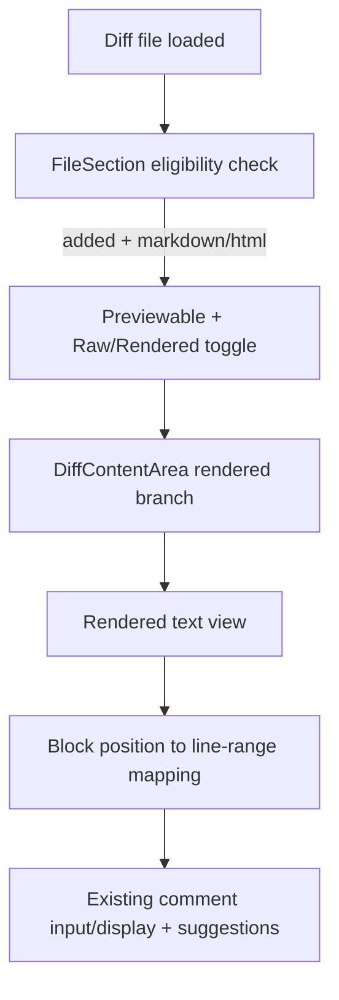
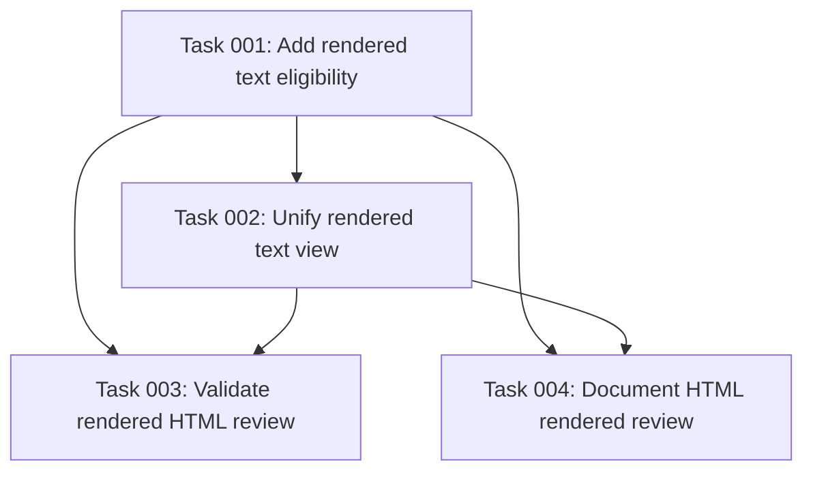

# Plan: HTML Rendered Review Parity with Markdown

## Original Work Order
> I want to be able to review `*.html` files just like I do with Markdown files. However, this will not need to translate the MD to HTML. I need to retain all functionality that the MD commenting has, probably using the same code path that the html coming from markdown uses.

## Executive Summary
This plan adds rendered review support for added `*.html` files by reusing the existing rendered Markdown review pipeline that already supports block-level line mapping and inline comments in rendered view. The goal is parity of reviewer experience, not introducing a separate HTML preview system.

The implementation keeps scope tight by extending file eligibility detection and adapting the rendered component path to accept raw HTML input while preserving the current line-based gutter comment behavior used for Markdown. This approach minimizes surface area, avoids duplicate UI logic, and keeps comment behavior consistent across Markdown and HTML rendered modes.

Key outcomes are: HTML files can switch between Raw and Rendered views, rendered HTML blocks support the same line-range commenting workflow as Markdown rendered view, and existing image/SVG/Markdown preview behavior remains unchanged.

## Context

### Current State vs Target State
| Current State | Target State | Why? |
|---|---|---|
| Rendered text review eligibility is limited to added Markdown files | Eligibility includes added HTML files (`.html`, optionally `.htm`) | Users need the same rendered-review workflow for HTML files |
| Rendered Markdown view is the only line-mapped rendered text path | A unified rendered text path handles Markdown and HTML without duplicating comment logic | Reuse existing robust commentable rendered flow |
| HTML files are reviewed only in raw diff mode | HTML files support Raw/Rendered toggle and rendered comment gutter behavior | Match reviewer ergonomics already available for Markdown |

### Background
The current renderer flow determines preview eligibility in `packages/react/src/components/DiffViewer/FileSection.tsx`, then dispatches rendering in `DiffContentArea.tsx`. For Markdown rendered view, `RenderedMarkdownView.tsx` extracts added lines, renders rich content, and maps source positions to gutter comment ranges. The request explicitly avoids Markdown-to-HTML translation concerns and asks to leverage the same path used by Markdown-rendered HTML output.

## Architectural Approach
The implementation extends the existing rendered-text architecture rather than introducing a new preview mode. All comment rendering, line-range matching, and input/display components stay centralized in the existing rendered content path.

### Eligibility and Mode Selection
**Objective**: Include HTML files in rendered review using the same toggle and dispatch behavior as Markdown.

Update preview eligibility to treat added HTML files as rendered-text eligible where Markdown is currently checked. Keep existing constraints unless explicitly changed: non-added files continue using raw diff flow, and image/SVG preview branches remain intact. Ensure eligibility logic is expressed in a reusable utility-style predicate so future rendered-text types do not require repeated regex checks.

### Unified Rendered Text Component Path
**Objective**: Reuse Markdown rendered-view comment mechanics for HTML input with minimal branching.

Adapt the rendered text component contract to accept a content mode (`markdown` vs `html`) derived from file extension, while preserving a single block-wrapper/gutter/comment pipeline. For Markdown mode, keep current plugins and front-matter handling. For HTML mode, render the extracted added-line HTML directly through the same position-aware rendered structure so block-level line mapping and line-range comment creation continue to work consistently.

### Safety and Behavior Boundaries
**Objective**: Preserve existing behavior and avoid regressions in current preview modes.

Retain current rendered behavior for Markdown, images, and SVGs. Keep file-level comments available in all modes, with line-level comments in raw view and rendered text gutter comments in rendered view. Ensure HTML support does not alter binary-file handling, expand-context behavior, or lazy file content loading.

## Risk Considerations and Mitigation Strategies

Technical Risks

- **Position mapping mismatch in HTML mode**: Rendered blocks could lose reliable source line references if parsing/rendering path differs from Markdown AST positions.
    - **Mitigation**: Preserve a single source-position strategy in the rendered-text path and add focused tests for line-range mapping in HTML fixtures.
- **Rendering safety/compatibility concerns**: Raw HTML rendering can introduce unsupported tags or unexpected layout behavior.
    - **Mitigation**: Reuse existing sanitization/render constraints from current rendered markdown HTML handling and keep rendering limited to added-file review context.

Implementation Risks

- **Logic duplication across eligibility checks**: Adding ad hoc HTML checks may drift over time.
    - **Mitigation**: Extract shared rendered-text eligibility helper and use it consistently where view mode defaults and toggles are computed.
- **Regression in existing Markdown rendered comments**: Refactoring rendered component interfaces can unintentionally break current Markdown workflows.
    - **Mitigation**: Add/extend renderer tests to cover both Markdown and HTML rendered comment flows through the same component path.

## Success Criteria

### Primary Success Criteria
1. Added `*.html` files display the Raw/Rendered toggle and can open rendered view.
2. Rendered HTML view supports the same gutter-based line-range comment creation and comment display behavior currently available for rendered Markdown.
3. Existing rendered Markdown behavior and image/SVG preview behavior remain unchanged in unit/e2e validation.

## Self Validation
1. Run renderer unit tests and add/execute new tests that verify HTML files are eligible for rendered mode and dispatch to the rendered text component path.
2. Add a fixture with an added HTML file containing multiple block elements, open review UI, switch to Rendered view, and create comments via gutter on multiple ranges; verify saved comments target expected `new` line ranges.
3. Repeat the same rendered comment interaction on an added Markdown file to confirm no behavior regression.
4. Validate image and SVG added-file previews still render correctly and are unaffected by rendered-text eligibility changes.

## Documentation
- Update `docs/PRD.md` to include HTML rendered-review support in the file preview capabilities matrix/section that currently describes Markdown rendered behavior.
- Update `test/features` scenarios (or equivalent e2e feature specs) to cover rendered review and commenting on added HTML files.
- If any developer-facing architecture notes describe rendered preview eligibility, update them to mention a shared rendered-text path (Markdown + HTML).

## Resource Requirements

### Development Skills
TypeScript/React component refactoring, AST/rendered content mapping for comment gutters, and test authoring for renderer/e2e workflows.

### Technical Infrastructure
Existing React renderer package, current diff fixtures, unit test framework, and e2e harness already used for rendered Markdown and preview testing.

## Integration Strategy
Integrate via the existing `FileSection` eligibility gate and `DiffContentArea` rendered dispatch, then consolidate rendered text behavior in the rendered view component(s). Keep all integration within current renderer package boundaries without introducing new runtime dependencies.

## Notes
This plan intentionally avoids adding new preview modes, new configuration flags, or backwards-compatibility layers beyond current behavior. Scope is limited to HTML parity with the existing Markdown rendered comment experience.

## Execution Blueprint

**Validation Gates:**
- Reference: `/config/hooks/POST_PHASE.md`

### Dependency Diagram

### Execution Phases

### ✅ Phase 1: Eligibility and Mode Wiring
**Parallel Tasks:**
- ✔️ Task 001: Add rendered text eligibility (completed)

### ✅ Phase 2: Shared Rendered Text Path
**Parallel Tasks:**
- ✔️ Task 002: Unify rendered text view (completed, depends on: 001)

### ✅ Phase 3: Validation and Documentation
**Parallel Tasks:**
- ✔️ Task 003: Validate rendered HTML review (completed, depends on: 001, 002)
- ✔️ Task 004: Document HTML rendered review (completed, depends on: 001, 002)

### Post-phase Actions
- Run the standard post-phase validation hook after each phase.
- Confirm renderer unit coverage and feature specs reflect the final implementation.

### Execution Summary
- Total Phases: 3
- Total Tasks: 4
- Maximum Parallelism: 2 tasks (Phase 3)
- Critical Path Length: 3 phases

## Execution Summary

**Status**: ✅ Completed Successfully
**Completed Date**: 2026-05-14

### Results
Implemented rendered-review support for added `.html` and `.htm` files using the shared rendered text path. Added HTML eligibility helpers, explicit Markdown/HTML rendered text modes, direct sanitized HTML rendering through the existing commentable gutter wrappers, renderer coverage, webapp feature coverage, and PRD/architecture documentation updates.

### Noteworthy Events
- Phase 1 uncovered a Vitest startup failure caused by CJS/ESM incompatibilities in the current Node 20.18 environment. The config shape and `jsdom` version were adjusted so lint and unit-test hooks run successfully.
- Phase 2 tightened direct HTML rendering by stripping executable handlers and external-loading attributes/tags before committing.
- Phase 3 corrected SVG preview default behavior back to Raw, matching existing product documentation and plan constraints.
- The narrow webapp e2e initially could not run under container Node 20.18 because Vite requires Node 20.19+. It passed under a one-off Node 20.19 runner after the webapp launcher was updated to call the local Vite binary directly.

### Recommendations
Use Node 20.19+ for webapp e2e validation in this container or CI environment so Vite can start without one-off runner workarounds.
