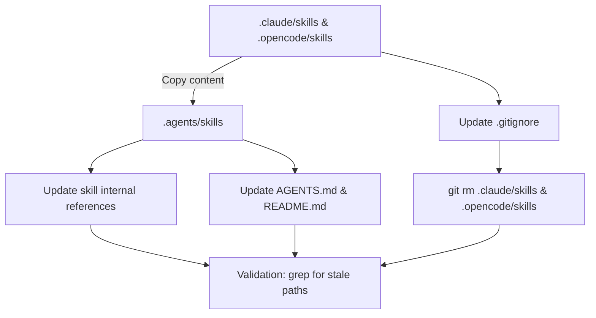
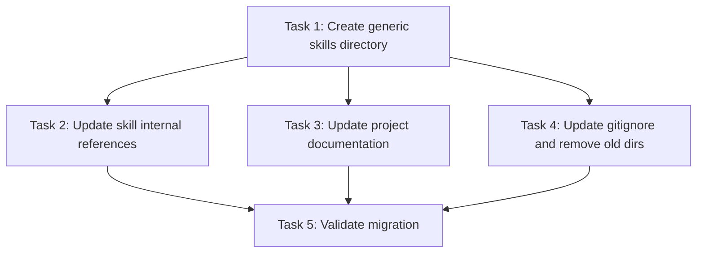

# Plan: Generic Agents Skills Directory

## Original Work Order

> I no longer want to depend on the .cloud directory to host the source skills. I want to add the source of truth for the skills in the .agents directory to make it more generic. Then we will gitignore the skills directory for the .claude and the .opencode and remove them from the repo leaving only the .agents folder.

## Plan Clarifications

| Question | Answer |
| --- | --- |
| Should devcontainer host mounts for `~/.agents` be updated? | No. The `~/.agents` mounts in devcontainer are for the user's home directory; this plan targets `<project-dir>/.agents`. |
| Should `.agents/AGENTS.md` and `.agents/agents` also be created in the repo? | No. This change is strictly limited to `skills/` in the project directory. |
| Should documentation maintain backwards compatibility with `.claude/skills`? | No. Update all active documentation to point exclusively to `.agents/skills/`. |

## Executive Summary

This plan centralizes the project's AI assistant skills into a single, vendor-agnostic `.agents/skills/` directory. Currently, identical skill files are duplicated under `.claude/skills/` and `.opencode/skills/`, creating a maintenance burden and coupling the repository to specific AI tools. By moving the canonical source of truth to `.agents/skills/`, we make the project more generic and easier to adopt regardless of which AI assistant the end user prefers.

The approach involves creating the new `.agents/skills/` tree, migrating the existing skill content and assets, updating all internal documentation and skill-file cross-references, and finally removing the old `.claude/skills/` and `.opencode/skills/` directories from version control while adjusting `.gitignore` to stop whitelisting them. This is a structural refactor with no runtime behavior changes.

## Context

### Current State vs Target State

| Current State | Target State | Why? |
| --- | --- | --- |
| Skills duplicated in `.claude/skills/` and `.opencode/skills/` | Single source of truth in `.agents/skills/` | Eliminate duplication and vendor-specific paths |
| `.gitignore` explicitly whitelists `.claude/skills/` and `.opencode/skills/` | `.gitignore` ignores `.claude/skills/` and `.opencode/skills/` | Remove vendor-specific directories from repo tracking |
| Documentation and skill files reference `.claude/skills/` for XSD schema and skill paths | All references point to `.agents/skills/` | Consistency with new canonical location |
| `README.md` instructs users to copy from `.claude/skills/` | `README.md` instructs users to copy from `.agents/skills/` | Installation instructions must match the repo layout |
| `AGENTS.md` notes XSD schema lives at `.claude/skills/self-review-apply/assets/self-review-v1.xsd` | `AGENTS.md` notes XSD schema lives at `.agents/skills/self-review-apply/assets/self-review-v1.xsd` | Internal conventions doc must reflect reality |

### Background

The repository currently ships two identical copies of the same skills:
- `.claude/skills/self-review-apply/` and `.claude/skills/self-review-critique/`
- `.opencode/skills/self-review-apply/` and `.opencode/skills/self-review-critique/`

These are kept in sync manually. The `.gitignore` file uses negation patterns (`!.claude/skills/` and `!.opencode/skills/`) to ensure only the skills subdirectories are tracked, while the rest of `.claude/` and `.opencode/` is ignored. The `self-review-critique` skill file references the XSD schema via a relative path starting from `.claude/skills/`, and `AGENTS.md` documents the schema location the same way. The `README.md` installation section assumes Claude Code as the target environment. Moving to `.agents/skills/` decouples the repository from any specific assistant brand.

## Architectural Approach

The implementation is a straightforward content migration and reference update. It does not introduce new logic, build steps, or runtime dependencies.

### Create Generic Skills Directory
**Objective**: Establish the new `.agents/skills/` tree as the canonical home for all AI assistant skills.

Create `.agents/skills/self-review-apply/` and `.agents/skills/self-review-critique/` with the exact same files currently present under `.claude/skills/`, preserving the nested `assets/` subdirectory that contains the XSD schema. Because `.claude/skills` and `.opencode/skills` are currently byte-identical, a single copy into `.agents/skills/` is sufficient.

### Update Internal Skill References
**Objective**: Ensure skill files do not contain hardcoded paths to the old vendor-specific directories.

The `self-review-critique/SKILL.md` file references `.claude/skills/self-review-apply/assets/self-review-v1.xsd` in two places (schema reading and `xmllint` invocation). These relative paths must be updated to `.agents/skills/self-review-apply/assets/self-review-v1.xsd`. The `self-review-apply/SKILL.md` references its own `assets/` directory relatively, so no change is needed there.

### Update Project Documentation
**Objective**: Align all human-facing and assistant-facing documentation with the new directory layout.

Update `AGENTS.md` to state that the XSD schema lives at `.agents/skills/self-review-apply/assets/self-review-v1.xsd` and that the apply skill is documented at `.agents/skills/self-review-apply/SKILL.md`. Update `README.md` to replace the `cp -r .claude/skills/self-review-apply ...` instruction with a `.agents/skills/` source path, and update the directory tree diagram under the "Claude Code Skill" section accordingly. No changes are required for archived plans in `.ai/task-manager/archive/`; those are historical records.

### Remove Old Directories from Version Control
**Objective**: Stop tracking `.claude/skills/` and `.opencode/skills/` in Git.

Update `.gitignore` to remove the `!.claude/skills/` and `!.opencode/skills/` negation patterns. Once the patterns are removed, `.claude/skills/` and `.opencode/skills/` will naturally fall under the existing `.claude/*` and `.opencode/*` ignore rules. After updating `.gitignore`, delete the old directories from the working tree and stage the deletion so Git stops tracking them. The `.agents/skills/` directory does not need an explicit `.gitignore` negation because it is not covered by any broad ignore rule.

### Verification and Validation
**Objective**: Confirm the migration is complete and no stale references remain.

After all file changes, perform a systematic search for any remaining references to `.claude/skills/` or `.opencode/skills/` in active source files, markdown documentation, and configuration files (excluding `.git/`, `node_modules/`, `.ai/task-manager/archive/`, and `.claude/worktrees/`). Confirm the XSD file is present under `.agents/skills/self-review-apply/assets/` and that `git status` shows the old directories as deleted and the new ones as untracked additions.

## Risk Considerations and Mitigation Strategies

Technical Risks

- **Stale path references missed during migration**: A hardcoded `.claude/skills/` reference may survive in a file not caught by initial grepping.
  - **Mitigation**: Use a broad recursive grep across all text files, explicitly excluding only `.git/`, `node_modules/`, historical archive plans, and transient worktrees. Validate before declaring completion.

- **XSD schema becomes desynchronized**: The project embeds a copy of the XSD as a string in `src/main/xml-serializer.ts`. That embedded copy is independent of the file-system XSD and is not part of this migration. The risk is that future editors may confuse which XSD is "source of truth."
  - **Mitigation**: `AGENTS.md` already documents that the XSD exists in two locations (file-system and embedded string). Update that note to reference `.agents/skills/` instead of `.claude/skills/`, preserving the explicit dual-location warning.

Implementation Risks

- **Accidental deletion of non-skill files under `.claude/` or `.opencode/`**: The `git rm` should be scoped strictly to the `skills/` subdirectories.
  - **Mitigation**: Only delete `.claude/skills/` and `.opencode/skills/`, not the parent directories. The rest of `.claude/` and `.opencode/` remains ignored as before.

## Success Criteria

### Primary Success Criteria
1. `.agents/skills/self-review-apply/` and `.agents/skills/self-review-critique/` exist with the same files (including `assets/self-review-v1.xsd`) previously present under `.claude/skills/`.
2. `.claude/skills/` and `.opencode/skills/` are no longer tracked by Git and are removed from the working tree.
3. `.gitignore` no longer contains `!.claude/skills/` or `!.opencode/skills/` negation patterns.
4. `AGENTS.md` and `README.md` reference `.agents/skills/` for skill installation and XSD location.
5. The `self-review-critique` skill file references `.agents/skills/self-review-apply/assets/self-review-v1.xsd` instead of `.claude/skills/...`.
6. A recursive grep over active project files returns zero matches for `.claude/skills/` or `.opencode/skills/` (excluding archive, worktrees, and generated artifacts).

## Self Validation

1. Run `ls -R .agents/skills/` and confirm both `self-review-apply/SKILL.md`, `self-review-apply/assets/self-review-v1.xsd`, and `self-review-critique/SKILL.md` are present.
2. Run `git ls-files | grep -E '^\.(claude|opencode)/skills/'` and confirm it returns no results.
3. Run `grep -r '\.claude/skills' /workspace --include='*.md' --include='*.ts' --include='*.tsx' --include='*.js' --include='*.json' --include='*.yaml' --include='*.yml' | grep -v 'archive/' | grep -v 'worktrees/' | grep -v '\.git/'` and confirm zero matches.
4. Run `grep -r '\.agents/skills' /workspace/AGENTS.md /workspace/README.md /workspace/.agents/skills/` and confirm references exist where expected.
5. Open `.gitignore` and visually verify that `.claude/*` and `.opencode/*` are ignored without any `!...skills/` negation lines.

## Documentation

- **AGENTS.md**: Update the "XSD Schema Location" section and the "Assistant Skills" section to reference `.agents/skills/` instead of `.claude/skills/`.
- **README.md**: Update the "Claude Code Skill" install instructions and directory tree to use `.agents/skills/`.
- **SKILL.md files**: Update `self-review-critique/SKILL.md` internal references to the XSD schema path.
- **No changes to runtime code**: `src/main/xml-serializer.ts` intentionally retains its embedded XSD string; only the documentation about the external XSD file changes.

## Resource Requirements

### Development Skills
- Basic filesystem and Git operations
- Text search and sed/awk or editor-based find-and-replace

### Technical Infrastructure
- Existing repository checkout with Git tooling
- No additional libraries, build tools, or runtime dependencies required

## Integration Strategy

This change is a repository-layout refactor. It integrates with existing workflows by being transparent to them: users who previously installed skills from `.claude/skills/` will now install from `.agents/skills/` using the same copy workflow documented in `README.md`. The self-review application itself does not depend on the location of skill files; only documentation and skill-internal relative paths change.

## Notes

- The `.devcontainer/devcontainer.json` host mounts for `~/.agents` and `~/.claude` are outside the scope of this plan because they refer to the user's home directory, not the project directory.
- Archived plans under `.ai/task-manager/archive/` should not be retroactively edited; they are historical records.
- Generated test artifacts under `.features-gen/` should be regenerated after the plan is executed, but the plan does not need to touch them directly since they are derived from source features.

## Dependency Diagram

## Execution Blueprint

**Validation Gates:**
- Reference: `/config/hooks/POST_PHASE.md`

### ✅ Phase 1: Create canonical skills directory
**Parallel Tasks:**
- ✔️ Task 1: Create generic `.agents/skills/` directory tree (no dependencies) - **status: completed**

### ✅ Phase 2: Update references and remove old tracking
**Parallel Tasks:**
- ✔️ Task 2: Update skill internal references (depends on: 1) - **status: completed**
- ✔️ Task 3: Update project documentation for `.agents/skills/` (depends on: 1) - **status: completed**
- ✔️ Task 4: Update `.gitignore` and remove old skill directories from version control (depends on: 1) - **status: completed**

### ✅ Phase 3: Validate migration completeness
**Parallel Tasks:**
- ✔️ Task 5: Validate migration and confirm no stale references remain (depends on: 2, 3, 4) - **status: completed**

### Post-phase Actions
None.

### Execution Summary
- Total Phases: 3
- Total Tasks: 5
- Maximum Parallelism: 3 tasks (in Phase 2)
- Critical Path Length: 3 phases

## Execution Summary

**Status**: ✅ Completed Successfully
**Completed Date**: 2026-05-18

### Results
All 5 tasks across 3 phases completed successfully. The canonical `.agents/skills/` directory was created with both `self-review-apply` and `self-review-critique` skills and their XSD asset. All documentation (`AGENTS.md`, `README.md`) and skill internal references were updated to point exclusively to `.agents/skills/`. The old `.claude/skills/` and `.opencode/skills/` directories were removed from version control, and `.gitignore` negation patterns were removed. A systematic validation grep confirmed zero stale `.claude/skills/` or `.opencode/skills/` references remain in active project files.

### Noteworthy Events
- During Task 5 validation, a stale reference was discovered in `tests/features/07-xml-output.feature` (line 80) and corrected.
- Generated artifacts in `.features-gen/` contained stale paths; the directory was removed and will be regenerated.
- The `.devcontainer/devcontainer.json` retains a host bind mount to `~/.claude/skills` in the user's home directory; this was correctly left untouched per plan clarifications.
- Commit messages initially exceeded commitlint `body-max-line-length`; messages were reformatted to pass.

### Recommendations
- Regenerate `.features-gen/` by running the relevant test generation command to ensure generated artifacts reflect the updated paths.
- Consider adding a CI check that greps for `.claude/skills/` or `.opencode/skills/` references in active files to prevent accidental re-introduction.
