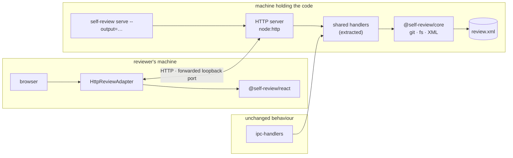
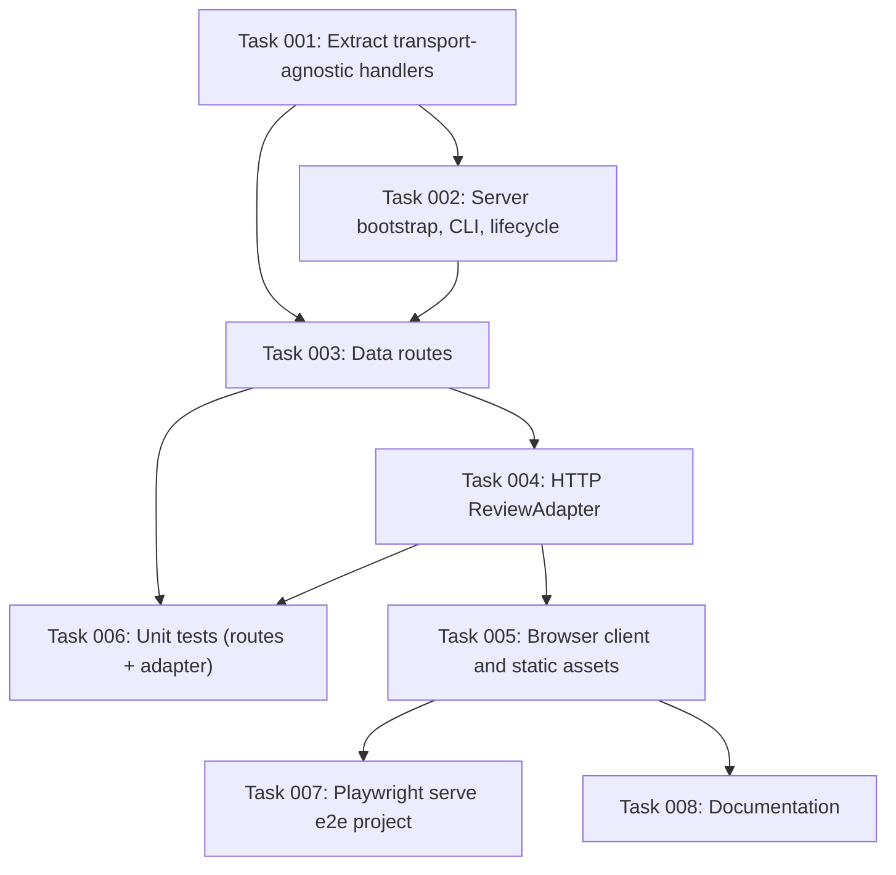

# Plan: Serve Mode (browser-reachable review session)

## Original Work Order

> What if we make the output path a cli argument for starters, rather than something you can
> change in the UI. e.g. `self-review --serve --output=my-review.xml :8080`
>
> [and earlier in the same discussion]
>
> What about a "remote" mode to self-review? I'm thinking something like how the Transmission
> bittorrent client can have a remote mode where it runs on the server, but you can connect via
> the web.

The motivating constraint: code under review lives inside an isolated VM (Lullabot
[sandbar](https://github.com/Lullabot/sandbar)) whose security model states *"The only guest mount
is the playbook, and it is read-only. There is no writable host mount"* and *"Samba is forced off
for Lima-provisioned VMs."* Code is expected to leave that VM only by `git push`. An Electron app
cannot be used from the host, and mounting the guest filesystem defeats the isolation the VM
exists to provide. A served UI reached over a forwarded loopback port is an already-supported
crossing for that environment, and requires nothing to be pushed and nothing to be mounted.

## Plan Clarifications

| Question | Answer |
| --- | --- |
| Should serve mode be strictly additive, or may it refactor shared code? | **Small extractions permitted.** Handler bodies lift out of `src/main/ipc-handlers.ts` into a module both Electron and serve import, so there is one implementation and no drift. The consequence is accepted: the desktop path changes and must be re-tested. |
| What test coverage should v1 carry? | **Unit plus reuse of the existing e2e harness.** Vitest for the route handlers and the HTTP adapter, and a new Playwright project alongside the existing `e2e` one that boots the server, loads a real diff, adds a comment, finishes the review, and asserts the XML on disk. |
| Is backwards compatibility required? | **Yes, for behaviour.** The Electron desktop app must continue to work exactly as it does today. It is explicitly *not* frozen as source — the extraction above edits it — but no user-visible desktop behaviour may change. No change to the v3 XML output. |
| Should the output path be changeable from the served UI? | **No.** It is fixed at launch by `--output`. This is a deliberate scope reduction, not an oversight. |
| What ends a served review session? | **An explicit finish.** `POST /api/review` writes the XML and then stops the server; process lifetime is review lifetime. A closed browser tab does nothing and saves nothing. |
| Does v1 need a server-to-client push channel? | **No.** See Background — the guide is resolved before the UI loads and rides with the diff payload, and the only other push exists for a welcome-screen feature v1 omits. |
| What binds, and what about authentication? | **`127.0.0.1` only.** Loopback binding is the whole of v1's security posture. Binding to a routable interface is out of scope, because it would require an authentication design this plan deliberately does not attempt. |

## Executive Summary

self-review is an Electron desktop application. Its value — a real review UI over a local diff,
with no remote and no account — is unavailable whenever the code being reviewed is not on the
machine the reviewer is sitting at. That is the normal case for anyone running a coding agent
inside an isolated VM, which is a growing pattern and the direct motivation here.

This plan adds a second front end to the existing application rather than a second application.
The repository is already separated along exactly the line this requires: `@self-review/react`
carries the entire UI with no Electron and no Node built-in imports, `@self-review/core` owns git,
filesystem and XML, and `packages/react/src/adapter.ts` defines a `ReviewAdapter` interface whose
own documentation says *"consumers implement this to provide data loading and lifecycle hooks"*.
Serve mode is a second implementation of that interface, backed by an HTTP server that reuses the
logic the Electron main process already runs.

The approach was chosen because it adds no new concepts. The seam exists, is documented as an
extension point, and already has two consumers — the Electron renderer and the `tests/webapp`
harness that runs in CI. Serve mode becomes the third. The expected outcome is that a reviewer on
one machine can review a diff held on another with the same UI, the same XML output, and no
weakening of whatever isolates the two.

## Context

### Current State vs Target State

| Current State | Target State | Why? |
| --- | --- | --- |
| The UI is reachable only as an Electron window on the machine holding the code | The same UI is also reachable over HTTP from a browser on another machine | A reviewer cannot use the tool at all when the code is in an isolated VM |
| `ReviewAdapter` has two implementations: the Electron renderer and the `tests/webapp` fixture harness | A third implementation backed by `fetch` | The interface is the designed extension point; no new seam is needed |
| Request handling lives inside `ipcMain` callbacks in `src/main/ipc-handlers.ts` | The same logic lives in a transport-agnostic module that both the IPC handlers and the HTTP routes call | One implementation, so the two front ends cannot drift |
| Output path is chosen at startup and changeable at runtime through a native dialog | In serve mode it is fixed by `--output` and the UI offers no control | A native file dialog has no browser equivalent; fixing it removes the problem instead of inventing an answer |
| A review ends when the window closes, prompting save or discard | A served review ends when the reviewer explicitly finishes; the server then exits | A browser tab has no reliable close semantics to hang a save prompt on |
| Reviewing a VM-held diff requires mounting the guest filesystem or pushing a branch | Neither is required | Both defeat or bypass the isolation the VM exists to provide |

### Background

Four findings from reading the codebase shaped this plan, and each removed work that a naive
version would have carried.

**The UI is already browser-clean.** `packages/react` declares no Electron dependency and imports
no Node built-in. `packages/core` does use `fs` and `child_process`, but already ships
`packages/core/src/browser.ts` as a browser-safe entry point, which `webpack.renderer.config.ts`
and `tests/webapp/vite.config.ts` both alias to. Nothing in the UI needs changing to run in a
browser.

**A browser build of the UI already exists and runs in CI.** `tests/webapp/` is a small Vite
application — `index.html`, `main.tsx`, `vite.config.ts`, `styles.css` — that mounts `ReviewPanel`
and `Toolbar` from `@self-review/react`, supplies its own `ReviewAdapter`, and renders its own
chrome. Its header comment describes it as demonstrating *"the embedding pattern: the host app
renders its own chrome (Toolbar, Finish Review button) and uses the ref handle to read the review
state when ready."* Playwright exercises it as the `e2e` project. The serve-mode client is that
application with fixture data replaced by HTTP calls, so the bundling, mounting and chrome
questions are already answered by working code.

**No push transport is required.** This was initially assumed to be necessary and the code
disproved it. `src/main/guide-loader.ts` states that *"Discovery is one-shot: the guide is resolved
from the startup output path"* and that `loadGuide` *"IS awaited before window creation"* so the
payload is cached before the first renderer request. The `DIFF_REQUEST` handler then sends the
guide immediately after the diff on the same request. The guide is therefore data available at
response time, not an event. The only other push is `onDiffLoad`'s later calls, which exist to
replace the session wholesale when a remote PR is opened from the welcome screen — a plan 58
feature that v1 omits. With `changeOutputPath` also removed, every remaining interaction is
request/response.

**Most of the IPC surface is not needed.** `src/shared/ipc-channels.ts` defines 29 channels. Around
fifteen fall away in a browser: the `APP_*` lifecycle trio, `DIALOG_PICK_DIRECTORY` and the two
`OUTPUT_PATH_*` channels (removed by `--output`), the three `FIND_*` channels (the browser provides
find natively), the `VERSION_UPDATE_*` pair, `APP_SHOW_ABOUT`, `OPEN_EXTERNAL`, and
`REMOTE_OPEN_URL`. Roughly ten routes remain.

Two facts about the existing code were thought to make the `--output` decision cheaper than it
appears: that `packages/react/src/components/FileTree.tsx` already guards on the method's absence
before offering the control, and that `SingleFileReview` already ships a reduced adapter whose tests
assert `changeOutputPath` is undefined.

**The first was wrong, and execution proved it.** Only the *handler* was guarded; the button
rendered unconditionally. See Noteworthy Events. The second holds, and omitting the key is now
genuinely a supported state because a one-line change under `packages/` made it one.

## Architectural Approach

Five components. The first is a refactor of existing code; the rest are new and additive.

### Shared Handler Extraction

**Objective**: Give the HTTP routes and the Electron IPC handlers one implementation, so the two
front ends cannot diverge as either changes.

The bodies of the handlers registered in `src/main/ipc-handlers.ts` are, with few exceptions,
transport-agnostic: they take a value, consult cached state or call into `@self-review/core`, and
return a value. Extraction moves those bodies into a module that takes plain arguments and returns
plain results, leaving the `ipcMain.on`/`ipcMain.handle` registrations as thin adapters over it.

The candidates are the handlers behind diff loading, resume loading, review submission, context
expansion, per-file content loading, image loading, and attachment reading. Handlers that are
inherently Electron — dialogs, window lifecycle, find-in-page, external links, version updates —
stay where they are and are not extracted.

Cached startup state is part of this. The current handlers read module-level caches populated
during Electron startup (the diff payload, the guide payload, resume data). The extracted module
needs an explicit place for that state so the server can populate it during its own startup rather
than inheriting it from Electron's. Making that dependency explicit rather than ambient is the main
design work of this component.

This is the only component that edits existing code, and therefore the only one carrying regression
risk to the desktop application.

### HTTP Server

**Objective**: Expose the extracted handlers over HTTP and serve the client bundle, with no new
runtime dependency.

Built on `node:http`. The project's own PRE_PLAN guidance asks for minimal dependencies while
warning against reinventing wheels; roughly ten routes with no middleware requirements sit
comfortably inside the standard library, and the package currently has no server dependency to
reuse. Adding one to a desktop application that otherwise does not need it is not justified at this
size.

Responsibilities: resolve the diff, guide and configuration at startup exactly as the Electron main
process does; serve the prebuilt client bundle as static files; expose the routes; and own session
end. Routes cover diff loading, resume loading, review submission, context expansion, per-file
content, images, attachments, and configuration. The guide is returned as part of the diff response
rather than as a separate route, mirroring how the IPC handler already delivers it.

Binding is `127.0.0.1` by default. In the motivating environment the VM's port forwarding is what
carries the connection to the host, so loopback is sufficient and no listener is exposed beyond it.

### Browser Client

**Objective**: Produce a browser build of the existing UI without forking it.

Modelled directly on `tests/webapp/`, which already solves this problem for the test suite: a Vite
application with an `index.html` entry, a `main.tsx` that mounts `ReviewPanel` and `Toolbar` and
renders the surrounding chrome, and a Vite config aliasing `@self-review/core` to its browser
entry. The serve client differs in supplying an HTTP-backed adapter instead of fixtures, and in
rendering a finish control that ends the session.

The build produces static assets the server serves. Packaging must place them where a released
binary can find them, which is the one part of this component that does not have an existing
answer in `tests/webapp` — that harness is only ever run from source by Playwright.

### HTTP Review Adapter

**Objective**: Implement `ReviewAdapter` over `fetch`.

A direct translation of the Electron adapter in `src/renderer/App.tsx`, which is twenty-one lines:
each method becomes a request instead of an `ipcRenderer` call. `readAttachment` returns binary and
is read as an array buffer rather than JSON. `onGuideLoad` becomes a callback invoked with the
guide already present in the diff response, preserving the interface's subscribe-and-unsubscribe
shape without a transport behind it. `changeOutputPath` is omitted.

`loadDiff` is the only required method; every other method this adapter provides is optional in the
interface, which means the UI degrades correctly if any of them is later dropped.

### CLI and Session Lifecycle

**Objective**: Launch the server, and define unambiguously when a review ends.

`serve` is a subcommand, matching `fetch-comments`, and takes `--address` for the host and port,
defaulting to `127.0.0.1` on a fixed port. `--output`
sets the review file path; `output-file` already exists as a configuration key resolved against the
working directory in `src/main/main.ts`, so this surfaces an existing value rather than introducing
one.

Session end is explicit. Submitting the review writes the XML through the same core serializer the
desktop app uses, responds, and then stops the server, so the process exits when the review is
finished. Nothing is written before that point, which matches the desktop application's behaviour
of discarding on quit unless the reviewer chooses to save. A closed tab therefore costs nothing and
means nothing.

## Risk Considerations and Mitigation Strategies

Technical Risks

- **Extraction changes desktop behaviour.** The handler bodies being lifted are live desktop code, and the caches they read are populated by Electron startup ordering that is easy to disturb.
    - **Mitigation**: Extract without behavioural change as a discrete step, verified by the existing Electron Playwright project (`test:e2e:electron`) before any serve-mode code depends on it. Make cache population an explicit argument rather than an ambient import, so both callers state what they provide.
- **The client bundle is not locatable in a packaged build.** `tests/webapp` is only ever run from source, so it provides no precedent for where built assets live in a release.
    - **Mitigation**: Treat asset location as a named piece of work rather than an afterthought, and cover it by running serve mode from a packaged build rather than only from source.
- **Large payload handling differs over HTTP.** The IPC layer has a large-payload mode and a `PAYLOAD_GUARD_SHOW` channel; a single HTTP response has different characteristics from a structured clone across IPC.
    - **Mitigation**: Reuse the existing `preparePayload` path and the per-file lazy loading route rather than inventing a second strategy. Exercise serve mode against a deliberately large diff.
- **Binary responses.** Attachments and images cross IPC today as buffers and base64 respectively; both need correct content types and encodings over HTTP.
    - **Mitigation**: Keep the adapter's declared return types as the contract, and assert on them in unit tests rather than trusting the browser to coerce.

Implementation Risks

- **Scope creep toward a general web deployment.** Authentication, multi-client synchronisation, session resume and public binding are all natural follow-on thoughts, and none is required by the motivating use case.
    - **Mitigation**: They are listed as out of scope in this plan. Loopback binding is what makes their absence defensible; if public binding is ever added, they stop being optional and that is a separate plan.
- **Divergence between the two front ends over time.** A future change to a handler could be made in one place and not the other.
    - **Mitigation**: This is the reason for the extraction. The single implementation is the mitigation, and the choice was made deliberately over the strictly-additive alternative that would have duplicated it.

Quality Risks

- **A served UI that renders but cannot save.** Unit tests over routes and adapter would both pass while the loop is broken end to end.
    - **Mitigation**: The Playwright `serve` project asserts the written XML on disk, not merely a successful HTTP response.

## Success Criteria

### Primary Success Criteria

1. `self-review serve --output=<path> <base>` starts a server bound to loopback, and the review UI loads in a browser pointed at it, rendering the same diff the desktop application renders for the same arguments.
2. A comment added in the browser and finished through the UI produces an XML file at `<path>` that validates against the v3 schema and is equivalent to what the desktop application writes for the same review.
3. Finishing the review stops the server and the process exits.
4. The served UI presents no control for changing the output path, and the absence causes no error.
5. The Electron desktop application's behaviour is unchanged: `test:e2e:electron` passes, and a manual desktop review still saves, discards, and changes output path as before.
6. No new runtime dependency appears in `package.json`.
7. `npm run test:unit` and the full Playwright suite, including the new `serve` project, pass.

## Self Validation

These steps are to be executed after implementation, against the real system.

1. In a git repository with at least one uncommitted change, run `self-review serve --output=/tmp/sv-check.xml` and confirm the process reports a loopback URL and does not open a window.
2. `curl -s http://127.0.0.1:<port>/api/diff | head -c 400` and confirm a JSON payload naming the changed files. Confirm the guide field is present in the same response body rather than requiring a second request.
3. Open the URL in a browser with Playwright CLI, screenshot the page, and confirm the file tree and diff render.
4. In that browser session, add a comment to a specific line, then activate the finish control.
5. Confirm the server process has exited, and that `/tmp/sv-check.xml` exists. Validate it against `packages/core`'s v3 XSD and confirm the comment body and its line attribute are present.
6. Run the same review through the desktop application against the same repository state and diff the two XML outputs, ignoring the timestamp attribute, to confirm equivalence.
7. `curl -s http://127.0.0.1:<port>/api/attachment/<path>` for a binary attachment and confirm the bytes match the file on disk, verifying the binary route does not corrupt content.
8. Start serve mode with an `--output` path in a non-writable directory and confirm the failure is reported at startup rather than after a completed review.
9. Run `npm run test:e2e:electron` and confirm the desktop suite passes unchanged after the handler extraction.
10. Package the application, run serve mode from the packaged build rather than from source, and repeat steps 2 and 3 to confirm the client assets are found.

## Documentation

- `README.md`: a serve-mode section covering the flag, the loopback default, the fixed output path, and the explicit finish. It should state plainly that serve mode has no authentication and is intended to be reached over a forwarded loopback port.
- `AGENTS.md` / `CLAUDE.md`: note the new front end and the extracted handler module, so future work knows there are two callers of that logic.
- `docs/`: this suggested following plan 58's intent-document convention. That convention turned out not to exist — see Noteworthy Events — so no intent document was written, and whether one should be is an open question for the maintainer.

## Resource Requirements

### Development Skills

Node HTTP server implementation without a framework; Electron main-process architecture, enough to
extract handler logic safely; React and Vite application bundling; Playwright, for a new project in
an existing configuration.

### Technical Infrastructure

Existing repository tooling only: Vite for the client build, Vitest for unit tests, Playwright for
end to end. No new runtime dependency is expected, and its appearance should be treated as a signal
that the approach has drifted.

## Integration Strategy

Serve mode is a second front end over shared logic, not a fork. It integrates at two points: the
extracted handler module, which both front ends call, and the `ReviewAdapter` interface, which both
front ends implement. The XML output is produced by the same `@self-review/core` serializer in both
cases, so a review is indistinguishable by its artifact regardless of which front end produced it.

Plan 58's remote PR/MR work is adjacent but independent. Serve mode is about where the *UI* runs;
remote PR review is about where the *diff* comes from. They compose in principle — a served UI
reviewing a remote PR — but v1 omits the welcome screen through which remote review is entered, so
that combination is out of scope here.

## Notes

The strongest argument for this plan is that it introduces no new architectural concept. Every
element already exists: the adapter interface as a documented extension point, a browser build of
the UI in `tests/webapp`, a browser-safe core entry in `packages/core/src/browser.ts`, and an
output path already resolvable from configuration. The work is connecting them and extracting the
handler logic they share.

The two scope reductions — fixed output path and explicit finish — were chosen because each
replaces a hard question with a simple answer rather than deferring it. A native file dialog has no
browser equivalent, and a browser tab has no reliable close semantics. Both could be revisited, but
neither should be revisited in v1, and the fixed output path in particular is what removes the last
push channel and keeps the transport request/response.

## Execution Blueprint

**Validation Gates:**
- Reference: `/config/hooks/POST_PHASE.md`

### Dependency Diagram

### ✅ Phase 1: Share the handler logic
**Parallel Tasks:**
- ✔️ Task 001: Extract transport-agnostic handler logic out of the Electron IPC layer (completed)

The only phase that edits existing desktop code. Nothing downstream may begin until
`test:e2e:electron` confirms the desktop application is behaviourally unchanged.

### ✅ Phase 2: Stand up the server process
**Parallel Tasks:**
- ✔️ Task 002: Serve-mode HTTP server bootstrap, CLI flags, and session lifecycle (depends on: 001) (completed)

### ✅ Phase 3: Complete the API surface
**Parallel Tasks:**
- ✔️ Task 003: Expose the shared handlers as serve-mode data routes (depends on: 001, 002) (completed)

### ✅ Phase 4: Bind the UI to the API
**Parallel Tasks:**
- ✔️ Task 004: Implement the HTTP ReviewAdapter (depends on: 003) (completed)

### ✅ Phase 5: Ship the client, cover the logic
**Parallel Tasks:**
- ✔️ Task 005: Build the serve-mode browser client and its static assets (depends on: 004) (completed)
- ✔️ Task 006: Unit test the serve-mode routes and the HTTP adapter (depends on: 003, 004) (completed)

### ✅ Phase 6: Prove and document
**Parallel Tasks:**
- ✔️ Task 007: Add a Playwright project covering the full served review loop (depends on: 005) (completed)
- ✔️ Task 008: Document serve mode and the shared handler module (depends on: 005) (completed)

### Post-phase Actions

After Phase 1, run `npm run test:e2e:electron` and treat a failure as a blocking regression rather
than a flake — that suite is the only gate protecting the desktop application from the extraction.

After Phase 6, execute the plan's Self Validation section in full, including the packaged-build step,
which is the one part of the client work with no existing precedent in the repository.

### Execution Summary
- Total Phases: 6
- Total Tasks: 8

## Execution Summary

**Status**: ✅ Completed Successfully
**Completed Date**: 2026-08-28

### Results

Serve mode works end to end. `self-review serve --output=<path>` starts a loopback HTTP server,
the existing review UI loads in a browser, a comment made there is written to the review file, and
finishing the review stops the server.

Delivered across six phases and eight tasks, all verified independently of the implementing agents
rather than on their reports:

- `src/main/review-handlers.ts` — transport-agnostic handlers with an explicit `ReviewSession`,
  called by both the Electron IPC registrations and the HTTP routes.
- `src/main/serve/` — `node:http` bootstrap, CLI flags, static client serving, session lifecycle,
  and the data routes.
- `src/serve-client/` — the browser client and its `ReviewAdapter` over `fetch`.
- A Playwright `serve` project asserting the artifact on disk, plus unit coverage of the routes
  and the adapter.
- README and AGENTS.md.

No new runtime dependency. The Electron desktop app is behaviourally unchanged: `test:e2e:electron`
passed after every phase, including the one change under `packages/`.

### Noteworthy Events

**Code review gate did not run.** Round 1 returned `skipped`, `reason: "no-reviewer-candidate"`,
`detail: "No harness other than `claude` is installed and responsive, so the review gate was
skipped."` An earlier attempt returned `skipped`, `reason: "validator-absent"`, `detail: "No
`xmllint` on PATH, so emitted findings could not be validated against the vendored schema and the
review gate was skipped. Install libxml2-utils (Debian/Ubuntu), libxml2 (Homebrew), or your
platform equivalent to enable the gate."` — `libxml2-utils` was installed, which resolved that
reason and exposed the second. Rounds run: 0. Findings recorded: 0. Findings applied: 0. **No
independent second-model review of this work has taken place.**

**A plan assumption was false, and a `packages/` change was authorised to fix it.** The plan and
task 4 both asserted that omitting `changeOutputPath` removes the Change… control, because
`FileTree.tsx:31` guards the handler. Only the handler is guarded; the `<Button>` rendered
unconditionally, so task 5's criterion "no output-path control is rendered" failed. The agent
reported it rather than editing `packages/`, which the plan forbade. With explicit authorisation
the button was made conditional, the false comment in `adapter.ts` was corrected, and the fix was
verified in a real browser (1 button before, 0 after, output path still displayed, no page errors).
This also removes the same dead button for `SingleFileReview`, which already ships a reduced adapter.

**Electron will not run headless, which serve mode had to solve.** Electron initialises Ozone/X11
even with no window and exits with "Missing X server or $DISPLAY" — on exactly the VM this feature
exists for. `app.commandLine.appendSwitch` is silently ignored because the platform is selected
before the app script runs, so `main.ts` re-launches itself once with `--ozone-platform=headless`
via `spawnSync`. `spawnSync` is load-bearing: with async `spawn` the launcher reached UI init and
segfaulted, orphaning the server.

**A launcher that is killed outright orphans the listener.** Found by task 7 while writing the e2e
test, reported rather than fixed at the time, and **fixed afterwards** in
`src/main/serve/orphan-guard.ts`.

Task 7's report said a reviewer who Ctrl-Cs `self-review --serve` is also affected. That was wrong,
and measuring each signal separately showed why: SIGINT to the process group, which is what Ctrl-C
sends, always killed the child and released the port. SIGTERM to the launcher's pid alone did
nothing at all, because the launcher is blocked in `spawnSync` and never processes it. Only
SIGKILL genuinely orphaned the child, which is also the one case no launcher-side handler could
catch. The child now watches its parent pid and exits when it changes.

**No push transport was needed, contrary to the initial design.** `guide-loader.ts` resolves the
guide one-shot at startup and the `DIFF_REQUEST` handler sends it immediately after the diff, so it
is data available at response time rather than an event. With `--output` removing
`OUTPUT_PATH_CHANGED` and the welcome screen omitted, every interaction is request/response. The
SSE layer in the original sketch was dropped.

**`docs/intent/` does not exist.** This plan's Documentation section suggested following plan 58's
intent-document convention, but `docs/intent/remote-pr-review.md`, which plan 58 cites as its
authoritative scope, was never created. Task 8 checked instead of assuming and declined to invent a
lone instance of a convention the repository does not have.

**Test suites were briefly red across a parallel phase.** In phase 5 the shared suite failed while
one agent's files were half-written. Attribution was confirmed by running each agent's files in
isolation. Not a defect; a property of running two agents against one suite.

**Pre-existing conditions, unchanged by this work.** One flaky Electron test
(`11-welcome-screen › Finish Review produces valid XML with source-path and no git-diff-args`)
fails then passes on retry; the same flake was observed on an unmodified `main` baseline. Three
lint warnings in `.agents/skills/*/scripts/dispatch-task-execution.cjs` are vendored and
pre-existing.

**Strikethroo was upgraded 3.17.1 → 3.19.1** by `npx strikethroo init --harnesses claude` and
`npx skills add`, committed separately as a `chore:` so it stays out of the feature diff.

### Necessary follow-ups

Still open:

1. **Get an independent review.** The gate never ran, so nothing has reviewed this work except the
   agents that wrote it and the orchestrator that verified it. This is the largest outstanding gap.
   Two review passes by the author have since landed, covering the README and part of the CLI, but
   most of the server and the client remain unread by a second party.
2. **Decide whether `docs/intent/` is a real convention** and, if so, whether plan 58's document and
   one for serve mode should both land.
3. **Consider wiring `test:e2e:serve` into CI.** It is deliberately excluded, matching the
   `electron` project and the workflow's stated scope, and costs one Electron package per run.

Done after the plan was archived:

4. ~~Forward signals in `relaunchHeadless()`.~~ Fixed differently, because the diagnosis was wrong:
   Ctrl-C was never affected and SIGKILL cannot be caught on the launcher side, so the child now
   watches its parent instead. `src/main/serve/orphan-guard.ts`.
5. ~~Rename the `[ipc]` log prefixes~~ in `review-handlers.ts`. Now `[review]`.
6. ~~Nothing consumes `outputPathReadOnly`.~~ Removed from `/api/config` and from the client's
   mirrored type; it was dead once the Change… button became adapter-driven.

Also landed after archival, from review feedback rather than the plan:

7. `serve` became a subcommand with `--address`, replacing the `--serve[=HOST:PORT]` flag this plan
   was written against. The plan text above has been updated to match; the Original Work Order and
   Plan Clarifications are left as they were written.
8. Comment density in the new files was brought closer to the rest of the codebase, and the README
   section was rewritten to explain use rather than argue design.
