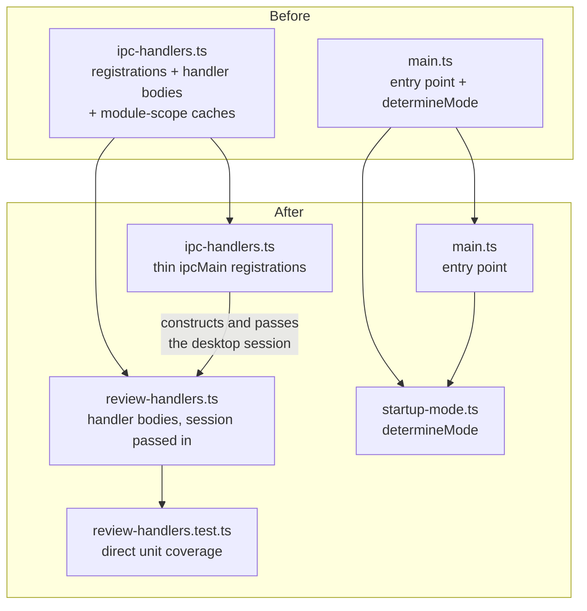
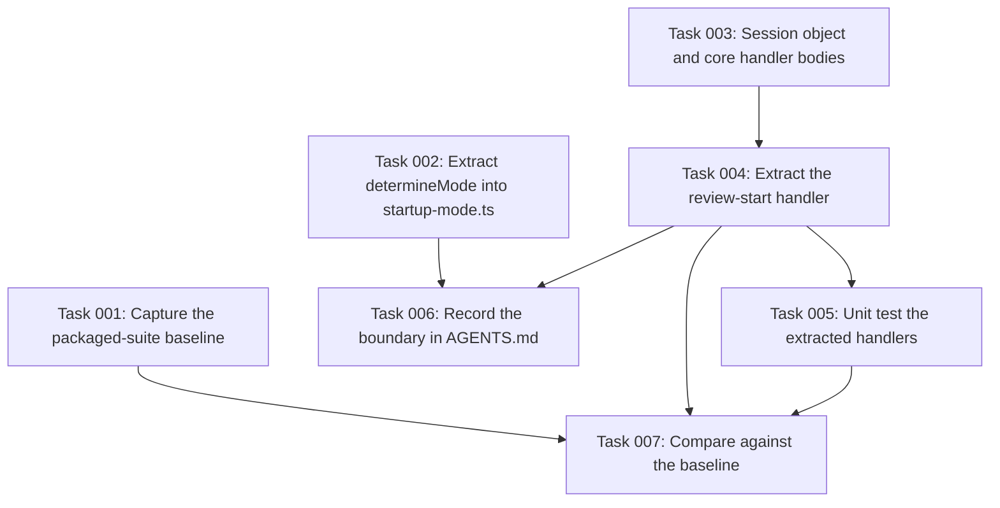

# Plan: Extract transport-agnostic review handlers

## Original Work Order

Work order as supplied

> This is the second of four pull requests decomposing a rejected 5,392-line
> change that added an HTTP serve mode to the application. The review it received
> was:
>
> > I feel like this change is too big for what it is.
>
> The decomposition is: a bug fix in a published component; **this change, the
> seam**; a move of the Node-only middle layer into a shared workspace package;
> and finally serve mode itself as a Node command-line program. Each must stand
> on its own merits. This one does: the handlers it extracts have never been
> unit-testable, and that is worth fixing whether or not serve mode is ever built.
>
> Lift the handler bodies out of `src/main/ipc-handlers.ts` into a new
> `src/main/review-handlers.ts`, replacing the module-level caches with an
> explicit session object passed in as a parameter. `ipc-handlers.ts` becomes
> thin `ipcMain` registrations over it. Separately, extract `determineMode` out
> of `src/main/main.ts` into `src/main/startup-mode.ts` so that any front end can
> resolve a startup session the same way the desktop does.
>
> Observable behaviour of the desktop application must be unchanged. This is the
> only change in the four-part sequence that can regress it, which is why it
> travels alone. Add the unit tests that the extraction makes possible.
>
> Start from `origin/main`. The earlier `feat/serve-mode` branch is discarded and
> must not be cherry-picked or ported; it may be read as a reference only.
>
> Constraints: additive where possible, with no changes to `packages/core`,
> `packages/types`, `packages/react`, or the Electron path beyond what this change
> strictly requires. Do not modify the Electron fuse configuration in
> `forge.config.ts`. Do not include `.ai/strikethroo/**` in the pull request. The
> default branch must remain releasable. The repository squash-merges and derives
> release versions from pull request titles via semantic-release's angular preset,
> so the title must follow that convention.
>
> Out of scope: creating any new workspace package, anything to do with HTTP or
> serve mode, and fixing the pre-existing headless failure in the
> `fetch-comments` subcommand.

## Plan Clarifications

| Question | Answer |
| --- | --- |
| Is backwards compatibility required? | Yes, absolutely, for the desktop application's observable behaviour. This change must be invisible to a user. No published package API changes here, so there is no external compatibility surface. |
| Should the extraction also move code into a new package? | No. That is a separate change. This one keeps everything inside `src/main/` and only reorganises it. |

## Executive Summary

The review handler bodies currently live inside the module that registers them
with Electron's inter-process layer, and they read their state from caches held
at module scope and populated during application startup. That coupling has two
costs: the handlers cannot be unit-tested, because exercising them means starting
an Electron application, and they cannot be reused by any front end that is not
the desktop window.

This change moves the bodies into a dedicated module and gives them an explicit
session object as a parameter instead of module-scope state. The registration
module becomes thin wrappers that construct the desktop application's session and
pass it through. Startup mode determination moves out of the main entry point for
the same reason.

Nothing a user can observe changes. The value delivered on its own terms is
testability: for the first time the handlers can be exercised directly, including
the case that module-scope caching made impossible to express, which is two
independent sessions that must not see each other's state. That such a test can
now be written is the clearest evidence the extraction is correct.

## Context

### Current State vs Target State

| Current State | Target State | Why? |
| --- | --- | --- |
| Handler bodies live in the IPC registration module, 561 lines on the default branch | Handler bodies live in a dedicated module; the registration module holds registrations only | A registration layer and the logic it registers are different concerns, and mixing them is what ties the logic to one transport |
| Handlers read state from caches at module scope, populated during application startup | Handlers receive an explicit session object as a parameter | Module-scope state permits exactly one review in one process, and cannot be constructed by a test |
| The handlers have no unit tests | The handlers have unit tests, including that two sessions are isolated from one another | Their only coverage today is an integration suite that requires packaging the application and a display, and which does not run in continuous integration |
| Startup mode determination is embedded in the main entry point | Startup mode determination is its own module | Resolving what to review is not specific to the desktop window, and burying it in the entry point makes it unreachable |

### Background

This is one part of a four-way decomposition. A single change that added an HTTP
serve mode was rejected for its size, and the underlying reason it was so large
is structural: the logic serve mode needed was not reachable without dragging the
desktop application along with it.

Measurement on the default branch shows why the extraction is worth doing
independently. Of 2,655 lines in the main-process directory, only 1,426 touch the
Electron runtime. The remaining 1,229 are ordinary Node code that happens to live
inside a desktop application. The handler bodies are part of that majority; what
binds them to Electron is not what they do, but where their state lives.

The extraction is deliberately conservative. No package is created, no module
moves outside the main-process directory, and no behaviour changes. Those are
later concerns. This change earns its place by making the handlers testable and by
removing the module-scope state that prevents a second caller, and it is
sequenced alone because it is the only part of the wider sequence that can break
the desktop application.

## Architectural Approach

### Component 1 — An explicit session object

**Objective**: Replace module-scope state with a value that can be constructed,
passed and isolated.

The state currently cached at module scope is identified and gathered into a
single session type. Every handler body that reads that state instead receives
the session as a parameter. The shape of the type follows from what the handlers
actually read, and is not designed ahead of a demonstrated need.

The property that matters, and that the current design cannot express, is that
two sessions are independent. Nothing in a handler may reach state that is not
reachable through its session parameter.

### Component 2 — Handler bodies in their own module

**Objective**: Separate what the handlers do from how they are registered.

The bodies move verbatim where possible into a dedicated module, taking the
session as a parameter. The intent is a move, not a rewrite: behaviour changes
are out of scope, and any change that is not purely mechanical should be visible
and deliberate rather than incidental.

The registration module retains its registrations and becomes a thin adapter,
constructing the desktop application's session and forwarding to the extracted
functions. It keeps its Electron-specific responsibilities, which do not move.

### Component 3 — Startup mode as its own module

**Objective**: Make the decision of what to review reachable outside the entry
point.

The function that determines startup mode moves out of the main entry point into
its own module, unchanged in behaviour. The entry point imports it. This is
separable from the handler work and touches a different file, but belongs in the
same change because it is the same argument applied to the same obstacle.

### Component 4 — The tests the extraction makes possible

**Objective**: Demonstrate the extraction is correct, and cover behaviour that
previously had no unit coverage.

Unit tests exercise the extracted handlers directly against constructed sessions.
Coverage should include the handlers' principal success paths, the case where a
diff and its guide are returned together, and explicitly that state set on one
session is not visible from another. That last test is the one that could not be
written before, and it is the strongest available evidence that the module-scope
coupling is genuinely gone.

## Risk Considerations and Mitigation Strategies

Technical Risks

- **A silent behaviour change during the move.** Refactoring by hand across
  hundreds of lines invites small differences in ordering, error handling or
  default values, and the integration suite that would catch them does not run in
  continuous integration.
    - **Mitigation**: Treat the move as mechanical and review it as one. Run the
      packaged-application integration suite locally both before and after the
      change, on the same repository fixture, and compare results rather than
      assuming a pass.
- **Residual module-scope state.** A cache left behind, or state reached through
  an import rather than the session parameter, would preserve the coupling while
  appearing to remove it.
    - **Mitigation**: The session-isolation unit test is the direct check. In
      addition, inspect the extracted module for any mutable state declared
      outside a function.
- **The session type grows beyond what is needed.** Designing it for the
  anticipated second front end rather than for current callers would be building
  for a need that has not arrived.
    - **Mitigation**: Derive the type strictly from what the existing handlers
      read. Anything not currently read does not belong in it.

Implementation Risks

- **Scope creep into the later parts of the sequence.** Creating a package or
  anticipating an HTTP caller would reintroduce exactly the size problem this
  decomposition exists to solve.
    - **Mitigation**: Enumerated in the success criteria: no new package, no
      module leaves the main-process directory, no HTTP.
- **The pull request title does not match the release convention.** Release
  versioning is derived from the title, so a malformed one produces a wrong
  version or none.
    - **Mitigation**: Use the angular convention. This change is a refactor with
      no user-visible effect, and its title should say so rather than implying a
      feature or a fix.

## Success Criteria

### Primary Success Criteria

1. Handler bodies live in a dedicated module and take an explicit session
   parameter; the IPC registration module contains registrations and Electron
   specifics only.
2. No mutable state is declared at module scope in the extracted module, and a
   unit test demonstrates that two sessions cannot observe each other's state.
3. Startup mode determination lives in its own module and the entry point imports
   it, with behaviour unchanged.
4. The desktop application's observable behaviour is unchanged: the same startup
   modes resolve, the same diffs render, and the same review output is produced
   for the same input.
5. The change creates no new workspace package, moves no module out of the
   main-process directory, and adds nothing related to HTTP.
6. Unit and browser end-to-end suites pass, and the packaged-application
   integration suite produces the same result as it does on the unmodified
   default branch.
7. The plan directory ships with the change, as the repository does for its
   other plans, carrying the plan document and its task files. The review
   gate's own output is excluded by the planning workspace's ignore rules.

## Self Validation

1. On the unmodified default branch, run the packaged-application integration
   suite against a fixed repository fixture and record which scenarios pass and
   which fail. This is the comparison baseline and must be captured before any
   code changes.
2. Apply the change, then run the unit suites and the browser end-to-end project
   and confirm both pass.
3. Re-run the packaged-application integration suite against the same fixture and
   compare scenario by scenario against the recorded baseline. Any scenario that
   passed before and fails after is a regression and blocks completion.
4. Launch the desktop application against a real repository with uncommitted
   changes and confirm the diff renders, a comment can be added to a line, and
   completing the review writes an output file containing that comment.
5. Repeat the previous step against a directory that is not a git repository and
   confirm the same startup mode resolves as before the change.
6. Search the extracted module for mutable declarations at module scope and
   confirm there are none.
7. Execute the session-isolation unit test in isolation and confirm it fails when
   the session parameter is deliberately replaced by shared state, proving the
   test actually constrains the design rather than passing vacuously.
8. Confirm the plan document and its task files are staged for the pull request,
   and that no review-gate output is, since the planning workspace's ignore
   rules exclude it.

## Documentation

- `AGENTS.md`: yes, an update is required. Record that the review handler bodies
  now live in their own module and take an explicit session, so a change to them
  is not confined to the desktop path.
- No user-facing documentation changes. Nothing observable to a user changes.
- No README changes.

## Resource Requirements

### Development Skills

- TypeScript, at the level of a careful mechanical refactor across module
  boundaries.
- Electron main-process architecture, sufficient to move logic out of the
  inter-process layer without altering behaviour.
- Vitest, for the unit coverage the extraction makes possible.
- Playwright, for running the existing integration suites as a comparison.

### Technical Infrastructure

- The existing workspace toolchain: TypeScript, Webpack, Electron Forge, Vitest
  and Playwright.
- A machine able to run the packaged desktop application, including a display or
  virtual framebuffer, since the comparison runs require it.
- A git repository fixture with uncommitted changes, held constant across the
  before and after comparison runs.

## Integration Strategy

The change targets the default branch directly and is independent of the
published-component fix that accompanies it, so both may be in review at the same
time. The two later changes in the sequence, which move this code into a shared
package and then build an HTTP front end on it, depend on this one and are
developed locally on top of it, then rebased once it merges, because the
repository squashes on merge.

## Notes

- Nothing from the earlier `feat/serve-mode` branch is carried across as a
  commit. It may be consulted as a reference for an approach that worked.
- The Electron fuse configuration is not modified here, and nothing in this change
  depends on it.
- The pre-existing failure of the `fetch-comments` subcommand on a machine with no
  display is unrelated and out of scope.
- No package is created here. The shared package that later receives this code is
  a separate plan, deliberately sequenced after this one so that the extraction is
  reviewed as logic and the move is reviewed as a move.

## Execution Blueprint

**Validation Gates:**
- Reference: `/config/hooks/POST_PHASE.md`

### ✅ Phase 1: Baseline and independent extractions
**Parallel Tasks:**
- ✔️ Task 001: Capture the packaged-application suite baseline before any code changes
- ✔️ Task 002: Move `determineMode` into its own startup-mode module
- ✔️ Task 003: Introduce the session object and extract the core handler bodies

Task 001 must be started before tasks 002 and 003 modify any file, since the
baseline is only valid against unmodified code.

### ✅ Phase 2: The remaining handler
**Parallel Tasks:**
- ✔️ Task 004: Extract the review-start handler, leaving its native dialog behind (depends on: 003)

### ✅ Phase 3: Coverage and documentation
**Parallel Tasks:**
- ✔️ Task 005: Unit test the extracted handlers, including session isolation (depends on: 003, 004)
- ✔️ Task 006: Record the new module boundary in AGENTS.md (depends on: 002, 004)

### Post-phase Actions

Phase 4 is the plan's own verification and is where Success Criterion 6 is
either met or shown to be unmet. It cannot be skipped on the grounds that the
unit suites are green, because the packaged application is the only thing that
exercises the desktop path end to end and it does not run in continuous
integration.

### ✅ Phase 4: Parity verification
**Parallel Tasks:**
- ✔️ Task 007: Re-run the packaged suite and compare against the baseline (depends on: 001, 004, 005)

### Execution Summary
- Total Phases: 4
- Total Tasks: 7

## Execution Summary

**Status**: ✅ Completed Successfully
**Completed Date**: 2026-09-02

### Results

Five commits on `feature/60--extract-transport-agnostic-review-handlers`, from
base `da5edc3`:

| Commit | Contents |
| --- | --- |
| `59a58ec` | `ReviewSession` type and factory, core handler bodies moved to `src/main/review-handlers.ts`, `determineMode` moved to `src/main/startup-mode.ts` |
| `613df60` | `REVIEW_START_DIRECTORY` split, its native dialog left in the registration layer |
| `79edf4c` | Eight unit tests in `src/main/review-handlers.test.ts` and the `AGENTS.md` boundary note |

`src/main/ipc-handlers.ts` went from 561 lines to 328 and now holds registrations
and Electron specifics only. Main-process unit tests went from 125 to 133.

All seven success criteria are met:

1. Handler bodies live in a dedicated module and take an explicit session.
2. No mutable module-scope state in the extracted module, and two unit tests
   demonstrate session isolation in both the read and the write direction.
3. Startup mode determination is its own module; the entry point imports it.
4. Observable desktop behaviour is unchanged — see criterion 6.
5. No new workspace package, no module left `src/main/`, nothing HTTP-related
   was added. The diff touches six files.
6. Unit (133 / 213 / 368) and browser end-to-end (61) suites pass. The
   packaged-application suite produced a per-scenario result list identical to
   the recorded baseline.
7. The plan document and its task files ship with the change, matching the
   repository's convention.

### Noteworthy Events

**The review gate did not run.** `code-review.cjs 60 claude` returned
`{"kind":"skipped","reason":"no-reviewer-candidate","detail":"No harness other
than \`claude\` is installed and responsive, so the review gate was skipped."}`
No reviewer was dispatched, so zero findings were recorded and zero applied.
Under the skill's rules a skip is not a failure, but it does mean the plan
carries no independent review, and that gap should be closed by a human reviewer
or a separate review pass before the pull request merges.

**The packaged-suite baseline had to precede everything.** Self Validation
step 1 is only satisfiable while the tree is unmodified, so task 1 ran to
completion alone before tasks 2 and 3 were dispatched, rather than in parallel
with them as the blueprint's phase grouping would otherwise allow. The suite
packages from the working tree, so a concurrent edit would have silently
corrupted the baseline.

**One pre-existing flake, matched in both runs.** The scenario "Finish Review
produces valid XML with source-path and no git-diff-args" failed its first
attempt and passed on retry in the baseline *and* in the after run, at the same
step (`tests/steps/11-welcome-screen.steps.ts:121`, an empty `<review>` element
written before the assertion). Same behaviour either side, so it is a match
rather than a change, but it is a genuinely flaky test in the suite.

**Three deviations from a byte-for-byte move, all deliberate and disclosed.**
`expandContext` snapshots the session's diff data into a local after its guard
instead of re-reading it at the write site; observable only if another handler
replaced the diff mid-`git diff`, which cannot happen since the only other
writer runs from the welcome screen. `takeReviewState` clears unconditionally
rather than under a guard, which in the 100 ms poll means writing `null` over
`null`. `commitReviewStart` calls the pure `preparePayload` unconditionally
where the original called it inside `if (window)`, costing one wasted array map
in a case that does not occur.

**Success Criterion 7 was wrong as written and has been corrected.** The work
order, quoted above unchanged, said not to include `.ai/strikethroo/**` in the
pull request, and the original criterion 7 repeated it. That was asserted
without checking the repository, which in fact ships plan directories with the
work they describe: `3ddcc5c` (#128) and `ba5a16e` (#118) each committed an
archived plan and its tasks alongside their source changes. The criterion now
matches the convention. Two artifacts this plan invented, the before and after
records of the packaged suite, have no precedent in earlier plans and were
trimmed to their per-scenario comparison before being committed; the raw
Playwright output they originally carried was dropped as noise. The review
gate's output is not committed because `.ai/strikethroo/.gitignore` excludes
`archive/*/review/`.

**A stale expected test count in the task files was corrected.** Tasks 3 and 4
were written expecting 215 renderer tests; the real figure on `main` is 213.
The 215 came from a run on a different branch that had added two tests. Caught
during execution and verified against a clean worktree at `HEAD`.

**Two pre-existing issues were found and deliberately left alone.**
`determineMode` checks `existsSync` against a resolved path but passes the raw
argument to `isGitTracked`, so tracked-ness is tested relative to the process
working directory rather than the resolved path. Separately,
`submitReviewState` logs with an `[ipc]` prefix, a transport-layer artifact now
sitting in a transport-agnostic module. Both are out of scope for a change whose
whole discipline is that it alters no behaviour.

### Necessary follow-ups

- Obtain independent code review, since the automated gate was skipped.
- Open the pull request with an angular-convention title. This is a refactor
  with no user-visible effect, so `refactor:` is the correct type.
- Consider filing the two pre-existing issues noted above.
- Self Validation steps 4 and 5 ask for manual launches of the desktop
  application against a git repository and against a non-git directory. Those
  assertions are covered mechanically by packaged scenarios 1-10 (XML output
  with comments at correct line references, output file written), 19 ("Not a
  git repository"), 24 ("Welcome screen appears when launched outside git
  repo") and 25 ("Directory mode loads all files as additions"), all of which
  passed identically before and after. A human should still click through once
  before merge; that has not been done.
