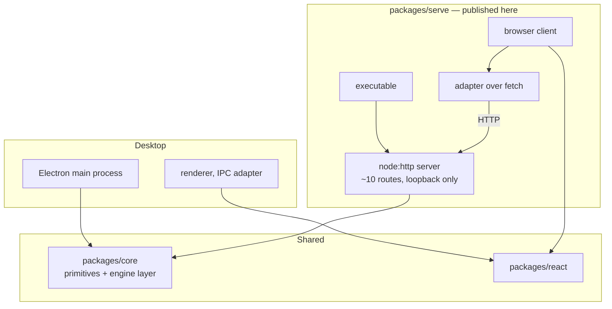
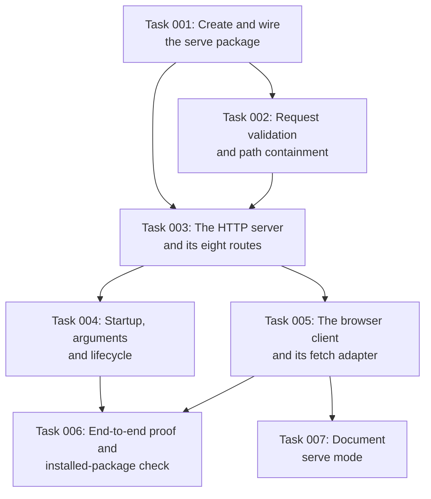

# Plan: Serve mode as a Node command-line package

## Original Work Order

<details>
<summary>Work order as supplied</summary>

> This is the fourth and last of four pull requests decomposing a rejected
> 5,392-line change that added an HTTP serve mode to the application. The review
> it received was:
>
> > I feel like this change is too big for what it is.
>
> The three preceding changes fixed a published component, extracted the review
> handler bodies behind an explicit session object, and moved the Node-only
> session layer into a private shared workspace package. This change builds the
> feature on top of them.
>
> The motivation: code under review often lives in an isolated environment that
> deliberately exposes no host filesystem mount and has no display, so a desktop
> window cannot reach it. Mounting the filesystem would defeat the isolation and
> pushing a branch defeats the point of reviewing before pushing. A served
> interface reached over an already-supported forwarded loopback port crosses that
> boundary with neither.
>
> Add a workspace package providing an executable, an HTTP server built on the
> Node standard library, and a browser client that mounts the existing React
> interface against an adapter implemented over the fetch API. Roughly ten routes,
> most of them thin wrappers over the shared session layer. No new runtime
> dependency. Make the session package public as part of this change and wire both
> new packages into `.releaserc.json` and the publish loop in
> `.github/workflows/release.yml`, because an externally invoked command must
> resolve its dependencies from the registry.
>
> **Because this program does not run inside the Electron binary it must not
> contain**: a re-exec of itself with a platform switch, a parent-process
> watchdog, an alternate asset-resolution branch for packaged builds, or detached
> spawning in its end-to-end fixture. The earlier attempt required all four
> because a headless subcommand inside the signed binary needs them; an ordinary
> Node process does not. Their reappearance means the program has been placed back
> inside the desktop binary.
>
> Settled scope decisions: the output path is fixed when the program starts and
> the interface offers no control for it, so the adapter omits the
> output-path-changing method entirely; completing a review writes the file and
> stops the server, so process lifetime is review lifetime and a closed tab does
> nothing; the review guide is resolved once at startup and returned with the
> diff, so the transport is request and response only with no server-initiated
> messages; and the listener binds to the loopback interface only, which is the
> entire access-control story.
>
> Constraints: no changes to `packages/core`, `packages/types` or `packages/react`.
> Do not modify the Electron fuse configuration in `forge.config.ts`. Do not
> include `.ai/strikethroo/**` in the pull request. The desktop application must
> keep working and the default branch must remain releasable. The repository
> squash-merges and derives release versions from pull request titles via
> semantic-release's angular preset.
>
> Out of scope: a welcome screen and therefore any remote entry point;
> authentication; binding to a non-loopback address; migrating existing
> integration scenarios onto this transport; and fixing the pre-existing headless
> failure in the `fetch-comments` subcommand.
>
> **For the maintainer to decide**: this shape means the serve capability is an
> externally invoked command rather than a subcommand of the desktop binary. If a
> single binary with a single command-line surface is preferred instead, this plan
> must be reworked, because running inside the binary reintroduces the re-exec and
> the watchdog. The three preceding changes are unaffected either way.

</details>

## Plan Clarifications

| Question | Answer |
| --- | --- |
| Is there still a separate package to publish alongside serve? | No. Plan 61 shipped the engine layer inside `packages/core` rather than as a separate `packages/engine`, and `core` is already published on every release. Only the serve package is new, so only the serve package needs adding to the release configuration and the publish loop. |
| Is backwards compatibility required? | The desktop application's observable behaviour must not change. The serve capability is new, so it has no compatibility surface of its own; the serve package establishes its initial public interface here. `@self-review/core` already exposes the engine layer as of plan 61, so this change adds no public surface to it. |
| Is a control offered for the output path? | No. It is fixed by an argument at startup, and the adapter omits the corresponding method entirely, because there is no browser equivalent of a native save dialog. |
| Where does the shared layer actually live? | In `packages/core`, exported from its `index.ts`. The work order above calls it the "session" package and plan 61 called it `@self-review/engine`; neither shipped. Plan 61 was executed as a separate private package and then folded into `core` before review, because a fourth package was not earning its keep: the existing three have never diverged in version, and `core` was already entirely Node-bound. The `ReviewSession` type is unaffected and keeps its name. |
| How far does request validation go? | Every route validates its own input before calling into `core`: bounded types for numbers, containment for paths, unknown fields rejected. The engine handlers were written for a type-checked in-process caller and TypeScript types do not exist at runtime, so the socket is where that assumption stops holding. Issue #145, fixed in this repository on 2026-09-09, is the standing evidence that untrusted strings reaching `git` is not hypothetical here. |
| How do routes carry filesystem paths? | As query parameters, never as URL path segments. `new URL(req.url, base).searchParams.get('path')` decodes exactly once and predictably, which is what the decode-once requirement needs; a path living in the URL path would put segment splitting, encoded separators and the listener's own decode in the same problem. |
| Does the serve package see a browser-safe or a Node-bound `core`? | Node-bound, which is what it wants. `@self-review/core` resolves to `src/index.ts` for Node consumers; the Electron renderer and the webapp harness both alias it to `src/browser.ts`, the Node-free subset. The serve program runs in Node and uses the full entry. Its browser client uses the React package over the HTTP transport and never reaches `core` directly. |

## Executive Summary

This change adds a second front end for the review interface, reached over HTTP
from a browser rather than through a desktop window. It exists because the code
most worth reviewing frequently sits in an isolated environment with no display
and no host mount, where the desktop application simply cannot be used.

Almost none of the machinery is new. The React interface already runs in a browser
with no desktop runtime and no Node built-ins, `packages/core` already owns git,
filesystem, session and output-file concerns, and the adapter interface is
already the documented seam that consumers implement. This is a third
implementation of that interface, alongside the desktop renderer and the existing
test harness. What the change adds is a server, a client entry point and an
adapter over fetch.

The decisive design choice is that the program is an ordinary Node process rather
than a subcommand of the signed desktop binary. That binary disables the fuse
permitting it to run as Node, so a headless subcommand inside it must re-exec
itself with a platform switch and then guard against being orphaned. Outside it,
none of that exists. Four categories of workaround required by the earlier attempt
are therefore not relocated but deleted, and their reappearance is treated as a
signal that the program has drifted back inside the desktop binary.

## Context

### Current State vs Target State

| Current State | Target State | Why? |
| --- | --- | --- |
| Reviewing a diff requires a display and a desktop window | A diff can be reviewed from a browser on a different machine over a forwarded loopback port | The environment holding the code often has no display and deliberately exposes no host mount |
| The engine layer in `packages/core` has exactly one consumer, the desktop application | It has two, over different transports | The layer was separated precisely so a second front end would not duplicate it |
| The published packages are consumed only from inside this repository | One of them backs an externally invoked command | An `npx`-invoked program must resolve its dependencies from a registry |
| A headless capability inside the signed binary needs a re-exec and a watchdog | The serve program is an ordinary Node process and needs neither | The binary disables the fuse that would let it run as Node, and that is deliberate hardening not to be relaxed |
| Reaching the review interface requires installing a desktop application | The serve capability is installable on its own | The target environment has no use for a bundled browser engine and often cannot run one |

### Background

The last part of a four-way decomposition. The original change was rejected for
its size, and roughly four hundred lines of it existed solely to survive inside a
desktop binary rather than to serve anything.

Two constraints were established by experiment rather than assumption. Setting the
rendering platform from within the application does not work, and neither does the
environment variable that would make the packaged binary behave as a Node
interpreter, because that fuse is deliberately disabled for a signed application.
A headless subcommand inside the binary must therefore re-exec itself with a
command-line switch, and then watch its parent so it does not outlive it holding a
port. Independently, a shipped headless subcommand already fails on a machine with
no display, terminating abnormally and writing no file, which confirms the gap is
a property of the binary rather than of serve mode. That defect is out of scope.

The existing end-to-end harness is sometimes mistaken for most of this capability
already built. It is not: its adapter implements two of the interface's eleven
methods, its diff loader returns a constant, it has no server, and completing a
review appends data to the document rather than writing a file. It exists to test
the React package without a backend, which is precisely why that package needs no
change here beyond the fix already made earlier in the sequence.

Whether this capability should be an externally invoked command or a subcommand of
the desktop binary is for the maintainer to decide, and remains open. This plan
proceeds on the former, which is what makes the deleted workarounds stay deleted.

## Architectural Approach



### Component 1 — The server

**Objective**: Expose the engine layer in `packages/core` over HTTP.

An HTTP server built on the Node standard library, with no framework and no new
runtime dependency. Its routes are largely thin wrappers over the engine layer in
`packages/core`, which already holds the logic; of the desktop application's
inter-process channels, roughly half fall away as either desktop-specific or
natively available in a browser.

The listener binds to the loopback interface. This is stated plainly rather than
presented as security, because it is the whole of the access-control story and a
reader deserves to know that before exposing a port.

The route surface is eight endpoints over the session, plus static serving for
the client bundle. Each is a thin wrapper over a function `packages/core` already
exports:

| Route | Wraps |
| --- | --- |
| `GET /api/diff` | `getDiffLoad(session)` |
| `GET /api/config` | `getConfigLoad(session)` |
| `GET /api/resume` | `getResumeLoad(session)` |
| `GET /api/file?path=` | `getFileHunks(session, path)` |
| `GET /api/image?path=` | `loadImage(session, path)` |
| `GET /api/attachment?path=` | `readAttachment(path)` |
| `POST /api/expand-context` | `expandContext(session, request)` |
| `POST /api/review` | `submitReviewState(session, state)` |

**Every route validates its own input before calling into `core`.** This is the
load-bearing difference between this front end and the desktop one, and it is not
optional. The handlers take their session explicitly and read no module-scope
state, which is what makes them safe to hang off a request — but they were written
for a caller the type system had already checked. Over IPC that caller is the
application's own renderer. Over HTTP it is whatever is on the other end of the
socket, and TypeScript types do not exist at runtime.

So each route parses its own body or query, and rejects anything that does not
match: numbers are bounded integers rather than "typed `number`", paths are
strings contained under their root, and unknown fields are refused rather than
forwarded. `expandContext` is the sharp case, because its `contextLines` reaches
a `git` argument.

Filesystem paths arrive as query parameters, never as URL path segments, so
`searchParams.get` decodes them exactly once. A containment check must not decode
again: a second decode turns an encoded traversal sequence inside a filename into
a real one. Accept the root itself and require everything else to sit strictly
beneath it.

Two protections already in `packages/core` must be preserved rather than
re-derived. `runGitDiffAsync` invokes `execFileAsync('git', ['diff', ...args])`,
passing arguments as literal argv entries rather than a shell string, and
`expandContext` places a `--` separator before `request.filePath` so a path
beginning with `-` cannot become a `git` option. Both came from the fix for issue
#145. The serve package introduces no subprocess call of its own; if one ever
appears, it is a fresh instance of that bug.

### Component 2 — Startup and lifecycle

**Objective**: Resolve one review session at startup and tie the process to it.

The program resolves its session the same way the desktop application does, using
the shared startup-mode logic, then serves it. The output path is fixed by an
argument at startup.

Completing a review writes the output file and stops the server, so process
lifetime is review lifetime. Nothing is auto-saved.

Correction, recorded after implementation: this component originally said a
closed tab does nothing "which matches the desktop application's behaviour of
discarding on quit". That was wrong. The desktop intercepts its window close and
offers Save & Quit, Discard or Cancel; it discards only when asked to. Serve mode
now warns through `beforeunload` before a tab with unsaved comments closes, which
is as close as a browser allows, since the prompt cannot offer to save.

### Component 3 — The browser client

**Objective**: Mount the existing interface against an HTTP transport.

A small client entry point mounts the existing React review interface and
supplies the chrome around it, with an adapter implementing the same interface as
the desktop renderer's over fetch instead of inter-process messages. The two are
meant to read as the same object over different transports.

The adapter omits the output-path-changing method entirely, because the path is
fixed at startup and there is no browser equivalent of a native save dialog. The
earlier fix to the file tree component is what makes that omission render
correctly rather than leaving an inert control.

The adapter's two subscription-shaped methods, `onGuideLoad` and `onDiffLoad`,
are satisfied without a push transport. Both the guide and the diff are resolved
once at startup and returned together by `GET /api/diff`; the adapter invokes both
callbacks on mount. The design therefore stays request and response only, with no
server-initiated channel and no reconnect story to get wrong.

### Component 4 — Packaging and release

**Objective**: Make the serve package installable from a registry.

The serve package declares an executable and is added to the release
configuration and to the publish loop, so release automation versions and
publishes it alongside the existing three.

That is the whole of the publishing work, and it is smaller than this plan
originally assumed. The earlier draft had a second package to promote from
private to public, with a build, entry-point fields and `publishConfig` to add.
Plan 61 shipped the engine layer inside `packages/core` instead, and `core` is
already published on every release with a `tsup` build and a full set of
entry-point fields. Nothing about it changes here.

The serve package depends on `@self-review/core` and `@self-review/react` by
version range, as an externally installed package must. Inside the workspace
those resolve to the local sources through the workspace symlinks; from a
registry they resolve to the published tarballs. The desktop application is
unaffected either way, since it reaches both by deep relative source path.

The client assets are built as part of the package's own build. Because the
program never runs from inside a packaged desktop application, asset resolution
has exactly one case and must not grow a second.

### Component 5 — Proof

**Objective**: Assert the artifact, not the response.

An end-to-end project drives the running program through a browser: comment on a
line, complete the review, then assert the output file on disk and that the
process exited. A successful response proves the request worked, not that the file
was written, so the assertion is on the artifact.

The fixture starts the program as an ordinary child process. Detached spawning
belongs to the discarded design and its presence would indicate the program has
moved back inside the desktop binary.

## Risk Considerations and Mitigation Strategies

<details>
<summary>Technical Risks</summary>

- **The excluded workarounds creep back in.** Under a failure that resembles the
  ones they originally solved, reintroducing a watchdog or a re-exec is the
  obvious move.
    - **Mitigation**: All four exclusions are success criteria and are checked
      directly by searching the source. If one appears genuinely necessary, that
      is evidence the program is running somewhere it should not be, and the cause
      is addressed rather than the symptom.
- **A path from a request escapes its root.** Three routes take a filesystem path
  from the request, and unlike the inter-process equivalents that input is
  untrusted.
    - **Mitigation**: Carry paths as query parameters so they decode exactly once,
      then contain every one against its root, accepting the root itself and
      requiring everything else to sit strictly beneath it. Never decode a second
      time: that turns an encoded traversal sequence inside a filename into a real
      one. Cover both with unit tests, including the whole-path-encoded form a
      browser actually sends.
- **A request field reaches `git` unvalidated.** The engine handlers were written
  for a caller the type system had already checked. A field typed `number` is only
  a number because the compiler said so, and the compiler is not present at
  runtime; over HTTP the body is whatever the socket delivered. `contextLines`
  reaches a `git` argument directly.
    - **Mitigation**: Validate at the route boundary, not inside `core` — bounded
      integers for numbers, contained strings for paths, unknown fields rejected.
      Preserve the two protections the fix for issue #145 already put in
      `packages/core`: the `execFile` argv form in `runGitDiffAsync`, and the `--`
      separator before `request.filePath` in `expandContext`. Add no subprocess
      call to the serve package; one would be a fresh instance of #145 with a
      wider reach, since these inputs arrive over a socket rather than from a
      repository on disk.
- **The two adapters drift apart.** Two implementations of one interface diverge
  quietly, and a consumer notices before a test does.
    - **Mitigation**: Test the new adapter against the interface contract
      directly, including the shapes the interface promises and the methods it
      deliberately omits.
- **The published package does not work once installed.** A package can function
  inside the workspace and still be broken from a registry, through a missing
  file, an unbuilt asset or a workspace-only dependency range.
    - **Mitigation**: Pack the tarballs, install them into a directory outside the
      workspace and run the executable there before considering the change
      complete.

</details>

<details>
<summary>Implementation Risks</summary>

- **Scope regrowth.** A welcome screen, authentication or a non-loopback binding
  each look small and each is a feature.
    - **Mitigation**: All three are stated non-goals. Each is defensible as its own
      change later and none is acceptable half-built here.
- **The packaging decision is reversed.** This ships as an externally invoked
  command rather than a desktop subcommand. That is settled — plan 61's work order
  records the maintainer agreeing to it — but a reversal would make the four
  excluded workarounds required rather than forbidden.
    - **Mitigation**: The exposure is confined to this change; the three preceding
      ones stand under either answer. A reversal reworks this plan alone.

</details>

<details>
<summary>Integration Risks</summary>

- **Release automation is wired asymmetrically.** Version bumping and publishing
  are configured separately, and a package present in one but not the other fails
  in a way that only appears at release time.
    - **Mitigation**: Add the serve package to both mechanisms in this change,
      and verify by inspecting the packed tarball's declared version and
      dependency ranges before any release runs.
- **The desktop application is disturbed.** As scoped this adds a package and
  modifies none of `packages/core`, `packages/react`, `packages/types` or `src/`,
  so the desktop application should see no change at all. The risk is that
  something turns out to need a shared-package edit after all.
    - **Mitigation**: Treat any edit to those paths as a named deviation rather
      than an expected side effect, and say so in the pull request. Run the
      desktop application's own suites and compare the packaged-application
      integration run against a recorded baseline either way.

</details>

## Success Criteria

### Primary Success Criteria

1. A serve package exists, declares an executable, and has no dependency on the
   desktop runtime anywhere in its tree.
2. Reviewing a diff through a browser against the running program produces an
   output file equivalent to the desktop application's for the same repository
   state, and the process exits once the review completes.
3. The program contains no re-exec with a platform switch, no parent-process
   watchdog, no packaged-build asset-resolution branch, and no detached spawning
   in its end-to-end fixture.
4. The listener binds to the loopback interface only, and the documentation states
   plainly that there is no authentication.
5. Routes taking a filesystem path from the request carry it as a query
   parameter, decode it exactly once, and cannot escape their root, including for
   whole-path-encoded input. Covered by tests.
6. The serve package is published by release automation and is installable from a
   registry, with the executable running from a clean installation outside the
   workspace and resolving `@self-review/core` and `@self-review/react` from
   there rather than from the workspace.
7. The desktop application's observable behaviour is unchanged, and the three
   pre-existing published packages are untouched — including `@self-review/core`,
   which already carries the engine layer as of plan 61.
8. The pull request contains no planning-workspace files.
9. Every route validates its own input before calling into `packages/core`, with
   bounded integers for numbers, contained strings for paths, and unknown fields
   rejected. Covered by tests that send each route a malformed body.
10. The serve package contains no `child_process` call, and the `execFile` argv
    form and the `--` separator that the fix for issue #145 put into
    `packages/core` are intact.
11. The serve package's tests run under `npm run test:coverage` with their own
    reports directory, alongside `coverage/main`, `coverage/renderer` and
    `coverage/core`.

## Self Validation

1. On the unmodified default branch, run the packaged-application integration
   suite against a fixed repository fixture and record the result as a baseline.
2. Apply the change, run a clean dependency install, and confirm both the desktop
   application and the serve program build.
3. Run the unit suites and the browser end-to-end project and confirm both pass.
   Re-run the packaged-application integration suite and compare against the
   baseline.
4. Search the serve package and its fixture for a re-exec, a platform switch, a
   parent-process watchdog, a packaged-resources branch and a detached spawn, and
   confirm none is present. Search its dependency tree for the desktop runtime and
   confirm it is absent.
5. In a scratch repository with known modifications, start the program with an
   explicit output path. Request the index over HTTP and confirm a success status.
   Request the diff route and confirm it returns the modified files and the guide
   in a single response body.
6. Against that running program, request a path route with a traversal sequence
   both plainly and whole-path-encoded, and confirm both are refused rather than
   resolving outside the root.
7. Drive the served interface with a browser automation tool: add a comment to a
   specific line, complete the review, then assert the output file on disk
   contains that comment with the expected line reference, that the process has
   exited, and that the port is no longer bound.
8. Perform an equivalent review of the same repository state through the desktop
   application and compare the two output files, confirming they agree on files,
   comments and line references.
9. Attempt to reach the running server on a non-loopback address of the host and
   confirm the connection is refused.
10. Pack the serve package, install the tarball into a directory outside the
    workspace, and run the executable there against a scratch repository,
    confirming it serves and writes its output. Confirm it resolves
    `@self-review/core` from the registry rather than from the workspace.
11. Inspect the packed tarball's declared version and dependency ranges, and
    confirm the serve package appears in the release configuration and the
    publish loop.
12. Confirm the working tree contains no planning-workspace files staged for the
    pull request.
13. Send each route a malformed request — a non-integer `contextLines`, a
    `contextLines` outside its bounds, an unknown extra field, and a path
    parameter containing a traversal sequence in both plain and whole-path-encoded
    form — and confirm each is rejected before any `core` function is reached.
14. Search the serve package for `child_process`, `execSync`, `execFile` and
    `spawn` and confirm there are no matches.
15. Confirm `runGitDiffAsync` still uses the `execFileAsync('git', ['diff',
    ...args])` form and that `expandContext` still places `--` before
    `request.filePath`, so this change has not regressed the fix for issue #145.
16. Run `npm run test:coverage` and confirm four reports are produced, the fourth
    being the serve package's.

## Documentation

- Application README: a serve-mode section covering installation, invocation, the
  fixed output path, the review lifecycle, and a plain statement that there is no
  authentication and the listener is loopback-only.
- A README for the serve package covering installation and invocation as an
  externally invoked command.
- `AGENTS.md`: yes, an update is required. Record that the review interface now
  has two front ends over different transports, so a change to the engine layer in
  `packages/core` affects both.
- Root `package.json`: the `test:coverage` script gains the serve workspace with
  its own reports directory, following the per-package pattern established when
  `core` was added to it.
- No changes to documentation for the existing end-to-end harness, which remains
  the isolated test of the React package.

## Resource Requirements

### Development Skills

- HTTP server design with the Node standard library, including static file
  serving and path containment.
- TypeScript across a Node and browser boundary.
- React, at the level of implementing an existing adapter interface.
- Front-end bundling, for the browser client.
- Playwright, for browser-driven end-to-end verification.
- Release automation with semantic-release and npm publishing from a workspace.

### Technical Infrastructure

- The existing workspace toolchain: TypeScript, Vite, Webpack, Electron Forge,
  Vitest and Playwright.
- A registry account with publish rights for the package scope, for the release
  configuration changes to take effect.
- Git, for constructing repository fixtures.
- A machine able to run the packaged desktop application for comparison runs,
  including a display or virtual framebuffer.

## Integration Strategy

This change depends on the engine layer having moved into `packages/core` and
must not be opened until that has merged, since otherwise its diff would contain
it. It is developed locally on top of that branch and rebased onto the default
branch afterwards, because the repository squashes on merge.

It is the point at which release automation begins versioning and publishing the
serve package alongside the existing three. Consumers of the existing published
packages are unaffected.

## Notes

- Nothing from the earlier `feat/serve-mode` branch is carried across as a commit.
  It may be read as a reference, but the excluded workarounds in it are excluded
  deliberately and must not be reintroduced along with anything borrowed.
- The Electron fuse configuration is not modified. Disabling the fuse that permits
  running the binary as a Node process is deliberate hardening for a signed
  application, and this design removes any need to revisit it.
- Migrating existing integration scenarios onto this transport is deliberate
  follow-up work, not part of this change. Roughly two thirds of them are
  transport agnostic and currently do not run in continuous integration at all,
  which is a reason to want this capability that is independent of reviewing code
  remotely.
- The pre-existing failure of the `fetch-comments` subcommand on a machine with no
  display is filed as issue #143, and is out of scope here. This used to
  contradict plan 61, whose Integration Strategy named this change as where the
  module "can finally gain a non-Electron entry point and issue #143 can be
  resolved structurally". The contradiction is now resolved, and not by choosing a
  side: plan 61's premise was that a private package's entry point is not
  installable, so the fix had to wait for something that publishes. It shipped
  into `packages/core` instead, which is already published and declares no `bin`.
  The structural fix is therefore a `bin` entry on a package that already ships —
  a small change of its own, doable before or after this one, and not gated on
  serve mode at all.

### Refinement Change Log

- 2026-09-04: Renamed every reference to the shared package from "session" to
  `@self-review/engine` / `packages/engine`, matching plan 61's clarification. The
  Original Work Order is quoted verbatim and still uses the old name; a
  clarification row records why. The `ReviewSession` type and the phrase "review
  session" are unaffected and were left alone.
- 2026-09-04: Expanded Component 4. Plan 61 now specifies the exact
  unpublishable shape the engine package arrives in — private, version `0.0.0`,
  no `publishConfig`, no `exports`, no build — so this plan enumerates what
  publishing it actually requires rather than describing it as becoming public.
- 2026-09-04: Recorded that the desktop application keeps importing the engine
  package by deep relative source path after publication, as `packages/core`
  already demonstrates, so nothing about the desktop build changes here.
- 2026-09-04: Flagged the #143 scope contradiction with plan 61. Not resolved.
- 2026-09-08: Rewritten for the outcome of plan 61, which did **not** ship a
  separate `packages/engine`. The engine layer lives in `packages/core`, exported
  from its `index.ts`, and `core` is already published on every release. All the
  work this plan had reserved for promoting a private package to public — a
  build, entry-point fields, `publishConfig`, removing the private flag, aligning
  its version — no longer exists. Component 4 now publishes exactly one package,
  the new serve package, and the success criteria and validation steps that said
  "both new packages" now say one.
- 2026-09-09: Added the input-validation contract. Every route now validates its
  own body or query before calling into `packages/core` — bounded integers,
  contained paths, unknown fields rejected. The engine handlers were written for a
  caller the type system had already checked, and the socket is where that stops
  being true. Issue #145, fixed in this repository on 2026-09-09, is the standing
  evidence: repository-controlled filenames and diff arguments were reaching `git`
  through a shell string. Serve mode moves those same inputs from IPC to a socket,
  so the plan now names the two protections that fix installed and requires them
  preserved rather than re-derived.
- 2026-09-09: Enumerated the route surface — eight endpoints plus static assets,
  each a thin wrapper over a function `core` already exports. The plan previously
  said only "roughly half fall away" and "largely thin wrappers", which left the
  surface for task generation to invent. Paths travel as query parameters so they
  decode exactly once, which is what the plan's existing decode-once requirement
  was reaching for without saying.
- 2026-09-09: Gave `onDiffLoad` the same treatment the plan already gave
  `onGuideLoad`. Both of the adapter's subscription-shaped methods resolve at
  startup and are returned together, so the design stays request and response only.
- 2026-09-09: Closed the packaging-reversal risk. Plan 61's work order records the
  maintainer agreeing to an externally invoked command over a desktop subcommand,
  so the Notes line calling it undecided is gone and the risk now records a
  settled decision rather than an open one.
- 2026-09-09: Narrowed the desktop-disturbance risk. As scoped this modifies none
  of `packages/core`, `packages/react`, `packages/types` or `src/`, so any edit to
  those becomes a named deviation rather than an expected side effect.
- 2026-09-09: Added the serve workspace to `test:coverage`, following the
  per-package reports pattern the maintainer established when `core` was added to
  it. A new workspace with tests that is absent from coverage would repeat the gap
  that had just been closed.
- 2026-09-09: Resolved the #143 contradiction with plan 61. It dissolved rather
  than being decided: the fix is now a `bin` entry on an already-published
  `packages/core`, independent of serve mode.
- 2026-09-08: Recorded which `core` entry point the serve program sees. Node
  consumers resolve `src/index.ts`; the Electron renderer and the webapp harness
  alias `@self-review/core` to `src/browser.ts`, the Node-free subset. The serve
  program runs in Node and uses the full entry, while its browser client reaches
  the engine only over HTTP.

### Open question for the maintainer

`@self-review/core`, `@self-review/react` and `@self-review/types` have never
once diverged in version — semantic-release stamps the application's version onto
all three on every release — and they are consumed only from inside this
repository. Whether they should keep publishing at all is a fair question, and
worth putting to the maintainer.

It is not, however, a question this change needs answered. An earlier draft of
this section proposed folding it in: publish exactly one artifact, the serve
command, with its workspace dependencies bundled rather than externalised. That
was argued from package hygiene and without looking at what the artifacts
contain. Measured against the repository as it stands, it is the more expensive
path by a wide margin:

- `packages/core` deliberately externalises `xmllint-wasm`, a WASM binary.
  Getting it into the packaged desktop build already required a
  `CopyWebpackPlugin` pattern matched to the asset relocator's rewritten path,
  with a comment warning that getting the destination wrong "leaves validation
  permanently unavailable in packaged builds". Bundling `core` means solving that
  again, in a different bundler.
- `packages/react` carries eighteen runtime dependencies and a two-step build,
  `tsup` followed by a Tailwind CSS compile, plus a `sideEffects` declaration for
  the emitted stylesheet. Bundling it means reproducing that pipeline inside the
  serve package's own build.
- No package in this repository uses `noExternal`. Bundling would be a new build
  strategy with no local precedent, introduced by the same change that adds an
  HTTP server.

Against that, adding a fourth package to release automation is three lines: one
`@semantic-release/npm` plugin entry, one path in the `@semantic-release/git`
assets array, and one word in the publish loop. All of it is machinery the
repository already runs on every release.

So this plan takes the four-package shape, and the consolidation question is
recorded here as a separate piece of work rather than a decision this change is
waiting on. Consolidating is defensible on its own merits; doing it inside the
serve change would make that change materially harder and buy serve mode nothing.
- 2026-09-09: Reframed the publishing open question. It previously proposed
  bundling the workspace dependencies into a single published artifact; measuring
  that against the repository's actual build configuration showed it to be the
  more expensive path, so the plan now commits to the four-package shape and
  records consolidation as separate work.

## Execution Blueprint

**Validation Gates:**
- Reference: `/config/hooks/POST_PHASE.md`

### Dependency Diagram



Acyclic. Validation precedes the routes deliberately: the routes call the
validators, so building the server first would mean writing eight handlers that
have nothing to call and retrofitting the checks afterwards — which is how a
containment check ends up applied to seven routes out of eight.

### ✅ Phase 1: The package
**Parallel Tasks:**
- ✔️ Task 001: Create and wire the serve package

### ✅ Phase 2: Input containment
**Parallel Tasks:**
- ✔️ Task 002: Request validation and path containment (depends on: 001)

### ✅ Phase 3: The server
**Parallel Tasks:**
- ✔️ Task 003: The HTTP server and its eight routes (depends on: 001, 002)

### ✅ Phase 4: Program and client
**Parallel Tasks:**
- ✔️ Task 004: Startup, arguments and lifecycle (depends on: 003)
- ✔️ Task 005: The browser client and its fetch adapter (depends on: 003)

### ✅ Phase 5: Proof and documentation
**Parallel Tasks:**
- ✔️ Task 006: End-to-end proof and installed-package check (depends on: 004, 005)
- ✔️ Task 007: Document serve mode (depends on: 005)

### Post-phase Actions

After phase 2, confirm the containment tests fail when the implementation is
reverted. A validator whose tests pass against a no-op is the failure this phase
exists to prevent, and it will not be visible later.

After phase 3, confirm `grep -rn "child_process\|execSync\|execFile\|spawn"
packages/serve/src` still returns nothing, and that
`packages/core/src/git.ts` still uses the `execFileAsync('git', ['diff',
...args])` form with the `--` separator in `expandContext`. This change must not
regress the fix for issue #145.

After phase 4, run the built executable by hand against a real repository before
starting phase 5 — the end-to-end project is much harder to debug than a manual
run when the program does not start at all.

### Execution Summary
- Total Phases: 5
- Total Tasks: 7

## Execution Summary

**Status**: ✅ Completed Successfully
**Completed Date**: 2026-09-09

### Results

`packages/serve` is an installable Node command that serves the review interface
over loopback HTTP. Eight JSON routes wrap functions `packages/core` already
exports, each validating its own input first; a browser client mounts the
existing React interface through a third implementation of `ReviewAdapter`;
submitting writes the output file and stops the process.

Seven tasks across five phases, eight commits from base `7d8acce`:

| Commit | Phase |
| --- | --- |
| `3315000` | the package and its release wiring |
| `ec46d65` | request validation and path containment |
| `ae8b1db` | the HTTP server and its eight routes |
| `dc2c7b5` | startup, arguments and lifecycle |
| `752cab3` | the browser client and its fetch adapter |
| `33ebe36` | dropping client sourcemaps |
| `b6a39e5` | the end-to-end proof and documentation |

Verified at completion: 858 unit tests; 61 webapp, 2 serve and 38 Electron
end-to-end scenarios; lint clean; root typecheck clean; `npm run package`
succeeds. The 38 Electron scenarios match the baseline recorded in plan 61, which
is the desktop-unchanged criterion. A packed tarball installs outside the
workspace and runs there, resolving `@self-review/core` and `@self-review/react`
from that installation.

The equivalence check is the one that matters most: the same fixture reviewed
through the desktop and through serve mode produces documents identical in every
element, attribute and ordering, differing only in the timestamp.

### Code Review

`Failed; No reviewer performed a certified review. No reviewer candidate; review
gate skipped. claude is excluded as the current harness. codex: Harness
executable 'codex' was not found on PATH. cursor: Harness executable
'cursor-agent' was not found on PATH. gemini: Harness executable 'gemini' was not
found on PATH. copilot: Harness executable 'copilot' was not found on PATH.
opencode: Harness executable 'opencode' was not found on PATH.`

No reviewer ran, so no findings were produced, acted on or ignored. This change
has had no second-model review; a human reviewer is the only review it has had.

### Noteworthy Events

**Review gate result, verbatim:**

```json
{"kind":"skipped","reason":"no-reviewer-candidate","detail":"No reviewer candidate; review gate skipped. claude is excluded as the current harness. codex: Harness executable 'codex' was not found on PATH. cursor: Harness executable 'cursor-agent' was not found on PATH. gemini: Harness executable 'gemini' was not found on PATH. copilot: Harness executable 'copilot' was not found on PATH. opencode: Harness executable 'opencode' was not found on PATH.","action":"continue","codeReview":"Failed; No reviewer performed a certified review. ..."}
```

**The desktop build was broken for three phases and no gate caught it.** The root
`tsconfig.json` includes `packages/**/*` and sets no `strict`, so the serve
package's discriminated unions did not narrow and `fork-ts-checker` failed the
desktop build with eight errors. Every phase gate ran `test:unit`, `lint` and the
*package-scoped* typecheck, and none ran the root typecheck or `npm run package`
— so a change that broke the desktop application passed three consecutive gates.
Found by task 6, which builds the app because its criteria require it. The fix
excludes `packages/serve` from the root config; nothing under `src/**` imports it.

**A task-1 acceptance criterion could not be satisfied as written.** Wiring an
empty workspace into the root `test:unit` script turns it red, and both the
pre-commit hook and CI run exactly that script, so phase 1 could not be
committed. The criterion moved to task 2, where the first test file lands. The
agent surfaced this rather than silencing it with `passWithNoTests`, which is the
flag plan 61 had to remove for the same reason.

**A brief given to task 4 was wrong.** It stated that `submitReviewState` writes
the output file. It does not — it stores state on the session, and the write is
`serializeReview` plus `writeFileSync`, as the desktop does at `main.ts:439-441`.
The agent checked rather than trusting the instruction and put the write in
`lifecycle.ts`. The consequence is recorded in the code: a 200 on
`POST /api/review` means accepted, not written.

**An attachment encoding bug that would have been silent.** `Attachment.data` is
an `ArrayBuffer` and `JSON.stringify` renders one as `{}`, so a review with an
image would have been accepted with a 200 and written as an empty file. Fixed by
encoding to base64 in a distinct `dataBase64` field and rejecting a raw `data`
field outright, so a client that forgets to encode gets a 400. The decoder slices
the attachment's own bytes out of Node's shared allocation pool; handing the
backing buffer over whole would have written kilobytes of unrelated process
memory into every attachment file. Reintroducing that bug fails six tests.

**A temp-directory prefix collision that plan 61's fix missed.**
`materializer.test.ts` scans the OS temp directory for `self-review-*` entries and
asserts none are fresh. `startup-mode.test.ts` creates `self-review-mode-literal-`,
which arrived with the fix for issue #145 during the same merge window and so was
not present when the other prefixes were moved onto the `self-review-test-`
carve-out. The engine move put both files in one vitest pool. The scan now also
skips an entry that vanishes between the listing and the stat.

**Phase 4 was serialised rather than run in parallel.** Tasks 4 and 5 both edit
`packages/serve/package.json`'s scripts, so running them concurrently would have
collided on the same file.

### Necessary follow-ups

1. **The published tarball does not run today.** `^1.43.4` resolves to the
   published `@self-review/core@1.43.4`, which predates the engine move and lacks
   the exports serve imports. This self-heals at the next release, since
   semantic-release bumps all package versions together and the caret admits the
   new one — but until then the declared range admits a core without the engine
   layer. Worth a deliberate decision rather than discovery by a user.
2. **`@self-review/react` is a runtime dependency the runtime never loads.**
   `dist/cli.js` imports only `@self-review/core` and Node built-ins; the React
   code is already inlined into the client bundle by the Vite build. Every
   installer downloads it and its peers for nothing.
3. **`parseReviewStateBody` and `serializeReview` disagree about `category`.** The
   validator accepts a comment without one and the serializer then throws. The
   process exits 1 with nothing written and a clear message, so the behaviour is
   safe, but the two should agree.
4. **Distribution polish**, as scoped separately: install instructions verified
   against the published artifact, and a smoke test of the real tarball.
5. **`AGENTS.md` still opens by describing the project as a "Local-only Electron
   desktop app."** No longer the whole picture, though not false. Left for the
   maintainer to phrase.
6. **Remote PR/MR mode is not implemented in serve mode.** Out of scope here.
   Whoever adds it must also inject remote provenance in `lifecycle.ts` before the
   write, as the desktop does.
